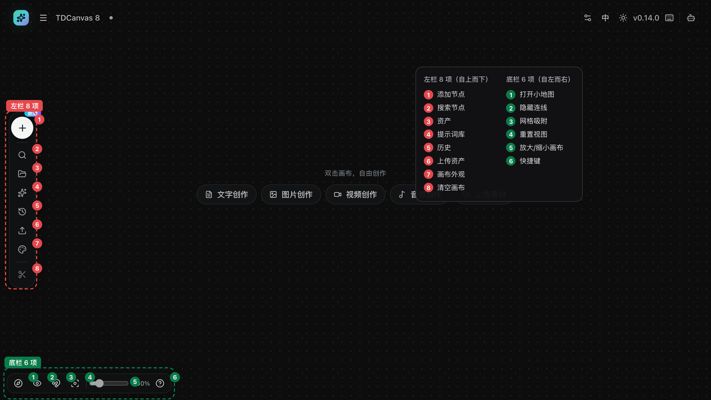
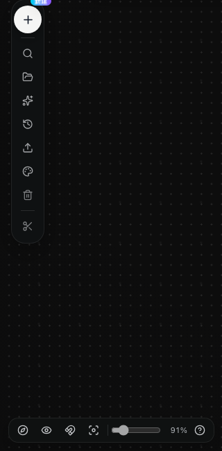
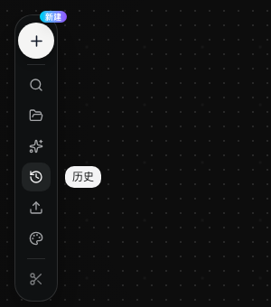
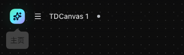
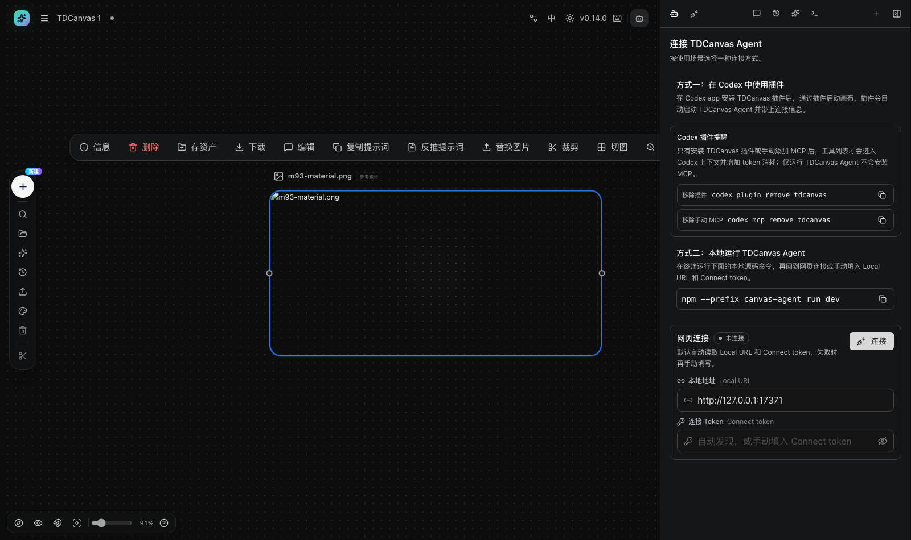
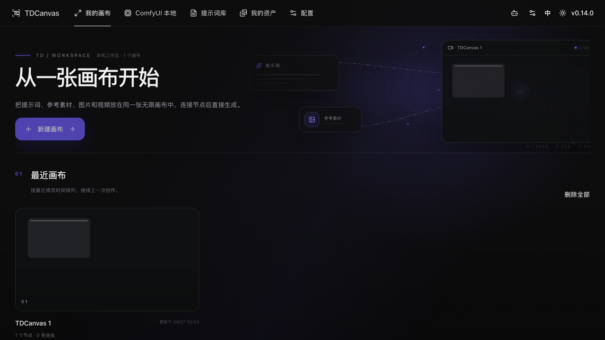

# 创建画布项目并认识工作区

- **适用角色**：所有 TDCanvas 用户（无需登录，本地使用）。
- **目标**：创建一个画布项目，认识编辑页的工作区布局，并学会回到项目列表。
- **前置条件**：TDCanvas 已启动（桌面客户端，或本地 Web 版）。
- **入口**：首页「新建画布 →」按钮；或首页顶部导航「我的画布」。

## 步骤

### 1. 打开首页

启动 TDCanvas 后默认进入首页 `我的画布`。首次使用时页面显示：

- 大标题「从一张画布开始」与紫色「新建画布 →」按钮；
- 「最近画布」区（首次为空，显示「还没有画布」）；
- 右上角实时预览窗（当前为空时显示占位）。

> 顶部导航还可以前往：ComfyUI 本地、提示词库、我的资产、配置；右上角提供 Agent 面板、中/EN 切换与明暗主题切换。完整清单见 [00-quickstart.md](../00-quickstart.md) 的「顶部导航都有什么」。

### 2. 新建画布

点击「新建画布 →」。TDCanvas 会立即创建一个新项目（自动命名，如「TDCanvas 1」；再新建会是「TDCanvas 2」，编号自动递增），并直接进入画布编辑页。

**关于编号**：首次安装时编号从 1 开始。如果你的第一个项目叫「TDCanvas 2」，通常是之前删除过项目留下的递增计数——不影响使用。

### 3. 认识编辑页工作区

这是一张**无限画布**：你可以把窗口想象成俯视一张无限大的纸，拖动画布就是在纸上平移视角。

| 区域 | 内容 |
|---|---|
| 顶栏 | 主页（返回首页）、画布菜单、项目标题（双击可改名）、本地 Codex 面板、配置、中/EN、明暗主题、版本号、快捷键 |
| 中央 | 无限画布；空画布时提示「双击画布，自由创作」，下方一排快捷芯片：文字创作、图片创作、视频创作、音频创作、上传素材 |
| 左侧 Dock | 新建（+）、搜索节点、资产、提示词库、历史（撤销/重做）、上传资产、画布外观、（**有选中时**出现）删除选中、快捷键 |
| 左下缩放 Dock | 打开小地图、隐藏连线、网格吸附、重置视图、5%–500% 缩放滑杆、快捷键 |

> ⚠️ **「左下缩放 Dock」这一行有 5 项在默认状态下点不到**（2026-10-05 M257 实测，R110）。
> **只有「打开小地图」能点**；**隐藏连线、网格吸附、重置视图、缩放滑杆、快捷键五项的落点全部在左侧节点面板内部**。
> 原因与上面 R106 那条**完全一样**：缩放条在 `left-3`（12–309px），面板在 `left-14` 起（56–336px），
> **横向重叠 253px**，而面板那层是 `z-[60]`、缩放条是 `z-50`。**面板开着时**就是这样（`use-canvas-side-panel-store.ts:19` + `canvas-side-panel.tsx:65-70`，R114）。
> **左侧 Dock 那 8 个按钮则全部点得到**（单选时 9 个也全部）——**它没被盖住，因为按钮中心在 x=40，落在重叠区左边。**
>
> **所以这一行要记成「几何上必然重叠、实际盖住几个」**：
> **左下角这一整片区域，控件按 x 从小到大排，面板从 x=56 开始吃——x 越大越先被吃掉。**

### ★ 左侧 Dock 上的按钮全是纯图标，但停上去都有名字

上面两张表列的那些名字，**在 Dock 上一个都看不到**。2026-10-03 逐个实测主列 8 个按钮：**可见文字 0 个、`title` 属性全部是 `null`**。整条 Dock 上不悬停时能看见的文字只有两处：「＋」按钮上方那个「**新建**」小徽标，和缩放滑杆旁的**百分比读数**（如 `91%`）。

**但把鼠标停上去，每个按钮都会弹出名字**——本手册此前说这里有 9 个按钮连悬停都没有提示，**那是错的，已订正**（见下方引用块）：

| 停上去弹出的名字 | 按钮长相 | 位置 |
|---|---|---|
| 添加节点 | ＋ | 主列第 1 个（唯一的大号圆钮，40×40） |
| 搜索节点 | 放大镜 | 主列第 2 个 |
| 资产 | 打开的文件夹 | 主列第 3 个 |
| 提示词库 | 星形 | 主列第 4 个 |
| 历史 | 时钟 | 主列第 5 个 |
| 上传资产 | 上传箭头 | 主列第 6 个 |
| 画布外观 | 调色板 | 主列第 7 个 |
| 清空画布 | 剪刀（**红色**） | 主列最下面一个 |
| 删除选中 | 垃圾桶 | **只要画布上有选中就出现**（单选、多选、全选都在），插在调色板和剪刀之间 |

> **2026-10-03 M196 订正这一行与下面第 121 段**：本手册此前写「**只在单选时出现**，
> 多选时它就没了」，并据此建议「要一次删掉多个节点，别指望用 Dock 的垃圾桶」。
> **实测是错的。** 逐档读数（容器 `.td-canvas-dock`，按 `aria-label` 枚举）：
> **未选中 8 个 → 单选 9 个 → Shift 真多选仍是 9 个 → Cmd+A 全选 3 个也是 9 个**；
> 只有**点空白取消选中**才回到 8 个。源码侧 `canvas-toolbar.tsx:258` 的条件是
> `{selectedCount ? … : null}`——**有选中就显示**，不是「正好选中 1 个」。
> **所以多节点删除可以走 Dock 的垃圾桶**，那条「别指望它」的建议作废。

> ⚠️ **订正：本手册此前写「悬停提示只有 6 个、9 个完全没有提示」，那是错的。**
> 2026-10-03 用「悬停前后全页可见文本取差集」重测，**上表 9 行的悬停提示一个都不缺**，浮层里写的名字与上表逐字一致。
> ★ **2026-10-04 M203 再订正本句的括注**：原文写的是「主列 **8 个**按钮（**含**单选时出现的「删除选中」）」——
> **那个括注把两个数混成了一句**：8 个是**恒有的**那批（不含垃圾桶），而「删除选中」是**有选中时才多出来的第 9 个**。
> 按它那个读法，恒有的就该是 7 个，**和上表的 9 行、以及上面 M196 逐档读到的 8 → 9 都对不上**。
> 现已改成不写括注：**恒有 8 个 + 有选中时多 1 个 = 9 个**。
> **教训：同一个数字被用来指两件事时，括注救不回来——得先问「这个数是哪一层的」。**
> **读错的原因**：Dock 的浮层是自研组件，类名是 `pointer-events-none absolute left-[calc(100%+8px)]`，**里面没有 tooltip / tip 任何字样**；而同一区域里左下角那 4 个视图控制按钮用的是 antd 原生浮层 `div.ant-tooltip`。此前只按 `tooltip` 字样找浮层，**就只抓到了后者，把前者整批读成了「无提示」**。
> **教训**：同一块界面里并存两种浮层实现时，按类名找浮层必然漏掉一半。**这是量具的毛病，不是产品的毛病。**

**还有一个订正**：本手册此前把「**主页**」列进了 Dock 那张「悬停有名字」表里。**主页不在 Dock 上**——它在顶栏最左边，而 Dock 的「添加节点」与它**横坐标完全一样**，按位置粗筛极易混为一谈。实测 Dock 容器里只有上表这 8 个按钮，「主页」是顶栏那 1 个。

> **为什么改成只说「横坐标一样」**（2026-10-03 M160 双视口复测）：原文在这里写了一对具体坐标，实测发现**纵坐标是假的、不能当认按钮的特征**。两个按钮的横坐标在 1600 宽和 1280 宽的窗口里都是 20（顶栏那条贴左上、Dock 那条贴左边，都不随窗口宽变化），**「横坐标完全一样」这个结论照样成立**；但 Dock 是**垂直居中**的，它每个按钮的纵坐标会随窗口高度整体平移（950 高的窗口里「添加节点」在第 325 行，800 高的窗口里就上移到第 250 行）。**认按钮认「横坐标」可以，认「纵坐标」不行**。

**记不住就停一下**：这套按钮**位置固定、顺序固定**，从上到下永远是「＋ / 放大镜 / 文件夹 / 星形 / 时钟 / 上传箭头 / 调色板 /（选中时）垃圾桶 / 剪刀」。认图标不如记顺序，但**停一下看名字最快**。

### ★ 顶栏也有两个按钮是真的认不出来

顶栏有 **10 个可点的东西**；**右侧 Agent 面板打开时还会多出第 11 个**（面板左缘那根拖宽窄的竖条）。2026-10-03 逐个实测，**9 个停上去有名字**（或本身印着字），**只有 1 个什么都不给**：

> **★ 2026-10-05 M249 订正**：这里原先写的是无条件的「一共 11 个可点的东西」，**11 只在右侧 Agent 面板打开时成立**。
> 面板收起时（**默认态**）那根竖条**整条落在窗口外面**——实测它的 rect 是 `(1593, 0, 16, 1000)`，而视口只有 1600 宽——
> 并且它所在的容器被显式关掉了指针（`components/agent/agent-panel.tsx:47` 写着 `pointerEvents: panelOpen ? undefined : "none"`）。
> **三条读数指向同一结论**：三个探针点全部不命中它；真鼠标按下去 `pointerdown` 落在 `section` 上、把手一次都没收到事件；
> 顶栏那一行里真正收得到事件的**只有容器内那 10 个**。面板打开后同一个把手移到面板左缘（实测 `(1152, 0, 16, 1000)`），
> 这时真按下去 `pointerdown` **正正落在 `button「调整右侧面板宽度」` 上**——**同一个元素，两种状态两种结果**。
> 换句话说：**面板开着数得 11，板着脸（收起）数得 10**。

> **2026-10-03 M196 补记枚举方法**：此前只写了「11 个」而**没写怎么数的**，这条断言因此**不可复核**。
> 现把边界钉死：`.td-canvas-topbar` 这个容器内是 **10 个**（主页、打开画布菜单、项目标题、
> 打开本地 Codex 面板、配置、切换到 English、切换到浅色主题、查看版本更新、快捷键、Agent），
> **面板打开时多出来的第 11 个是「调整右侧面板宽度」——它不在这个容器里**
> （收起时贴窗口右缘、在视口之外，Agent 面板打开时移到面板左缘），
> 正是下文表里那个「右侧面板拖动把手」。**换句话说：面板开着 11 = 容器内 10 + 容器外 1。**
> 另注：左下角那 4 个视图控制按钮（小地图 / 连线 / 网格吸附 / 重置视图）**也不在顶栏容器里**，
> 手册没有把它们算进这 11 个——这个取法是对的，两组按钮的 `aria-label` 各自独立、不会数重。

> **★ M249 补一条手册原先没提的**：左侧面板右缘**也有一根一模一样的拖动把手**（「调整左侧面板宽度」），
> 它同样在顶栏容器之外、同样只有 16px 宽。**它也没被算进 11——但理由和缩放条那 4 个不一样**：
> 实测**真鼠标按在它上面，`pointerdown` 落在 `section` 上、把手收不到事件**（阳性对照：同一个监听器按在顶栏主页按钮上，
> 落点是 `button「主页」` 里的图标），**所以它是「点不到」，不是「不算」**。
> 也就是说**顶栏这一行真正收得到指针的，恒是 10 个**；面板打开时才变成 11 个。
>
> **⚠️ 2026-10-05 M260 订正上面最后那个「点不到」——它说得太满，实测是假的。**
> 那次按的是把手的**正中间**，而这根把手**骑在面板右缘上**（源码 `canvas-side-panel.tsx:131`：
> `absolute right-0 w-4 translate-x-1/2`——**内侧 8px 在面板里、外侧 8px 在面板外**）。
> ★ **逐点采样加真拖拽的读数**：把手占 **x 327–343**，落点逐点为
> **327 ✓ 把手 / 331 ✓ 把手 / 335 ✗ 面板 / 339 ✗ 画布 / 343 ✗ 画布**——
> **中心（335）确实收不到事件，而内侧（327–331）收得到**。
> ★ **而且它是真拖得动的**：从内侧 2px 处（x=329）拖 +100，**面板宽度 280 → 380**，**拖回去又回到 280**。
> ★ **所以正确说法是「只有内侧那一小段拖得动」**，不是「点不到」。
> ★ **这一条连续错了三批**（M249 一次、R110 一次、R110 转述一次），
> **三次都只采了元素中心那一个点**——**而这正是 F85 那条**。

| 认不出的 | 它在哪、长什么样 | 你只能靠什么认出它 |
|---|---|---|
| **画布菜单**（俗称汉堡按钮） | 顶栏最左，主页按钮右边，三条横线 | 位置——它永远是画布名左边那个 |
| **右侧面板拖动把手** | 一根 16px 宽的竖条，**要右侧 Agent 面板打开才摸得到**（打开时贴在面板左缘；收起时整条在窗口外，点不着） | 位置——面板打开时那条能拖宽窄的分隔线 |

> **认不出来不是你的问题。** 这两个按钮停上去**既没有悬停提示也没有原生提示**，界面上任何地方都不会显示它们叫什么。好在它们都是这条边上**唯一**的东西——三横线只出现在画布名左边，拖把手是那条竖线，位置认比长相认可靠。
>
> **★ 拖把手要先开面板才摸得到**：默认状态下窗口右缘那里**什么都没有**（不是「有一根很淡的竖条」，是**真的一条竖条都没有**）。想拖右侧面板的宽窄，**先点顶栏右边的 Agent 按钮把面板叫出来**，竖条才出现在面板左缘。

其余 9 个分别是：主页（停上去显示「主页」）、项目标题（**双击可改名**，停上去写「双击修改画布名称」）、本地 Codex 状态灯（停上去写当前连接状态）、配置、语言切换（按钮上印一个「**中**」字，停上去写「切换到 English」）、明暗主题、版本号（印着 `v0.14.0`，停上去写「查看版本更新」）、快捷键、Agent。

> **「切换到浅色主题」按钮里藏着一个看不见的字**：它确实有一个写着「切换到浅色主题」的文字节点，但那个节点只有 **1×1 像素**——占不了地方，等于没有。**只有浏览器自己弹出的原生提示在起作用**（本应用里叫 `title` 属性）。这类「明明有字却看不见」的节点在应用里不止一处，Agent 面板顶部那排图标按钮里的文字更极端，是 **0×0**。

**两个容易踩的坑**：

**① 「清空画布」和「裁剪」是同一把剪刀。** 选中一个**已经放了图**的图片节点时，节点上方工具条里有一个「裁剪」，左侧 Dock 里有一个「清空画布」——**两者的图标逐字相同**（都是 `lucide-scissors`），而且**它们会同时出现在同一屏上**。

> **注意前提**：图片节点**刚建出来、还没放图**时，工具条上**没有「裁剪」**（那时只有 4 个按钮：信息、删除、编辑、上传图片）。**所以你得先放一张图，才谈得上「两把剪刀同屏」这回事。** 对照表见 [edit-nodes.md 的工具条一节](edit-nodes.md#悬浮工具条-每个节点类型都不一样)。

> ⚠️ **但别把这条读成「你分不清哪个是哪个」**（本手册此前就是那么写的，2026-10-02 已订正）。**一个在常驻的左边竖排、一个在跟着节点走的横条上，位置差别一眼可见**，再加上 Dock 那个是红色且点了会弹确认框。**真正的提醒只有一句：这两处剪子功能完全不同，别顺手点到错的那把。**
>
> **「相隔多远」这种数字不要去背**（2026-10-03 M160 订正）：本手册此前给过一个具体的横向距离。它**既不可复现、也不该被当成认按钮的依据**——左边那把钉死在屏幕上，右边那把**跟着节点跑**，你把节点拖到画布别处，距离就整个变了（实测同一个有图图片节点，放在画布左侧时两把相距 163 像素，放在画布右侧时能到九百多）。**要认它们，靠「一个竖排常驻、一个横排跟节点」这个关系，别靠数像素。**

### 图标会被复用，认按钮要靠位置不要靠长相

这不是 Dock 独有。2026-10-02 把**全应用 36 个可见图标**（在画布空白、选中节点、打开 Agent 面板三种状态下各扫一遍）按类名分组，发现 **9 个图标被用在了不止一个功能上**：

| 图标 | 用在哪些功能上 | 会不会同屏 |
|---|---|---|
| `sparkles` 星形 | 顶栏**主页** · Dock **提示词库** · Agent 面板**技能** | 不同屏 |
| `plus` 加号 | Dock **添加节点** · Agent 面板**新对话** | 不同屏 |
| `scissors` 剪刀 | Dock **清空画布** · 工具条**裁剪** | **同屏**（一个竖排常驻、一个横排跟节点，**别按像素数**） |
| `upload` 上传箭头 | Dock **上传资产** · 工具条**替换图片** | **同屏**（同上：一个竖排常驻、一个横排跟节点，**别按像素数**） |
| `trash2` 垃圾桶 | 工具条**移除节点** · Dock **删除选中** | **同屏** |
| `message-square` 对话气泡 | Agent 面板**对话** · 工具条**编辑** | **同屏** |
| `bot` 机器人 | 顶栏 **Agent** 按钮 · 面板内另一个 | — |
| `plug-zap` 插头 | 面板顶栏**连接设置** · 连接状态指示 | — |
| `copy` 复制 | 多处复制按钮（同一个功能，合理） | — |

> **这一列为什么只写「同屏」、不再给具体距离**（2026-10-04 M203 补）：这张表此前给过两个数（剪刀 931 px、上传箭头 815 px），**两个都已作废**——左侧 Dock 那一列钉死在屏幕上、节点工具条那一列跟着节点跑，**距离根本不是界面属性**（实测同一对图标放在画布左侧时只相距 163 像素，见上方 M160 订正）。
>
> ★ **这里还藏着一个「M160 只做了一半」**：M160 当年订正了**剪刀那一行**（正文里那段订正至今只谈剪刀），**上传箭头那一行漏在表里没人管**——它是另一个字符串，从头到尾**没有任何一条订正登记过它**。**订正写一半，等于没写。** 本批已把两行一并改掉，并把两处都登记成回归项（R31 / R49），以后再冒出来门禁会当场点名。
> **认它们靠「一个竖排常驻、一个横排跟节点」这个关系，不靠数像素。**

> **所以：认按钮要靠位置，不要靠长相。** 四处按钮区的顺序都是固定的（左侧 Dock 见上文清单、节点工具条见 [edit-nodes.md](edit-nodes.md) 的按钮表、Agent 面板见 [use-agent.md](use-agent.md)、顶栏见上文那节），**记住顺序比认图标可靠得多**。实在认不出就悬停一下——**这四处里，除了顶栏那两个按钮（画布菜单、右侧面板拖动把手），停上去都有名字。**

**② 「删除选中」只要画布上有选中就出现，多选时也在。** 实测逐档（M196，2026-10-03）：

| 档位 | Dock 按钮数 | 「删除选中」在吗 |
|---|---|---|
| 未选中 | **8** | 否 |
| 单选 1 个 | **9** | **是** |
| Shift 追加到 2 个 | **9** | **是** |
| `Cmd+A` 全选 3 个 | **9** | **是** |
| 点空白（取消选中） | **8** | 否 |

> **可复核**：这四档用 `scripts/probe-canvas-chrome.js` 重跑（只读，不点任何删除类按钮），
> 输出逐档明细。**要在节点不互相遮挡的画布上跑**——节点默认全叠在画布中心。

**所以多节点删除可以走 Dock 的垃圾桶**——本手册此前说「别指望它、走右键菜单」，那是错的，已订正（见 R44）。

> **两处曾经出错的地方，都是判据而不是产品**：
> **① 数字。** 此前写「未选中 15 → 单选 16 → 多选 15」，实测是 **8 → 9 → 9**。
> **② 把「取消选中」当成了「多选」。** 一次 Shift 点击点到了**空白画布**上（节点都叠在画布中心，
> 偏移一点就落到背景），读出 8 个按钮——**Dock 为 8 的真正原因是选中被清空了**。
> 两种解释都能解释「8」，只有一条读数分辨不开；后来用**节点工具条数量**当独立读数才分开：
> **真多选时工具条为 0**（工具条按节点走，多选没有单一归属），**单选时为 1**。

中央那排快捷芯片是**快捷入口**，不是必走的流程——等画布已有内容后它们会消失，此时用左侧 Dock 的「+」按钮（弹「添加节点」菜单）或直接双击空白处创建节点。

> ⚠️ **「左侧 Dock 的「+」」这条在默认状态下点不到**（2026-10-05 M255 实测，详见 [30-concepts.md](../30-concepts.md#节点-画布上的一切)）。
> 左侧那块节点面板**默认是收起的**（第一次打开画布时它被主动收起一次），**而你手动打开过一次之后就一直开着**（R114），
> 它会把这个菜单**整块盖住**——点「+」按钮它会变成「✕」，**但屏幕上不会出现菜单**。
> **「画布外观」「历史」两个飞层同样被盖。**
> **首选双击画布空白处**（那份菜单浮在面板之上），或先收起左侧面板再用 Dock。

画布内容会**自动保存**在本机，无需手动保存。这意味着关掉页面不会丢东西，但也意味着**删掉的项目不会自动找回**——重要项目请用首页的导出功能留一份 zip 备份。

### 4. 回到项目列表

点击顶栏「主页」按钮回到首页。「最近画布」区现在会显示项目卡（标题、节点数与连线数、更新时间），点击卡片即可重新进入画布。

卡片上的「N 个节点 · M 条连线」能让你在进入前就大致判断这个项目的复杂度——节点很多的项目通常加载稍慢。

## 成功判据

- 浏览器地址为 `/canvas/<项目ID>`，顶栏显示项目标题；
- 首页「最近画布」出现该项目卡片，卡片显示正确的节点计数与更新时间。

## 取消与恢复

- 误建了空项目：回到首页，将鼠标悬停在项目卡上使用删除（有确认弹窗）；首页多选模式下可批量删除。
- 项目标题想改：见 [project-management.md](project-management.md)（双击顶栏标题或首页卡片重命名）。

## 相关任务

- [create-nodes.md](create-nodes.md)：在画布上创建各类节点。
- [undo-persistence.md](undo-persistence.md)：撤销、重做与自动保存的边界。
