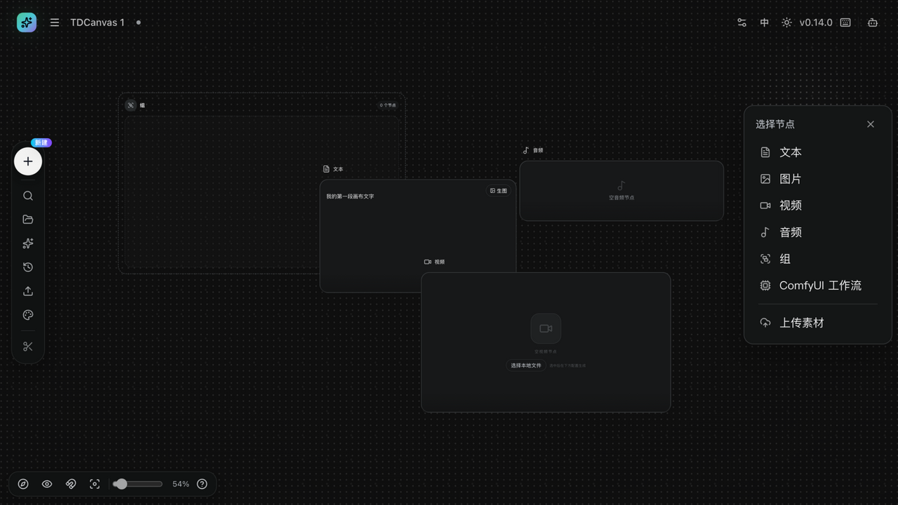

# 创建各类节点

- **适用角色**：所有 TDCanvas 用户。
- **目标**：在画布上创建文本、图片、视频、音频、组和 ComfyUI 工作流节点。
- **前置条件**：已打开一个画布项目（见 [create-canvas-project.md](create-canvas-project.md)）。
- **入口**：双击画布空白处；或左侧 Dock「＋ 新建」；空画布时还有中央的快捷创作芯片。

## 入口一：双击画布空白处（推荐）

1. 在画布空白处**双击**，弹出「选择节点」菜单。
2. 菜单共七项：**文本、图片、视频、音频、组、ComfyUI 工作流、上传素材**（最后一项是分隔线下的素材入口）。
3. 点击任意一项，对应节点会在**双击位置**创建，并自动选中。

## 入口二：快捷创作芯片（空画布时）

空画布中央会显示一排快捷芯片：**文字创作、图片创作、视频创作、音频创作、上传素材**。点击即创建对应节点。画布上已有节点后芯片消失，此时用入口一或左侧 Dock「＋ 新建」。

## 各类节点创建后的样子

| 节点 | 创建后 | 适合放什么 |
|---|---|---|
| 文本 | 520×300 卡片，占位「双击编辑文字」，右上角「生图」按钮 | 提示词、草稿、说明文字 |
| 图片 | 620×350 卡片，「空图片节点」+「选择本地文件」 | 本地图片、AI 生成图 |
| 视频 | 660×371 卡片，「空视频节点」+「选择本地文件」 | 本地视频片段 |
| 音频 | 540×160 窄条卡片，「空音频节点」 | 语音、音乐素材 |
| 组 | 760×480 **虚线框**，标题「组」+「0 个节点」徽标 | 把相关节点圈在一起（把节点拖进虚线框即入组） |
| ComfyUI 工作流 | 由导入的 ComfyUI 工作流生成，需先在「ComfyUI 本地」配置环境 | 本地 ComfyUI 生成流程 |

## 成功判据

- 新节点出现在双击位置并处于选中态（蓝色边框）；
- 空媒体节点显示「空××节点」占位与「选择本地文件」按钮；
- 组节点为虚线边框，徽标显示当前成员数（初始「0 个节点」）。

## 取消与恢复

- 误建节点：按 `Delete` / `Backspace` 删除，或 `Cmd/Ctrl+Z` 撤销。
- 不小心把菜单点没了：再双击一次空白处即可重新打开。

## 相关任务

- [upload-materials.md](upload-materials.md)：往图片/视频/音频节点里填充真实素材。
- [connect-references.md](connect-references.md)：把节点连成生成流程。
- [organize-canvas.md](organize-canvas.md)：用组整理画布（编写中）。
