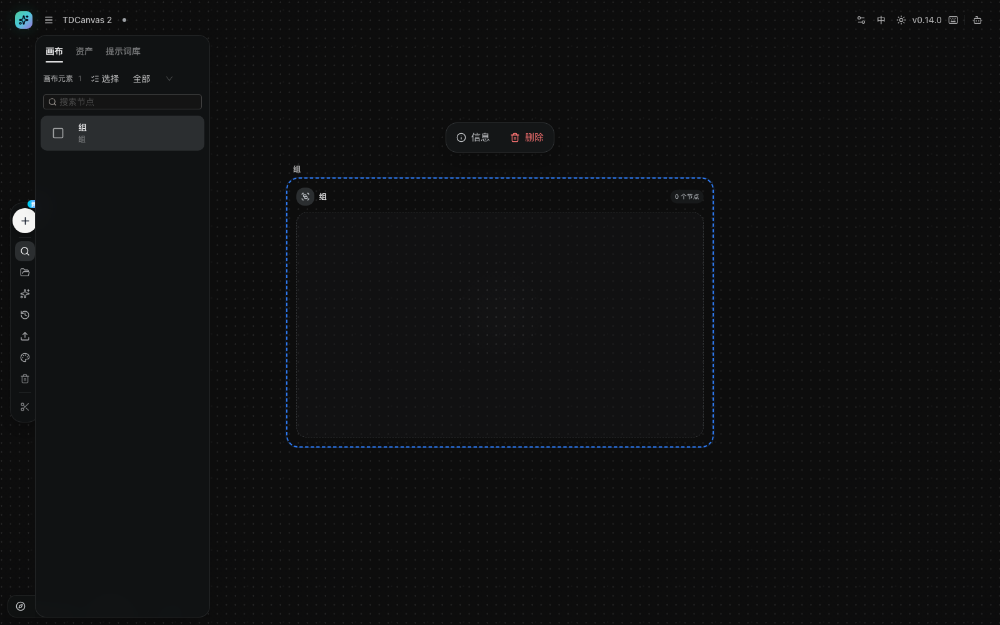
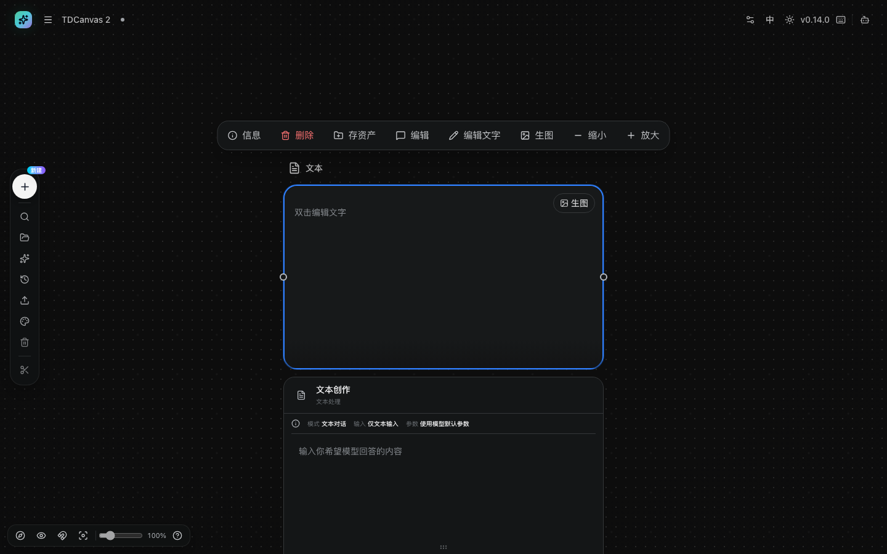
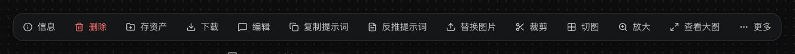
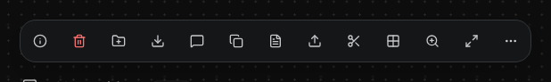
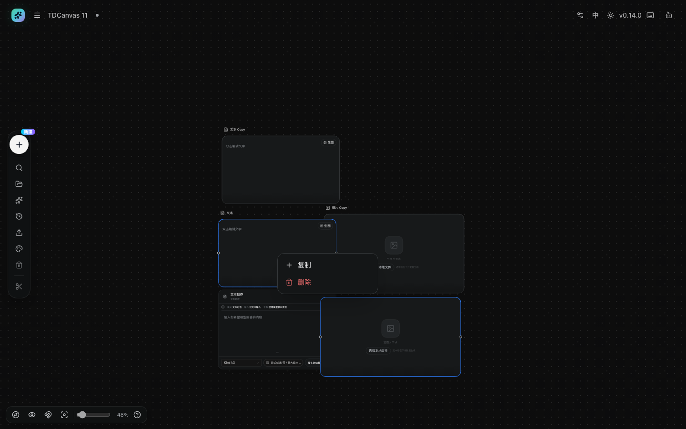
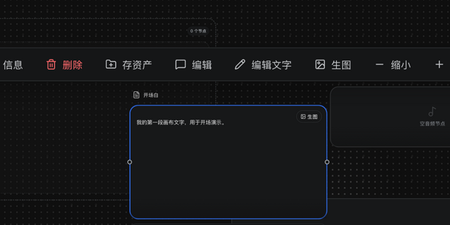
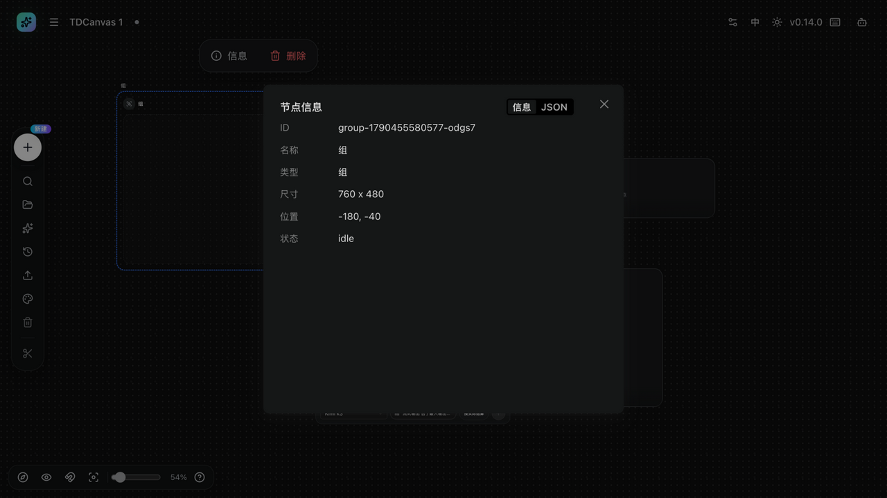
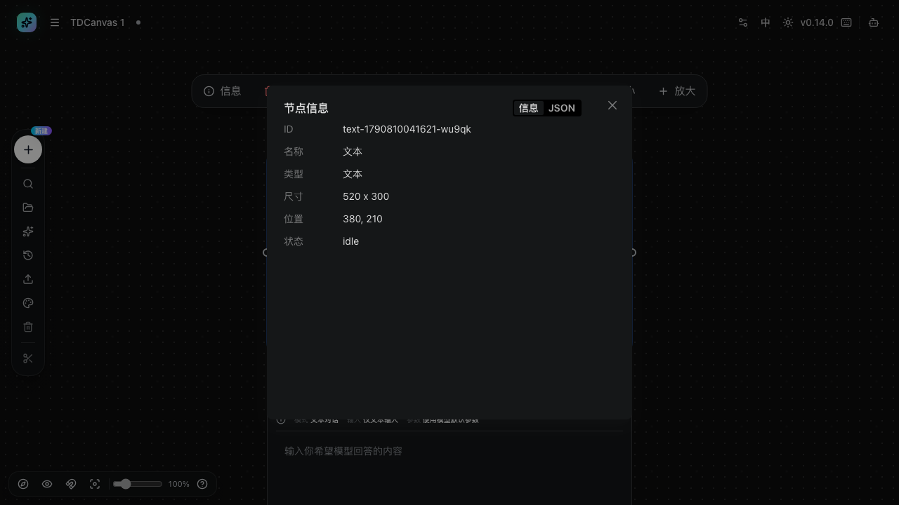

# 编辑节点：重命名、改文字、缩放与信息面板

- **适用角色**：所有 TDCanvas 用户。
- **目标**：修改节点的标题与内容，调整节点大小，查看节点详细信息。
- **前置条件**：画布中已有节点（见 [create-nodes.md](create-nodes.md)）。
- **入口**：单击选中节点 → 顶部悬浮工具条；或直接双击节点。

## 悬浮工具条：每个节点类型都不一样

工具条是**选中单个节点**后才出现的（多选时、拖动节点时、或工具条设置面板打开时它都会隐藏）。它上面有什么，**完全由这个节点的类型和有没有内容决定**——这是最常让人困惑的地方，所以先给一张**穷尽 9 种组合**的对照表（2026-10-01 逐节点点选实测，每个按钮的读屏提示一并记录）：

| 节点类型 | 按钮数 | 从左到右的全部按钮 |
|---|---|---|
| **文本**（空节点，还没写字） | **8** | 信息 · 删除 · 存资产 · 编辑 · 编辑文字 · 生图 · 缩小 · 放大 |
| **文本**（有内容） | **8** | 与上面**逐字相同**——文本节点是唯一一种"有没有内容都一样"的节点 |
| **图片**（空节点，还没放图） | **4** | 信息 · 删除 · 编辑 · 上传图片 |
| **图片**（有内容） | **13** | 信息 · 删除 · 存资产 · 下载 · 编辑 · 复制提示词 · 反推提示词 · 替换图片 · 裁剪 · 切图 · 放大 · 查看大图 · 更多 |
| **视频**（空节点，还没放视频） | **4** | 信息 · 删除 · 编辑 · 上传视频 |
| **视频**（有内容） | **6** | 信息 · 删除 · **存资产** · **下载** · 编辑 · 替换视频 |
| **音频**（空节点，还没放音频） | **4** | 信息 · 删除 · 编辑 · 上传音频 |
| **音频**（有内容） | **5** | 信息 · 删除 · **下载** · 编辑 · 替换音频（**没有「存资产」**） |
| **ComfyUI 工作流**（空节点，还没选工作流） | **4** | 信息 · 删除 · **运行** · **参数**（**既没有「编辑」也没有「上传」**） |
| **组** | **2** | 信息 · 删除 |

> **2026-10-03 M137 补 ComfyUI 行、并订正那句汇总**：本表此前**整类漏掉了 ComfyUI 工作流节点**。
> 实测（先「清空画布」只留它一个，再点选，`elementFromPoint` 阳性对照确认命中）：
> **4 个按钮，是「信息 · 删除 · 运行 · 参数」**——**和其他三种空节点都不一样**：
> 图片 / 视频 / 音频的空节点都是「信息 · 删除 · 编辑 · 上传 X」，
> **ComfyUI 节点没有「编辑」也没有「上传」，换成「运行」和「参数」**。
> 建法：左侧 Dock「＋ 新建 → ComfyUI 工作流」，节点上写着「选择本地工作流 / 选中节点后，从已导入的工作流中选择一个」。
>
> ⚠️ **只测到空节点这一档**：ComfyUI 节点要先导入工作流才能用，
> 而导入工作流**依赖本机 ComfyUI 环境**（见 [generate-images.md](generate-images.md)），
> **本批次不具备该环境，所以「选上工作流之后是几个按钮」没有测，也不猜**。
>
> **顺带订正本节下方那句汇总**：原文写「长度从 2 到 13 共 5 种」，
> **按上表逐个数是 6 种**：**2 / 4 / 5 / 6 / 8 / 13**。
> （表格本身每一行都是对的，错的只是那句汇总——**又一次「正文汇总与表格对不上」**。）

> **2026-10-01 取证说明**：除「组」与「视频（有内容）」外均为逐节点点选实测。**「组」这一行是 M80 复测定正的**——本手册此前写的是「组 0 个、没有工具条」，那是**判据失误**：当时组被其他节点压住，点选命中的是压在它上面的节点，于是数到了别人的按钮数。**正确做法是先「清空画布」只留一个组，再在画布上点它**——实测 `["信息","删除"]` 恰 2 个，组节点 `data-node-id` 形如 `group-…`、边框为 `border-style: dashed` 2 像素、左上角带 `lucide-group` 图标、内部文字是「组 0 个节点」。

> **2026-10-01 M94 补表与订正**：本表此前只有 5 行，自称"完整对照表"却**整类漏掉了音频**、也漏了「文本（空）」与「视频（有内容）」。补测四行后发现**顺带订正了一处旧错**——本节下方原有一句"视频/音频节点上找不到存资产和下载不是坏了"，那是**把空节点当成了有内容的节点**：实测**视频节点放上视频后有 6 个按钮，存资产与下载都在**；**音频放上音频后有 5 个按钮，「下载」在、只有「存资产」不在**。两处均已改正。

对照看：**同一个画布里，选中图片节点时这条工具条会长得多**（13 个按钮），选中组节点则只剩最左边的两个。同一条工具条、长度从 2 到 13 **共 6 种**（2 / 4 / 5 / 6 / 8 / 13，逐个数见上表），这是"工具条按节点类型变化"最直观的证据。

> ★ **同一个图片节点，按钮数还能再变一次：13 个 ↔ 4 个**（2026-10-03 M136 实测）。
> **图片节点刚建出来是空的**（还没有图），这时候选中它，工具条**只有 4 个按钮**：
> 信息、删除、编辑、上传图片。**其余 9 个——存资产、下载图片、复制提示词、反推提示词、
> 替换图片、裁剪、切图、放大、查看大图——一个都不出现**，因为它们全都依赖节点里
> 真的有一张图片。
> **所以「13 个」是放上图片之后才有的**。你新建一个图片节点、还没选图，就发现
> 「下载」「裁剪」「切图」这些按钮怎么都找不到，**不是界面坏了，是图还没放上去**。
> 放一张图（或用「上传图片」选一张）之后，13 个按钮立刻齐了。
>
> 顺带一条同批读数：**这 13 个按钮没有任何「开 / 关」状态标记**——
> `aria-pressed`、`aria-expanded`、`aria-checked`、`aria-current` 四个属性
> **13 个全是空的**，逐个点下去，图标、按钮上的字、无障碍名称**全都不变**。
> 也就是说**这条工具条上的按钮都是「点一下就干活」的动作，不是有开关的选项**。
> （左侧 Dock 的「＋ 新建」是另一回事：它面板打开时图标会从 ＋ 变成 ×，
> 但无障碍名称不变——那一条已写进 [create-nodes.md](create-nodes.md)。）
> **注意读法**：这里说的是**按钮元素本身**没有状态变化，**不是说这些功能没有状态**——
> 比如「隐藏连线」那个开关的状态是显示在按钮外观上的，不在这个属性里。

从这张表能读出四条规则，理解了就再也不会找错按钮：
**① 每一类都有「信息」和「删除」在最左边。** 这两个是所有节点的公共项——**组也不例外**，它的全部按钮就是这两个。其余都是按类型加的。

**② 空节点只有"填内容"这一个动作可做。** 空的图片节点只给你「上传图片」、空的视频节点只给你「上传视频」、空的音频节点只给你「上传音频」——因为它还没有内容，谈不上存资产、下载、裁剪。**把内容放进去，工具条会立刻变长**（图片从 4 个变成 13 个，视频从 4 个变成 6 个，音频从 4 个变成 5 个）。这就是为什么"同一个节点前后按钮不一样多"。

**③ 文本节点是唯一的例外：有没有内容都一样，恒 8 个。** 别的类型都要先填内容才"解锁"更多按钮，文本节点不需要——空着的时候就已经能「存资产」「生图」「编辑文字」了。所以**别拿图片、视频那套"空节点只有 4 个"去套文本节点**。

**④ 组的工具条只有公共项，没有任何针对组本身的编辑动作。** 选中一个组时你会看到「信息」和「删除」，然后就结束了——**不是没有工具条，而是没有更多**。组只是给成员节点套了个框，对它本身没有可执行的编辑动作：想改内容，去改**里面的成员节点**。

### 按钮上印的字，和鼠标悬停弹出的字，是两句话

上面那张表列的是**按钮上印在面上的字**——你能直接看到，照着找就行。但**把鼠标停在按钮上，弹出来的提示往往完全是另一句**。2026-10-02 对图片节点的 13 个按钮逐个实测（读 `aria-label` 并实际悬停读浮层，两者逐字一致）：

| 按钮上印的 | 鼠标悬停弹出的 | 一样吗 |
|---|---|---|
| 信息 | 查看节点信息 | 不一样 |
| 删除 | 移除节点 | 不一样 |
| 存资产 | 加入我的资产 | 不一样 |
| 下载 | 下载图片 | 不一样 |
| 编辑 | 编辑 | 相同 |
| 复制提示词 | 复制生成该图片的提示词 | 不一样 |
| 反推提示词 | 创建反推提示词的文本和配置节点 | 不一样 |
| 替换图片 | 替换图片 | 相同 |
| 裁剪 | 裁剪并生成新节点 | 不一样 |
| 切图 | 按行列切分图片 | 不一样 |
| 放大 | 放大图片分辨率 | 不一样 |
| 查看大图 | 查看图片详情 | 不一样 |
| 更多 | 配置快捷工具 | 不一样 |

**13 个里有 11 个对不上**，只有「编辑」和「替换图片」两个悬停出来是同一句。

> **这不是 bug，是这套界面本来的设计**：按钮上的字是给人扫一眼认功能的**短标签**，悬停提示是把这个动作**会发生什么**讲完整。**别因为悬停出来的字和按钮上的不一样，就以为自己找错了按钮**——同一个按钮，两句话而已。
>
> **其中「更多」那一条最值得记**：按钮上只写「更多」，光看这三个字完全不知道它干什么；**悬停出来是「配置快捷工具」**，这才是它唯一的解释。下一节讲的「显示文字」开关就在那个面板里。

### 「显示文字」关掉后，工具条上就一个字都没有

工具条上的文字**可以被关掉**：在「更多 → 自定义工具栏」弹窗里有一个**显示文字**开关。2026-10-02 实测（改的是 `localStorage` 里的 `tdcanvas:image-quick-tools-v6`）：

| 状态 | 按钮数 | 工具条总宽 | 按钮上有字吗 |
|---|---|---|---|
| **默认（没设过）** | **13** | **1285** | 有，每个按钮「图标 + 文字」 |
| 关掉「显示文字」 | **13** | **574** | **一个字都没有** |
| 改回默认 | **13** | **1285** | 有 |

> **关掉文字不改变按钮的个数，只改变它有多宽**——从 1285 缩到 574，省下 711 像素（约一半），单个按钮从 86 宽缩到 44 宽。**但这时你只能靠图标认**：上面两张图放在一起看就知道，「切图」和「替换图片」是两个长得几乎一样的方框图标，「裁剪」（剪刀）和「查看大图」（斜箭头放大镜）也容易混。**这时候悬停提示就是你唯一的线索**——所以那 11 组"对不上"的字，在纯图标工具条上从"多余的细节"变成了"必需品"。
>
> **没认出按钮不要紧：把鼠标停在上面就行。** 悬停提示在任何显示设置下都在。

> **音频节点上没有「存资产」，这不是坏了——本版本真的没有。** 文本、图片、视频三类节点放上内容后都有「存资产」，**只有音频节点没有**：它放上音频后是 5 个按钮，「下载」在、「存资产」不在（源码 `canvas-node-hover-toolbar.tsx:151` 的条件写的是 `hasImage || hasVideo || isText`，**音频不在其中**）。资产库那一侧同样没有音频类型（筛选只有 全部 / 文本 / 图片 / 视频），所以**音频在画布和资产库两头都存不进去**。想留住音频，目前只剩导出画布 zip 一条路——素材文件会落在 `projects/<项目id>/files/` 下（`lib/canvas/canvas-export.ts:20` 按素材类型推导扩展名，音频同样在内），**源码依据，未做导出实测**，具体见 [undo-persistence.md](undo-persistence.md)。
>
> **注意别把空节点当成有内容的节点。** 视频和音频节点**刚建好还没放东西时**确实只有 4 个按钮（信息 / 删除 / 编辑 / 上传），存资产和下载都没有；**放上内容之后按钮会变**，视频变 6 个、音频变 5 个。说"视频节点没有存资产"是不对的——**要看它有没有内容**。
>
> **「更多」那个按钮不是溢出菜单。** 它只在图片节点上有，读屏提示是「配置快捷工具」，点开是**工具条自定义面板**——「多角度」就藏在那里，默认没勾。详见 [image-operations.md](image-operations.md#工具条是可以自定义的-「多角度」默认没勾)。

> **同一个操作，两个界面两种叫法。** 工具条上这个按钮的**文字**是「存资产」，但它的**读屏提示**（鼠标悬停与读屏软件读到的）是「加入我的资产」。提示词库卡片上同一个动作也写「加入我的资产」。你在按钮上找不到「加入我的资产」四个字，是正常的——**按钮上是「存资产」**。

## 选中多个节点时：工具条会消失

多选是你**一次处理多个节点**的手段，方式有三种（见 [shortcuts-help.md](shortcuts-help.md)）：

- `Ctrl / Cmd` + 拖动，框选一片区域内的节点；
- `Shift` / `Ctrl / Cmd` + 点击，逐个加选或减选；
- `Ctrl / Cmd` + `A`，全选。

**但选中两个及以上节点后，悬浮工具条会完全消失**（2026-10-01 实测：单选 1 个时工具条有 8 个按钮；`Shift` 追加选中第 2 个后，工具条整个不见了）。这不是 bug，是它的设计——工具条上的每个按钮都是针对**某一个具体节点**的操作（裁剪这张图、把这个文本存成资产），多选时"对哪一个节点做"没有答案，所以干脆不显示。

> **多选状态下，这个版本没有批量编辑能力。** 2026-10-01 实测全部结论：
>
> | 操作 | 多选时的表现 |
> |---|---|
> | 拖动 | ✅ 整组一起移动 |
> | `Delete` 删除 | ✅ 一次删掉全部选中的节点（实测 2 个节点一次删光） |
> | `Ctrl / Cmd` + `Z` 撤销 | ✅ **一次撤销就把整组恢复**（实测删 2 个后一次撤销，2 个都回来了） |
> | `Ctrl / Cmd` + `C / V` 复制粘贴 | ✅ **复制的是「当前选中的」那几个**（实测 2 个 → 4 个） |
> | 右键菜单 | ⚠️ 仍是「复制 / 删除」两项，**与单选时完全相同**；但「复制」**只复制你右键点到的那一个**（见下一节） |
> | 悬浮工具条 | ❌ 不出现 |
>
> 所以如果你想给 5 个节点统一改点什么——改名字、改尺寸、批量删掉——**这个版本做不到，只能一个个来**。删除和移动是唯一真正省事的多选用途。

> **复制粘贴遇到「组」有个坑**：复制的**只是你选中的那些节点**，选中组就只复制那个组框，**成员不会顺带跟过来**——粘出来是个徽标「0 个节点」的空壳组。要复制整个组，得**连成员一起选中**。完整实测表见 [organize-canvas.md](organize-canvas.md#复制组-成员不会跟着来-粘出来是个空壳)。

> **误删了怎么找回**：多选后按 `Delete` 是**一步操作**，`Ctrl / Cmd + Z` 也是**一步撤销**——整组一起回来，不用一个一个撤。前提是你没有在删除后又做了别的操作（每一步操作各占一格撤销栈）。

## 多选时右键「复制」只复制右键的那一个

多选之后右键菜单**看不出任何变化**——还是那两项「复制 / 删除」，和单选时一模一样。但点下去的结果不一样：

| 场景 | 操作 | 画布节点数变化 | 实际复制了几个 |
|---|---|---|---|
| 单选 1 个 | 右键 →「复制」 | 2 → 2 | 1 个（正常） |
| **多选 2 个** | **右键 →「复制」** | **2 → 3** | **只有 1 个——而且是右键命中的那个** |
| **多选 2 个** | **`Ctrl / Cmd + C` 再 `Ctrl / Cmd + V`** | **2 → 4** | **2 个（选中的都复制了）** |

（2026-10-01 实测。随后又在 4 节点的画布上复核：只选中其中 2 个时，右键复制是 4 → 5，`Ctrl / Cmd + C / V` 是 4 → 6——**快捷键复制的是"选中的那 2 个"，不是画布上全部 4 个**。）

副本出现在**右键命中的那个节点**的右下方（偏移 +36, +36）；另一个被选中的节点**原地不动，也没有副本**。

> **为什么这个陷阱难发现**：图里两个节点都带蓝框（框边那圈圆点是选中态的缩放手柄），说明**多选确实生效了**；可菜单里只有两项，**没有任何"当前选中了 2 个"的提示**——它和单选时的菜单长得一模一样。工具条也不出现，所以没有任何一处会提示你"现在是多选"。

**源码为什么是这个行为**：`project.tsx` 里右键菜单的 `onDuplicate` 只取右键那一刻记下的 `contextMenu.nodeId`，然后调用单节点的 `duplicateNode(nodeId)`——这个函数从头到尾只读这一个 id，**没有读过 `selectedNodeIds`**，源码上就不支持批量。同一份源码里另有 `copySelectedNodes` 负责多选复制，它挂在 `Ctrl / Cmd + C / V` 上。

**怎么一眼看出副本是谁的**：副本永远出现在**被右键点的那个**节点的右下方（+36, +36）。实测中没出现过"右键点 A、结果复制了 B"的情况。

**要一次复制多个，用快捷键**：先选中要复制的几个（`Shift / Ctrl / Cmd` + 点击逐个加选，或 `Ctrl / Cmd + A` 全选），再 `Ctrl / Cmd + C` → `Ctrl / Cmd + V`。这条路和右键菜单里的「复制」**不是一回事**，实测画布上 4 个节点只选中 2 个时，快捷键也只复制那 2 个。

## 重命名节点

1. **双击节点上方的标题文字**（如「文本」「开场白」），标题变为输入框。
2. 输入新名称（最长 64 字符），按 `Enter` 确认；按 `Esc` 取消。

> 注意：标题悬浮在节点上边框之外，双击要瞄准标题文字本身；双击到节点主体会进入「编辑文字」或打开预览。

## 编辑文字内容（文本节点）

任选其一：

- **双击节点内容区域**，进入编辑状态，输入文字；点击画布空白处即保存。
- 选中节点后点击悬浮工具条的「**编辑文字**」，同样进入编辑。

图片、视频、音频节点没有文字内容，它们的「编辑」按钮打开的是节点下方的生成面板（见 [generate-images.md](generate-images.md)）。

## 缩放节点大小

1. 选中节点，四角出现圆形缩放手柄。
2. 拖动任意一角向外/向内缩放。限制：最小 220×160，最大 1600×1200。
3. 图片与视频节点默认**锁定宽高比**（等比缩放）。要自由变形，只有**图片节点**有这个开关，而且它**默认不在工具条上**，得先调出来：工具条最右端的「**更多**」→「自定义工具栏」→ 勾上「**锁比例**」→「**保 存**」（弹窗长什么样、里面共几项，见 [image-operations.md](image-operations.md)）。调出来之后点它，按钮上的字会从「锁比例」变成「自由比例」。
4. 图片节点替换为新图后会按新图比例自动回调尺寸（居中缩放）。

*实测（2026-10-02）：第 2 条的两个数字都精确成立——把文本节点往右下猛拖，尺寸**精确停在 220×160**；把左上角挪到视口上方再用右下角手柄往右下猛拖，**精确停在 1600×1200**。两点补充：① **尺寸不走网格吸附**（220 不是 16 的倍数，实测就是 220 而不是 224），而**节点位置是走的**；② 文本节点**不锁比例**，实测只横拖就能把宽高比从 1.516 改成 1.649。*

> **⚠️ 这两个上下限只对手动拖手柄成立——上传时算出来的尺寸可以突破它们。**
>
> *实测（2026-10-02）：上传一张 2000×100 的扁长图，节点最终是 **640×160**——宽被压到 640，而**高度被抬到了下限 160**。于是这张 20:1 的图在 4:1 的节点里显示，宽高比**保持不住**，节点上下会留白或画面被拉变形。*
>
> 同样的道理反过来也成立：一张细高的大图，高度会被压到上限 1200。**所以「节点至少 160 高、最多 1600×1200」对手动缩放成立，对上传不成立。**

> **手柄太小点不中？** 缩放手柄会随画布缩放变小，在低缩放比例下只有十几像素。先用左下角缩放滑杆放大到 **100% 以上**，手柄会恢复到约 28px，此时可以精确拖拽（已实测：76% 缩放下拖角点成功放大，宽高比锁定保持）。

> **「锁比例」这三个字说的是"现在什么样"，不是"点了会怎样"。** 按钮上显示的是**当前状态**：关着时写「锁比例」，开着时写「自由比例」；而**鼠标悬停出来的提示才是下一步动作**——关着时提示「切换为自由比例」，开着时提示「切换为等比缩放」（2026-10-01 实测两个方向的字与提示都对得上）。所以看到「锁比例」别以为是"点了会锁上"，它现在就是锁着的。**视频节点没有这个开关**，恒为等比缩放；要变形只能先把视频换成别的比例再导回画布。

## 查看节点信息

选中节点后点击悬浮工具条最左的「**信息**」，打开「节点信息」面板：

面板含 **信息 / JSON** 两个页签。「信息」页签逐行列出节点的 ID、名称、类型、尺寸、位置、状态：

这个面板主要在**排查问题**时有用：

- **ID** 是节点的唯一标识，排查连线或数据异常时提供给开发者；
- **位置** 与 **尺寸** 可以确认节点是否被误拖、误缩放；
- **状态**（如 `idle`）反映节点当前是否空闲——生成中会变成对应状态。

「JSON」页签可查看节点原始数据。查看完毕点击右上角 × 关闭。

> **2026-10-02 M113 实测：上面六行是「永远都有」的，此外还有五行是「有才出现」的。**
>
> 面板里的行是**条件渲染**的——节点没有对应数据，那一行根本不画。所以**你看到的行数比这里列的少，不是面板坏了**：
>
> | 额外行 | 什么时候才出现 |
> |---|---|
> | **本地文件** | 节点带磁盘路径时（**本地上传/生成出来的图片没有这一行**——实测其 `metadata` 里没有 `localPath`） |
> | **提示词** | 节点带提示词时（生成配置、生成结果节点有；空白文本节点没有） |
> | **图片组** | 批量生成且子节点数 **大于 1** 时（单张不显示） |
> | **图片大小** | 见下方，**实际上传与生成的图片节点这一行永远不出现** |
> | **错误详情** | 节点出错时。这不是普通的一行，而是**一块红色区域**，带一个「**复制错误**」按钮，一点就把整段错误详情复制走——**提交 Issue 时直接点它，不用手抄** |
>
> **「图片大小」这一行有个反直觉的地方**：它算的是素材数据的字节数，而**素材在应用里是存在本机数据库、以 `blob:` 地址引用的**。实测一个上传的图片节点，面板里没有这一行，**但它的 JSON 里明明存着真实的字节数**（`metadata.bytes`）和 MIME 类型。**也就是说：应用手里有数据，这一行却没显示。** 你想知道某个图片节点占多大，看 JSON 页签的 `bytes` 字段。
>
> 顺带一个观察：**上传的图片节点不一定是默认尺寸**。空图片节点是 620×350，而从文件拖进来的图片会按图片本身的比例定尺寸（实测一张 1×1 的图被放到 **220×220**）——所以「尺寸」这一行对不上默认值是正常的。

## 删除与恢复

- 选中节点按 `Delete` / `Backspace`，或点悬浮工具条红色「**删除**」（删除有连带效应：连线一并移除）。
- 误删后：左侧 Dock「**历史**」→「**撤销**」，被删节点连同连线一并恢复。

删除的连带效应经常被忽略：删掉一个上游节点，所有连到它的下游都会失去这个引用。删除前先看一眼这个节点是否连着别人的线。

## 已知限制（排障见 90-troubleshooting.md）

- **不要在多个浏览器标签页里同时编辑同一个画布项目**：两个标签页都会自动保存，后保存的一方会用它看到的旧内容覆盖另一方的修改（例如另一标签里刚输入的文字消失）。发现内容丢失时，先不要刷新，尝试在仍打开该画布的标签页里用「历史 → 撤销」找回。
- 悬浮工具条在节点非常靠近画布左边缘时可能伸出屏幕左侧，此时把节点往右拖一段再操作。

## 相关任务

- [create-nodes.md](create-nodes.md)：创建节点。
- [undo-persistence.md](undo-persistence.md)：撤销重做与自动保存的完整边界。
- [generate-images.md](generate-images.md)：节点下方面板的生成流程。
