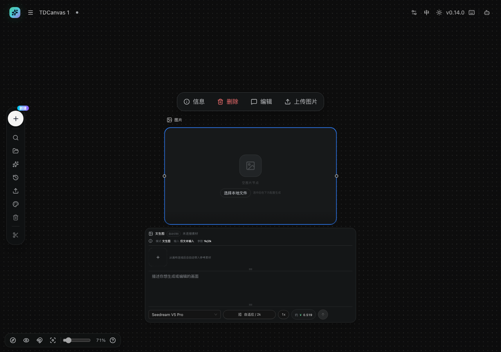
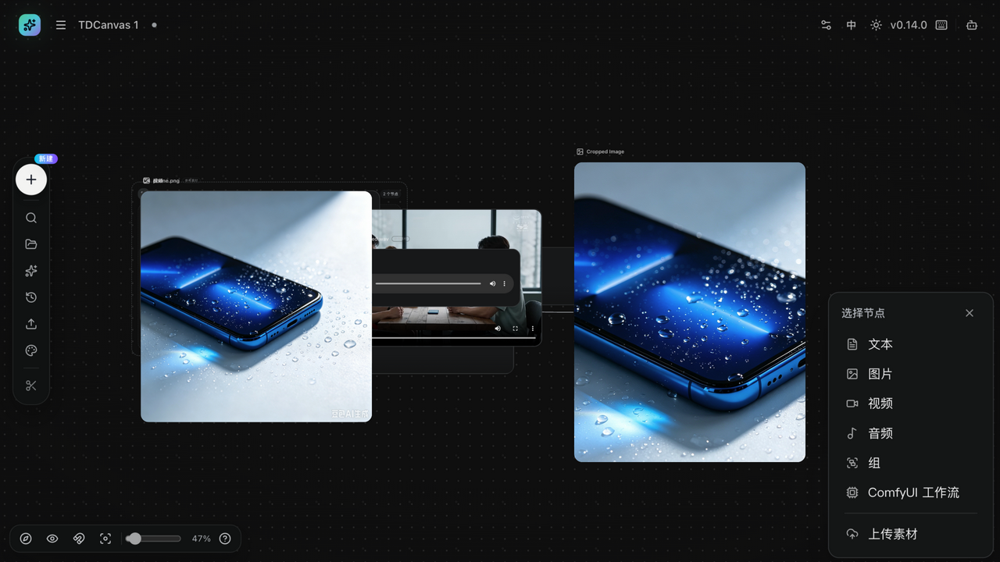
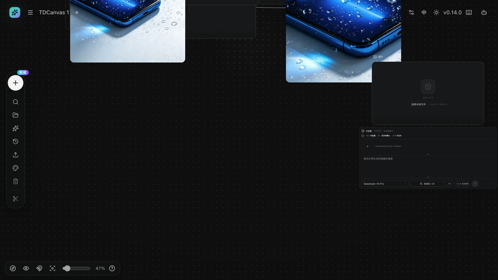
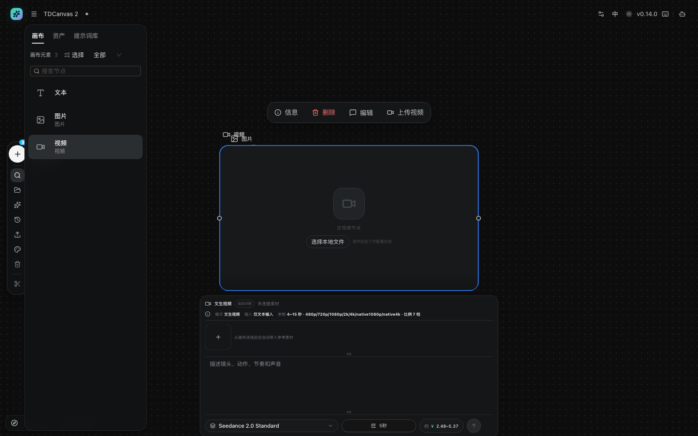
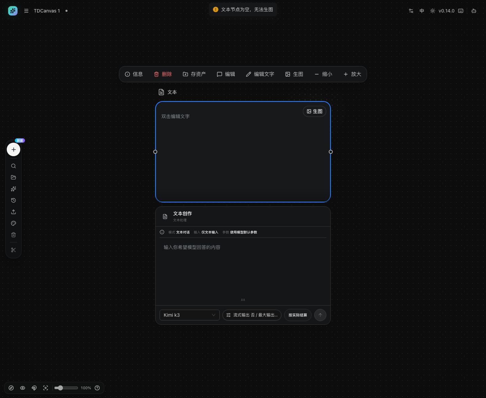
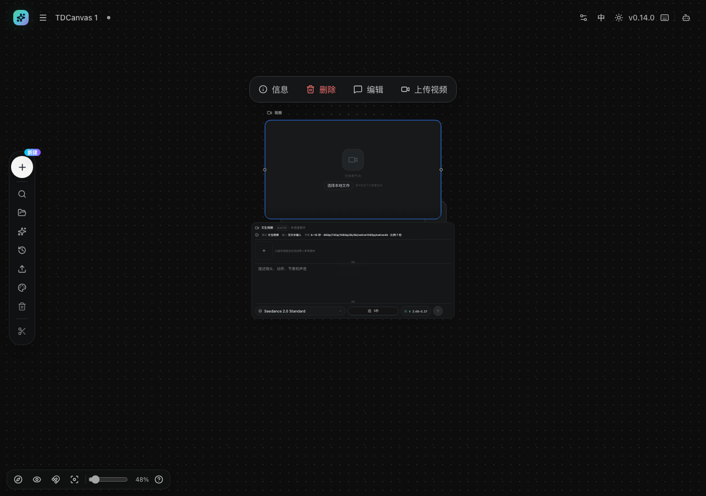
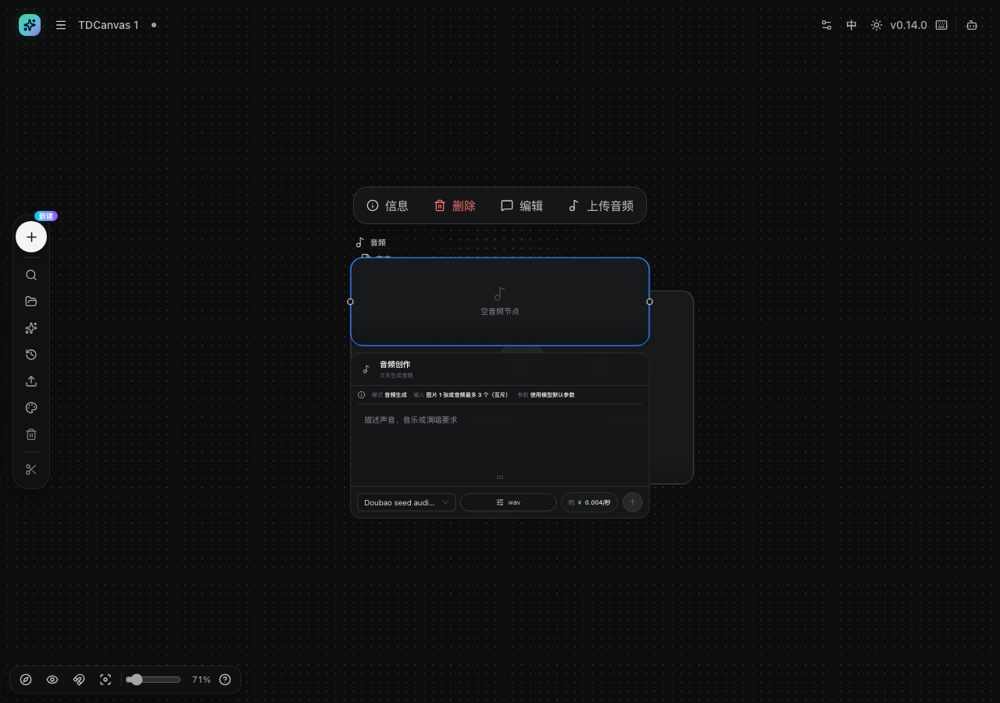

# 发起图片生成并理解任务状态

- **适用角色**：已配置「AI 土豆」API Key（代码中为 Aitudou）的 TDCanvas 用户。
- **目标**：以图片节点为中心发起 AI 生图，理解任务状态与结果组织。
- **前置条件**：右上角「配置」中已填写并保存 API Key（未配置时点击生成会失败）。配置弹窗的完整字段与「验证并查询余额」见 [20-reference.md](../20-reference.md#api-配置-生成功能的前提)。
- **入口**：选中图片/文本等节点 → 节点下方的生成面板。**四类节点挂四种不同的面板**（文本挂的是对话面板，不是生图面板），逐项对照见下方[「生图之外」一节](#生图之外-音频与视频生成的参数和价格)。

> ⚠️ **费用提示**：生成调用 Aitudou API 按量计费。本页为流程说明；开始生成前请确认模型与参数。

## 发起生成

选中图片节点（或通过[连线引用](connect-references.md)把参考素材接到节点上——面板提示「从画布连线后会自动带入参考素材」），节点下方会展开生成面板：

> ⚠️ **「自动带入」只保证素材出现在参考素材区，不保证它参与生成。** 未被点名的素材会盖着「不参与生成」标签，面板顶部还会提示「N 个素材不符合当前模型的输入要求」。关键描述请直接写进描述框。实测细节见 [30-concepts.md](../30-concepts.md#连线不等于自动生效)。

面板从上到下分四块：

| 区域 | 内容 |
|---|---|
| 标题栏 | 模式名（文生图 / 图生图…）、来源徽标（自动识别）、素材状态（未连接素材） |
| 参数行 | 模式、输入、参数（1k/2k）——按节点类型自动匹配 |
| 参考素材区 | 「＋」槽位，提示「从画布连线后会自动带入参考素材」 |
| 描述框 | 「描述你想生成或编辑的画面」 |
| 底部操作条 | 模型下拉、比例（自适应 / 2k）、数量（1x）、**约 ¥ 价格**、发送按钮 |

**注意底部的价格**：它随模型、比例和数量实时变化（实测 Seedream V5 Pro + 自适应/2k + 1x ≈ ¥0.519）。**在点发送之前看一眼这个数字**，是控制生成成本最直接的方式——想要更便宜的结果，可以换成更小的比例或更便宜的模型。

1. 在描述框输入画面描述。
2. 按需调整模型、比例与数量——**每次调整都看价格变化**。
3. 点发送按钮开始生成。

## 生成前 checklist

在点发送之前，确认这四件事，可以避免大部分白花钱的情况：

- **参考素材对不对**：面板顶部显示「未连接素材」时，这次就是纯文生图；想要图生图必须先连线（见 [connect-references.md](connect-references.md)）。
- **模型是不是你以为的**：模型下拉默认按引用自动匹配，参考图变了模型也可能跟着变。
- **价格能不能接受**：底部「约 ¥」是这次的实际开销。
- **API Key 配了没**：未配置时点发送会直接失败（见 [../90-troubleshooting.md](../90-troubleshooting.md)）。

## 生图之外：音频与视频生成的参数和价格

不同节点类型挂的是**不同的生成面板**，价格量级差别很大。2026-10-01 逐个实测，2026-10-01 M66 用干净 profile 复测并订正了其中的三处错误：

| 节点类型 | 面板标题 | 默认模型 | 输入 / 参数 | 面板显示价格 |
|---|---|---|---|---|
| **文本** | **文本创作 / 文本处理** | **Kimi k3** | 输入 仅文本输入 · 参数 使用模型默认参数（最大输出长度 1024） | **不显示价格**，只写「按实际结算」 |
| 图片 | **文生图** | Seedream V5 Pro | 输入 仅文本输入 · 参数 1k/2k | 约 **¥0.519** / 张 |
| 视频 | **文生视频** | **Seedance 2.0 Standard** | 参数 **4~15 秒 · 7 档分辨率**（默认 5 秒）+ 比例 7 档 | 约 **¥2.48–5.37** |
| 音频 | **音频创作 / 文本生成音频** | **Doubao seed audio 1.0** | 模式 音频生成 | 约 **¥0.004 / 秒** |

> **2026-10-01 M82 复验**：四个价格数字全部未漂移，四类的面板标题与默认模型也逐字一致。**但分辨率档位订正了——此前本表只列了 5 档（`480p/720p/1080p/2k/4k`），实际是 7 档**，面板参数行原文为 `4–15 秒 · 480p / 720p / 1080p / 2k / 4k / native1080p / native4k · 比例 7 档`。**多出来的 `native1080p` 与 `native4k` 正是价格区间 ¥2.48–5.37 的两端**——只列 5 档会让人以为选 4k 就是最贵的。

> **价格是实时拉的，不是写死在应用里的。** 取证时抓到的请求是 `GET /tdtv-api/aitudou/api/pricing`，返回体含 `observed_prices` / `price_estimates` / `official_price_discounts` 等字段。**平台调价后上表的数字会变**，以界面实际显示为准。
>
> **文本面板的价格位会先闪一下「读取价格…」**，几秒后变成「按实际结算」，**全程不出现任何金额**。那不是卡住。

> ⚠️ **M66 订正：文本节点的面板不是生图面板。** 本表此前把文本与图片并成一行「文本 / 图片 → 图像创作 → Seedream V5 Pro → 约 ¥0.519」，**三项全错**：① 「图像创作」这个词在 i18n 与源码中各出现 **0** 次，界面上根本没有；② 文本节点挂的是「文本创作」，跑对话模型 Kimi k3；③ 文本面板**没有价格**。视频的「文本生视频」也应为「文生视频」。**如果你按旧表去找一个叫「图像创作」的面板，永远找不到。** 见下一节。

> ⚠️ **看单位，不看数字大小**。音频的「0.004」看着最小，但它是**按秒**的——一段 30 秒的音频就是 ¥0.12，看着不多；视频的「2.48–5.37」是**区间**（随时长与分辨率变动），一次顶得上五次生图。**视频生成是本产品里单次最贵的操作**，批量做视频之前先算一笔账。

## 文本节点的面板不是生图面板

**这是本版本最容易踩的一个误会**：文本节点下方也会展开一个"生成面板"，长得很像生图面板，但它跑的是**对话模型**，不是绘图模型。

| | 文本节点的面板 | 图片节点的面板 |
|---|---|---|
| 面板标题 | **文本创作** · 副标题「文本处理」 | **文生图** |
| 模式行 | 模式 **文本对话** · 输入 仅文本输入 · 参数 使用模型默认参数 | 模式 **文生图** · 输入 仅文本输入 · 参数 1k/2k |
| 输入框占位 | **「输入你希望模型回答的内容」** | 「拖拽你想生成或编辑的画面」 |
| 底部 | 模型 **Kimi k3** · 流式输出 否 / 最大输出长度 **1024** · **按实际结算** | 模型 **Seedream V5 Pro** · 自适应 / 2k · 1x · **约 ¥ 0.519** |
| 有没有价格 | ❌ **没有** | ✅ 有 |

**为什么文本面板不显示价格**：它按「**按实际结算**」走，金额在生成完成后才确定，和按张计费的生图不一样。**所以"这个面板没写价钱"不代表免费**——只是不在这里显示。

**文本节点右上角那个「生图」按钮是另一回事**：它不是"打开生图面板"，而是**拿这个文本节点当提示词去生图**。2026-10-01 实测，文本节点**为空**时点它，顶部会弹一条提示「**⚠ 文本节点为空，无法生图**」，什么也不会发生——先在节点里写点内容再点。

> **源码依据**：`aitudou-native-generation.ts` 的 `DEFAULT_OPERATION_BY_KIND` 写明 `text: "text.chat"`（其余三类分别是 `image.generate` / `video.generate` / `audio.generate`）；面板模式名由 `aitudou-native-generation-panel.tsx` 的 `nativeAutomaticMode` 给出，文本分支返回「文本处理」。这与上表的运行时实测逐条吻合。

### 视频生成面板

- **首帧图片**：支持本地图片或**图片 URL**，时长可选 4-8 秒，分辨率 480p / 720p / 1080p 自动匹配；也可以从对话框添加首帧图片（或参考图）。
- **描述框**：提示词写「镜头、动作、节奏和声音」。
- **价格是区间不是定值**：面板写「约 ¥2.48–5.37」，实际按你选的时长与分辨率落点，**以发送前显示的金额为准**。

### 音频生成面板

- **模式**：音频生成。
- **输入限制**：**图片 1 张或音频最多 3 个（互斥）**——想用音频当参考，就不能再同时给图片。
- **参数**：使用模型默认参数。
- **描述框**：提示词写「声音、音乐或演唱要求」。

### 三类面板的共同点

结构是一样的：**标题 → 模式/输入/参数行 → 描述框 → 底部操作条（模型 · 格式或比例 · 价格 · 发送）**。所以学会图片面板的操作方式，另外两类照搬即可；真正要重新学的只有**每类特有的参数**（视频的时长与分辨率、音频的输入互斥规则）。

> **点发送前看一眼单位**是这份手册最实用的一条省钱建议。生图的「¥0.519」是一次性单价，音频的「¥0.004/秒」和视频的「¥2.48–5.37」都会随你的选择放大——把三者的价格放在一起对比（见上表），比记住某一个数字有用得多。

## 生成中与结果

- 生成中：节点显示进度遮罩，相关连线出现流动动效。
- 完成后：
  - 数量为 1 → 结果直接回填当前节点；
  - 数量大于 1 → 当前节点成为**主图**，右侧堆叠生成子图节点（可展开/收起/设为主图）；
  - 每次生成的历史保留在节点的**图片历史**中（最近 24 个版本，可随时切换回某一版）。它在界面上叫「**历史版本**」——点图片节点右上角那个圆形按钮就是，别指望界面上有「图片历史」四个字。

## 任务状态与异常

**节点上真正会出现的状态只有三种，而且分属两套系统。** 别去找「已排队」「已完成」这些中文词——v0.14.0 的界面上**一个都不会出现**：

| 你会看到的 | 出现在哪 | 触发条件 | 建议操作 |
|---|---|---|---|
| **生成中** | 节点**内部**变成一个转圈 + 这四个字 | 任务正在跑 | 等待；可刷新页面，状态会恢复 |
| **生成失败** | 节点**内部**变成错误块，带「**重试**」和「**查看完整错误**」 | 请求被拒或出错 | 点重试，或先看完整错误再改参数 |
| 一枚**英文小徽标**（`queued` / `running` / `succeeded` / `partial` / `failed` / `attention` / `stopped`），有时带 `· 42%` | 生成面板的**标题行右侧**，灰底圆角小标签 | **只有提交之后才出现** | 照字面理解；`stopped` 之后远端可能仍在跑并计费 |

**还没提交时，节点上没有任何状态显示。** 2026-10-01 实测：打开图片节点的生成面板（面板正常出现，标题「文生图」，模式「文生图」，模型「Seedream V5 Pro」），页面里「待配置 / 已排队 / 处理中 / 已完成 / 部分完成 / 等待补充参数 / 已停止」**七个词各出现 0 次**，也没有任何徽标。**没有「待配置」这个状态**——你看到的是「**未连接素材**」这类提示，不是任务状态。

> **⚠️ 2026-10-01 M85 重大订正：这张表此前写的是八个中文状态名，并标称取自 i18n 原文。** 那八个词确实逐字存在于 `zh-CN.ts` 的 `canvas.aitudou.status` 里，**但整组文案从未被任何组件引用**——穷尽 `web/src` 搜索后，`canvas.aitudou.*` 只有 `nodeTypes.aitudou` 一处被用上，其余（`status` / `card` / `panel`）全是死文案。**真正渲染任务阶段的是 `TaskStatus` 组件，它输出的是原始英文枚举值**（`{taskPhase}`），且**仅在 `taskId` 存在时渲染**。本手册此前的 M71 订正方向反了：它把死文案当成了界面原文，把真实的英文徽标当成了不存在。
>
> **仍有未验证的部分**：提交后的中间态与完成态**没有运行时证据**——验证它们需要真实提交一个付费任务，本手册不触发。上表英文徽标那一行的判据来自**源码**（枚举定义 + 渲染位置），不是实测；「生成中 / 生成失败」两个词来自 i18n 且**有源码调用点**（`canvas.node.generating` / `canvas.node.failed`），但同样只在跑任务时出现，本手册未实测。

- 「停止」只停止本地等待，不会取消远端任务。
- 提交过的任务即使刷新页面也能恢复状态（本地任务日志）。
- 同一节点有未完成任务时不允许重复发起（防止重复计费）。

> **「已停止」不等于「没花钱」**。点停止后界面上的转圈消失、节点恢复常态，很容易让人以为任务被取消了。实际上远端可能仍在执行并计费——想确认请到 Aitudou 平台查账单。同理，失败任务通常不计费，但**部分成功**是按成功的那些计费的。

## 快捷路径

- 文本节点右上角「**生图**」：在右侧自动创建图片节点并连线，把文本作为提示词。
- 图片节点悬浮工具条「**反推提示词**」：创建反向推导提示词的文本节点（付费）。

## 相关任务

- [connect-references.md](connect-references.md)：连接参考素材。
- [image-operations.md](image-operations.md)：免费的本地裁剪/切图/放大。
- [../90-troubleshooting.md](../90-troubleshooting.md)：生成失败排查。
