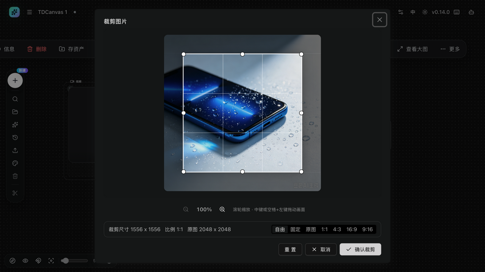
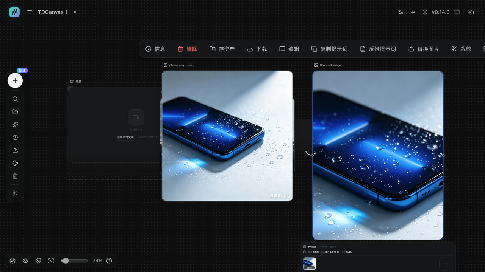

# 图片本地处理：裁剪、切图、放大

- **适用角色**：所有 TDCanvas 用户。
- **目标**：对画布上的图片做裁剪、九宫格切图和无损放大——这些操作**在本机完成，不调用付费生成**。
- **前置条件**：画布中有一个已填充图片的节点。
- **入口**：选中图片节点 → 顶部悬浮工具条 →「裁剪」「切图」「放大」。

## 裁剪

1. 选中图片节点，点击悬浮工具条「**裁剪**」，打开「裁剪图片」对话框。
2. 拖动裁剪框四角与边框调整范围；底部可切换比例预设：自由 / 固定 / 原图 / 1:1 / 4:3 / 16:9 / 9:16。
3. 滚轮缩放画面，中键或空格+左键拖动画面；「重置」恢复初始裁剪框。
4. 点击「**确认裁剪**」。

5. 结果：在原图右侧自动创建「Cropped Image」子节点并连线，原图保留不动。

## 切图

1. 悬浮工具条「**切图**」打开切图对话框。
2. 设置行数与列数（最多 12），可用「撤销/重做」调整分割线。
3. 确认后按网格生成 N 个子图片节点，自动排列并逐一连线到原图。

## 放大

1. 悬浮工具条「**放大**」打开放大对话框。
2. 选择目标长边 **1K / 2K / 4K**（上限 4096px）与算法（默认 high 逐级放大，效果更平滑）。
3. 确认后生成放大结果的子图片节点。放大使用本地插值算法，不产生费用；需要 AI 超分请改用生成流程。

## 成功判据与恢复

- 操作完成后画布出现新的子图片节点，且与原图有线连接；原图始终不变。
- 对结果不满意：删除子节点即可，或用「历史 → 撤销」。

## 相关任务

- [upload-materials.md](upload-materials.md)：先上传图片。
- [generate-images.md](generate-images.md)：需要 AI 重绘/超分时的付费路径（仅描述）。
