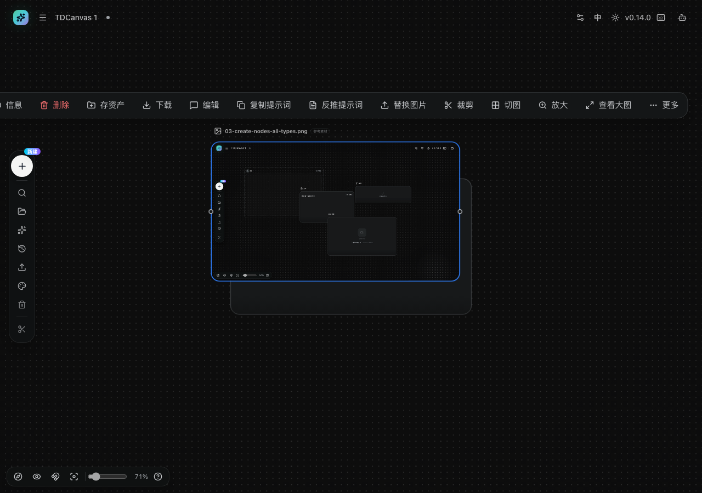

# 图片本地处理：裁剪、切图、放大

- **适用角色**：所有 TDCanvas 用户。
- **目标**：对画布上的图片做裁剪、九宫格切图和无损放大——这些操作**在本机完成，不调用付费生成**。
- **前置条件**：画布中有一个已填充图片的节点。
- **入口**：选中图片节点 → 顶部悬浮工具条 →「裁剪」「切图」「放大」。

## 为什么先用这一组而不是生成

图片节点的工具条上既有**免费的本地处理**（裁剪、切图、放大），也有**付费的 AI 能力**（反推提示词等）。它们的区别很实际：

| | 本地处理（裁剪/切图/放大） | AI 生成 |
|---|---|---|
| 费用 | 免费 | 按量计费 |
| 会不会改动原图 | 不会 | 写入新结果 |
| 断网可用 | 是 | 否 |
| 结果类型 | 确定性的几何/插值运算 | 模型重新创作 |

**能用本地处理解决的，就不要点生成。** 比如原图 2048px 想发朋友圈，裁剪成 1:1 就够，不需要付费超分；一张 3×3 拼图想拆开，切图即可，不需要 AI 重绘。

选中一张已填充的图片节点，工具条上从左到右可以看到这两个分组：

**「裁剪 / 切图 / 放大」三个是免费的本地操作**——它们都有同一个共同点：**结果会生成新的子节点并自动连线到原图，原图始终保留**。所以做错了删掉子节点就行，不用担心破坏原素材。

## 裁剪

1. 选中图片节点，点击悬浮工具条「**裁剪**」，打开「裁剪图片」对话框。
2. 拖动裁剪框四角与边框调整范围；底部可切换比例预设：自由 / 固定 / 原图 / 1:1 / 4:3 / 16:9 / 9:16。
3. 滚轮缩放画面，中键或空格+左键拖动画面；「重置」恢复初始裁剪框。
4. 点击「**确认裁剪**」。

5. 结果：在原图右侧自动创建「Cropped Image」子节点并连线，原图保留不动。

## 切图

1. 悬浮工具条「**切图**」打开切图对话框。
2. 设置行数与列数（最多 12），可用「撤销/重做」调整分割线。
3. 确认后按网格生成 N 个子图片节点，自动排列并逐一连线到原图。

适合把一张长截图或拼图拆成单张：12×12 上限意味着最多能切出上百块，先想好要哪几块再动手。

## 放大

1. 悬浮工具条「**放大**」打开放大对话框。
2. 选择目标长边 **1K / 2K / 4K**（上限 4096px）与算法（默认 high 逐级放大，效果更平滑）。
3. 确认后生成放大结果的子图片节点。

> **本地放大不是 AI 超分。** 它用插值算法把像素「铺」大，**不会凭空增加细节**——放大后看细节会偏软但不会产生新内容。如果你要的是把糊图变清晰，那属于 AI 超分，需要走 [generate-images.md](generate-images.md) 的付费流程（并明确计费）。

## 成功判据与恢复

- 操作完成后画布出现新的子图片节点，且与原图有线连接；原图始终不变。
- 对结果不满意：删除子节点即可，或用「历史 → 撤销」。
- 因为原图不会被改动，这些操作可以放心反复试。

## 相关任务

- [upload-materials.md](upload-materials.md)：先上传图片。
- [generate-images.md](generate-images.md)：需要 AI 重绘/超分时的付费路径（仅描述）。
- [../20-reference.md](../20-reference.md)：图片历史版本上限与格式限制。

