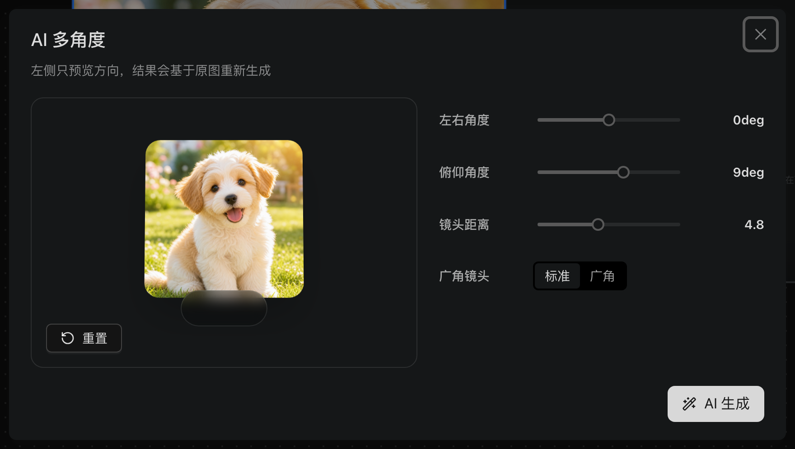

# 图片处理：裁剪、切图、放大与多角度

- **适用角色**：所有 TDCanvas 用户。
- **目标**：对画布上的图片做裁剪、九宫格切图、无损放大，以及需要付费的多角度重生成——前三个**在本机完成，不调用付费生成**。
- **前置条件**：画布中有一个已填充图片的节点。
- **入口**：选中图片节点 → 顶部悬浮工具条 →「裁剪」「切图」「放大」；「多角度」需要先在工具条自选里勾出来（见下）。

## 为什么先用这一组而不是生成

图片节点的工具条上既有**免费的本地处理**（裁剪、切图、放大），也有**付费的 AI 能力**（反推提示词等）。它们的区别很实际：

| | 本地处理（裁剪/切图/放大） | AI 生成 |
|---|---|---|
| 费用 | 免费 | 按量计费 |
| 会不会改动原图 | 不会 | 写入新结果 |
| 断网可用 | 是 | 否 |
| 结果类型 | 确定性的几何/插值运算 | 模型重新创作 |

**能用本地处理解决的，就不要点生成。** 比如原图 2048px 想发朋友圈，裁剪成 1:1 就够，不需要付费超分；一张 3×3 拼图想拆开，切图即可，不需要 AI 重绘。

选中一张已填充的图片节点，工具条上从左到右可以看到这两个分组：

**「裁剪 / 切图 / 放大」三个是免费的本地操作**——它们都有同一个共同点：**结果会生成新的子节点并自动连线到原图，原图始终保留**。所以做错了删掉子节点就行，不用担心破坏原素材。

## 工具条是可以自定义的，「多角度」默认没勾

工具条**最右端还有一个「更多」按钮**（读屏标签是「配置快捷工具」）。点它会打开「自定义工具栏」弹窗，里面列出这个节点类型**全部 14 个**可用工具，用复选框决定哪些出现在工具条上：

**默认只勾了 12 项**（2026-10-01 实测），没勾的是「**锁比例**」和「**多角度**」。所以：

> **「多角度」不是找不到，是默认没显示。** 很多人以为这个功能不存在，其实它只是被收在这个弹窗里。勾上并「保 存」之后工具条会多出「多角度」按钮，选择结果记在浏览器 localStorage 的 `tdcanvas:image-quick-tools-v6`（实测保存后计数由 12/14 变为 13/14，`ids` 数组里出现 `angle`），换设备不会同步。

同一弹窗底部的「**显示按钮文字**」开关可以切换工具条按钮是否带文字标签——默认是开的，这也是为什么工具条上的字比较多。

## 多角度

> **⚠️ 这是付费操作。** 和裁剪/切图/放大不同，点「AI 生成」会真的调用模型计费。本手册只描述界面与参数，**未替你执行生成**。

1. 选中图片节点，点工具条上的「**多角度**」。
2. 在「AI 多角度」对话框里调三个滑杆与一个开关：
   - **左右角度**（水平旋转，默认 0deg）
   - **俯仰角度**（上下倾斜，默认 9deg）
   - **镜头距离**（默认 4.8，越小越广）
   - **广角镜头**：二选一「标准」/「广角」
3. 左侧是实时方向预览，底部有「重置」；调好点「**AI 生成**」。

> **一个必须提前知道的预期管理**：弹窗副标题写得很明确——「**左侧只预览方向，结果会基于原图重新生成**」。也就是说左侧那个立体方块**只是示意旋转方向，不是真正的 3D 预览**；真正点下「AI 生成」之后，模型是**拿原图重新画一张**，不是把原图旋转过去。这意味着：
>
> - 新图的**细节、光影、背景都可能和原图不一样**，不是你原来那张图转了个角度；
> - 想保住原图就去 A 角度/距离，和原图接近的「微调」效果是达不到的——它不是修图工具；
> - 如果你只是想让构图转个方向，这一步的预期应该是「得到一张角度不同的新图」，而不是「得到同一张图的另一个视角」。

## 裁剪

1. 选中图片节点，点击悬浮工具条「**裁剪**」，打开「裁剪图片」对话框。
2. 拖动裁剪框四角与边框调整范围；底部可切换比例预设：自由 / 固定 / 原图 / 1:1 / 4:3 / 16:9 / 9:16。
3. 滚轮缩放画面，中键或空格+左键拖动画面；「重置」恢复初始裁剪框。
4. 点击「**确认裁剪**」。

5. 结果：在原图右侧自动创建「Cropped Image」子节点并连线，原图保留不动。

## 切图

1. 悬浮工具条「**切图**」打开切图对话框。
2. 设置行数与列数（最多 12），可用「撤销/重做」调整分割线。
3. 确认后按网格生成 N 个子图片节点，自动排列并逐一连线到原图。

适合把一张长截图或拼图拆成单张：12×12 上限意味着最多能切出上百块，先想好要哪几块再动手。

## 放大

1. 悬浮工具条「**放大**」打开放大对话框。
2. 选择目标长边 **1K / 2K / 4K**（上限 4096px）与算法（默认 high 逐级放大，效果更平滑）。
3. 确认后生成放大结果的子图片节点。

> **本地放大不是 AI 超分。** 它用插值算法把像素「铺」大，**不会凭空增加细节**——放大后看细节会偏软但不会产生新内容。如果你要的是把糊图变清晰，那属于 AI 超分，需要走 [generate-images.md](generate-images.md) 的付费流程（并明确计费）。

## 局部重绘（蒙版）：这个版本没有，别找了

「**只想把图上那一小块改掉，其他地方别动**」是最高频的图片编辑需求。TDCanvas 的代码里**确实写了一个完整的蒙版编辑器**（431 行的画笔式涂抹界面，能产出 `maskDataUrl`），接口层也**完整支持**蒙版参数（`requestEdit` 的第 4 个形参就是 mask，会以 `formData` 字段 `mask` 发给服务端），中英文错误提示（`geminiMaskUnsupported`「Gemini 调用格式暂不支持蒙版编辑」、`maskModelUnsupported`「蒙版编辑暂不支持该模型，请使用其他渠道」）也都齐备。

**但界面上没有任何入口能打开它**（2026-10-01 取证）：

- 那个蒙版编辑器组件在全仓**零 import**，没有任何页面引用它；
- `requestEdit` 的**全部 4 个调用点都显式传入 `undefined`** 作为 mask 参数，也就是说即使别处算出蒙版也不会送出去；
- 图片节点的悬浮工具条**逐个点过、弹窗里也逐项点名核对过，两处都没有蒙版**。
  ⚠️ **这里最容易数错**：悬浮工具条**有图时是 13 个按钮**（2026-10-03 M137 逐节点实测）；
  而「更多 → 自定义工具栏」弹窗里列的是 **14 项**（多了 `resize` 一项，M121 记）。
  **这两个数字说的不是同一个东西**——本手册此前把它们混成一句「工具条的 14 个」，
  **读者照着数会数出 14，比实际多一个**（2026-10-03 M157 订正）。

> **这正是「代码里有 ≠ 你能用」的又一例。** 搜源码会看到一整套蒙版实现和完整的错误文案，很容易据此规划工作流，但**这个版本没有把它接到界面上**。判断标准仍然是那一条：**打开界面找不到，就当作它不存在**。

**替代做法**（按推荐顺序）：

1. **先试多角度**——如果你的诉求其实是「换个视角」，多角度能给出新图，虽然不是局部修改；
2. **用裁剪 + 生成**：把要改的那块单独裁成一个子节点，在它上面用生成面板重新出一张满意的结果，再决定要不要放回原图；
3. **在外部工具里做局部重绘**，再把成品传回 TDCanvas（[upload-materials.md](upload-materials.md)）。

## 成功判据与恢复

- **免费的三项**（裁剪/切图/放大）操作完成后，画布出现新的子图片节点，且与原图有线连接；原图始终不变。做错了删子节点或「历史 → 撤销」即可。
- **多角度**成功后同样生成新图，但因为是重新生成，**不要指望它和原图完全对得上**。
- 因为原图不会被免费操作改动，这三项可以放心反复试。

## 相关任务

- [upload-materials.md](upload-materials.md)：先上传图片。
- [generate-images.md](generate-images.md)：需要 AI 重绘/超分时的付费路径（仅描述）。
- [../20-reference.md](../20-reference.md)：图片历史版本上限与格式限制。

