# 管理我的资产

- **适用角色**：所有 TDCanvas 用户。
- **目标**：把常用的提示词、参考图片等素材存进「我的资产」，随时检索、编辑、导出和备份。
- **前置条件**：已启动 TDCanvas 并登录本机工作区。
- **入口**：顶部导航的「**我的资产**」。

「我的资产」是独立于画布项目的**素材仓库**：画布项目存节点和连线，资产库存可复用的文本与图片。两者互不影响，资产保存在本机。

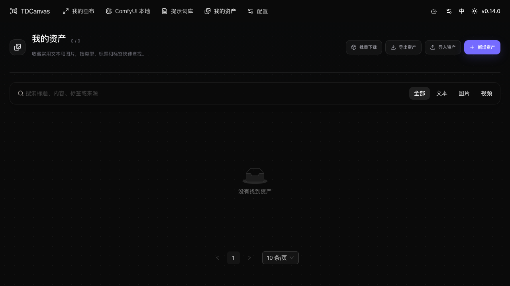

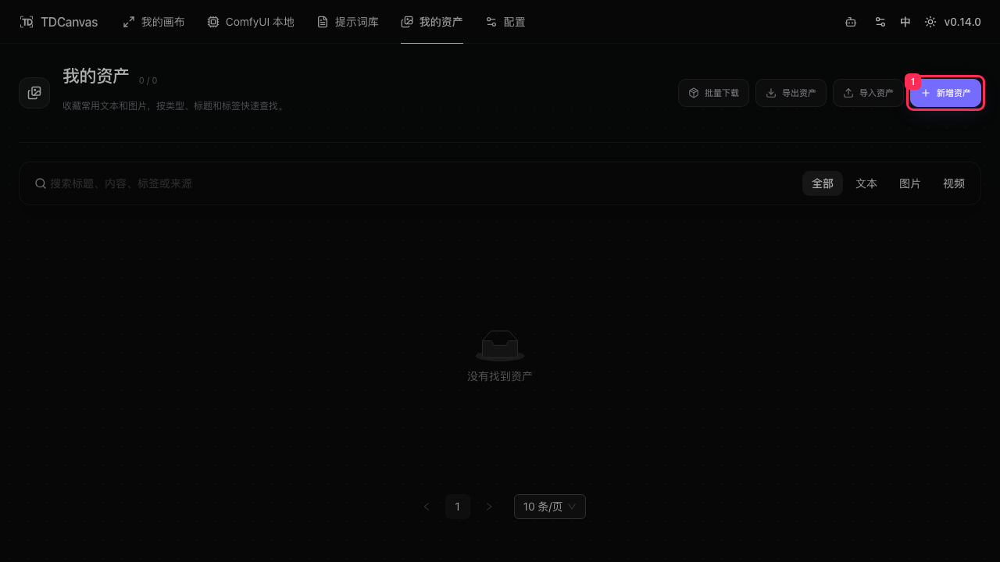

## 认识页面

| 位置 | 内容 |
|---|---|
| 页面标题 | 我的资产，副标题「收藏常用文本和图片，按类型、标题和标签快速查找。」 |
| 右上工具栏 | 批量下载、导出资产、导入资产、新增资产 |
| 搜索框 | 占位文字「搜索标题、内容、标签或来源」 |
| 类型筛选 | 全部 / 文本 / 图片 / 视频 |
| 卡片 | 封面区（文本资产显示内容摘要）、标题、来源、类型徽标、摘要、标签 |
| 卡片底部操作 | 编辑、复制、删除（按类型不同而不同，见下） |
| 标题右侧计数 | 形如 `1 / 1`，为「当前筛选结果 / 全部资产」 |
| 底部分页 | 默认 10 条/页 |

## 新增一个文本资产

1. 点击右上角「**新增资产**」，弹出「新增资产」窗口。
2. 「类型」选「文本」（默认）。
3. 「标题」填写便于检索的名字——必填。
4. 「封面 URL」可留空；需要缩略图时粘贴图片地址，或点「上传」选择本地图片。
5. 「标签」输入后按**回车**逐个添加（如「摄影」「产品」）。
6. 「来源」可填「手动添加 / 画布 / 提示词库」等字样；「备注」为可选项。
7. 「文本内容」填写正文——文本类型必填。

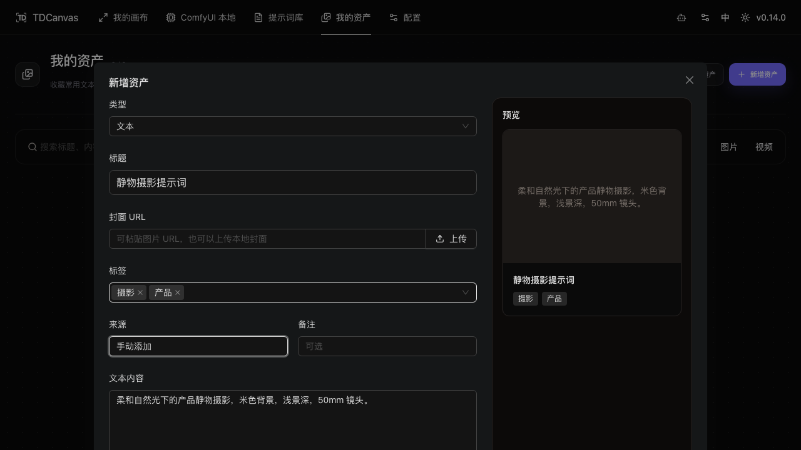

8. 点「**保 存**」。窗口关闭，右上角出现「资产已保存」提示，卡片出现在列表中。

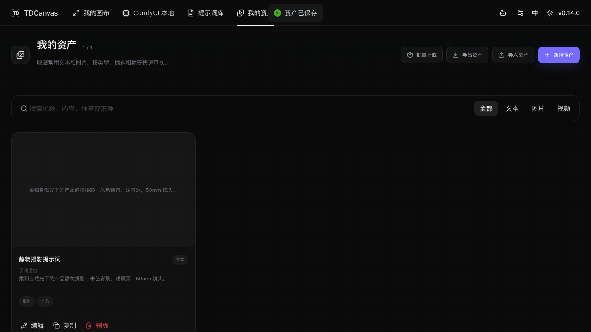

## 查看详情

点击卡片的**封面区**（文本资产即显示内容摘要的灰色区域），右侧滑出「**资产详情**」面板：顶部再次显示内容摘要，其下依次是标题、类型与标签、「文本内容」全文，以及「**复制文本**」按钮。

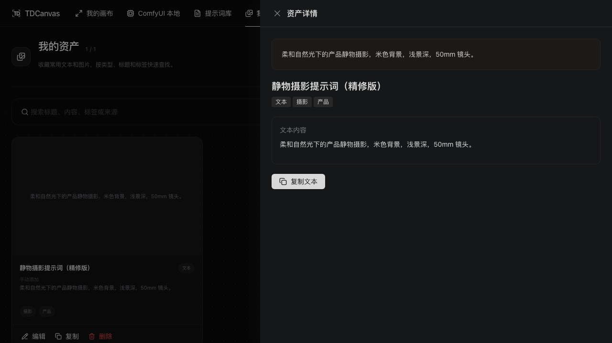

## 编辑资产

1. 点击卡片底部的「**编辑**」，弹出编辑窗口（字段与新增时相同）。
2. 修改标题或其他字段。
3. 点「保 存」，卡片立即更新。

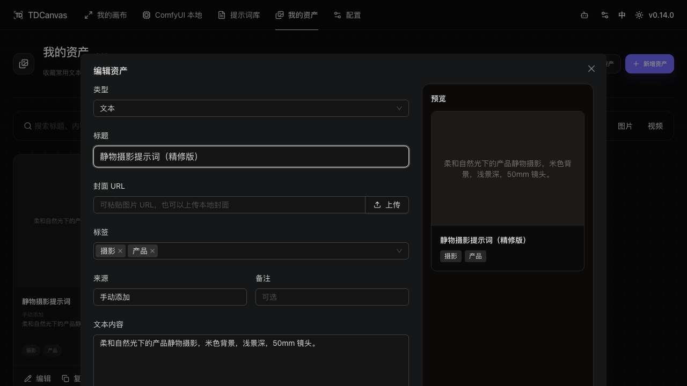

## 搜索与筛选

- **搜索**：在搜索框输入关键词，匹配**标题、内容、标签或来源**四个字段。输入即过滤，标题右侧的 `当前 / 全部` 计数同步变化。
- **类型筛选**：点「全部 / 文本 / 图片 / 视频」切换。实测只有一个文本资产时，选「图片」或「视频」会显示 `0 / 1` 与空态「没有找到资产」。

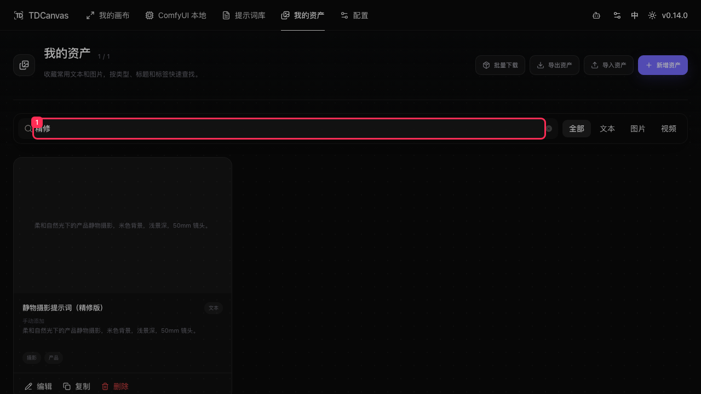

## 批量下载

「批量下载」这个名字有点误导：**点它不会下载任何东西**，它只是把你切换到**勾选模式**。真正的下载动作在下一步的工具栏里。

1. 点工具栏「**批量下载**」进入勾选模式。每张卡片右上出现圆形勾选框，**卡片底部的操作条会整条隐藏**（避免误点编辑/删除），工具栏变成「已选 N 项 / 全选当前结果 / 下载 ZIP / 取消」。
2. 点「**全选当前结果**」勾选当前筛选出的全部资产。注意「当前结果」四个字——它跟着筛选走：先按「图片」筛选再全选，就只会勾中图片，不会把文本一起打包。
3. 点「**下载 ZIP**」打包下载；点「取消」退出勾选模式。

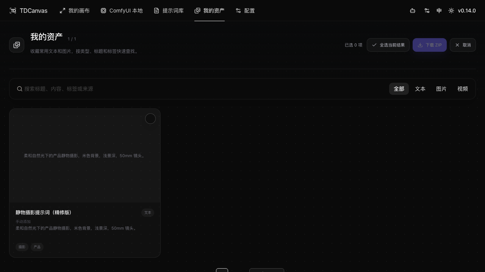

**一个容易卡住的地方**：「下载 ZIP」在没有勾选任何资产时是**灰色不可点**的。它不是坏了，是还没到能下载的状态——先勾选或全选，它才会变成紫色可点。

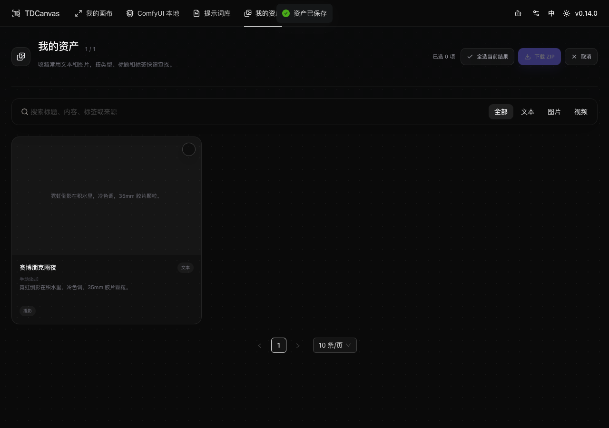

勾选后点「下载 ZIP」，页面顶部弹出成功提示，形如「**1 个资产已保存为 TDCanvas.zip**」，并**自动退出勾选模式**、工具栏恢复原样。

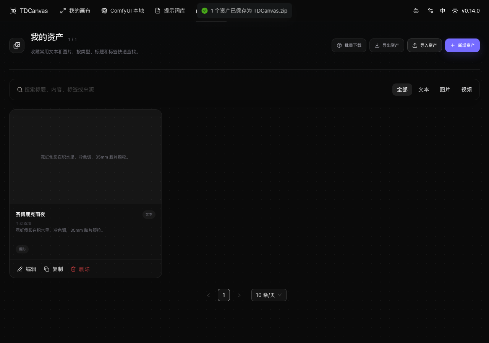

> 提示语里直接写出了 ZIP 的文件名，**这是确认产物名最快的办法**——不用去翻系统下载目录。

## 带走资产的三条路

资产页能"把东西带走"的地方有三个，它们产出的文件**互不通用**，用错会导致还原不回来：

| | 导出资产 | 批量下载 → 下载 ZIP | 卡片上的「下载」 |
|---|---|---|---|
| 适用类型 | 全部 | 勾选的任意类型 | 仅图片 / 视频 |
| 作用范围 | **全部资产**（忽略当前筛选与勾选） | 仅勾选的资产 | 单个资产 |
| 落地文件 | 一个 zip | 一个 zip | 单个原始文件 |
| zip 文件名 | `我的资产.zip`（固定） | `<画布名>.zip`，取不到则 `TDCanvas.zip` | — |
| 含元数据（标题/标签/来源） | ✅ | ❌ | ❌ |
| 能用「导入资产」还原 | ✅ | ❌ | ❌ |
| 适合 | **备份、换机迁移** | **分享给不装 TDCanvas 的人** | 存单张图/视频 |

一句话记法：**「导出」是给自己搬家的，「下载」是给别人寄东西的。** 只有前者是往返的（导出 → 导入），后者是单向的。

## 导出与导入

- **导出资产**：把**全部**资产打包为 `我的资产.zip` 下载到系统下载目录。它不看当前筛选也不看勾选状态——在「图片」筛选下点它，导出的仍是全部资产。无资产时点击会提示「暂无资产可导出」。
- **导入资产**：点它**直接弹出系统文件选择器**（中间没有二次确认页），选择此前导出的 zip 压缩包导入，成功提示「已导入 N 个资产」；文件无效时提示「导入失败，请选择有效的资产压缩包」。

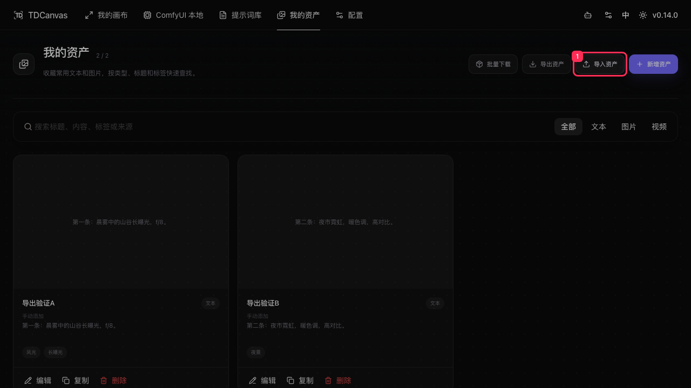

### 两个 zip 里到底装了什么

2026-10-01 实测拆包对比（一个文本资产「赛博朋克雨夜」）：

```text
导出资产 → 我的资产.zip                批量下载 → TDCanvas.zip
├── assets.json                       └── 赛博朋克雨夜.txt
│   ├── app / version / exportedAt        内容仅为「文本内容」那一段
│   ├── assets[]  ← 完整元数据
│   └── files[]   ← 媒体文件清单
└── files/
    ├── image_xxx.png
    └── media_xxx.mp4
```

- **「导出资产」的 zip 是一份自描述的存档**。`assets.json` 里有 `app`、`version`、`exportedAt` 三个头部字段，加上资产数组（标题、封面、标签、来源、备注、正文、时间戳）和一份媒体文件清单。导入时正是靠这个清单把二进制放回原位。
- **「下载 ZIP」的 zip 只是一堆裸文件**，一个资产对应一个文件（文本落成 `.txt`，图片视频落成原格式），包内**没有任何元数据**，也**没有目录层级**。同名资产会自动改名为「xxx (2).txt」避免互相覆盖。

> 拿「下载 ZIP」的产物去点「导入资产」，一定会得到「导入失败」——因为它压根没有 `assets.json`。这正是两条路径的分工。

### 为什么两个 zip 名字不一样

`我的资产.zip` 是写死的固定名（界面文案里就叫这个），而批量下载的 zip 名是**猜出来的**：程序会先看选中资产是不是都来自**同一个画布项目**，是的话就用那个画布的名字；不是（或者压根不来自画布，比如手动添加的资产）就退回"最近打开的画布名"；连这个都没有，才落到硬编码的 `TDCanvas`。

所以截图里那个 `TDCanvas.zip` 并不是 bug，而是**这条兜底链走到底的样子**——我测的资产来源是「手动添加」，前两级都没取到名字。想换个名字，唯一办法是让这批资产来自同一个画布项目。

### 导出不会下载远程封面

导出只打包**存进本机**的图片和视频（源码里按本地存储键去找二进制）。如果某个资产是用「**封面 URL**」粘贴的**远程地址**，那串 URL 只会作为文本躺在 `assets.json` 里，**图片本体不会进 zip**。换机后如果那个链接已失效，这个资产的封面就没了。

> 想让图片真正随备份走，走「**图片内容**」的上传（本地文件）而不是「封面 URL」。

2026-09-30 实测的完整还原流程：

1. 新建两个文本资产（带标签），确认列表计数为 `2 / 2`；
2. 点「导出资产」，得到 `我的资产.zip`；
3. 逐个删除两个资产，页面回到「没有找到资产」；
4. 点「导入资产」并选择该压缩包；
5. 两个资产全部恢复，计数回到 `2 / 2`，标题、正文、标签、来源均与删除前一致。

> 导入是**追加**而非覆盖：与现有资产同名时会产生新的条目，导入前建议先清空或重命名可能冲突的资产。

## 删除资产

1. 点击卡片底部的「**删除**」，弹出确认框「删除资产」，正文为「确定删除「<资产名>」吗？删除后会从我的资产中移除。」
2. 点「删 除」确认，或「取 消」放弃。

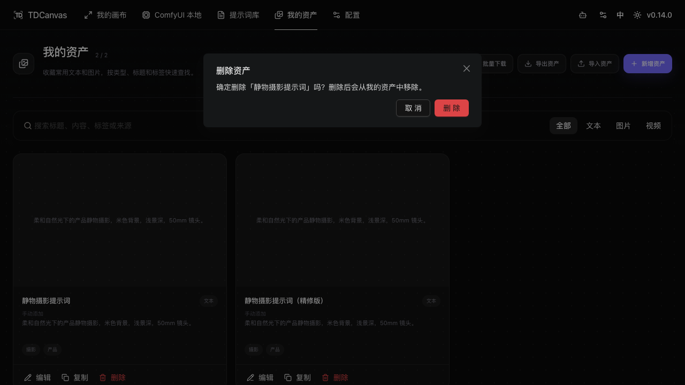

> **删除不可撤销**，也没有回收站。误删后只能重新录入，建议先「导出资产」留一份备份。

## 不同类型的卡片操作

| 资产类型 | 卡片底部可用操作 |
|---|---|
| 文本 | 编辑、复制、删除 |
| 图片 | 编辑、下载、删除 |
| 视频 | 下载、删除（**无「编辑」**） |

这组差异不是随手排的，它由**类型决定**：

- **「编辑」排除视频**——视频资产只有来源地址和存储键，没有可编辑的正文表单，改不了字段。
- **「复制」只给文本**——它复制的是**「文本内容」那段纯文本到系统剪贴板**（复制成功提示「文本已复制」），不是复制整个资产。想把文本资产搬到提示词库里，得先点「复制」再手动粘贴。
- **「下载」只给图片和视频**——文本没有可下载的媒体文件，文本要带走请走上面的「批量下载 → 下载 ZIP」。

> 顺带一提：进入批量模式时**整条操作条会被隐藏**（见上文截图），这是防止你在勾选状态下误触编辑或删除。

## 成功判据

- 保存后右上角出现「资产已保存」，且列表计数 `0 / 0` → `1 / 1`；
- 编辑后卡片标题即时变为新值；
- 搜索或筛选后计数与卡片数量一致，无匹配时显示「没有找到资产」；
- 导出后系统下载目录出现 `我的资产.zip`；
- 批量下载后顶部提示「N 个资产已保存为 XXX.zip」，且工具栏自动退出批量模式；
- 删除后卡片消失，回到空态。

## 已知限制

- 视频资产**不能编辑**，只能下载或删除；要改标题需删除后重建。
- 删除无撤销与回收站。
- 资产与画布项目是两份独立存储；删除资产不会影响画布节点，反之亦然。
- 「封面 URL」填的**远程图片不会随导出打包**，换机后可能失效。
- 「下载 ZIP」的产物**无法用「导入资产」还原**（缺元数据），它只适合单向分享。
- 批量下载的 zip **名不跟随你输入的标题**，而是取自资产来源的画布名，取不到就是 `TDCanvas.zip`。

## 相关任务

- [use-prompt-library.md](use-prompt-library.md)：从提示词库把提示词收藏进资产。
- [project-management.md](project-management.md)：画布项目本身的导出与删除。
- [20-reference.md](../20-reference.md)：资产与数据的存储位置。
