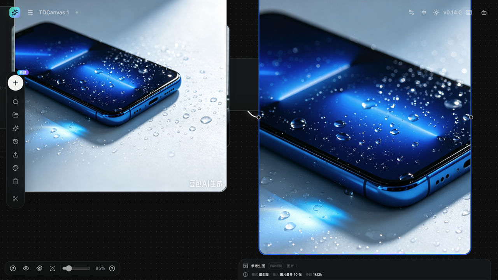
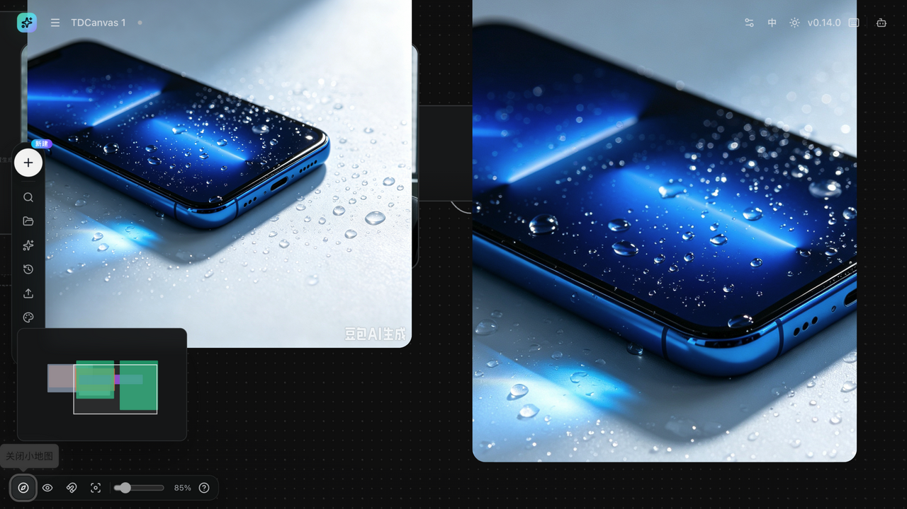
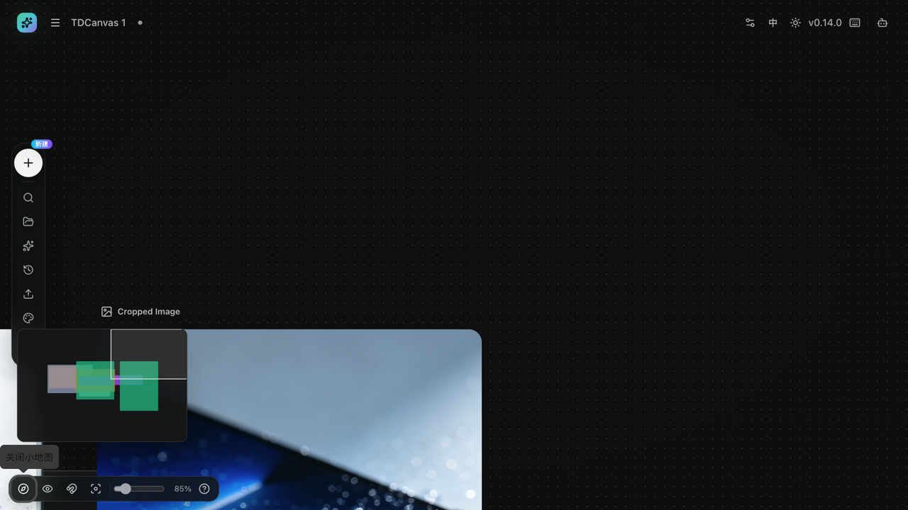
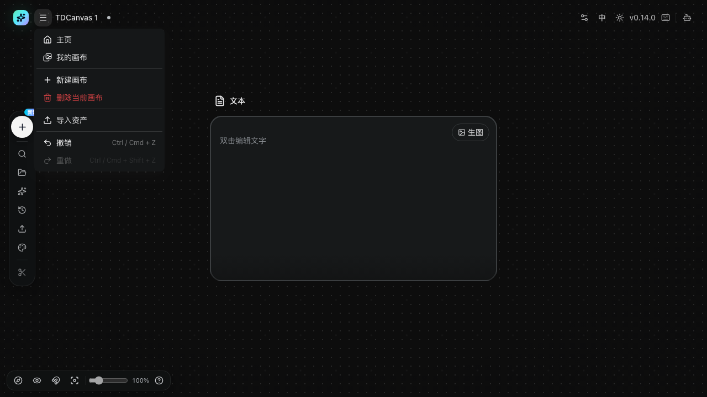
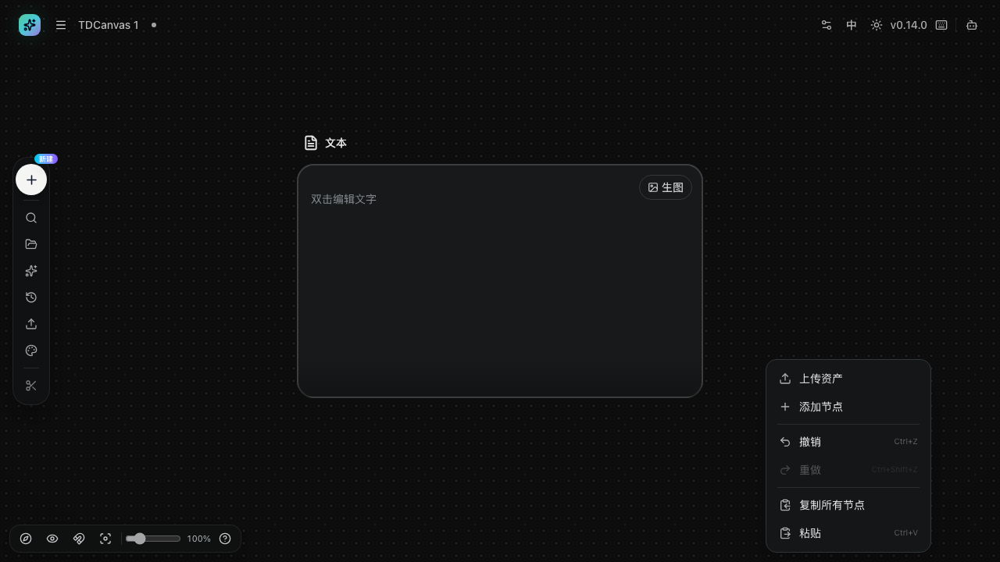

# 平移、缩放与小地图导航

- **适用角色**：所有 TDCanvas 用户。
- **目标**：在无限画布上自由移动视野、缩放画面，并用小地图快速跳转。
- **前置条件**：已打开一个画布项目。
- **入口**：画布任意空白处；左下角缩放 Dock。

## 缩放

- **鼠标滚轮**：在画布上滚动滚轮即缩放（以鼠标位置为中心），范围 5%–500%。
  - 缩放以**鼠标位置为锚**：指到哪里，哪里就是放大/缩小的中心。
  - 步进约为每次 ±10%（1.1 倍率），连续滚动可平滑放大。
- **缩放滑杆**：左下角滑杆精确调整；点击百分比旁的圆形按钮可一键重置。
  ★ **面板开着时这两个点不动**——左侧节点面板整块盖住左下角那一片（见 [排障页](../90-troubleshooting.md#左下角一排按钮点不动-缩放、网格吸附、重置视图、快捷键全都失灵)），
  **先点 Dock 里的「搜索节点」把面板收起来**。**滚轮缩放没有这个问题**，它不在那一排里。
  - 滑杆为**对数刻度**（5%–500%），低百分比区间每格跨度更大；拖动过量时可小幅回拖。
  - 滑杆缩放以**视口中心为锚**（与滚轮不同）。
- 触控板双指捏合同样生效。

## 平移

- **按住画布空白处拖动**：平移视野（最常用）。
- 小地图也可以拖动视口框平移（见下）。

## 重置视图

- 点击左下角「**重置视图**」按钮：自动缩放到刚好容纳全部节点（最大 100%）。
- 若当前有节点处于选中状态，重置视图会**聚焦到选中节点**（实测 156%，上限 150% 以内）——先按 `Esc` 取消选中再点重置，即可回到全览（无选中时实测 fit 全部为 54%–100%）。

## 小地图导航

1. 点击左下角第一个图标「**打开小地图**」，左下方出现小地图面板（240×160，节点按类型着色，白色框为当前视口）。
2. 在小地图上**点击或拖动**，主画布视野随即跳转到对应区域。
3. 再次点击该图标（变为「关闭小地图」）收起。

*实测（2026-10-02）：上面三条逐条成立。① 面板确为 **240×160**；② 在小地图上点一个位置，主画布的**视野中心精确落在你点的那个位置**（偏差 0 像素），拖动时视口跟手、松手在哪停在哪；③ 导航**不会改变缩放比例**。另外无论把画布放大还是缩小，小地图始终是 240×160，不会跟着变大变小。*

> ★ **2026-10-06 M273 把「始终 240×160」这句又单独验了一遍，三档逐点测**：
> ★ **100% / 200% / 50% 量到的都是 `240×160`，一个像素没变**（★ **同一批里的缩放控件 297×36 同样三档不变**）。
> ★ **所以它是「屏幕坐标」**，而**节点、端口、四角手柄那些是「画布坐标」**——
> ★ **同样写着两个数字，一个要乘缩放、一个不要，区别只在于它写没写在画布那层缩放之内**
> （归类表见 [30-concepts.md](../30-concepts.md)）。

> **为什么你的节点在小地图上显得特别小、四边还有大片空白？** 这是正常的：小地图显示的范围是「**所有节点的外接矩形，再上下左右各留出一大圈空白**」，并且**始终等比缩放以保证所有节点都在画面内**。所以节点之间的空隙也被一起压缩了，看起来只有中间一小块。

> ★ **小地图看的是「全部节点」，画布看的是「当前视野里的节点」——这是两批不同的节点。**
> 画布只画**视野加一圈缓冲范围内**的节点（源码 `pages/canvas/project.tsx:617` 的 `visibleNodes`），
> 而小地图拿的是**全部节点**（`:3885` 传进去的是 `nodes`，不是 `visibleNodes`）。
> ★ 所以**节点跑出视野时，它没有消失，只是画布不再画它了**——
> **而小地图上那个位置还留着它**（上面那句「所有节点的外接矩形」说的正是这件事）。
> **这让小地图成了整个界面上唯一能看见视野外节点的地方**：
> 找不到某个节点时，**别急着刷新页面，先点开小地图看它在哪儿，点它一下，视野就跳过去了**。
> ★ 顺带一个实用巧合：左侧节点面板开着时，左下角那排控件**只有「打开小地图」点得到**，
> 其余五个被面板盖住（见 [排障页](../90-troubleshooting.md#左下角一排按钮点不动-缩放、网格吸附、重置视图、快捷键全都失灵)）——
> **于是「节点不见了」这件事，恰好只能靠这个唯一幸存的按钮来解决。**

### ⚠️ 小地图会压住画布左下角，被压住的节点点不到

小地图是盖在画布**上层**的一块浮层，固定占住左下角 **240×160** 的区域——它不会避让节点，也没有「自动收起」。**落在这一块里的节点会被整块盖住，接收不到鼠标。**

*实测（2026-10-02）：把节点拖到小地图覆盖区域正中，再试这些操作——*

| 操作 | 被小地图压住的节点 | 同批放在空白处的对照节点 |
|---|---|---|
| 点一下选中 | **选不中** | ✅ 正常选中 |
| 按 `Delete` 删除 | **删不掉**（节点数不变） | ✅ 正常删除 |
| 从它拖出连线 | **拖不了**（连输出端口都找不到） | ✅ 正常连线 |

**这不是应用卡死了，是被挡住了。** 两种解法，任选：

- **把小地图关掉**：再点一次那个图标（变成「关闭小地图」）即可。**这是最快的解法**——小地图只是导航辅助，本来就不必常开。
- **把节点挪出来**：先用滚轮或拖空白处把视野挪开，节点离开左下角这块区域就能正常操作了。

> **一个容易误判的连带现象**：被压住的节点因为**根本选不中**，所以你按 `Delete` 什么也不会发生——此时**撤销也救不了你**（没选中就没有可撤销的删除）。请先关掉小地图再操作。

> **布局建议**：把节点尽量放在画布**中部偏右**，左下角这块地留给小地图。反正小地图开着的时候，那块地你也点不到。

## 画布里两个不显眼的菜单

平移和缩放都在「看得见的地方」，但画布上有两个菜单藏在角落，里面有几项操作**没有对应的界面按钮**，只能从这里进（2026-10-01 逐项实测）。

### 顶栏左上角的画布菜单

点顶栏最左边的**汉堡按钮**（项目名左侧）展开，共七项：

| 菜单项 | 作用 | 注意 |
|---|---|---|
| 主页 / 我的画布 | 回到首页项目列表 | 等同顶栏「我的画布」 |
| 新建画布 | 直接开一个新项目 | 等同首页「新建画布」 |
| **删除当前画布** | 删除**你正在编辑的这个**项目 | ⚠️ **没有任何确认弹窗，一点即删** |
| **导入资产** | ⚠️ 名不副实：**实际打开的是本地媒体文件选择器**（与 Dock「上传资产」是同一个函数 `handleUploadRequest`），**与「我的资产」无关**，不能用来恢复 `我的资产.zip` | 见下方说明 |
| 撤销 / 重做 | 同 `Ctrl / Cmd + Z`、`Ctrl / Cmd + Shift + Z` | 无可撤销操作时为禁用态（灰） |

> ⚠️ **「删除当前画布」是整个产品里最危险的一次点击**。它不像首页那样弹确认框——实测点击后画布被**立即删除并跳回首页**，`role=dialog` 数量为 0，没有任何提示。源码层面也能对上：画布内走 `project.tsx:1264` 的 `deleteCurrentProject`，直接调用 `deleteProjects()` 后跳转；而首页卡片删除走的是 `setDeleteIds` → `CanvasDeleteProjectsDialog` 确认弹窗。**同一个"删除画布"，两条路径行为不一致**。要删画布请回首页操作（见 [project-management.md](project-management.md#删除项目)）。

> ⚠️ **「导入资产」这个标签是错的**。菜单里写「导入资产」，很容易让人以为它能导入 `我的资产.zip`——但源码里这一项绑定的是 `onImportImage={() => handleUploadRequest()}`，**和「上传资产」是同一个处理函数**，点开的是本地图片/视频/音频文件选择器。要真正导入 `我的资产.zip`，得回首页的「我的资产」页面点「导入资产」（见 [manage-assets.md](manage-assets.md)）。运行时实测也吻合：点击后 URL 不变、页面无任何「导入」相关文案，只是弹出了文件选择器。

### 画布空白处的右键菜单

在**空白处**（不是节点上）点右键，菜单出现在鼠标位置，共六项：

| 菜单项 | 作用 | 备注 |
|---|---|---|
| 上传资产 | 打开文件选择器上传素材 | 与 Dock「上传资产」同一个入口 |
| 添加节点 | 打开节点类型菜单 | 与 Dock「+」同一个入口 |
| 撤销 / 重做 | 同上 | 标签写作 `Ctrl+Z` / `Ctrl+Shift+Z` |
| **复制所有节点** | 一次复制画布上的**全部**节点 | ★ **空画布上这一项是灰的、按不动**（见下） |
| 粘贴 | ★ **落在画布容器的中心，不是鼠标位置** | 标签写作 `Ctrl+V` |

> **下面三块内容单独成节了**（「粘贴的两条通路与「内部优先」」）——★ **落点、两条通路、以及两条都非空时的优先级都在那边。**
>
> ⚠️ **本手册此前写「在鼠标位置粘贴」，那是错的，已订正**（2026-10-06 M283 实测 + 源码双证）。
> **落点规则是：副本外接框的中心，对准画布容器的中心。** 实测两次右键、两种位置：
>
> | 你在哪里点的右键 | 副本落点（以图片节点为例） | 说明 |
> |---|---|---|
> | (1400, 700) | 世界坐标 **(560, 35)** | 相对原位 (360, −55) 偏移 **+200, +90** |
> | (500, 780) | 世界坐标 **(560, 35)** | **和上一行一模一样——右键位置完全不影响落点** |
>
> **开 Agent 面板还会让落点整个左移**：
>
> | 右侧 Agent 面板 | 画布容器宽 | 容器中心 | 副本偏移 |
> |---|---|---|---|
> | **收起** | 1600 | 800 → 世界 650 | **+200, +90** |
> | **展开** | **1159**（被面板吃掉 441） | 579.5 → 世界 429.5 | **−20.5, +90** |
>
> 所以「复制所有节点 → 粘贴」在用之前先想清楚你要副本落在哪：**它总是落在你当时那半块画布的正中间，而「哪半块」取决于右侧面板开没开**。想放在别处，粘贴后整组拖走即可（外接框整体平移，相对位置不变）。
>
> **副本一律在标题后加 ` Copy`**（实测图片 / 音频 / 视频 / 文本四个都加）。
>
> **粘贴完第一个副本的生成面板会自动打开**——因为「第一个」是按节点数组顺序来的，而这个画布上排第一的是图片节点。按 `Esc` 或点空白即可关掉。
>
> **「复制所有节点」+「粘贴」= 整个画布的备份与复制**。实测：2 个节点的画布执行「复制所有节点」后在空白处「粘贴」，节点数从 2 变成 4——是**整画布复制**，不是复制选中的那几个。
>
> ⚠️ **连线的处理**：`connectionsRef` 全量拷进剪贴板，粘贴时按 `idMap` 重映射、**端点对不上的直接丢掉**。
> **这条已在含连线的画布上实测**（2026-10-06 M286，先在夹具里拖出一条 video → image 的连线）：
> **4 个节点 + 1 条连线 → 粘贴后 8 个节点 + 2 条连线**，
> ★ **而新那条连的是「副本」**——实测它的两端分别是 `m247-video.mp4 Copy` 与 `…png Copy`，
> ★ **不是原来那两个节点**（源码正是靠 `idMap` 把端点换成副本的新 id）。
> ★ **所以「快速复刻画布」在含连线的画布上同样成立**，连线会跟着一起复制。
>
> ★ **⚠️ 但连按两次粘贴，副本会重名**：★ **12 个节点里有两份都叫「X Copy」**，
> ★ **而不会出现「X Copy Copy」**——因为剪贴板里存的始终是**原节点**，
> ★ **每次粘贴都从原标题重新算一次。** 两批副本**靠位置区分、标题一模一样**，
> ★ **想区分就粘贴后逐个改名。**
>
> 备份一个项目最稳的办法仍然是导出 zip（见 [project-management.md](project-management.md#导出项目)）。
>
> **空画布上「复制所有节点」是灰的**（2026-10-06 M283 在另一张 0 节点画布上实测）：**六项里只有它 `disabled`，「粘贴」照常可点**。所以「按了没反应」的原因是它根本按不动，不是菜单坏了。

> **注意快捷键标签不一致**：顶栏菜单把撤销写作 `Ctrl / Cmd + Z`（Mac 上对），而右键菜单只写 `Ctrl+Z`——**在 Mac 上照着右键菜单的标签按 Cmd+Z 是对的，但界面上没告诉你 Cmd 存在**。以顶栏菜单和 [shortcuts-help.md](shortcuts-help.md) 的写法为准。

### 粘贴的两条通路与「内部优先」

> **★ 还有第二条「粘贴」通路，它平时不声张**：**内部剪贴板是空的时，「粘贴」不会报错——它会自动改读系统剪贴板**
> （源码 `if (!pasteCopiedNodes()) void pasteSystemClipboard()`，`pages/canvas/project.tsx:3914`）。
> **★ 所以「粘贴」其实覆盖两种完全不同的东西，而菜单上只有同一个「粘贴」二字。**
>
> ⚠️ **★★ 两条都非空时，内部优先。** 这一点有实测（2026-10-06 M288），**而且很容易让人以为粘贴坏了**：
> **你先「复制所有节点」，然后到别的应用复制了一段文字，再回画布按「粘贴」——**
> **出来的是节点副本，不是那段文字。**
>
> | 系统剪贴板 | 内部剪贴板 | 粘贴出来的东西 | 有没有那条提示 |
> |---|---|---|---|
> | 文字 | 空 | **文本节点** | ★ **有：「已从剪切板添加文本」** |
> | 文字 | **4 个节点** | ★ **4 个节点副本**，★ **那段文字被完全无视** | ★ **没有** |
> | ★ **换成别的内容** | **4 个节点** | ★ **仍然是 4 个节点副本** | ★ **没有** |
>
> ★ **★★ 那条提示就是「走了哪条路」的判据**：
> ★ **看到「已从剪切板添加文本 / 图片」，说明走的是系统剪贴板那条；**
> ★ **什么都没有，说明走的是内部副本那条。**
> ★ **★ 而第三行是顺带查实的**：内部剪贴板是「复制那一刻」的快照，
> **你之后在别处复制什么都改不了它。**
> ★ **所以想让粘贴认新的内容，得先在画布里再复制一次（或者干脆让内部剪贴板空着）。**

| 系统剪贴板里是什么 | 结果 | 提示 |
|---|---|---|
| **图片**（哪怕同时还有文字） | **建一个图片节点** | 「已从剪切板添加图片」 |
| 只有文字 | 建一个文本节点 | 「已从剪切板添加文本」 |
| **只有空格 / 换行 / 制表符** | **什么都不发生、也不提示** | **无** |
| 空的 | 什么都不发生 | 无 |

> **三条必须知道的规则**（2026-10-06 M284 实测）：
> **① 图片压倒文字。** 剪贴板里同时放了一张图和一段中文时，**只建图片节点，那段文字被静默丢掉**——实测剪贴板类型 `text/plain` 与 `image/png` 两样都在，**结果只有 1 个图片节点、只弹图片那一条提示**。
> **② 图片节点的标题恒是 `clipboard-image.png`。** 这是源码里写死的文件名，**你在别处复制的图片叫什么名字，它都不管**。
> **③ 文本节点的标题取正文前 32 个字、正文存完整内容。** 一段 35 字的文字，落成标题 32 字 + 正文 35 字。
>
> **两条通路落在同一个点。** 内部剪贴板与系统剪贴板、「复制所有节点」与 `Ctrl+V`，**五次独立实测的落点中心逐位相同**（**(711.44, 382.65)**，当时缩放 77%）。**所以「画布容器中心」是粘贴的通用落点，不分你走的是哪条路。**
>
> ⚠️ **「粘贴按了没反应」有两个已知原因，都不是坏了**：**① 画布 0 节点时「复制所有节点」是灰的**（见上）；
> **② 系统剪贴板里只有空白字符时，上面那一行「什么都不发生、也不提示」。**
> **排查办法**：先随便往剪贴板里复制一段**有字的**文字，再粘贴——**这一步能同时排掉上面两条**。
>

## 成功判据

- 滚轮滚动时缩放百分比（左下角）实时变化，且画面围绕鼠标位置缩放；
- 小地图中的白色视口框位置与主画布当前视野一致；点击小地图任意位置，视野中心立即移动过去。

> **节点多到小地图也不够用时**，用画布左侧 Dock 的「搜索节点」侧边面板——它能按类型筛选并**一键定位到指定节点**（列表项的鼠标提示原文就叫「定位到节点」），还能只导出选中的那几个节点。完整说明见 [organize-canvas.md](organize-canvas.md#侧边面板-画布上的节点索引器)。

## 常见问题

- **按住空格拖动不能平移**：TDCanvas 的空格键不用于平移；直接拖画布空白即可。
- **滚轮滚动变成了页面滚动**：请确保鼠标位于画布区域内（左侧 Dock、顶栏、弹层上的滚轮不会缩放画布）。

## 相关任务

- [create-nodes.md](create-nodes.md)：创建节点后整理视野。
- [organize-canvas.md](organize-canvas.md)：分组与外观设置。
