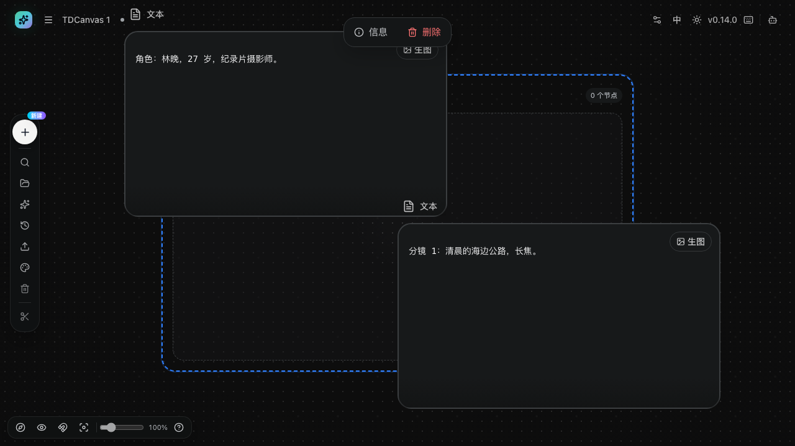
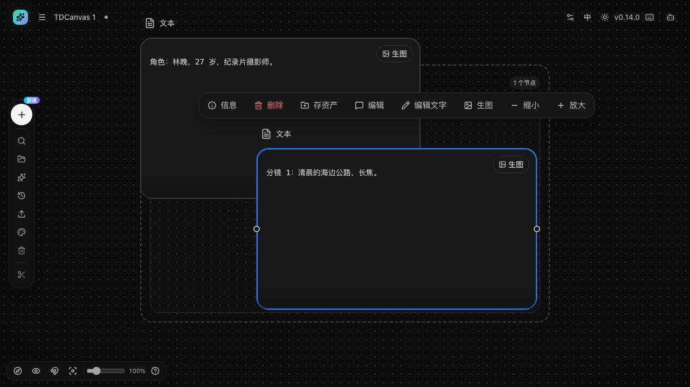
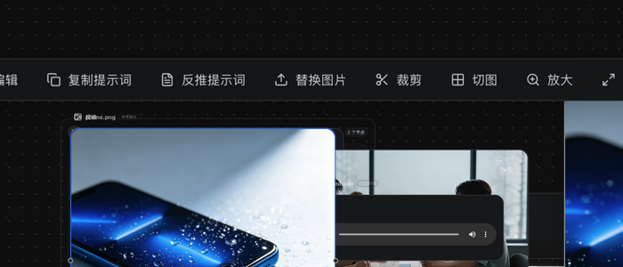
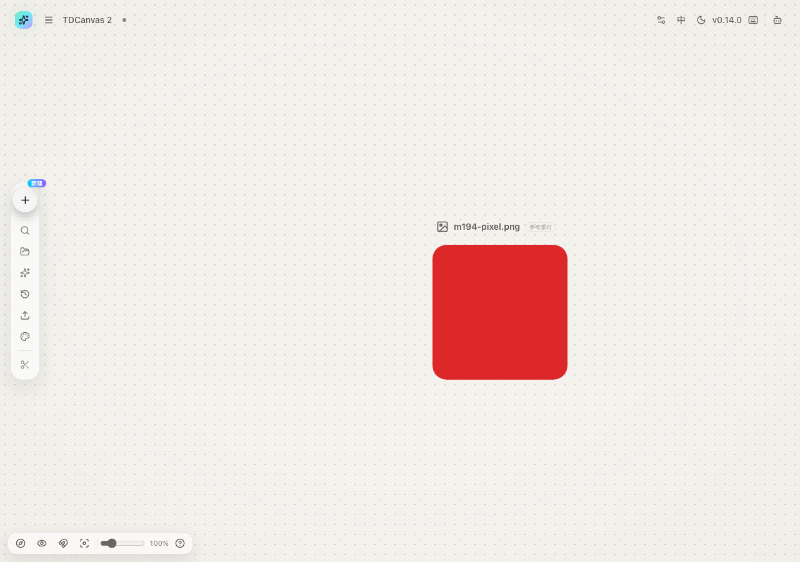
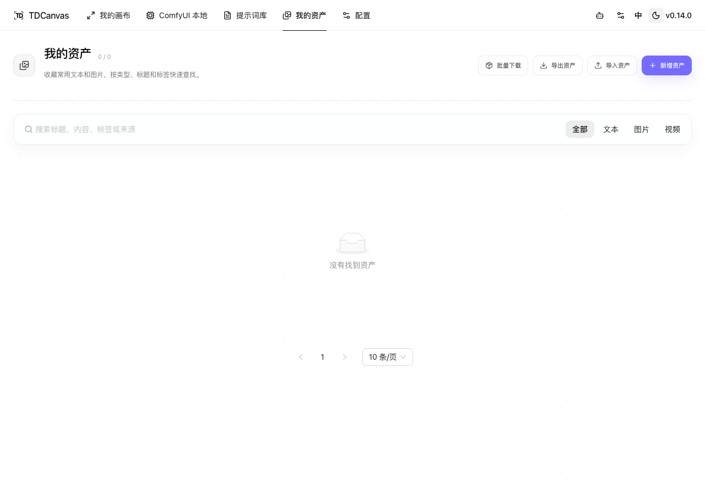
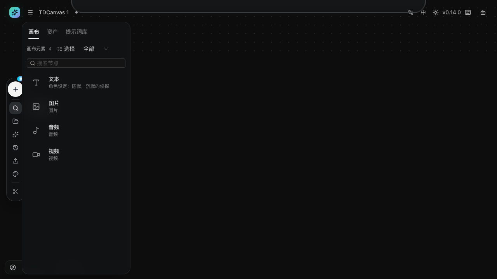
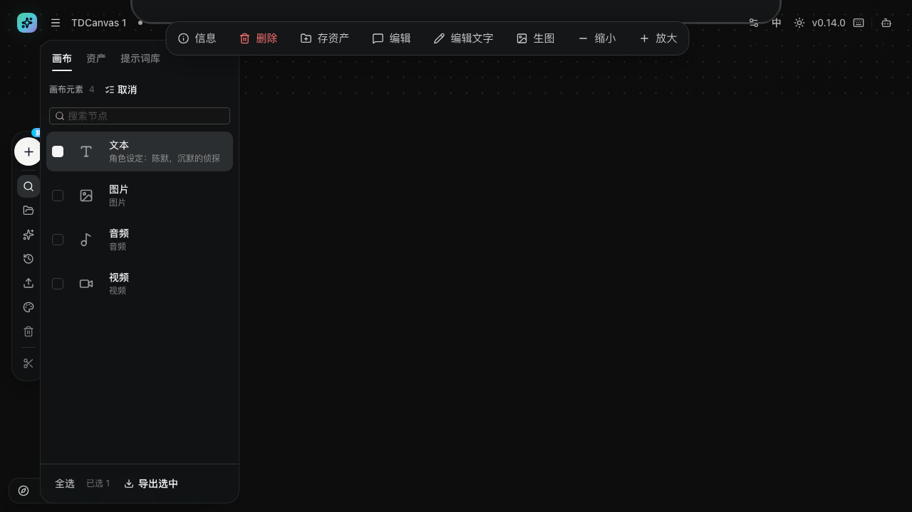
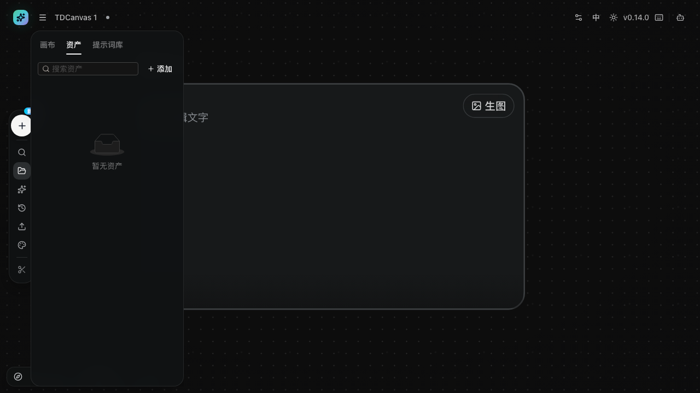

# 分组、外观与画布整理

- **适用角色**：所有 TDCanvas 用户。
- **目标**：用组整理相关节点，按喜好调整画布外观（主题/背景/输入模式），并使用对齐与吸附。
- **前置条件**：已打开一个画布项目，画布上有若干节点。
- **入口**：双击空白创建「组」；左侧 Dock「画布外观」；左下角 Dock 开关。

## 分组：把节点圈进「组」

节点一多，画布很快就变成一片散沙。用组把它们按用途圈起来，是最省力的整理方式——比如「角色设定」「分镜草稿」「待出图」各一个组。

1. **创建组**：双击空白 → 选「组」（或左侧 Dock「＋ 新建 → 组」），出现一个**蓝色虚线框**，右上角带「N 个节点」徽标。

   

2. **拖节点入组**：把任意节点**拖进虚线框**内松手，该节点即成为组成员，虚线框右上角徽标计数 **+1**。
3. **联动**：拖动组框时，**所有成员一起移动**；把成员拖出框外即退出组，徽标计数相应 -1。
4. **组不参与连线与生成**，只是视觉与整理容器。

   

> **组的边界是「归属」不是「遮挡」**：成员节点仍然可以拖到框外，也可以照常连线和生成。组只影响你移动组框时成员是否跟着走，不改变节点本身的行为。
>
> 想调整组的大小，拖动虚线框的边缘或角部；组变大只是让更多节点落在框内，并不会自动吸附里面的节点。

## 画布外观

左侧 Dock「**画布外观**」打开外观面板：

| 设置 | 选项 | 说明 |
|---|---|---|
| 画布输入模式 | 连线模式 / 无线模式 | 决定引用组织方式（见 [connect-references.md](connect-references.md)） |
| 主题模式 | 浅色 / 深色 | 全局界面主题 |
| 网格样式 | 点阵 / 线格 / 空白 | 画布背景图案 |
| 图片信息 | 开 / 关 | 图片节点上显示尺寸等信息条 |

这些设置里**只有「主题模式」是全局的**，其余三项（输入模式、网格样式、图片信息）都是**项目级**的——跟着项目保存，下次打开同一画布时保持不变。换句话说，可以给「工作稿」用点阵网格 + 连线模式，给「展示稿」用空白背景 + 无线模式，两套画布互不影响。

网格样式除了好看，还影响操作感受：点阵网格最容易看出节点是否对齐；空白背景画面最干净，但节点多时容易失去空间参照。

## 浅色主题怎么切：两个入口，一个开关

**主题模式是全局设置，不是项目设置**——改一次，首页、画布、资产页、配置页、Agent 面板**全部**跟着变，并且**关掉浏览器再打开也还是你选的那个**。

它有两个入口，**效果完全一样**：

| 入口 | 位置 | 适合 |
|---|---|---|
| **顶栏主题按钮** | 顶栏右侧，日亮 / 月亮图标 | 任何时候随手切，一秒生效 |
| **外观面板「主题模式」** | 左侧 Dock「画布外观」 | 已经在调外观时顺手改 |

浅色主题不是把深色反相，而是一套完整的独立配色：画布底色是**浅米色**（`oklch(1 0 0)` 的近白），节点与面板转白底深字，画布背景的**点阵变成浅棕点**。资产页的卡片、配置页的两栏布局在浅色下都正常：

**在外观面板里切主题，面板自己不会变**：面板是在弹出的瞬间渲染的，你在面板里点「深色」，**要先把面板关掉再打开**才能看到新配色——这是正常的，不是卡住了。

> **一个容易困惑的点**：面板里显示的是你**当前**的主题。在顶栏切到浅色后再打开外观面板，「浅色」就是选中态（见 [30-concepts.md](../30-concepts.md#主题与画布外观) 的浅色截图）——因为两个入口读写的是同一份设置。

## 对齐与吸附

- 拖动节点时出现**对齐辅助线**（与其他节点的边缘/中心对齐，吸附阈值约 7 屏幕像素）。
- 左下角「**网格吸附**」开关：开启后拖动按 16px 网格取整。

两个功能解决的痛点不同：**对齐辅助线**是临时的，只在你拖动时出现，帮你和其他节点对齐；**网格吸附**是持续的，把所有节点约束到统一网格上，适合需要整齐排布的场景（比如把 9 个分镜摆成 3×3）。

辅助线不出现通常是因为附近没有可对齐的对象——把节点拖到与其他节点边缘或中心接近的位置才会触发。

## 侧边面板：画布上的节点索引器

节点一多，"刚才那个节点在哪"就会变成真问题。画布左侧 Dock 上的三个按钮——**「搜索节点」「资产」「提示词库」**——打开的是**同一个侧边面板**，只是停在不同的标签页。

> ⚠️ **很多人找不到它，因为它默认是收起的**。首次打开画布时产品会主动把面板关掉（源码 `canvas-side-panel.tsx` 里用 `localStorage:tdcanvas:compact-shell-v1` 做了"只关一次"的埋点），而且这三个按钮**没有文字标签、只有图标**，Dock 又窄。记住位置：**左侧竖排 Dock 的第 2/3/4 个图标**。

### 画布标签页：找到并导出节点

点「搜索节点」打开，面板顶部是 **「画布元素 N」**（实测 4 个节点显示 4），右侧两个控件：

- **「选择」**——进入多选模式，见下节；
- **「全部」**——按类型筛选，源码里可选：全部 / 图片 / 视频 / 文本 / 音频 / Config / 组。其中「Config」是历史遗留类型，画布上不会存在这种节点，**选中它必定是空列表**（原因见 [30-concepts.md](../30-concepts.md#两种打不开的节点类型)）。

下面是节点列表，每行有**类型图标 + 节点标题 + 内容预览**（图片节点显示缩略图而不是图标）。运行中（生成/上传）的节点右侧还会亮一个**状态小圆点**：绿=成功、橙=进行中、红=错误。

**点任意一行即可「定位到节点」**——列表项的鼠标提示原文就是这四个字，画布会把视野移到该节点上。节点多了以后，这比用小地图或拉缩放滑块找位置快得多。

### 选择模式：只导出你要的节点

点「选择」后：标题栏按钮变成「**取消**」、类型筛选暂时隐藏、每行前面出现复选框，底部浮出一条工具栏——**全选 / 已选 N / 导出选中**。

勾选后点「导出选中」，浏览器会**直接下载一个 zip**（2026-10-01 实测：勾选 1 个文本节点，下载文件名 `画布元素-1个.zip`，包内是该节点内容对应的 `.txt`）。这条路径和首页的"导出整个项目"不同：

| 想带走什么 | 用哪里 |
|---|---|
| **画布上的几个节点**（不含整个项目结构） | 侧边面板 → 选择 → 导出选中 |
| **整个画布项目**（含节点、连线、视口与全部素材） | 首页勾选项目卡 → 批量导出 |

> **为什么需要"只导出几个节点"**：首页导出是项目级的全有或全无；把一张图或一段提示词发给同事时，你要的往往只是那一小块。侧边面板的按需导出正好补上这个缺口——素材类节点导出的是原文件，文本节点导出的是 `.txt`。

### 资产与提示词库标签页

同一面板的另两个标签页与顶部导航是**同一份数据**：

- **资产**：搜索框 placeholder 是「搜索资产」，右侧「**+ 添加**」；没有资产时显示「暂无资产」。这里看到的就是「我的资产」里的内容，加了资产会同步。
- **提示词库**：搜索框 placeholder 是「搜索提示词」。与 `/prompts` 页面共用同一份提示词来源，因此在本版本里同样是空的（见 [use-prompt-library.md](use-prompt-library.md)）。

面板右侧边缘有一条拖拽把手可以**调整宽度**，宽度会记在本机；再次点同一个 Dock 按钮即可收起。

## 视图辅助

- 左下角 Dock：小地图开关（见 [navigate-canvas.md](navigate-canvas.md)）、连线显隐、网格吸附、重置视图。

**隐藏连线**在节点连线很多时特别有用：画面会立刻清爽，引用关系改用对象引用查看。切换不影响已有的引用关系。

## 成功判据

- 拖入组后组徽标计数变化（实测 0 → 1 个节点）；拖动组框成员联动；
- 外观设置即时生效并随项目保存（下次打开保持）。

## 相关任务

- [navigate-canvas.md](navigate-canvas.md)：视图控制。
- [create-nodes.md](create-nodes.md)：创建要整理的节点。
- [30-concepts.md](../30-concepts.md)：为什么组不参与生成。

