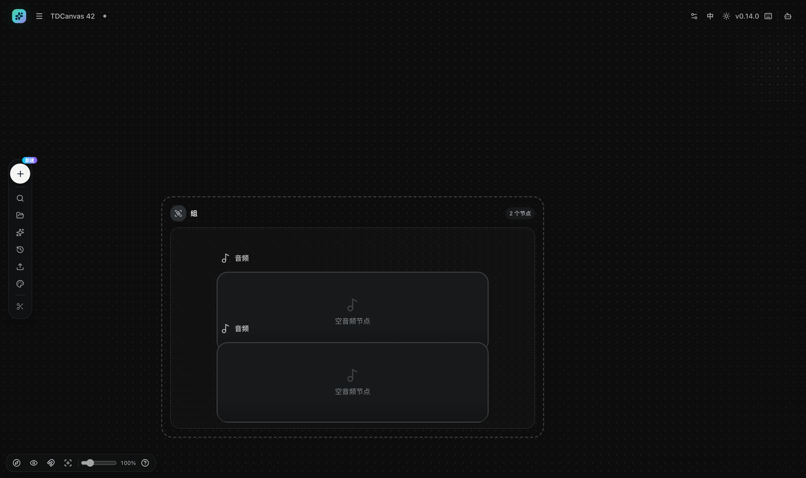
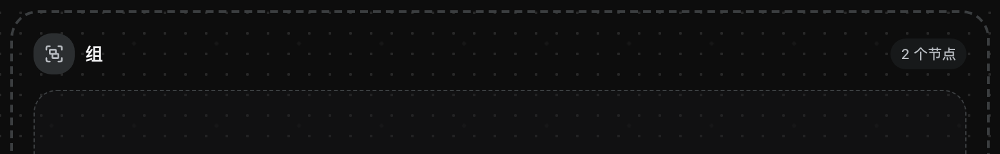
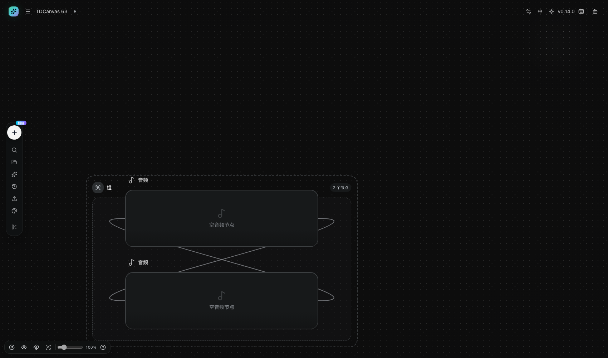
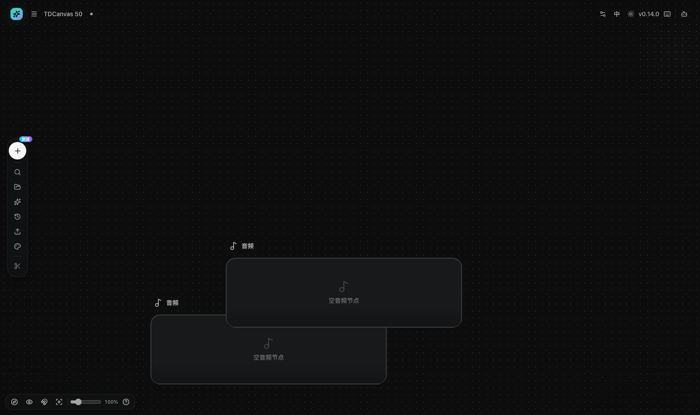
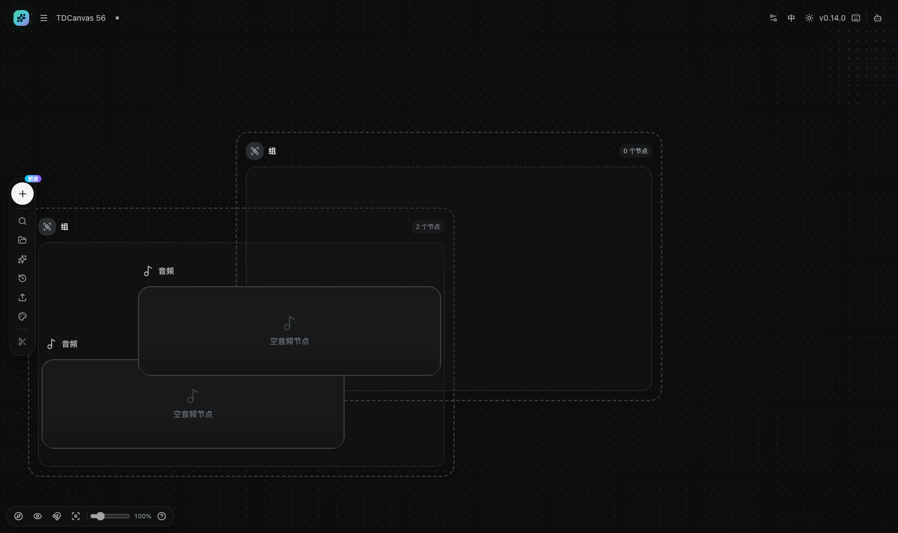

# 分组、外观与画布整理

- **适用角色**：所有 TDCanvas 用户。
- **目标**：用组整理相关节点，按喜好调整画布外观（主题/背景/输入模式），并使用对齐与吸附。
- **前置条件**：已打开一个画布项目，画布上有若干节点。
- **入口**：双击空白创建「组」；左侧 Dock「画布外观」；左下角 Dock 开关。

## 分组：把节点圈进「组」

节点一多，画布很快就变成一片散沙。用组把它们按用途圈起来，是最省力的整理方式——比如「角色设定」「分镜草稿」「待出图」各一个组。

1. **创建组**：双击空白 → 选「组」（或左侧 Dock「＋ 新建 → 组」），出现一个**蓝色虚线框**，右上角带「N 个节点」徽标。

   

2. **拖节点入组**：把任意节点**拖进虚线框**内松手，该节点即成为组成员，虚线框右上角徽标计数 **+1**。判据是**节点的中心点**落在框内——不需要整块塞进去，但中心越界就不算了。

   

   徽标是右上角这枚圆角小胶囊，它**显示的是当前成员数**，不是"有没有成员"：

   

3. **联动**：拖动组框时，**所有成员一起移动**；把成员拖出框外即退出组，徽标计数相应 -1。**组框外的节点不受影响**，不会被拖着跑。

4. **组不参与连线与生成**，只是视觉与整理容器。

   

> **徽标计数与成员联动的完整实测序列（2026-10-02 M101）**：空组 `0` → 拖入一个 `1` → 再拖入一个 `2` → 拖出一个 `1` → 拖出最后一个 `0`。
>
> 同批还测了**联动**：组里有 2 个成员时拖动组框，组位移 `[+200, -90]`，**两个成员的位移与之逐像素相同**；同一个画布上位于组框外的第三个节点位移 `[0, 0]`，纹丝不动。
>
> 源码侧也对得上：徽标数的是 `project.tsx:656` 里对每个节点 `metadata.groupId` 的累加，**逐个节点加总**，所以它天然是真计数。

> **一个容易踩的坑：节点"生下来"就在框里，不算入组。**
>
> 新建节点的默认位置是画布视图正中，如果你恰好在组上方建节点，它会**直接出现在虚线框里**——但徽标仍是「0 个节点」，它还不是成员。**必须真的拖它一下**（哪怕只在框内挪几像素再松手），徽标才会跳到「1 个节点」。
>
> 2026-10-02 M101 实测对照：同一个组（框体 760×480），先建一个中心点正好落在框内的文本节点，**连读两次徽标都是 0**；接着把这个节点在框内平移一下松手，**再读就是 1**。两次几何位置完全相同，唯一的差别是"有没有拖过"。

> **组的边界是「归属」不是「遮挡」**：成员节点仍然可以拖到框外，也可以照常连线和生成。组只影响你移动组框时成员是否跟着走，不改变节点本身的行为。
>
> 想调整组的大小，拖动虚线框的边缘或角部；组变大只是让更多节点落在框内，并不会自动吸附里面的节点。

### 组里的节点能正常连线

**组不会挡住连线。** 组成员之间的连线、以及成员连到组外节点，都能正常建立——**组的虚线框不会挡住端口**。

> **2026-10-02 M104 实测**（每次连线前都先用 `elementFromPoint` 确认抓的确实是那个节点的端口，被别的节点压住就作废重来）：
>
> | 场景 | 结果 |
> |---|---|
> | 单个成员在组内，测它的 input / output 端口 | 两个端口**几何上都落在组框内**，但命中的都是**它自己** → 组框不挡 |
> | 同组两个成员，A → B | ✅ 连线数 `0 → 1` |
> | 同组两个成员，B → A（反向再测一次） | ✅ 连线数 `1 → 2` |
> | 组内成员 → 组外节点 | ✅ 连线数 `0 → 1` |
> | 连完 2 条线后看组徽标 | 仍是 `2 个节点`——**连线不影响成员归属** |

> **一个跟组无关、但很容易被误记到组头上的坑**：组的默认尺寸是 **760×480**，而文本节点是 **520×300**（★ **这两个都是画布坐标，100% 缩放下的数**）。**两个文本节点塞不进默认大小的组**——并排要 1040 宽、竖排要 600 高，都超了，于是它们**必然重叠**，端口互相遮挡，拖线时会觉得"点不着"。这不是组的问题，是尺寸决定的：**要放多个文本节点，先把组拖大**。音频节点只有 540×160，竖排两个刚好放得下，所以更容易看出"连线其实没问题"。

### 删掉组：里面的节点不会被一起删掉

这是很多人不敢试的操作——组框里明明圈着一堆节点，删组框会不会把它们一起带走？**不会。**

选中组、按 `Delete`（或用工具条上的「删除」），被删掉的**只有那个虚线框**，**成员节点原地留下**，只是从此不再属于任何组。撤销还能把组连同归属关系一起恢复。

反过来也一样：**删掉一个成员，组会留着**，徽标从 `2` 变 `1`，其余成员不受影响。

> **2026-10-02 M102 实测**（都是 2 成员的组，拖拽前先用 `elementFromPoint` 确认抓到的确实是组框，不是被成员压住的假象）：
>
> | 操作 | 结果 |
> |---|---|
> | 删除组 | 组的 2 个成员**全部存活且位置不变**，组已删；撤销后组回来，**徽标恢复到 2** |
> | 删除 1 个成员 | 组**仍在**，徽标 `2 → 1`，另一个成员存活；撤销后徽标回到 2 |
>
> 源码口径：`project.tsx:849-855` 的 `deleteNodes` 只移除显式选中的那些节点；若有存活节点的 `metadata.groupId` 指向被删的组，它**只把 groupId 清空**，节点本身原样保留。

### 两个组重叠时，徽标会莫名变化

**组不能被拖进另一个组**——但**成员会**。

如果你把组 A 拖到组 B 上，A 的成员会跟着一起移动。移动过程中，**每个成员的归属会被重新判定**：此时中心点同时落在 A、B 两个框内的成员，会**改投到另一个组**去。于是你会看到 A 的徽标少 1、B 的徽标多 1。

> 2026-10-02 M102 实测：起点 A 徽标 `2`、B 徽标 `0`（合计 2）；把 A 拖到 B 上后变成 A `1`、B `1`（合计仍是 2）。**合计守恒、且减的是 A**，说明是成员改投而不是组被套进去——源码也确实两处显式排除组（`findGroupDropTarget` 一旦发现移动集合里有组就返回 `null`；兜底分支也直接跳过 `type === Group` 的节点）。
>
> **后果最迷惑的地方**：改投之后再拖 B，跟着走的只有**那一个成员**，组 A 和它剩下的成员纹丝不动。实测 B 位移 `[-150, +408]`，改投的成员位移与之完全相同，组 A 与另一成员均为 `[0, 0]`。

> **怎么避免**：整理时让两个组**不重叠**，尤其是别把一个组拖到另一个组上。实在重叠了，把组挪开再各自拖一下成员，归属就会各自归位。

### 复制组：成员不会跟着来，粘出来是个空壳

`Ctrl / Cmd + C` 复制的**只是你选中的那些节点**——选中组，就只复制那个组框，**成员不会被顺带带走**。

粘贴出来的新组落在**画布视图正中**，名字会加上后缀「组 Copy」，徽标是「0 个节点」——**一个空壳**。原来的组和它的成员完全不受影响。

想在另一个画布里复制整个组，**得连成员一起选中**（框选或 `Cmd / Ctrl + A` 全选）。三条路径实测如下：

| 复制前选中了什么 | 粘贴新增了什么 | 新组的徽标 |
|---|---|---|
| **只选组** | **1 个**（只有那个空组） | `0` |
| **组 + 2 个成员**（`Cmd / Ctrl + A`） | **3 个**（组 + 两个成员） | **`2`，归属完整保留** |
| **只选 1 个成员** | 1 个**游离节点**，不新增组 | 原组徽标不变 |

> **第三行有个容易误解的地方**：把组里的某个成员单独复制出来，粘贴出的副本**即使正好落在原组的框里，也不属于任何组**——原组徽标纹丝不动。这和本页开头那条规则是同一回事：**成员身份要在你拖过它之后才成立，粘贴不触发判定**。
>
> **源码口径**：`project.tsx:1047` 的 `copySelectedNodes` 只按 `selectedIds` 过滤，**不会把成员拉进来**；粘贴时 `project.tsx:1107-1111` 用 `idMap` 重映射 `groupId`——只有当**组本身也在剪贴板里**时，`idMap.get(groupId)` 才有值，归属才能正确接上；否则该字段被置空。

## 画布外观

左侧 Dock「**画布外观**」打开外观面板：

| 设置 | 选项 | 说明 |
|---|---|---|
| 画布输入模式 | 连线模式 / 无线模式 | 决定引用组织方式（见 [connect-references.md](connect-references.md)） |
| 主题模式 | 浅色 / 深色 | 全局界面主题 |
| 网格样式 | 点阵 / 线格 / 空白 | 画布背景图案 |
| 图片信息 | 开 / 关 | 图片节点上显示尺寸等信息条 |

这些设置里**只有「主题模式」是全局的**，其余两项（输入模式、图片信息）都是**项目级**的——跟着项目保存，下次打开同一画布时保持不变。换句话说，可以给「工作稿」用点阵网格 + 连线模式，给「展示稿」用空白背景 + 无线模式，两套画布互不影响。

> **★ 「网格样式」要单独说一句：选「线格」有一次性例外**（2026-10-03 M191 实测）。
> 上面那句「跟着项目保存」对**点阵**和**空白**成立，对**线格不成立**：
>
> | 网格样式 | 改完刷新，能保住吗 |
> |---|---|
> | 点阵 | ✅ 3/3 |
> | **空白** | ✅ **3/3** |
> | **线格** | ❌ **0/3**——**每次都变回点阵** |
>
> **现象**：你把网格换成「线格」，画布当场就变过去了；**一刷新就悄悄变回「点阵」**，没有任何提示。
>
> **原因**（源码 `project.tsx:4198` 的 `migrateCanvasBackgroundMode`）：应用里有一段**一次性迁移**——
> 某个项目**第一次**以「线格」被打开时，它会把这个值改成「点阵」，并在浏览器里打个标记；
> 从那以后「线格」就不再被改动。**也就是说：某个画布的「线格」会被吃掉一次，第二次起才真正保存。**
>
> **「每个画布各算一次」不是推测，是拿第二个画布验过的**（2026-10-03 M192 补测）：
> 在一个**全新的画布**上连做三轮「点阵 → 线格 → 刷新」，结果是
> **第 1 轮丢（变回点阵）、第 2 轮留住、第 3 轮留住（2/3）**——
> 与那个早就迁移过的老画布**逐字一样的形状**（老画布三轮 **3/3** 全留住）。
> 两个画布的标记也是各记各的键。**所以换一个新画布，第一次的线格照样会被吃掉。**
>
> **实测怎么做的**（每轮都先把标记删掉，保证条件一致）：
> 设成点阵 → 设成线格 → **先确认库里确实变成了 `lines`** → 刷新 → 读回。
> **前一步的「先确认」不能省**——本系列有一次因为匹配词写错（面板里的选项文字是单字
> 「点」「线」「空白」，不是「点阵/线格/空白」）压根没点上，
> 而「设点阵→刷新还是点阵」却被记成了「✅ 原样回来」，是一次**假通过**。
>
> **给你的做法**：要用线格，就**改完之后刷新一次、再改一次**——第一次的那个值反正留不住。
> 或者干脆用「空白」：它 3/3 都保得住，视觉上也更干净。

网格样式除了好看，还影响操作感受：点阵网格最容易看出节点是否对齐；空白背景画面最干净，但节点多时容易失去空间参照。

## 浅色主题怎么切：两个入口，一个开关

**主题模式是全局设置，不是项目设置**——改一次，首页、画布、资产页、配置页、Agent 面板**全部**跟着变，并且**关掉浏览器再打开也还是你选的那个**。

它有两个入口，**效果完全一样**：

| 入口 | 位置 | 适合 |
|---|---|---|
| **顶栏主题按钮** | 顶栏右侧，日亮 / 月亮图标 | 任何时候随手切，一秒生效 |
| **外观面板「主题模式」** | 左侧 Dock「画布外观」 | 已经在调外观时顺手改。★ **得先把左侧节点面板收起来**，否则整个飞层被盖住、点不到（见下） |

> **想自己复核这条？打开控制台看一个键就够了**。2026-10-01 实测：点顶栏主题按钮后，`localStorage` 会**新增一个键** `tdcanvas:theme_store`，值形如 `{"state":{"theme":"light"},"version":0}`（`dark` 同理）。**关掉整个浏览器再打开仍然是浅色**——实测确认。顺带记下切换时 DOM 上的两个标记：`<html>` 的 `class` 从 `font-sans dark` 变成 `font-sans`，页面根节点的 `class` 从 `ant-app tdcanvas-dark` 变成 `ant-app tdcanvas-light`；顶栏按钮的可访问名会同步从「切换到浅色主题」翻成「切换到深色主题」。**你不需要相信"全局"这个说法——去 `localStorage` 里看一眼 `tdcanvas:theme_store` 就能确认它确实落在了全局存储上。**

浅色主题不是把深色反相，而是一套完整的独立配色：画布底色是**浅米色**（`oklch(1 0 0)` 的近白），节点与面板转白底深字（2026-10-04 实测节点文字色 `rgb(41, 37, 36)`、节点内层描边 `rgb(214, 211, 202)`），画布背景的**点阵变成浅棕点**。资产页的整页也跟着换，工具栏、搜索框、筛选按钮与资产卡片在浅色下都正常：

> ★ **用「画布外观」这个入口之前，先把左侧节点面板收起来**（点 Dock 里的「搜索节点」放大镜切换）。
> **这不是可有可无的顺序，是「能不能用」的差别**：面板开着时**整个盖住**外观飞层。
> 2026-10-05 实测：飞层占 **x 74–322**、面板占 **56–336**，**横向重叠 248px**，
> **飞层里那 3 个按钮在面板开着时 3 个全部点不到**（落点全在面板内）；收起面板后 **3/3 全通**。
> ★ **并且直接验过一次行为**：默认状态下点「切换到浅色主题」那个位置，
> 主题**纹丝不动**（`dark → dark`）；收起面板后点**同一个坐标**，主题**真的切了**（`dark → light`）。
> ★ **所以「点了没反应」不是主题没切好，是那一下压根没落在开关上。**
> **最省事的做法是用顶栏那个日亮 / 月亮按钮**——它在顶栏右侧，不受这块面板影响，一秒生效。

**切完之后，外观面板自己不会立刻变**：面板是在弹出的瞬间渲染的，
在面板里点完主题，**要把面板关掉再打开**才能看到新配色——**这是正常的，不是卡住了**。
★ **前提是那一下真的点中了**（见上一段）：**先把面板收起来再点**，主题才会真的切过去。

> **一个容易困惑的点**：面板里显示的是你**当前**的主题。在顶栏切到浅色后再打开外观面板，「浅色」就是选中态（见 [30-concepts.md](../30-concepts.md#主题与画布外观) 的浅色截图）——因为两个入口读写的是同一份设置。

## 对齐与吸附

- 拖动节点时出现**对齐辅助线**（与其他节点的边缘/中心对齐，吸附阈值约 7 屏幕像素）。
- 左下角「**网格吸附**」开关：开启后拖动按 16px 网格取整。
  ★ **面板开着时这个开关点不动**——它被左侧节点面板盖住了，
  **得先点 Dock 里的「搜索节点」（放大镜）把面板收起来**（详见下面「前提一」，
  以及 [排障页](../90-troubleshooting.md#左下角一排按钮点不动-缩放、网格吸附、重置视图、快捷键全都失灵)）。

两个功能解决的痛点不同：**对齐辅助线**是临时的，只在你拖动时出现，帮你和其他节点对齐；**网格吸附**是持续的，把所有节点约束到统一网格上，适合需要整齐排布的场景（比如把 9 个分镜摆成 3×3）。

辅助线不出现通常是因为附近没有可对齐的对象——把节点拖到与其他节点边缘或中心接近的位置才会触发。

> **「16px 网格」是画布的坐标单位，不是你屏幕上的像素——缩到 50% 以下时，看得见的网格线会变粗，节点会吸在两线中间。**
>
> **2026-10-02 M108 实测**。这里有两个容易混为一谈的「网格」：
> - **吸附步长是固定的 16 个画布单位**——**只要网格吸附是开着的**。无论你把画布缩到多大，
>   落点都是 16 的整数倍；**但开着的时候还有一条优先级更高的规则会改写它，见下面第 3 条**；
> - **画出来的网格线间距是自适应的**——间距在屏幕上不会小于 8 像素，一旦你把画布缩到 50% 以下，线与线之间就隔 32 个画布单位，缩到 25% 以下隔 64 个，以此类推。
>
> 两者在 100% 缩放下**恰好一致**，所以平时看不出来。实测各档位（判据：节点落点与最近网格线的屏幕偏移）：
>
> | 缩放 | 网格线实际间隔 | 吸附落点实测 |
> |---|---|---|
> | 100% | 16 画布单位 | 6/6 精确落在线上 |
> | 79.6% | 16 | 7/7 落在线上 |
> | 63.3% | 16 | 7/7 落在线上 |
> | 50.3% | 16 | 7/7 落在线上 |
> | **40.1%** | **32** | **7 次里 3 次正好落在两条线正中间**（偏 6.41 像素，而此时线间距是 12.82 像素——精确的一半） |
>
> **所以「节点没吸在网格线上」不是吸附坏了**：在 50% 以下的缩放里，**有一半的吸附位置本来就不对应任何一条可见的线**。想让网格吸附看起来「整齐」，先放大回 50% 以上。

> **⚠️ 2026-10-05 M253 订正：上面那条「16 的整数倍」有两个前提，缺一个就不成立。**
>
> **前提一：网格吸附得开着，而它默认是关的。** 左下角那个「网格吸附」开关默认 `关`（`20-reference.md` 的设置速查表里写着），
> **关着的时候根本没有取整这一步**，节点落在哪取决于你手停在哪。
> ★ **而想把它打开，先得跨过另一道坎**：这个开关**在默认状态下压根点不动**——
> 左侧节点面板开着时**它被整块盖住**（2026-10-05 M257 实测，R110），
> **得先点 Dock 里的「搜索节点」（放大镜）把面板收起来**。
> **所以这一节的第一道操作是「收面板」，不是「开网格吸附」**——
> ★ **这一点单看上面两条都看不出来**：一条讲它默认关着，一条讲左下角那一片的排列，
> **而「关着 → 要去打开 → 打开的那一步按不动」只在两条叠起来时才成立**。
>
> **前提二：开着的时候，智能对齐的优先级比网格更高，命中它就轮不到网格了。**
> 这不是推断——**应用自己的单元测试就是这么写的**：那条用例的名字叫
> 「网格吸附只作为 fallback，智能对齐优先」，它断言同一组参数下
> **只开网格时落点是 128（8×16，标准格点）、有对齐目标时落点是 325——325 不是 16 的倍数**。
>
> **所以这一节的正确读法是**：
> **「16 的整数倍」是网格吸附在没有别的吸附目标时的落点，不是节点位置的普遍性质。**
> 拖着节点经过别的节点边缘 7 个屏幕像素以内时，它会贴到那个节点上去，**这时候落点通常不在网格上**——
> 这正是上面第 190 行说的两套机制的关系：**辅助线是临时的，网格是持续的**，而**它们会同时生效，先对齐后网格**。
>
> **顺带一提**：上面第一条的「约 7 **屏幕**像素」是准确的——辅助线阈值确实按屏幕像素算、缩放时自动换算成画布单位，所以它不会随缩放漂移。**而网格那一条只写「16px」没说是哪个坐标系，正是这个混淆的源头。**
>
> **2026-10-03 M158 实测坐实这个「7 屏幕像素」**（此前只是源码推断）。做法：把一个节点**只沿 X 轴**拖动、Y 完全不动，
> 让「水平对齐」不会自动成立，再把它的左边缘拖到**另一节点左边缘 + d 屏幕像素**，看垂直辅助线出不出现：
>
> | 屏幕偏移 | 垂直辅助线 |
> |---|---|
> | 24 / 16 / 12 / 9 / 8 px | 无 |
> | **7 px** | **有** |
> | 6 / 5 / 3 px | 无 |
>
> **边界精确落在 7 与 8 之间**，与源码 `canvas-alignment-guides.ts` 的默认参数 `thresholdPx = 7`
> 及其 `threshold = thresholdPx / max(scale, 0.05)` 的换算**完全吻合**（两个调用点都没覆盖这个默认值）。
>
> ★ **顺带记一个读法陷阱**：偏移 0/3/5/6 px 时**反而没有**垂直辅助线——
> 因为此时距离已经小到 0，吸附早已完成、辅助线不再需要显示。
> **「没看到辅助线」不等于「没吸附」**，量阈值时要找的是**边界那一侧**（本例是 7 有、8 无）。

## 侧边面板：画布上的节点索引器

节点一多，"刚才那个节点在哪"就会变成真问题。画布左侧 Dock 上的三个按钮——**「搜索节点」「资产」「提示词库」**——打开的是**同一个侧边面板**，只是停在不同的标签页。

> ⚠️ **很多人找不到它，因为它默认是收起的**。首次打开画布时产品会主动把面板关掉（源码 `canvas-side-panel.tsx` 里用 `localStorage:tdcanvas:compact-shell-v1` 做了"只关一次"的埋点），而且这三个按钮**没有文字标签、只有图标**，Dock 又窄。记住位置：**左侧竖排 Dock 的第 2/3/4 个图标**。

### 画布标签页：找到并导出节点

点「搜索节点」打开，面板顶部是 **「画布元素 N」**（实测 4 个节点显示 4），右侧两个控件：

- **「选择」**——进入多选模式，见下节；
- **「全部」**——按类型筛选。2026-10-01 逐项抄录，下拉里是**七项**：全部 / 图片 / 视频 / 文本 / 音频 / **配置** / **分组**。其中「配置」是历史遗留类型，画布上不会存在这种节点，**选中它必定是空列表**（原因见 [30-concepts.md](../30-concepts.md#两种打不开的节点类型)）。

> **注意最后两项的叫法和节点标题不一样**：这里叫「配置」「分组」，而节点自己的标题叫「生成配置」「组」。**同一类型两套名字，按筛选器里的找就对了。** 另外这个筛选清单和创建菜单**不是同一份**——筛选器里没有「ComfyUI 工作流」和「上传素材」，菜单里没有「配置」。

下面是节点列表，每行有**类型图标 + 节点标题 + 内容预览**（图片节点显示缩略图而不是图标）。运行中（生成/上传）的节点右侧还会亮一个**状态小圆点**：绿=成功、橙=进行中、红=错误。

**点任意一行即可「定位到节点」**——列表项的鼠标提示原文就是这四个字，画布会把视野移到该节点上。节点多了以后，这比用小地图或拉缩放滑块找位置快得多。

> ⚠️ **但定位完先点一下画布，再去按快捷键**（2026-10-05 M261 实测，R113）。
> ★ **点列表项这个动作本身，会把焦点留在面板里**——而**焦点一旦在面板里，画布快捷键全部失灵**：
> `Delete` / `Backspace` / `Esc` / `Ctrl / Cmd + A` / `Ctrl / Cmd + C / V` / `Ctrl / Cmd + Z` **一个都不响应**。
> ★ **症状长这样**：你刚定位到那个节点，视野也过去了，看着一切正常，
> **伸手按 `Delete` 想删掉它——没反应**；按 `Esc` 想取消选中——**也取消不掉**。
> **看上去像应用卡死了，其实只是焦点不在画布上。**
> ★ **修法只有一个动作**：**点一下画布**（空白处或节点上都行），焦点立刻回来，所有快捷键恢复。
> **机制**：快捷键处理器挂在 `window` 上（`pages/canvas/project.tsx:1805`），
> **但第一件事就是早退**——事件目标落在 `[data-canvas-no-zoom]` 里就直接 `return`（`:1739-1740`），
> **在任何键分发之前**；**而侧面板自己就带 `data-canvas-no-zoom`**（`canvas-side-panel.tsx:115`）。
> ★ **所以这一节的正确读法是**：**「定位 → 点一下画布 → 再动手」**，
> **省事的做法是全程用鼠标**（拖动、点工具条按钮），**键盘操作留给「焦点已经在画布上」的时候**。

### 选择模式：只导出你要的节点

点「选择」后：标题栏按钮变成「**取消**」、类型筛选暂时隐藏、每行前面出现复选框，底部浮出一条工具栏——**全选 / 已选 N / 导出选中**。

勾选后点「导出选中」，浏览器会**直接下载一个 zip**（2026-10-01 实测：勾选 1 个文本节点，下载文件名 `画布元素-1个.zip`，包内是该节点内容对应的 `.txt`）。这条路径和首页的"导出整个项目"不同：

| 想带走什么 | 用哪里 |
|---|---|
| **画布上的几个节点**（不含整个项目结构） | 侧边面板 → 选择 → 导出选中 |
| **整个画布项目**（含节点、连线、视口与全部素材） | 首页勾选项目卡 → 批量导出 |

> **为什么需要"只导出几个节点"**：首页导出是项目级的全有或全无；把一张图或一段提示词发给同事时，你要的往往只是那一小块。侧边面板的按需导出正好补上这个缺口——素材类节点导出的是原文件，文本节点导出的是 `.txt`。

### 资产与提示词库标签页

同一面板的另两个标签页与顶部导航是**同一份数据**：

- **资产**：搜索框 placeholder 是「搜索资产」，右侧「**+ 添加**」；没有资产时显示「暂无资产」。这里看到的就是「我的资产」里的内容，加了资产会同步。
- **提示词库**：搜索框 placeholder 是「搜索提示词」。与 `/prompts` 页面共用同一份提示词来源，因此在本版本里同样是空的（见 [use-prompt-library.md](use-prompt-library.md)）。

面板**右侧边缘**有一条竖直拖拽把手可以**调整宽度**，宽度会记在本机；再次点同一个 Dock 按钮即可收起。

> **★ 抓把手要抓「内侧」那一小段，抓中间是抓不动的**（2026-10-05 M260 实测，R112）。
> 这根把手 16px 宽，**骑在面板右缘上**——内侧一半压在面板里、外侧一半在面板外。
> 逐点实测：把手占 **x 327–343**，**327 和 331 能抓住，335（正中间）抓不住**，
> **339、343 更抓不住**（那两处已经落在画布上了）。
> **真拖得动的读数**：从内侧 2px（x=329）拖 +100，面板宽 **280 → 380**；拖回去复原 **280**。
> **宽度区间 220 – 480**，默认 280。
> ★ **两条推论**：① **拖把手是可行的**——别因为「按中间没反应」就断定它坏了；
> ② **但拖窄解决不了遮挡**——最窄 220 时面板仍占 56–276，
> **左下缩放条那几个按钮照样在它下面**（详见 [排障页](../90-troubleshooting.md#左下角一排按钮点不动-缩放、网格吸附、重置视图、快捷键全都失灵)）。

> **别把这条把手和右面板那条搞混——画布上共有两条，一条管左一条管右。** 它们的判据不是位置（都在「面板与画布的分界线上」），而是**高度**：2026-10-01 实测，左面板那条高 **830** 像素（上下不顶到屏幕边，因为面板本身内缩）；右面板那条（Agent 面板）高 **900** 像素，**顶天立地**。记住「矮的那条调左侧，高的那条调右侧」就不会拖错。
>
> | | 调整左侧面板宽度 | 调整右侧面板宽度 |
> |---|---|---|
> | 管谁 | 画布左侧的节点/资产/提示词库面板 | 右侧的 Agent 面板（见 [use-agent.md](use-agent.md)） |
> | 骑在哪条边 | 左面板的**右**缘 | 右面板的**左**缘 |
> | 实测尺寸 | 16 × 830 | 16 × 900 |
> | 光标 | `col-resize` | `col-resize` |

## 视图辅助

- 左下角 Dock：小地图开关（见 [navigate-canvas.md](navigate-canvas.md)）、连线显隐、网格吸附、重置视图。

**隐藏连线**在节点连线很多时特别有用：画面会立刻清爽，引用关系改用对象引用查看。切换不影响已有的引用关系。

## 成功判据

- 拖入组后组徽标计数变化（实测 0 → 1 → 2 个节点）；拖动组框成员联动，组框外的节点不动；
- **注意**：新建的节点即使正好落在框内也不算成员，徽标仍是 0——**必须拖它一次**；
- **组里的节点能正常连线**（组内互连、连组外都实测可行，连线不影响徽标）；
- 删除组时**成员节点原地保留**，只删掉那个框；撤销能把组和归属一起恢复；
- 两个组别叠在一起：叠上会让中心点同时落在两框内的成员**改投**到另一个组；
- 外观设置即时生效并随项目保存（下次打开保持）。

## 相关任务

- [navigate-canvas.md](navigate-canvas.md)：视图控制。
- [create-nodes.md](create-nodes.md)：创建要整理的节点。
- [30-concepts.md](../30-concepts.md)：为什么组不参与生成。

