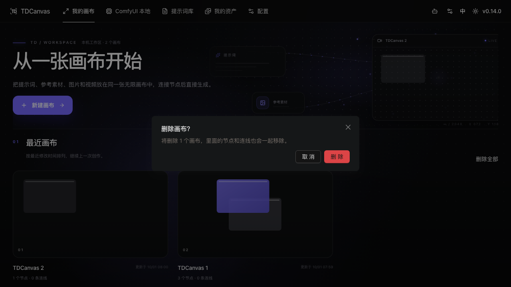

# 管理画布项目

- **适用角色**：所有 TDCanvas 用户。
- **目标**：在首页管理画布项目——打开、重命名、导出、删除。
- **前置条件**：已创建至少一个画布项目。
- **入口**：顶栏「主页」或导航「我的画布」。

## 项目列表与打开

首页「最近画布」按**最近修改时间**倒序排列，每张卡片显示：

- 封面预览（取项目中最新生成的素材）；
- 项目标题与序号徽标；
- 节点数与连线数、更新时间。

点击卡片进入画布；右上角实时预览窗展示当前最新项目。

**按最近修改排序**意味着：今天改过的项目一定在最上面，不用在一堆卡片里找。如果你习惯同时开好几个项目，回到首页扫一眼顶部的几张卡片，通常就是刚在做的那些。

卡片上的「N 个节点 · M 条连线」是判断项目状态的最快信息：连线数远大于节点数，说明这是一个引用关系复杂的项目，**打开时加载可能稍慢**。

## 重命名

两种方式：

- **画布内**：双击顶栏项目标题，输入新名称后 `Enter`。
- **首页**：鼠标悬停项目卡，点击铅笔（重命名）按钮。

项目标题最长 64 字符。建议起名时带上用途或日期（例如「角色设定-1001」），项目多了以后光看标题就能分辨。

## 删除项目

- 悬停项目卡点击垃圾桶图标，或首页「删除全部」批量删除。
- 删除有**确认弹窗**，确认后项目及其内容不可恢复（素材文件由系统统一回收）。

> 删除**没有回收站也没有撤销**——这是画布里最不可逆的操作。养成两个习惯：动手删之前先看一眼卡片标题确认没删错；重要项目先导出 zip 再删（见下节）。

### ⚠️ 删画布有两条路径，行为不一致

同一个「删除画布」，从两个地方进，结果完全不同（2026-10-01 实测 + 源码核对）：

| 路径 | 有确认弹窗吗 | 后果 |
|---|---|---|
| **首页项目卡**垃圾桶图标 / 「删除全部」 | ✅ 有：「删除画布？」+「将删除 N 个画布，里面的节点和连线也会一起移除。」+ 取消 / 删除 | 点「删除」才真正删 |
| **画布内**顶栏汉堡菜单 →「删除当前画布」 | ❌ **没有**，一点即删 | 画布立即消失并跳回首页 |

源码上这是两条独立实现：首页走 `canvas-project-card.tsx` → `setDeleteIds` → `CanvasDeleteProjectsDialog` 确认弹窗；画布内走 `project.tsx:1264` 的 `deleteCurrentProject`，**直接** `deleteProjects()` + `navigate("/canvas")`，中间没有任何确认环节。

> **给用户的实际操作建议**：要删画布，**一律回首页从项目卡删**。画布内那个红色菜单项没有确认框，误触的代价是整个项目瞬间消失，而自动保存和撤销都救不回来——**撤销历史只存在于画布内，画布本身被删掉后就无处可撤了**。养成「删除只在首页做」的习惯，能避开这个版本里最贵的一个坑。

## 导出项目

- 首页勾选项目卡左上角复选框（可多选）→ 使用批量导出。
- 导出为 zip 包（含项目数据与素材文件），可用于备份或迁移。

导出的 zip 里包含 `projects.json` 与项目用到的素材文件，可以整体拷到另一台机器导入。因为内容都在本机，**换电脑或重装系统前，导出是唯一能带走项目的方式**。

## 画布项目和「我的资产」是两回事

两者都是本机存储，但用途不同：

| | 画布项目 | 我的资产 |
|---|---|---|
| 存什么 | 节点、连线、视口、外观 | 提示词文本、参考图片 |
| 入口 | 首页「我的画布」 | 顶部导航「我的资产」 |
| 导出 | 首页勾选后批量导出 | 工具栏「导出资产」 |
| 详见 | 本页 | [manage-assets.md](manage-assets.md) |

删除画布项目**不会**删除「我的资产」里的内容，反之亦然——两套数据互不影响。

## 相关任务

- [create-canvas-project.md](create-canvas-project.md)：创建项目。
- [undo-persistence.md](undo-persistence.md)：自动保存与撤销边界。
- [manage-assets.md](manage-assets.md)：与画布项目独立的素材仓库。

