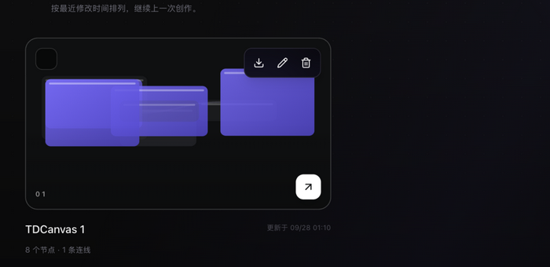

# 管理画布项目

- **适用角色**：所有 TDCanvas 用户。
- **目标**：在首页管理画布项目——打开、重命名、导出、删除。
- **前置条件**：已创建至少一个画布项目。
- **入口**：顶栏「主页」或导航「我的画布」。

## 项目列表与打开

首页「最近画布」按**最近修改时间**倒序排列，每张卡片显示：

- 封面预览（取项目中最新生成的素材）；
- 项目标题与序号徽标；
- 节点数与连线数、更新时间。

点击卡片进入画布；右上角实时预览窗展示当前最新项目。

## 重命名

两种方式：

- **画布内**：双击顶栏项目标题，输入新名称后 `Enter`。
- **首页**：鼠标悬停项目卡，点击铅笔（重命名）按钮。

## 删除项目

- 悬停项目卡点击垃圾桶图标，或首页「删除全部」批量删除。
- 删除有**确认弹窗**，确认后项目及其内容不可恢复（素材文件由系统统一回收）。

## 导出项目

- 首页勾选项目卡左上角复选框（可多选）→ 使用批量导出。
- 导出为 zip 包（含项目数据与素材文件），可用于备份或迁移。

## 相关任务

- [create-canvas-project.md](create-canvas-project.md)：创建项目。
- [undo-persistence.md](undo-persistence.md)：自动保存与撤销边界。
