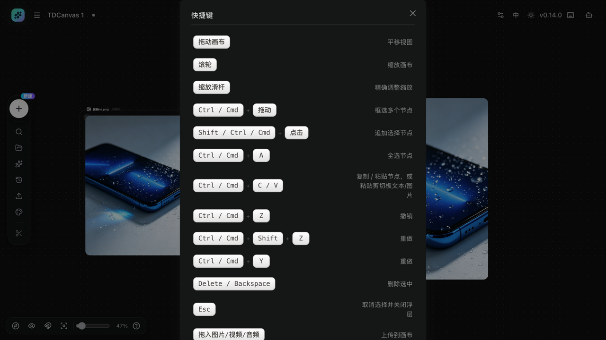

# 快捷键与帮助

- **适用角色**：所有 TDCanvas 用户。
- **目标**：查看画布全部鼠标与键盘操作。
- **入口**：顶栏键盘图标，或左下角 Dock 的「快捷键」按钮。

## 键位速查（与弹窗逐字一致）

| 操作 | 键位 |
|---|---|
| 平移视图 | 拖动画布空白处 |
| 缩放画布 | 鼠标滚轮 |
| 精确调整缩放 | 缩放滑杆 |
| 框选多个节点 | `Ctrl / Cmd` + 拖动 |
| 追加/取消选择 | `Shift / Ctrl / Cmd` + 点击 |
| 全选节点 | `Ctrl / Cmd + A` |
| 复制 / 粘贴节点（或粘贴剪贴板文字/图片） | `Ctrl / Cmd + C` / `V` |
| 撤销 / 重做 | `Ctrl / Cmd + Z` / `Ctrl / Cmd + Shift + Z` 或 `Y` |
| 删除选中 | `Delete / Backspace` |
| 取消选择并关闭浮层 | `Esc` |
| 上传图片/视频/音频到画布 | 拖入文件 |

> 视图提示：画布空白处拖动即平移；滚轮为缩放；缩放滑杆可精确调整。

## 打开方式

- 顶栏右侧键盘图标「快捷键」；
- 左下角缩放 Dock 最右侧「快捷键」按钮。

## 相关任务

- [navigate-canvas.md](navigate-canvas.md)：视图控制详解。
- [90-troubleshooting.md](../90-troubleshooting.md)：快捷键不生效排查。
