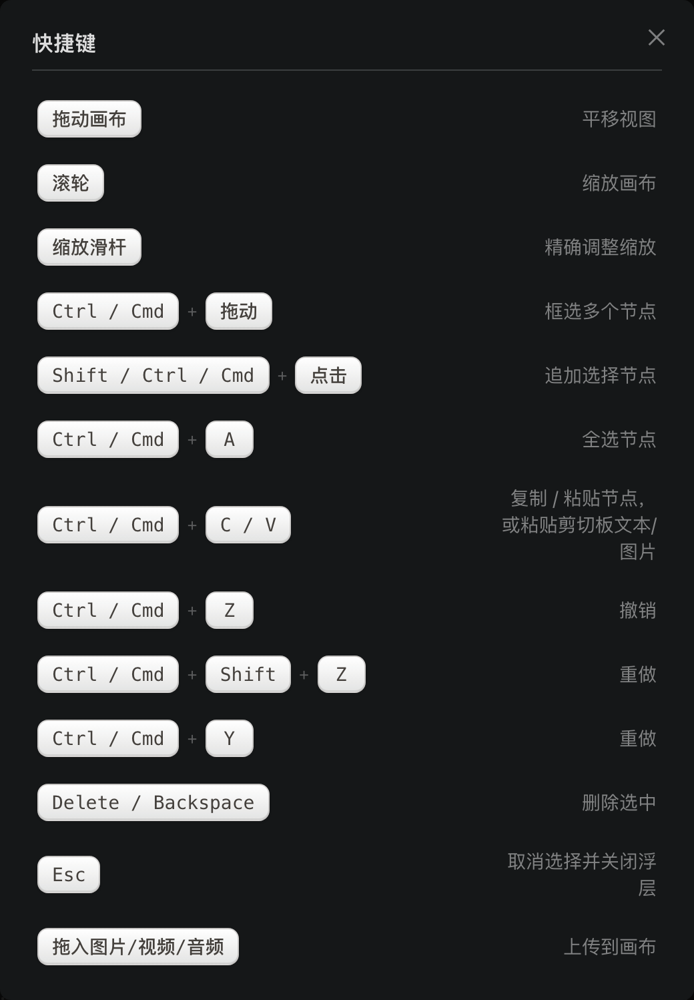
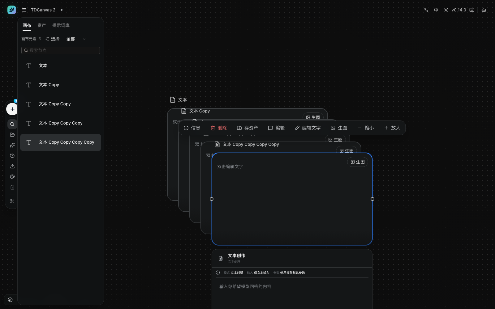

# 快捷键与帮助

- **适用角色**：所有 TDCanvas 用户。
- **目标**：查看画布全部鼠标与键盘操作。
- **入口**：顶栏键盘图标，或左下角 Dock 的「快捷键」按钮。

## 弹窗里的十三条（逐字抄录）

下表与弹窗内容一致，弹窗共 **13 行**（实测：弹窗边界框 520×749，内部无滚动容器，13 行全部可见，没有被视口裁掉的隐藏行）：

| 键位 / 方式 | 弹窗标注的作用 |
|---|---|
| 拖动画布 | 平移视图 |
| 滚轮 | 缩放画布 |
| 缩放滑杆 | 精确调整缩放 |
| `Ctrl / Cmd` + 拖动 | 框选多个节点 |
| `Shift / Ctrl / Cmd` + 点击 | **追加选择节点** |
| `Ctrl / Cmd` + `A` | 全选节点 |
| `Ctrl / Cmd` + `C / V` | 复制 / 粘贴节点，或粘贴**剪切板**文本/图片 |
| `Ctrl / Cmd` + `Z` | 撤销 |
| `Ctrl / Cmd` + `Shift` + `Z` | 重做 |
| `Ctrl / Cmd` + `Y` | 重做 |
| `Delete / Backspace` | 删除选中 |
| `Esc` | 取消选择并关闭浮层 |
| 拖入图片 / 视频 / 音频 | 上传到画布 |

> **多选之后能做什么（实测，别抱太高期待）**：选中两个及以上节点时，**悬浮工具条会整个消失**，右键菜单也还是单选那两项「复制 / 删除」——**这个版本没有批量编辑**。多选真正能省事的只有三件事：**整组一起拖动**、**一次 `Delete` 删掉全部**（`Ctrl / Cmd + Z` 也是一次全恢复），以及 `Ctrl / Cmd + C / V` **复制粘贴全部选中的节点**。想批量改名字或尺寸，只能一个个来。详见 [edit-nodes.md](edit-nodes.md#选中多个节点时-工具条会消失)。

> ⚠️ **多选时右键「复制」有个陷阱：它只复制你右键点到的那一个。** 菜单不会告诉你现在是多选（和单选长得一模一样），但复制的结果是**单数**——实测选中 2 个节点后右键「复制」，画布上只多出 1 个副本（2 → 3），而且副本是**右键命中的那个**，不是选中的两个。**要一次复制全部选中，请用 `Ctrl / Cmd + C` 再 `Ctrl / Cmd + V`**（实测 2 → 4）。详见 [edit-nodes.md](edit-nodes.md#多选时右键「复制」只复制右键的那一个)。

三个容易看岔的细节：

- **「重做」在弹窗里占两行**（`Shift+Z` 和 `Y` 各一行），不是一行写「或」；
- 弹窗用的是「**剪切板**」不是「剪贴板」——整个应用五处文案（右键菜单、提示词库、画布右键菜单）都写「剪切板」，你在界面上找「剪贴板」三个字是找不到的；
- 弹窗只说「**追加**选择节点」，没说「取消」。想取消选中，点空白处或按 `Esc` 更稳。

## 弹窗没写、但确实能用的三条

下面这三条**在弹窗里不存在**，但操作是真的（均已实测）：

| 操作 | 方式 | 说明 |
|---|---|---|
| 重命名节点 | 双击节点**标题** | 标题是节点边框**上方**那块带虚线下划线的文字，位置比节点框高 40 像素 |
| 编辑文字 | 双击文本节点**内容区** | 内容区就是节点框本身，里面写着「双击编辑文字」 |
| 复制 | 节点右键 →「复制」 | 副本向右下偏移 **+36, +36** 像素。**多选时只复制右键点到的那一个** |

**两个「双击」别搞混，这是最容易点错的地方**。2026-10-01 逐个验证过它们的落点——判据是双击后**焦点落在哪个元素**上：

| 双击哪里 | 双击后 `document.activeElement` | 结果 |
|---|---|---|
| 标题（「文本」那块） | `INPUT`，值为「文本」 | 进入**重命名**，输入框里已填好现标题 |
| 内容区（节点框中央） | `TEXTAREA` | 进入**编辑正文**，是能换行的多行框 |

> 节点正文区是 `TEXTAREA`、标题是 `INPUT`，两者不是同一个控件——所以标题永远只有一行，正文能敲回车分段。

**复制还有一件手册没细说的事：副本标题会变。** 原文是**在现标题后面追加一个英文的 ` Copy`**，不是加序号：

> 2026-10-01 连续四次复制的实测坐标：`(540,350)` → `(576,386)` → `(612,422)` → `(648,458)` → `(684,494)`，**每级偏移都是 +36 / +36，恒定不变**；标题同步变成「文本 Copy」→「文本 Copy Copy」→「文本 Copy Copy Copy」→「文本 Copy Copy Copy Copy」。**连点复制就会叠加出一长串 Copy**，这不是故障。想让标题干净，就双击标题改掉。

**右键菜单本身只有两项**：对节点右键弹出的是「**复制**」「**删除**」，没有第三项（画布上三个右键菜单各不相同，见 [connect-references.md](connect-references.md#管理连线)）。

**为什么弹窗不收这三条**：它们是「双击」和「右键」这类鼠标手势，不是快捷键——弹窗的体裁是键位表，只列键帽。但你把它们当键位记却又找不到，会以为自己记错了。

> **画布上没有缩放类快捷键**。放大缩小只能用滚轮或左下角的缩放滑杆——这是与大多数设计工具不同的地方，也是新手最常问的键位。滚轮缩放以**鼠标指针位置**为锚点，也就是说指针在哪，缩放时那个点就固定在原地。

## 键位记不住怎么办

不用背。上表就是弹窗内容的完整抄录，随时可以对照；更省事的办法是**用鼠标菜单**：

| 想做什么 | 不记键位的做法 |
|---|---|
| 撤销 | 左侧 Dock「历史」→ 面板里的「撤销」 |
| 删除节点 | 选中后点悬浮工具条红色「删除」 |
| 取消选择 | 点画布空白处，或按 `Esc` |
| 复制副本 | 节点右键 →「复制」。**多选时它只复制右键点到的那个**；要一次复制全部选中，用 `Ctrl / Cmd + C` 再 `Ctrl / Cmd + V` |

**这四条在 2026-10-01 全部实测过**，逐条结果：

- **撤销**：清空 5 个节点的画布后，「历史 → 撤销」把 5 个全带回来了（详见 [undo-persistence.md](undo-persistence.md)）。
- **删除**：选中节点后工具条出现，点红色「删除」——3 个节点变 2 个，**不需要任何确认弹窗**。那个按钮的计算色是 `rgb(248, 113, 113)`（玫红），确实是红的。
- **取消选择**：`Esc` 与点空白**两种都行**，实测都让悬浮工具条消失（按钮数 4 → 0）。

> **单击空白 ≠ 双击空白，这两个别混。** 单击空白**只是取消选择**，什么都不会弹出来（实测点击前后 `.td-canvas-flyout` 数量都是 0）；**双击**空白才会弹出「选择节点」创建菜单。所以"取消选择"随便点，不担心手抖点出东西；想建节点才需要双击。

**能用鼠标完成的操作都有对应入口**，快捷键只是省时间。

## 快捷键不生效的常见原因

- **光标在输入框里**：正在输入文字时 `Cmd/Ctrl + Z` 是「撤销输入」而不是「撤销画布操作」。先点一下画布空白处让焦点离开输入框。
- **在浏览器里被截胡**：某些浏览器会把 `Cmd/Ctrl + N`、`Cmd/Ctrl + T` 等保留给自己；TDCanvas 用到的键位通常不冲突。
- **按了 `Esc` 以为会删除节点**：`Esc` 只是取消选择和关闭浮层，删除要用 `Delete` / `Backspace`。

## 打开帮助弹窗的两种方式

- 顶栏右侧键盘图标「快捷键」；
- 左下角缩放 Dock 最右侧「快捷键」按钮。

两处打开的是**同一个弹窗**（实测：两个入口点开后弹窗边界框完全相同，520×749 @(380,76)，内容归一化后逐字相同）。但弹窗只有 13 行，**上面第二节列的三条鼠标手势它并不包含**——这是本页分成两节的原因。

> **弹窗的横坐标会跟着窗口宽度走，别当成漂移**：它水平居中，所以 1280 宽的窗口量到 `x=380`（(1280−520)/2），1440 宽则量到 `x=460`。宽度与高度恒为 520×749，纵坐标恒为 76。

> ⚠️ **「仍可见」不等于「还能点」——弹窗开着的时候，左侧 Dock 和左下角缩放条是看得见、但点不动的。** 这是 antd 弹窗自带的一层**透明遮罩**（`.ant-modal-wrap`，铺满 1440×900 整个视口，`background: rgba(0, 0, 0, 0)` 完全透明，`pointer-events: auto`），它视觉上什么都不挡，却把下面的点击全吃掉了。实测弹窗打开时，Dock 那 8 个按钮和缩放条那 4 个按钮的 `visibility` / `opacity` 一律不变（仍可见），但逐个用 `elementFromPoint` 打点，**12 个点无一命中按钮本身，全部落在遮罩上**；实点左侧「清空画布」也没有弹出确认框，**这一下只是把快捷键弹窗关掉了**。所以看见 Dock 还亮着就伸手去点，是白点。

> **弹窗里没有的两个入口**：画布空白处右键菜单里的「**复制所有节点**」和「**粘贴**」在快捷键弹窗和本页表格里都没有。实测「复制所有节点」复制的是画布上**全部**节点（不看当前选中了哪些），随后「粘贴」把整份复制到鼠标位置——2 个节点的画布粘贴后变成 4 个。
>
> **它和 `Ctrl / Cmd + C / V` 不是一回事**：后者复制的是**当前选中的节点**。实测一个 4 节点的画布上只选中其中 2 个，`Ctrl / Cmd + C / V` 的结果是 4 → 6，只多出被选中的那 2 个的副本；另外 2 个没被选中，也就没有副本。想用快捷键达到「复制所有节点」的效果，得先 `Ctrl / Cmd + A` 全选再 `Ctrl / Cmd + C / V`。
>
> **两处菜单的快捷键标签不一致**：顶栏汉堡菜单把撤销写作 `Ctrl / Cmd + Z`（Mac 上正确），而右键菜单只写 `Ctrl+Z`——界面上没提示 Mac 需要换成 `Cmd`。**以本页表格和顶栏菜单为准。**

## 相关任务

- [navigate-canvas.md](navigate-canvas.md)：视图控制详解（含缩放锚点规则、两个角落菜单的完整说明）。
- [../20-reference.md](../20-reference.md)：完整键位、限制与格式表。
- [../90-troubleshooting.md](../90-troubleshooting.md)：快捷键不生效排查。

