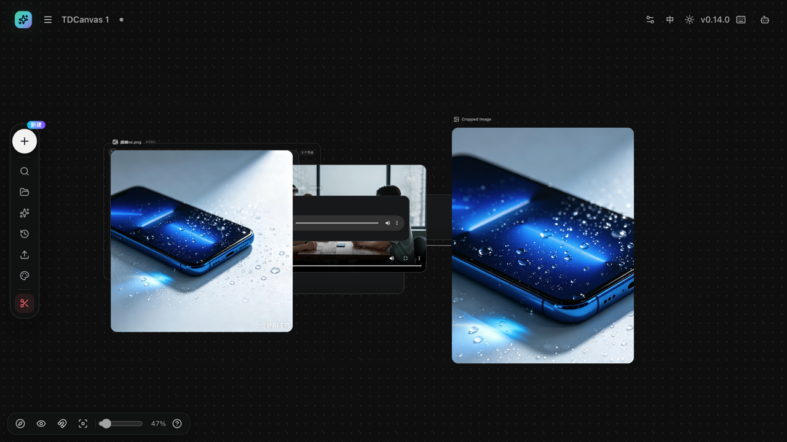

# 撤销重做与自动保存

- **适用角色**：所有 TDCanvas 用户。
- **目标**：撤销误操作、重做被撤销的操作，并理解画布的自动保存范围。
- **前置条件**：已打开一个画布项目并有可撤销的更改。

## 撤销与重做

任选其一（效果相同）：

- 快捷键：`Cmd/Ctrl + Z` 撤销；`Cmd/Ctrl + Shift + Z` 或 `Cmd/Ctrl + Y` 重做。
- 左侧 Dock「**历史**」→ 弹出面板中的「**撤销**」「**重做**」按钮（灰显表示没有可撤销/重做的操作）。

实测行为：

- 撤销/重做覆盖：节点与连线增删改、节点移动与缩放、文字编辑、背景模式与输入模式切换；
- **一次拖拽算一条历史**（拖动过程中的中间位置不逐步记录）；
- 历史上限 50 条，超出后最早的记录被丢弃；
- 应用历史后会取消当前选中。

## 自动保存

画布内容**全自动保存**，没有手动保存按钮：

- 保存范围：节点、连线、视口位置、背景模式、输入模式等（项目标题改动同样即时生效）；
- 保存时机：改动后自动写入本机（IndexedDB），连续编辑会合并写入；
- **刷新或关闭页面后再打开**，首页「最近画布」点击该项目即可恢复全部内容与视口。

## 危险操作与边界

| 操作 | 行为 | 可撤销吗 |
|---|---|---|
| 删除节点/连线 | 删除（选中后 `Delete`） | ✅ 撤销可恢复（连连线一并恢复） |
| 清空画布（左侧 Dock 红色按钮） | 移除画布上全部节点，有确认弹窗 | ⚠️ 弹窗确认后建议立即检查；以「历史 → 撤销」尝试恢复 |
| 删除项目（首页） | 删除整个项目（有确认弹窗） | ❌ 不可逆 |
| 关闭页面 | 无影响，内容已自动保存 | — |

## 常见问题

- **两个标签页打开同一项目**：两边都会自动保存，后保存的一方会覆盖另一方的修改（例如刚输入的文字消失）。请只在一个标签页中编辑同一画布；发现内容丢失时先不要刷新，到仍打开的标签页里用「历史 → 撤销」找回。
- **键盘撤销没反应**：确认焦点不在输入框内（输入框中快捷键不生效）；或改用「历史」面板按钮。

## 相关任务

- [edit-nodes.md](edit-nodes.md)：删除节点的连带影响。
- [project-management.md](project-management.md)：项目级管理与删除。
