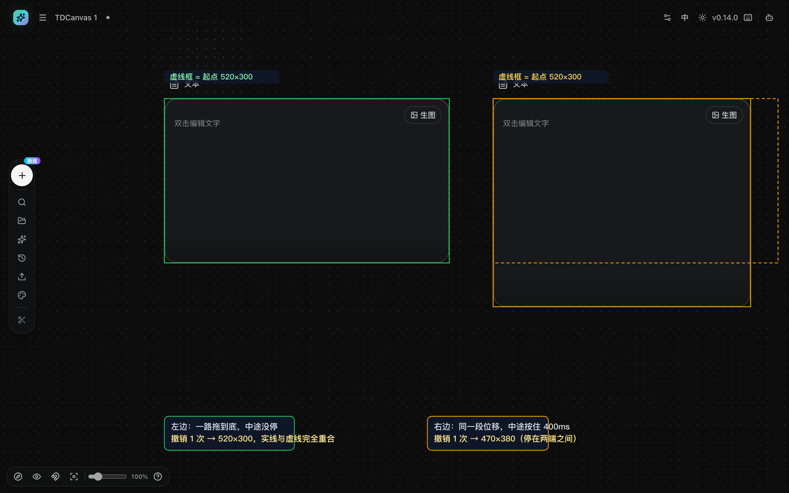
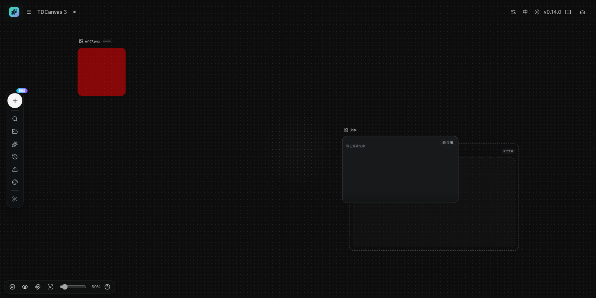

# 撤销重做与自动保存

- **适用角色**：所有 TDCanvas 用户。
- **目标**：撤销误操作、重做被撤销的操作，并理解画布的自动保存范围。
- **前置条件**：已打开一个画布项目并有可撤销的更改。

## 撤销与重做

任选其一（效果相同）：

- 快捷键：`Cmd/Ctrl + Z` 撤销；`Cmd/Ctrl + Shift + Z` 或 `Cmd/Ctrl + Y` 重做。
- 左侧 Dock「**历史**」→ 弹出面板中的「**撤销**」「**重做**」按钮（灰显表示没有可撤销/重做的操作）。

> 「清空画布」有确认弹窗、且撤销能完整救回、但**刷新即失效**——这三件事的实测见下方 [清空画布：撤销救得回来，但只给你到"刷新"为止](#清空画布-撤销救得回来-但只给你到-刷新-为止)。

实测行为：

- 撤销/重做覆盖：节点与连线增删改、节点移动与缩放、文字编辑、背景模式与输入模式切换；
- **一次拖拽算一条历史**（拖动过程中的中间位置不逐步记录）；
- 历史上限 50 条，超出后最早的记录被丢弃；
- 应用历史后会取消当前选中。

### 「50 条上限」在操作上意味着什么

这一条不只是数字，它有一个**你会真的撞上、但界面不会提示**的后果：

*实测（2026-10-02）：在一个空画布上连续上传 55 次（每次间隔略大于合并窗口，所以每次都单独记一条），共得到 55 个节点。此后一路按撤销，**撤到第 50 步时画布上仍剩 5 个节点**，再按也没有反应——**最早那 5 次操作已经撤不回来了**。*

也就是说：

- **撤销只能往回走 50 步。** 做得越多、越早，越回不去；
- 被挤出去的那些记录**不是「延迟撤销」，是真的没有了**——本次会话里怎么按都不会回来；
- **重做不受这个上限影响**：撤销到底之后再一路重做，55 个节点能全部走回来。

> **实践建议**：如果你想「从头再来」，**别指望连按撤销**。上面那 5 个残留节点直接框选删除更快。

### 「一次拖拽算一条」是怎么算的

*实测（2026-10-02）：一次跨越 14 个中间位置的连续拖动，只记 **1** 条历史——按一次撤销就精确回到拖拽前的位置，而不是退回拖拽途中的某一步。*

> **为什么正文里不写「跨了多少像素」**（2026-10-03 M160）：本手册此前给过一个「448×144 像素」的行程。那是**一次具体操作的屏幕读数**，取决于当时节点在哪儿、鼠标拖了多远，**换个位置重做就是另一个数**。**能跨距离而不产生多余历史，这才是这条的重点**；「14 个中间位置」也已经说明了「不是逐格记」。

> **★ 这条有个前提：拖的过程中不能停**（2026-10-03 M187）。「一次拖拽算一条」成立的条件是**从按下到松手之间一直在动**。
> 实测对照，同一段位移、同一个手柄，各做 3 次：
>
> | 拖法 | 按几次撤销才回到原尺寸 |
> |---|---|
> | 一路拖到底，中途不停 | **1 次**（3/3） |
> | **中途按住不动 400ms**（鼠标全程没松开）再继续拖完 | **2 次**（3/3）——第一次撤销只退到**拖拽途中的中间尺寸**，第二次才回到起点 |
>
> **中途那 400ms 里什么都没发生，但历史已经落了一条**——落的是「拖到一半时」那个状态。
> 所以拖得**慢**不会把一次拖拽拆开（另测：12 步、每步停 120ms、总耗时 1.9 秒的慢拖，3/3 仍只占 1 条），
> **是「中途静下来」才会**。慢慢挪到一半停下来想了想，再接着拖，这次拖拽就留下了两条历史。
> **判断标准不是「拖了多久」，是「中途有没有静默」**——这与上文「50 条上限」是两回事：上限挤掉的是别的操作，这里多出来的是同一次操作自己的两条。

★ **★ 下面这张图把这件事并排做给你看**（★ **2026-10-07 M306 拍**）：
同一张画布、两个节点、同一个手柄、同一段位移（起点 `520×300` → 终点 `420×460`），
**唯一的差别是「中途停不停」**；**各自撤销一次之后，虚线框是它们的起点、实线框是此刻的真实大小。**

> ★ **★ 为什么值得配这张图**：界面上根本看不到历史条数——
> 左侧 Dock 那个「历史」飞层里**只有「撤销」和「重做」两个按钮**（`canvas-toolbar.tsx:387`），
> **没有任何条目列表。所以上面那条规则光靠文字记不住，而这张图把它变成了「看得见的重合 / 看得见的没重合」。**
> 本图两端各做一次（★ **起点 520×300、终点 420×460 都是当场实测**）；
> **正文那条 3/3 是另外三次实验的结论，两者不要混着读。**

所以「拖过去再拖回来」确实不会留下一堆垃圾历史；但反过来，**同一次不中断的拖拽里包含的多个微调无法逐个撤销**，要改回去只能整体再拖一次——**除非你中途停下来**，停下来再接着拖就变成两段、可以一段一段退回来。

## 自动保存

画布内容**全自动保存**，没有手动保存按钮：

- **保存范围（2026-10-03 M188 把那个「等」字换成了确切清单）**：一个画布项目在数据库里一共 **12 个字段**——`id`、`title`、`createdAt`、`updatedAt`、`nodes`（节点，含文字与全部元数据）、`connections`（连线）、`chatSessions`、`activeChatId`、`inputMode`（输入模式）、`backgroundMode`（背景模式）、`showImageInfo`（是否显示图片信息）、`viewport`（**缩放比例和画面位置都在**）。**换句话说：画布里所有你能在界面上定下来的东西都存着。**
- **★ 但 `chatSessions` 这个字段要单独说一句**（2026-10-03 M190 补查）：它**存是存了，可它一直是空的**。全仓没有任何一处往里写对话消息——Agent 面板的对话记录在**另一个内存 store** 里，**不落盘**。**所以别指望「画布里聊过的话」会跟着画布留下来**。这条不影响上面那句总结，因为画布里确实没有「聊天」这个交互。
- **不存的只有「你当时正在看什么」**：当前选中了哪些节点、右键菜单、悬停工具条、打开着的弹窗、小地图开合、**以及撤销历史**——这些刷新后一律回到初始状态（撤销历史尤其要注意，见下文「清空画布」那节）。**Agent 面板的对话也在这一类里**。
- 保存时机：改动后自动写入本机（IndexedDB），连续编辑会合并写入；**但缩放/平移比别的改动多等一会儿**，见下一节。
- **刷新或关闭页面后再打开**，首页「最近画布」点击该项目即可恢复全部内容与视口。

*实测（M167）：刷新后**视口也原样回来**——缩放仍是 60%，三个节点的坐标与尺寸**逐项零偏差**。做法是先点「重置视图」量下默认视口（缩放 44%），再把缩放改成 60% 并平移到另一处，然后刷新页面。**为什么要先量默认视口**：如果应用压根不在刷新时重置视口，那「刷新前后一致」就恒真、证不了任何事；只有先量出默认视口，才能证明恢复回来的是**你自己摆的那一版**而不是默认状态。*

*实测（2026-10-02）：上面三条逐条成立。这次是**直接把浏览器数据库里的东西读出来**核对的，而不是只看界面「看起来还在」：项目确实落在本机 IndexedDB 的 `tdcanvas` / `app_state` 里，项目对象带 **12 个字段**，其中 `viewport` 存的是完整视口（**缩放比例和画面位置都有**）。刷新前后两个节点的屏幕位置与宽度**逐字一致**（`829,263` 与 `1177,440`，宽 329），且落盘的缩放比例与画布实际比例吻合到小数第三位。*

### ⚠️ 改完立刻刷新，可能丢掉最后一次改动

*实测（2026-10-02）：连续改一次节点、每次只等不同时间就刷新，结果是有明确分界的——*

| 改动后等待 | 刷新回来后 |
|---|---|
| 0 毫秒 / 150 毫秒 / 300 毫秒 | **改动丢了** |
| 420 毫秒 / 550 毫秒 / 800 毫秒 | **改动保住了** |

分界线落在 **300 到 420 毫秒之间**。这是因为连续操作会被合并、并在停下约 **0.4 秒**后才真正写进数据库——**在这之前关掉页面，那一步就白做了**。

#### ★ 但缩放和平移要多等一倍时间（2026-10-03 M188）

上面那张表量的是**改动画布内容**（加节点、挪位置、改文字）。**缩放和平移不是同一档**——它们要多等将近半秒：

| 改的是什么 | 刷新回来前的等待 | 结果 |
|---|---|---|
| 画布内容（节点、文字、连线…） | 300 / 500 / 700 毫秒 | **改动保住了** |
| **缩放 / 平移（画面位置）** | 700 / 750 / 800 / **850** 毫秒 | **改动丢了** |
| **缩放 / 平移（画面位置）** | **900** / 1100 / 1400 毫秒 | **改动保住了** |

**分界线落在 850 到 900 毫秒之间**，正好是上面那个 0.4 秒的**两倍多**。
两个数字都能在源码里对上：所有改动都要过一道 **400 毫秒**的合并写盘（`use-canvas-store.ts:56`），
而**缩放和平移在此之前还要先过自己的一道 500 毫秒**（`project.tsx:449-459`）——两道加起来就是 900 毫秒。
实测分界与源码相加**毫秒级吻合**。

> **所以「停一秒再走」这条保险建议是对的，但要知道它为什么够用**：一秒刚好压过 900 毫秒这道更高的门槛。
> 如果你只是改内容，0.4 秒就够；**刚滚过滚轮就刷新，画面位置会退回你滚之前的样子**——
> 节点内容一条不少，只是「你刚才把画面拉到了哪里」这个记录没写进去。

> **对日常操作的实际影响很小**：你做完一个动作、再去按刷新或关标签页，中间通常已经超过 0.4 秒了。真正容易踩到的场景是——**连续快速操作之后立刻刷新/直接关标签页**，或者**程序自动触发的操作**（Agent、MCP 脚本等）。
>
> **保险做法**：做完一批改动，**停一秒再走**。

> **同时要知道：改完之后界面上不会出现任何「已保存」提示。** *实测：改动后连盯 6 秒，弹出的提示条为 0 条，整页文字、按钮悬停提示、读屏标签里**一个「保存」字样都没有**。* 所以你没法靠界面判断「存好了没有」——**上面那条「停一秒」就是唯一的判断依据。**

### 数据只存在这台电脑上

- 内容保存在**浏览器的本机数据库**里，**不联网、不同步**（这个版本没有任何同步入口，详见 [90-troubleshooting.md](../90-troubleshooting.md)）。
- 换电脑、重装系统、换浏览器，或者**清除浏览器数据 / 清理站点数据**，画布都会**一起消失**——没有云端副本。
- **导出 zip 是唯一的离线备份手段**，见 [project-management.md](project-management.md#导出项目)。

**自动保存的真正含义**：它保证的是「关掉页面不丢东西」，**不保证「删错了能找回来」**。

这两件事经常被混为一谈。事实上：

- 误删一个节点 → 靠**撤销**找回（历史栈在内存/本机，最多 50 条）；
- 删除整个项目 → **无法找回**，自动保存不会留一份副本；
- 覆盖了旧版本 → 自动保存只会保留**最新状态**，不会像云端版本历史那样留档。

所以真正需要备份的，是**重要项目**。但请先看清一件事：**首页的批量导出 zip 在这个版本里救不回画布**——TDCanvas 没有「导入画布」功能，导出的 `projects.json` 没有任何入口能读回去（实测：i18n 三条文案零组件引用，首页无文件选择器；详见 [project-management.md](project-management.md#导出项目)）。

实际能做的只有两件：

1. **保素材**：导出 zip 后把 `projects/<项目id>/files/` 里的图片视频解压存下来，换机后重新上传；提示词与参考图则走「我的资产 → 导出资产 / 导入资产」，那一对是完整往返。
2. **保结构**：只能**重建**。同一台机器内想留一份副本，用「复制所有节点」+「粘贴」（实测 2 节点 → 粘贴后 4 节点）。

> 换句话说：**这个版本没有真正管用的画布备份**。与其依赖导出 zip 求安心，不如把"重要项目不要随手删"当成第一原则——因为删掉之后，连素材都要靠提前手动解压才能捞回来。

## 撤销能覆盖什么

实测撤销/重做覆盖：节点与连线增删改、节点移动与缩放、文字编辑、背景模式与输入模式切换。

**2026-10-03 逐项复核过一遍**（每一项都是「做完 → 按撤销 → 读本机存储」三步，不是看界面像是恢复了就记）：

| 做过什么 | 撤销后 |
|---|---|
| 工具条删除一个节点 | ✅ 节点回来 |
| 「清空画布」清掉 3 个节点 | ✅ 3 个都回来 |
| 框选全选后按 `Delete` | ✅ 都回来 |
| 改节点名 | ✅ 名字回到改前 |
| **把正文 10 个字全选删空** | ✅ **10 个字逐字回来** |
| 工具条放大字号（14 → 16） | ✅ 回到 14 |
| 拖动节点位置 | ✅ 回到原坐标 |
| 拖角缩放节点（520×300 → 640×380） | ✅ 回到 520×300 |
| 建一条连线再选中删掉 | ✅ 连线回来 |

**「误删的文字能用撤销找回来」这条现在有实测了**（2026-10-03 M187 补测）——
此前本手册只写「想找回误删的文字要用撤销，不是 `Esc`」，那是**推断**；
实测确认：正文删到 0 字后按撤销，10 个字逐字回来。

**但有一条改不回来**：见下方「危险操作与边界」里的**改项目标题**一行。

两个容易误解的点：

- **一次拖拽算一条历史**——拖动过程中的中间位置不逐步记录。所以拖了一下再拖回来，不会留下一堆历史；**前提是中途不停**，停超过约 0.2 秒就会多留一条（见上文那节）；
- **应用历史后会取消当前选中**——撤销完往往需要重新点一次节点，这不是 bug。

这两条 2026-10-02 都做了精确实测：14 帧拖拽按一次撤销**残差 0 像素**回到起点；连续 55 次操作后撤到底只剩 5 个节点（详见上文两节）。

## 危险操作与边界

| 操作 | 行为 | 可撤销吗 |
|---|---|---|
| 删除节点/连线 | 删除（选中后 `Delete`） | ✅ 撤销可恢复（连连线一并恢复） |
| 清空画布（左侧 Dock 红色按钮） | 移除画布上全部节点，**有确认弹窗** | ✅ **同一次页面会话内可完整撤销** · ❌ **刷新页面后永久不可逆** |
| **改项目标题**（顶栏双击画布名） | 改名，**立即生效并已保存** | ❌ **撤不回**——按 `Cmd/Ctrl+Z` 没有任何反应（实测 3/3）。想改回来只能再改一次 |
| 删除项目（首页） | 删除整个项目（有确认弹窗） | ❌ 不可逆 |
| 关闭页面 | 无影响，内容已自动保存 | — |

**★ 为什么改项目标题撤不回，而清空画布能撤回**（2026-10-03 M187）：
这两件事看起来都是「改点东西」，但撤销系统只快照画布里的内容（节点、连线、文字、背景模式等），
**画布自己的名字不在其中**。所以**画布里面**你几乎怎么折腾都能撤回，**画布本身的名字**却不在撤销的保护范围内。
这一点很容易被「画布里按错了也能找回」的直觉带过去——改错了名字，只能手动改回来。

## 清空画布：撤销救得回来，但只给你到"刷新"为止

**确认弹窗的原文**是「清空画布？这会删除当前画布上的所有节点和连线。」，两个按钮是「取 消」「清 空」。

**撤销能把整个画布救回来**——这一点实测过，2026-10-01：

| 步骤 | 画布节点数 |
|---|---:|
| 清空前 | 5 |
| 点「清 空」确认 | **0** |
| 左侧「历史」→「撤销」 | **5，一个不少** |

**但分界线是"刷新"，不是"重启"。** 这是最要紧的一句：

| 清空之后你做了什么 | 还能撤销吗 |
|---|---|
| 直接点左侧「历史」→「撤销」 | ✅ **5 个节点全部回来** |
| **按一下 `F5` 刷新**（哪怕就一下） | ❌ **撤销与重做两个按钮同时变灰，点不动了** |
| 关掉标签页再打开 | ❌ 同上 |

> **刷新后怎么认出已经没救了**：点开左侧「历史」，面板里「**撤销**」和「**重做**」两个按钮**同时是灰的**（`disabled`）。平时只要有过任何一次改动，其中一个必然是亮的。两个都灰 = **这次会话的历史栈已经清空，救不回来了**。
>
> 2026-10-01 实测这一步：清空 → `F5` 刷新 → 打开「历史」→ `撤销` 与 `重做` 的 `disabled` 均为 `true` → 点击无效，节点数仍为 0。

**为什么会这样**：节点数据会自动保存（刷新后画布仍是空的，说明"清空"这个结果已经落盘），但**撤销栈只活在当前这次页面会话的内存里**，不随节点数据一起保存。

> **2026-10-01 M97 取证说明**（这一栏的三种"可撤销吗"此前没有逐条依据；其中第二条长期缺运行时证据，本批补上）：
> - **删除节点 → 撤销恢复**：运行时实测（2 个节点按 `Delete` → 剩 1 个 → `Cmd+Z` → 2 个都回来）。
> - **「连连线一并恢复」**：**运行时实测成立**。先拖出一条真实连线，再删掉其中一个节点（2 节点 · 1 连线 → 1 节点 · 0 连线），按 `Cmd+Z` 后**节点与连线一起回来**，应用自己的项目卡计数显示「**2 个节点 · 1 条连线**」（2026-10-01 M97）。这与源码完全吻合：`project.tsx:128` 的历史快照类型是 `Pick<CanvasClipboard, "nodes" | "connections">`——撤销栈里存的就是节点和连线两份数据，`applyHistory` 恢复时同时执行 `setNodes` 与 `setConnections`。**连线不是"顺带恢复的"，而是和节点躺在同一条快照里。**
>   - **顺带解开一个卡了很久的取证障碍**：本手册此前记着"端口拖拽在自动化下复现不了（拖完连线数为 0）"，**根因找到了——不是产品不支持，是探针没先悬停源节点**。端口元素写的是 `visible ? "pointer-events-auto" : "pointer-events-none opacity-0"`，**节点没被悬停时端口不可点**；探针直接把 `mouse.down()` 派发到端口坐标，落点其实是画布表面，于是变成"按住空白处拖动 = 平移"，连线数自然是 0。**先 `mouse.move` 悬停到源节点上、等端口变为可交互、再按下拖到目标端口**，连线立刻建立。**凡是"某个交互在自动化下复现不了"，先确认自己有没有把前置的 hover 状态做出来。**
> - **「只救回最近 50 条」**：源码坐实——`project.tsx:425` 的 `past = [...past.slice(-49), last]`，保留末尾 49 条再加新的 1 条。

**所以清空画布的正确姿势是**：点完「清 空」，**别做任何别的事，直接按 `Cmd/Ctrl + Z` 或去「历史」点撤销**。想先导出、想先截图看看、手欠按了一下刷新——都来不及了。真正要紧的不是"能不能撤销"，而是"**在刷新之前撤销**"。

## 常见问题

- **两个标签页打开同一项目**：两边都会自动保存，后保存的一方会覆盖另一方的修改（例如刚输入的文字消失）。请只在一个标签页中编辑同一画布；发现内容丢失时先不要刷新，到仍打开的标签页里用「历史 → 撤销」找回。
- **键盘撤销没反应**：确认焦点不在输入框内（输入框中快捷键不生效）；或改用「历史」面板按钮。

## 相关任务

- [edit-nodes.md](edit-nodes.md)：删除节点的连带影响。
- [project-management.md](project-management.md)：项目级管理与删除。
