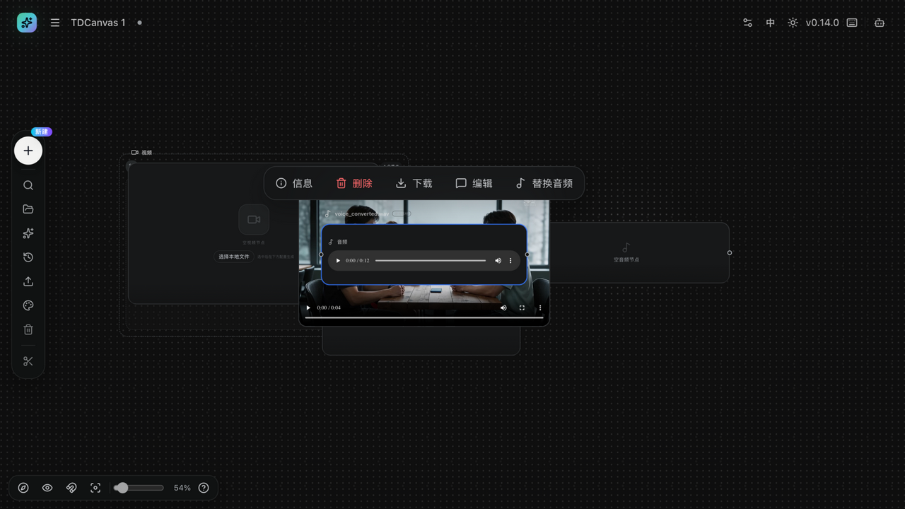
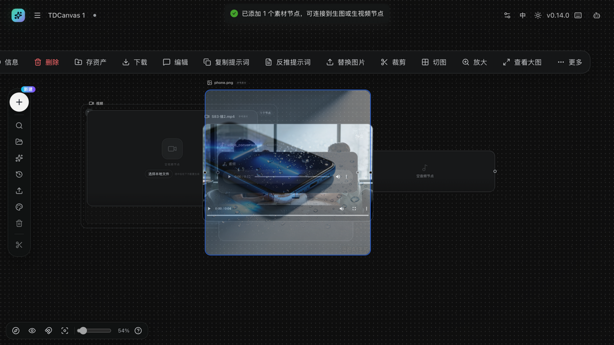

# 上传本地素材：图片、视频、音频

- **适用角色**：所有 TDCanvas 用户。
- **目标**：把本地图片、视频、音频文件放进画布，成为可连线、可引用的素材节点。
- **前置条件**：已打开一个画布项目；本地准备好素材文件。
- **入口**：空媒体节点的「选择本地文件」、左侧 Dock「上传」、直接把文件拖进画布。

## 支持的格式与限制

- 图片：JPG / PNG / WebP
- 视频：MP4 / MOV / AVI / MKV
- 音频：MP3 / WAV / FLAC
- 单个文件不超过 **50MB**；超限或不支持的格式会逐条提示。

**上传完全在本机完成，不产生任何费用**——只有把素材连到生成节点并运行生成才会计费。

## 三种上传方式怎么选

| 场景 | 用哪种 |
|---|---|
| 手里有一堆素材想一次性铺到画布 | 方式一：直接拖文件 |
| 已经建了空节点，想往里填 | 方式二：节点的「选择本地文件」 |
| 还没想好放哪，先留个位置 | 方式三：上传素材占位节点 |

## 方式一：拖文件进画布

把文件从文件夹直接拖到画布上松手。每个文件在落点附近生成对应类型的节点；一次拖多个文件会依次排开。

这是铺素材最快的做法——不用先建节点，拖到哪就落在哪。

## 方式二：通过文件选择器上传

1. 选中一个**空的**图片/视频/音频节点（或左侧 Dock「＋ 新建」先创建一个）。
2. 点击节点里的「**选择本地文件**」，选择文件。
3. 上传完成后节点被填充：图片按原始比例显示；视频/音频出现原生播放器，可直接在节点内播放。

## 方式三：上传素材占位节点

左侧 Dock「＋ 新建 → 上传素材」会先创建一个「上传素材」占位节点并自动打开文件选择器；取消选择时占位节点自动删除。

## 上传后的行为（实测）

- 图片/视频/音频上传成功会弹出提示「**已添加 1 个素材节点，可连接到生图或生视频节点**」，并在画布中新建素材节点（即使当时选中了别的空节点，也不会覆盖它）。
- 素材文件保存在本机（IndexedDB），节点记录稳定引用；刷新页面后素材仍在。
- 每个素材节点自带播放/预览：图片直接显示；视频/音频用原生播放器。

> **一个容易困惑的行为**：即使你已经选中了一个空的图片节点再点上传，系统仍然会**新建**一个素材节点，而不是填进你选中的那个。这是有意设计——上传的素材要保持原始比例和可播放性，塞进任意尺寸的节点会变形。看到新节点冒出来不用怀疑操作错了。

## 上传后就能生成吗

不能。上传只是把素材放进画布，**还需要连线**才能参与生成：

把素材节点的右侧输出口连到图片/视频/音频节点，它就会出现在对方的参考素材区。**注意「出现在参考素材区」不等于「一定参与生成」**——未被点名的素材会标着「不参与生成」，详见 [connect-references.md](connect-references.md) 与 [30-concepts.md](../30-concepts.md#连线不等于自动生效)。

## 取消与恢复

- 上传是本地操作，不产生费用；传错删掉节点即可（`Delete`）。
- 删除素材节点不会立刻删除本机文件（孤儿文件由系统统一回收）。
- 删除素材节点会同时移除与它相连的连线，误删后可用「历史 → 撤销」恢复。

## 已知限制

- **上传只检查扩展名，不校验文件真实内容**（2026-09-28 实测：把一个 HTML 文件改名成 `.mp4` 拖进去也会被接受，生成一个无法播放的黑屏视频节点）。如果某个视频/音频节点打开后是黑屏或没有声音，先确认文件本身是不是视频/音频。
- 单文件 50MB 上限；大文件建议先压缩或裁剪再传。

## 相关任务

- [create-nodes.md](create-nodes.md)：先创建空节点再上传。
- [image-operations.md](image-operations.md)：对图片节点做裁剪/切图/放大。
- [connect-references.md](connect-references.md)：把素材作为参考连接到生成节点。

