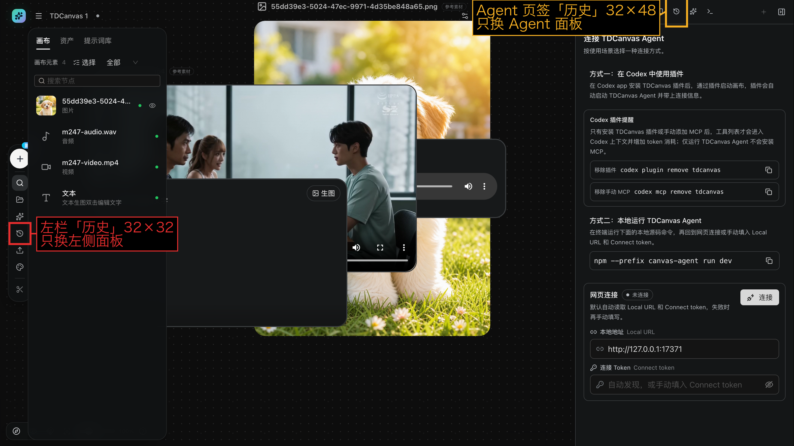

# 连接 Agent 让它操作画布

- **适用角色**：愿意在本机跑 Codex、并让 AI 代为操作画布的 TDCanvas 用户。
- **目标**：弄懂右侧 **Agent 面板**的四个标签页和两种连接方式，能自行判断"是没找到入口"还是"确实没连上"。
- **前置条件**：已启动 TDCanvas（浏览器版即可查看面板）。
- **入口**：顶栏**右侧**的机器人图标（`aria-label="打开 Agent"`）。

> **这一页写的是"面板长什么样、怎么连"。** 连上之后真正的对话与执行效果，需要你在本机真的跑起 Agent 才能验证，本手册**不臆造**那部分步骤。你可以把这一页当作连面前的体检表。

## 面板在哪：默认收着，容易找不到

Agent 面板**默认是收起的**，顶栏右侧只留一排小图标。点**机器人（Bot）图标**展开，再点面板内最右端的收起图标合上。面板左边缘有一条**可拖动的分隔把手**，可以拉宽拉窄。

> ★ **「在哪能找到」的确切答案（2026-10-03 M158 实测）**：**Agent 面板不只在画布页——每一条页面都有它**。
> 逐条打开 `/canvas`、`/assets`、`/prompts`、`/config`、`/comfyui-local`，
> **五处的 Agent 元素完全一致**：**面板内都是同一组 7 个**——「连接设置」「对话」「历史」「技能」「日志」「新对话」「收起 Agent 面板」；顶栏另有 1 个「打开 Agent」把它叫出来。
> 因为它在**所有页面的共同外层布局**里（源码 `user-layout.tsx` 无条件渲染 `<AgentPanel />`），
> **所以你在任何一个页面都能打开它，不必先回画布**。
>
> ⚠️ **反过来更值得记：它没有独立的网址。** 直接访问 `/agent` 得到的是 **404 页面**
> （正文写着「这个地址没有对应的页面，可能已经移动或被合并到其他入口」）——
> **本手册此前只说「面板是常驻右侧面板」，没说「所以 `/agent` 是死路」**，
> 而想当然的人第一个反应往往就是去敲一个 `/agent` 地址。
> 全应用就 7 条路由：`/`、`/canvas`、`/canvas/:id`、`/assets`、`/prompts`、`/config`、`/comfyui-local`（2026-10-03 实测 `/agent` 落进 404）。

它和画布的**左侧 Dock** 是两回事：Dock 管画布自己的工具，Agent 面板是聊天窗口。两边同时开着会各占一半屏幕。

## 画布上多一个入口：项目名旁边的小圆点

**在画布页（`/canvas/:id`）里，Agent 面板有两个入口**，而首页和其他页面只有一个。

| 页面 | 入口 | 位置 |
|---|---|---|
| 首页 / 我的资产 / 配置 等 | **机器人（Bot）图标** | 顶栏右侧，提示「打开 Agent」 |
| **画布页** | ① **项目名右侧的小圆点** | 紧跟在画布标题后面 |
| **画布页** | ② 机器人（Bot）图标 | 顶栏最右侧 |

**那颗小圆点是 Codex 的连接状态灯**，也是面板开关。实测它是一个 28×28 的按钮，里面只有一颗 6px 的圆点，★ **这 28×28 是屏幕坐标、不随画布缩放变**（实测 100% / 200% / 50% 三档都是 28×28；★ **而画布上四角那个同样是 28×28 的缩放手柄却是画布坐标、三档量到 28 / 56 / 14**——**同一个数分属两类，详见 [30-concepts.md](../30-concepts.md)**），鼠标停上去会写明当前状态：

| 圆点颜色 | 状态 | 悬停提示 |
|---|---|---|
| **灰色** | 未连接 | `Codex 未连接` |
| **橙色** | 正在连接 | `Codex <当前动作>`（如「Codex 正在连接」） |
| **绿色** | 已连接 | `Codex 已连接` |

**两个入口做的是同一件事**——实测点哪一个都能把面板打开／收起（面板在 1440 宽视口下左边界在 `x=999` 与 `x=1440` 之间来回切换）。所以随便点哪个都行，状态灯只是顺带告诉你连没连上。

> **命名有点乱**：同一个面板，按钮的无障碍名在不同地方不一样——首页是「打开 Agent」，画布上的状态灯是「打开本地 Codex 面板: Codex 未连接」。**认位置和认颜色比认名字可靠。**

## 面板打开后画布会变窄

面板宽 **440px**，固定从右侧压过来。画布、左侧 Dock、顶栏**都还在**，只是右边少了一块：

- 面板左边缘有一条**可拖动的分隔把手**。实测默认宽 **440px**，往左拖可以加宽（拖到 648px 验证过）。
- ★ **宽度有区间，而且这条把手要抓它靠面板的那一半**（2026-10-06 M278 实测）：
  ★ **往左拖到 560（变宽）**、**往右猛拖精确停在 360（最窄）**、**往左猛拖精确停在 760（最宽）**；
  ★ **16px 宽的把手只有右侧那一半抓得住**（距左边缘 0 / 3 / 5 像素 ✗，7 / 8 / 10 / 12 / 15 ✓），
  ★ **按正中间抓不动**——★ **而拖拽方向与左侧面板那条相反**（左侧那条是往右拖变宽）。
  ★ **与源码一致**：这条是 `left-0 -translate-x-1/2`，宽度夹在 `Math.min(760, Math.max(360, …))`。
  ★ **把手的高度不是常数**：★ **它就等于你的浏览器窗口高度**（顶天立地），
  ★ **而左侧面板那条比窗口高度矮 70 像素**——★ **所以两条把手同时都在的时候，矮的那条一定是左侧的**，
  ★ **六档窗口高度（450 / 500 / 600 / 700 / 900 / 1200）实测这个差都是 70 像素**，
  ★ **而把手宽度 16 像素在任何窗口下都不变**（详见 [organize-canvas.md](organize-canvas.md)）。
- **宽度会记住，但展开状态不会**：收起再展开，宽度还是你上次调的那个（实测 648px 原样恢复）；但**离开画布页后面板会自动收起**，下次进来也是收着的，要再点一次入口。★ **本批另测：把宽度拖到 760 之后刷新页面，仍然是 760**（记在 `tdcanvas:agent-panel-width`）。

> 换句话说：**"多宽"是全局记忆的，"开不开"是临时的。**

## 五个视图，不止"聊天"

面板顶端是**一排纯图标按钮**（没有文字标签），从左到右共 7 个：

> **2026-10-03 M197 复核（v0.14.0）：7 个、顺序一致、且 7 个全是纯图标。**
> 逐个读 `aria-label` 与可见文字：连接设置（读屏「连接设置，当前未连接」）· 对话 · 历史 · 技能 ·
> 日志 · 新对话 · 收起 Agent 面板，**七个的可见文字都是空字符串**。
> 「纯图标」这条**不能只靠数个数证明**——必须逐个读它的可见文字，为空才算数。

| 图标 | 视图 | 作用 |
|---|---|---|
| 插头 | **连接设置** | 两种连接方式与网页连接状态（打开面板时**默认落在这里**） |
| 对话气泡 | **对话** | 与 Agent 聊天、发送指令 |
| 时钟 | **历史** | 按工作空间查看过往会话 |
| 星光 | **技能** | 查看本机已安装的 Skill |
| 终端 | **日志** | 运行日志、排查日志、原始 JSON |
| ＋ | **新对话** | 开一条新会话 |
| 面板收起 | — | 收起 Agent 面板 |

前五个是**视图切换**，后两个是**动作**。因为整排没有文字，**认位置比认图标更可靠**——⚠️ 本手册此前写的是反过来（见下）。> ⚠️ **订正**：这里原先写的是「认图标比认位置更可靠」，**方向写反了**。2026-10-02 把全应用 36 个图标按类名分组扫了一遍，**9 个图标被复用在了不同功能上**（详见 [create-canvas-project.md](create-canvas-project.md#图标会被复用-认按钮要靠位置不要靠长相)）。**连这个「星光」都不止一处**：Agent 面板的「技能」、Dock 的「提示词库」、顶栏的「主页」用的是同一个星形。**所以认图标认不准是常态，认位置才是稳的**——这排按钮的顺序是固定的。

> ★ **这七个按钮上的字，你在界面上是看不到的**（2026-10-02 实测：按钮里确实存在「对话」「历史」「技能」「日志」「新对话」「未连接」这些文字节点，但它们的尺寸全是 **0×0**——占不了地方，等于没有）。**上表这一列写的是它们的「无障碍名称」**，也就是读屏软件念的那句。
>
> **好在把鼠标停上去都能看到名字**：实测这七个的悬停提示依次是「连接设置 · 未连接」「对话」「历史」「技能」「日志」「新对话」「**收起对话**」。**认不出来就悬停一下，这是最省事的办法。**
>
> ⚠️ **有一处对不上**：那个「面板收起」按钮，读屏念的是「**收起 Agent 面板**」，悬停弹出来的却是「**收起对话**」——**两句不是同一句话**。另外「连接设置」在未连接时有**三种说法**：读屏念「连接设置，当前未连接」、那个看不见的文字节点写「未连接」、悬停提示是「连接设置 · 未连接」。**都不是错，但别以为它们会一致。**

> **给要自己核对的人**：这排图标用的是 [Lucide](https://lucide.dev) 图标库，认不出来时按类名找最稳——连接设置 `lucide-plug-zap`、对话 `lucide-message-square`、历史 `lucide-history`、技能 `lucide-sparkles`、日志 `lucide-terminal`、新对话 `lucide-plus`、收起面板 `lucide-panel-right-close`（2026-10-01 实测，在浏览器控制台逐个读出 svg 的 class，与上表一一对应）。

> ⚠️ **★ 这个「历史」和左侧 Dock 那个「历史」不是一回事**（2026-10-06 M281 实测）。
> **画布上同时有两个读作「历史」的可点元素，打开 Agent 面板时它们一起可见**：
>
> | | 左侧 Dock 第 5 项「历史」 | 本面板页签里的「历史」 |
> |---|---|---|
> | 位置 | 左侧竖栏，距顶约 455 | 面板最上排，贴窗口顶边 |
> | 尺寸 | 32 × 32 | 32 × 48 |
> | 点下去 | ★ **只换左侧面板的内容**（飞层变成「撤销 / 重做」那一套） | ★ **只换本面板的内容**（切到会话历史那一页） |
> | 另一边 | Agent 面板**纹丝不动** | 左侧面板**纹丝不动** |
> | 源码身份 | `data-canvas-tool="tool-history"` | 面板顶部那排视图切换之一 |
>
> **判据是行为读数**（2026-10-06 实测，点之前/点之后各读一次三块区域的可见文本量）：
> 点左栏那个 → 左侧面板 230 → 245、Agent 面板 **492 → 492 不动**；
> 点面板这个 → Agent 面板 492 → 55、左侧面板 **245 → 245 不动**，且该页签变为选中态。
> ★ **两边各自只动自己那半边，这就是它们不是同一个功能的证据。**
>
> ★ **为什么容易点错**：★ **面板这排按钮的文字在界面上是 0×0、看不见**（见上面那条），
> ★ **而左侧 Dock 那个「历史」是带图标的常驻按钮**，★ **两者的「读屏名」却字面相同**。
> ★ **要认就认位置**：★ **贴窗口顶边那一排是面板页签（32×48），左侧竖栏那一列是 Dock（32×32）**。

> **图里两个时钟图标长得几乎一样**——★ **这正是问题所在**：★ **红框那个在左、橙框那个在右上角**，
> ★ **而它们的读屏名都是「历史」**。★ **按 F116 记一条可复算的**：★ **全页按 `aria-label` 分组，
> ★ **同名又落在不同容器上的组一共两组，另一组是「快捷键」**（见 [shortcuts-help.md](shortcuts-help.md#两个入口不是同一个弹窗)）。

>
> ⚠️ **2026-10-03 M158 订正两处会失效的读数**：
> ① **按钮尺寸不是清一色 32×32**。1600×950 视口实测：连接设置、新对话、收起面板是 **32×32**，
> 而**对话 / 历史 / 技能 / 日志这四个视图切换是 32×48**。
> ② ★ **绝对横坐标只对「当时那个窗口宽度」成立，读者换个窗口就数不对**。
> 原文记的「整排从 `x=1044` 起、`x=1399` 止」是在 1440 宽视口下测的；
> 1600 宽视口实测是 **`x=1204` 起、`x=1523` 止**——**整排随视口宽度平移**。
> 原因是**面板完全右对齐视口**：实测面板左边界 `x=1159`、宽 `440`、右边缘 `1599`
> （= 视口宽 1600 − 1）。**面板宽度 440px 这个数字是稳的，横坐标不是。**
> 要核对请用**相对关系**：这排按钮贴在面板顶部，**从面板左边界往右依次排开**，
> 最左边那个 `x=952` 的「**调整右侧面板宽度**」是拖动手柄，不在这 7 个视图/动作里。
> **写死绝对坐标是 M107 推翻「端口命中区 43×43」的同一个毛病**——那次的数字带着当时的画布缩放量，
> 这次的数字带着当时的窗口宽度，**都会随环境失效**。

> **这个应用有几处按钮区，认字规则各不相同**（2026-10-03 逐个实测）：**节点工具条**默认带文字、可以关掉；**Agent 面板这排**永远只有图标、但悬停全有名字；**左侧 Dock**也只有图标，但**停上去同样一个都不缺名字**（本手册此前说左侧 Dock 那 9 个按钮全都没有悬停名字，2026-10-03 已订正——读错的原因是按 `tooltip` 类名找浮层，而 Dock 用的是自研浮层，类名里没有那个字样）。所以「这个应用的按钮能不能认出来」不能一概而论——左侧 Dock 那条见 [create-canvas-project.md](create-canvas-project.md)，节点工具条那条见 [edit-nodes.md](edit-nodes.md)。

## 连接设置：两种方式

打开面板默认就是这一页，标题「连接 TDCanvas Agent」，副标题「按使用场景选择一种连接方式。」

**方式一：在 Codex 中使用插件。** 在 Codex app 里装好 TDCanvas 插件后，**通过插件启动画布**，插件会自动带上连接信息。页面里还给了一条提醒：

> 只有安装 TDCanvas 插件或手动添加 MCP 后，工具列表才会进入 Codex 上下文并增加 token 消耗；**仅运行 TDCanvas Agent 不会安装 MCP**。

配了两条卸载命令备查：`codex plugin remove tdcanvas`（移除插件）、`codex mcp remove tdcanvas`（移除手动 MCP），都带一键复制按钮。

> **那三个「复制」小按钮没有任何名字**（2026-10-03 实测）：它们是 24×24 的小方块，**既没有无障碍名称、也没有可见文字**，按钮里连文字节点都没有——但**停上去会弹出「复制命令」**。面板里一共三个（对应上面两条卸载命令和方式二的 `npm` 命令）。**这说明「按钮上没有字」不等于「认不出来」**，本手册此前只按「有没有文字节点」清点，漏掉了这三个。

> **别把两种"插件"搞混**：这一节说的「TDCanvas 插件」指的是**装进 Codex app 的那个插件**（用来启动画布并带连接信息）。画布里还有另一套叫「**节点插件**」的东西（能往节点工具条上注入按钮），但**这个版本没有上线**——详见 [../20-reference.md](../20-reference.md#这个版本没有的功能)。两者没有关系。

**方式二：本地运行 TDCanvas Agent。** 在终端跑面板里给出的源码命令（实测为 `npm --prefix canvas-agent run dev`），再回到网页点「连接」。

**网页连接。** 最底下是真正动手的地方，状态点显示「未连接」，两个输入框：

| 字段 | 占位文字 | 说明 |
|---|---|---|
| 本地地址 Local URL | 例如 `http://127.0.0.1:17371` | **默认值已预填**，实测打开就是这一串 |
| 连接 Token Connect token | 自动发现，或手动填入 Connect token | 密文框（带眼睛图标可切换显示），实测默认留空 |

面板说明「默认自动读取 Local URL 和 Connect token，失败时再手动填写」——**所以多数情况下你什么都不用填，直接点「连接」即可**；只有自动发现失败时才需要手动补 Token。

> 「连接」按钮在**未连接时**是可点的（2026-10-03 复测：`disabled=false`、`cursor=pointer`、在可点元素集合内），点错会得到提示，**不会破坏画布数据**（实测点之前 1 个节点、点之后仍是那 1 个 `data-node-id`，一个没丢）。
>
> 提示原文是：**「没有发现本地 Agent，请先在 Codex 使用插件或手动启动 TDCanvas Agent」**——它直接告诉了你下一步该做什么，比一句「连接失败」有用得多。**本机没起 Agent 服务时点它就是这个结果**，属正常，不是画布出问题。

## 对话：为什么输入框是灰的

没连上 Agent 时，对话页**一片空白**，只有底部输入框。它的占位文字直接说明了原因：

> **MCP 初始化中，完成后即可发送**

实测此时「发送」「上传图片」「选择 Skill」「新对话」四个按钮**全部为禁用态**。这不是加载卡住了——TDCanvas 正在等本机 Agent 建立 MCP 连接，而 Agent 还没跑起来。**先把上面的连接做完，这页才会活。**

输入区左下角这一排图标，从左到右——**下面这四个是「还没连上 Agent」时的样子**：

1. **上传图片** —— 给 Agent 看图；
2. **选择 Skill** —— 指定这次用哪个技能；
3. **工具确认模式** —— 见下节；
4. **Codex 权限模式** —— 见下节。

> **★ 2026-10-04 M214 补一个状态边界：连上之后这排会变成六个。**
> 原文那个「四个」是**未连接时**的数，不是固定清单。
> 对源码 `web/src/components/agent/agent-chat-composer.tsx`：
> 这一排是条件渲染的，顺序为
> 上传图片 → 选择 Skill → 工具确认模式 → Codex 权限模式 → **模型选择 → 推理程度**。
> **后面那两个来自 `AgentModelControls`，只在 `models?.length && model && reasoningEffort` 时才渲染**；
> 而模型列表**只在 `connected` 为真时才去拉**（`local-agent-panel.tsx:610` 的 `if (!connected) return;`）——
> 所以**没连上时它们不存在，连上且 Agent 返回了可用模型时它们会出现在最右边，四个变六个。**
>
> **认按钮别只看个数**：多出来的两个在**权限模式右边**，一个是模型、一个是推理程度。
> 另外拉回来的模型如果一个都不支持推理档位（`if (!models.length) return;`），这一排**仍然是四个**——
> **连上了也不一定是六个。**

## 两个"模式"别搞混

这是最容易混的一处：输入框下面有**两个**下拉，名字都像"确认"，但管的不是同一件事。

| | 工具确认模式 | Codex 权限模式 |
|---|---|---|
| 问的是 | **Agent 动手改画布前**要不要问你 | **Codex 自己操作电脑时**的边界 |
| 可选值 | 手动确认 / **自动确认**（默认） | **请求批准**（默认）/ 自动审查 / 完全访问权限 |
| 影响 | 画布里的写入操作 | 读写工作区外文件、联网等 |

**为什么默认是"自动确认"**：TDCanvas 把画布视为"用户已经授权的工作区"，所以 Agent 改画布时不逐条打断你。代价是它改错时你不会及时知道。

**为什么权限默认最严**：恰恰相反，"请求批准"管的是**你的本机文件和网络**，默认给最严的一档。三档的差别是逐步放权：

- **请求批准**（默认）—— 编辑工作区外文件或联网时始终询问；
- **自动审查** —— 由 Codex 判断风险操作，必要时再问；
- **完全访问权限** —— 不受限制地访问网络和本机文件。

> 建议：日常保持默认。想让 Agent 自己跑一整批任务再调松，调松前先想清楚哪些目录和网络目标是可以交出去的。

## 技能：读取本机的，不是云端的

技能页标题「本地 Skill」，副标题「**安装在本机，由 Codex 直接执行**」。未连接时中间是一句提示：

> **连接 Agent 后查看 Skill** / 连接成功后会读取本机已安装的 Skill

页面顶部从左到右是：一个 ⟳ 循环箭头图标按钮、一个「创建 Skill」按钮、「全部来源」筛选和「搜索 Skill」输入框。

> **★ 未连接时，顶部那两个按钮都是禁用的**——⟳ 与「创建 Skill」一起灰掉，鼠标移上去是禁止手势，点了没反应。**2026-10-05 M244 实测**：两个按钮都带 `disabled`，而不只是「重新读取」那一个。
>
> **★ 那个 ⟳ 按钮在界面上没有文字**（2026-10-05 实测，32×32 见方，`innerText` 为空，里面只有一个 svg 图标）。把鼠标移上去，**提示浮层写的是「重新读取」四个字，不带 Skill**；「重新读取 Skill」是它**对读屏软件报的名字**。本页正文以前直接写「「重新读取 Skill」」，**读者在界面上找不到这五个字**（R100）。

**"本机"两个字是关键**：Skill 不是 TDCanvas 云端能力，它读的是你电脑上已安装的 Skill 文件，**由 Codex 在你本机直接执行**。所以技能列表因人而异，别人有你没有很正常；连接之前也读不出来。

## 日志：出问题时先看这里

日志页是排查 Agent 问题的第一站，顶部有状态行：

| 状态项 | 未连接时的实测值 |
|---|---|
| 状态点 | **未启用**（旁边还有一个「就绪」） |
| 地址 | `http://127.0.0.1:17371` |
| 消息数 | 0 条消息 |
| 待处理工具 | 无待处理工具 |
| 筛选 | 全部 0 / 错误 0 / 警告 0 / 信息 0 |
| 列表 | 暂无事件日志 |

三种视图可切：**运行日志 / 排查日志 / 原始 JSON**。右上角三个按钮：复制全部日志、复制最近错误、清空日志（后两个未连接时禁用）。

> **2026-10-01 M68 复核**：上表六行与三个按钮的**可用/禁用态**逐条重新对过一遍，全部吻合——「未启用」「就绪」「`http://127.0.0.1:17371`」「0 条消息」「无待处理工具」「全部 0 / 错误 0 / 警告 0 / 信息 0」「暂无事件日志」，以及「复制全部日志」可用、**「复制最近错误」与「清空日志」确实处于禁用态**（`disabled` 属性为 true）。同批复核的还有：面板实测 **441px**（含 1px 边框，可视宽即 440px，与上文的 440px 不矛盾）、左边界 `x=999`、状态灯按钮 28×28 且内部圆点 6×6、首页入口可访问名「打开 Agent」。**M36 记录的这几处仍然成立。**

**判断顺序**：连不上 → 看「运行日志」的启动输出；连上了但 Agent 不干活 → 看「排查日志」；要提 issue 或自查 → 复制「原始 JSON」。

## 历史：按工作空间分组

历史页顶部是**工作空间**选择器，默认「默认画布目录」，右侧「刷新」。未连接时正文提示「连接本地 Agent 后显示历史记录」，且「刷新」「新对话」两个按钮均禁用。

## 成功判据

- 点顶栏机器人图标，右侧滑出 Agent 面板，默认停在**连接设置**；
- 连接设置页出现两种连接方式与两条可复制的命令；
- Local URL 已预填 `http://127.0.0.1:17371`；
- 未连接时，对话页输入框显示「MCP 初始化中，完成后即可发送」，发送按钮为灰；
- 未连接时，历史页显示「连接本地 Agent 后显示历史记录」，技能页显示「连接 Agent 后查看 Skill」；
- 日志页状态点显示「未启用」，地址与 Local URL 一致。

> **本手册的"成功判据"到"面板正确显示未连接状态"为止。** 真正连上之后的判据（能发消息、Agent 能改画布）需要你本机跑起 Agent，不在本手册的验证范围内——我们不写没验证过的步骤。

## 已知限制

- **面板默认收起**，顶栏只有图标没有文字，Agent 功能很容易被当成"没有这个功能"。
- **★ 面板里的对话不落盘——刷新就没了**（2026-10-03 M190 补查）。画布项目里确实有个叫 `chatSessions` 的字段，**但它一直是空数组**：全仓没有任何一处往里写对话消息，Agent 的对话记录待在另一个**只存在内存里**的 store。实测刷新前后该字段都是 `[]`，浏览器本地存储里也**没有任何消息或会话记录**（连 `tdcanvas:agent-*` 都没写过一个键）。**「历史」页签里的「新对话」按钮在没连上 Agent 时是禁用的**——它的线程也走 Agent 侧。**所以别把重要对话只留在面板里。**
- **不启动 Agent 时，除连接设置外的三个标签全是"连接后才有内容"** 的空态，看不到真实形态。
- **Local URL 与 Connect token 的自动发现依赖本机 Agent**；端口 `17371` 是默认值，被占用时需要手动改。
- **技能列表因机器而异**，手册无法给出"你应该看到哪些 Skill"。
- **只有装了插件或手动加了 MCP，工具列表才会进 Codex 上下文**；只跑 Agent 不会有工具，也就不增加 token 消耗。

> ### ⚠️ 改地址之前请先读完这一段（2026-10-03 M181 补）
>
> **「本地地址」那个框是能改的，而它连着一样很重的东西：整张画布。**
>
> 源码 `web/src/pages/canvas/hooks/use-agent-bridge.ts` 会把「项目 id、项目名、**全部节点**、全部连线、
> 当前选中项、视口」打包成一份快照发布给 Agent。默认地址是本机的 `http://127.0.0.1:17371`，
> **数据只在本机进程之间流动，这没问题**。
>
> 但实测与源码都表明，这个框**接受任何 `http` / `https` 地址——只校验协议，不校验是不是本机**，
> 填进去之后**会被记在这台电脑的浏览器里长期生效**（键名 `tdcanvas:agent-url`）。
> **填成公网地址，画布内容就会发到那个地址去。**
>
> 更该留意的一条：这个地址**还能由网址参数带进来**——打开带 `?agentUrl=…&agentToken=…` 的链接时，
> 应用会直接采用它。**别点来路不明、带着这种参数的链接。**
>
> 首页那句「节点内容存在你自己的电脑上，不上传」在**不连 Agent** 时是成立的（抓包实测：上传、逐字打字、
> 改节点名全程 0 条对外请求、0 条带请求体）；**一旦把 Agent 指到本机以外，那句承诺对你就不成立了。**
> 详见 [20-reference.md 的数据与存储](../20-reference.md#不上传这句话的实测与三个例外)。
>
> *「网址参数」这一条只有源码证据、没有运行时实测*——没有第二个可连的 Agent，
> 也不打算把画布真的发到别处去验证它。**如实标注。**

## 相关任务

- [navigate-canvas.md](navigate-canvas.md)：画布自身的导航与顶栏菜单。
- [20-reference.md](../20-reference.md)：存储位置、限制与设置速查。
- [90-troubleshooting.md](../90-troubleshooting.md)：「连接失败」「输入框一直是灰的」等排障条目。
