# 参考：键位、限制、状态与设置

> 全部条目取自 TDCanvas `v0.14.0` 真实界面与源码。

## 怎么用这一页

这是一页**查表用的速查页**，不是教程：想知道「某个键是干什么的」「某个上限是多少」「某个状态意味着什么」，直接跳到对应小节；想按流程做一件事，去 [10-tasks/](10-tasks/README.md) 的任务页；遇到报错和异常，去 [90-troubleshooting.md](90-troubleshooting.md)。

阅读时有三条通用约定：

- **凡是写「当前版本」的，都是会变的**。本手册记录的是 `v0.14.0` 的行为，升级后请以界面实际显示为准。
- **凡是写「源码确认」的，都带代码标识**（如 `MAX_CANVAS_IMAGE_HISTORY`），方便你自己在仓库里复核。
- **凡是本手册没能实测到的，会直接说明**。例如需要付费生成的「历史版本」面板就没有配图——我们不替你花钱，也不用示意图冒充截图。

## API 配置（生成功能的前提）

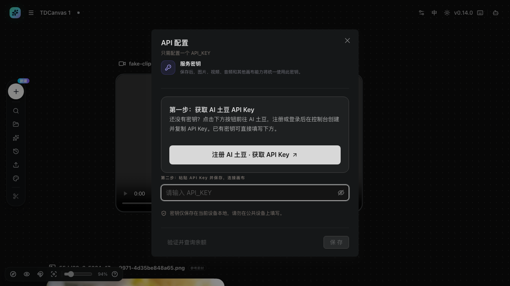

| 项目 | 实测结果（2026-10-01） |
|---|---|
| 入口 | 画布右上角「配置」按钮 |
| 弹窗标题 | `API 配置`，副标题「只需配置一个 API_KEY」 |
| 密钥字段 | 一个密码框，placeholder「请输入 API_KEY」，右侧有显示/隐藏眼睛图标 |
| 作用范围 | 「图片、视频、音频和其他画布能力将统一使用此密钥」——**一个密钥打通全部生成能力** |
| 「验证并查询余额」 | 独立按钮，保存前可先验证密钥并查余额 |
| 「保 存」 | 未填密钥时为禁用态 |
| 平台名称 | 界面写「**AI 土豆**」（代码中为 Aitudou），第一步按钮为「注册 AI 土豆 · 获取 API Key」 |
| 存放位置 | 「密钥仅保存在当前设备本地，请勿在公共设备上填写」 |

> **为什么强调"一个密钥"**：很多人会以为图片、视频、音频各要一把不同的 Key，从而在配置环节就卡住。实际上这里只有一个字段，配一次就够所有生成能力用。如果「生成」按钮点了没反应，第一件事就是确认这把钥匙存没存（见 [90-troubleshooting.md](90-troubleshooting.md#点击生成报错-没有反应)）。

### 同一个配置，两个入口两种长相

API 配置有**两个入口**，右侧表单完全一样，**但左边多了一整栏说明**——这不是两个功能，是同一套表单装在两种容器里。

| | 顶栏「配置」按钮 | 顶栏导航「配置」页（`/config`） |
|---|---|---|
| 形态 | 居中**弹窗** | 独立**整页** |
| 页面标题 | `API 配置` + 副标题「只需配置一个 API_KEY」 | `API 配置` + 副标题「设置 TDCanvas 调用 AI 土豆服务所需的唯一密钥」 |
| 左侧说明栏 | **无** | **有**：小标题 `API`、标题「服务密钥」、一句作用说明、一条分隔线、一句安全提示 |
| 右侧表单 | 服务密钥 → 第一步 → 第二步 → 验证/保存 | **完全相同** |
| 关闭方式 | 右上角 `Close` 或 `Esc` | 浏览器后退或点导航 |

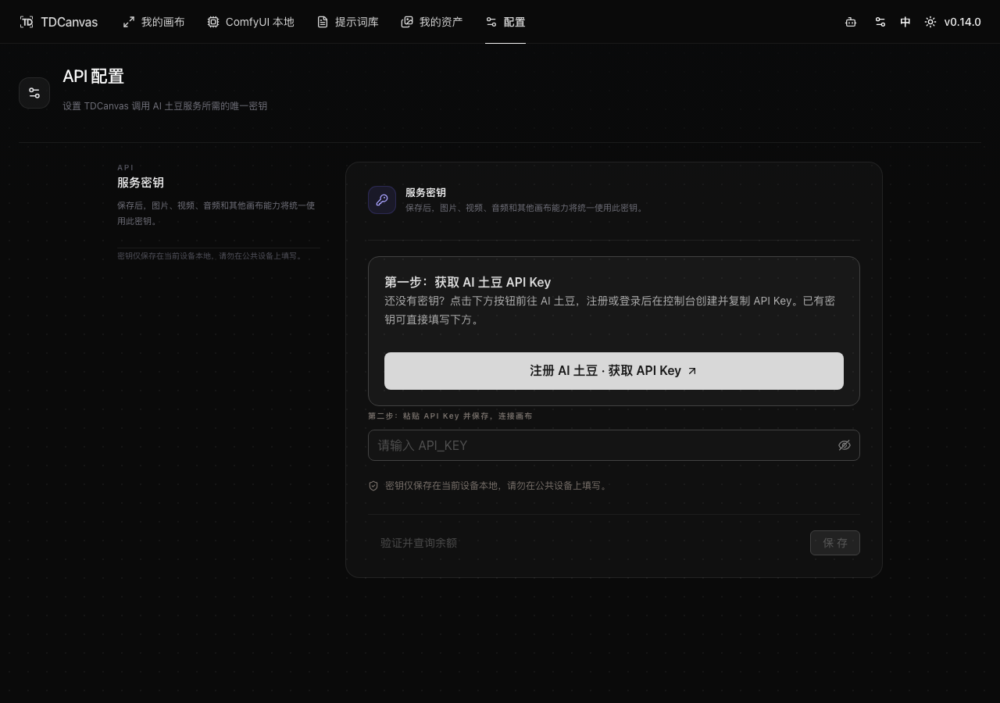

**该用哪个**：临时看一眼余额用弹窗就够了；想通读一遍安全说明、或打算把这个页面单独收藏分享给别人，用 `/config` 整页更合适。

> 弹窗版的截图见本页顶部。两版**共用同一个表单组件**，所以字段、按钮、禁用态完全一致——**你在这页学到的东西，在弹窗里原样适用**。
>
> 这句断言做过运行时逐元素对拍（2026-10-01）：把两处的表单元素全抓下来按「标签+文案+禁用态」逐条比对，**弹窗 6 个元素与整页 6 个完全对应，弹窗没有任何一个元素是整页没有的**；两边处于禁用态的按钮也逐项相同（都是「验证并查询余额」与「保 存」在未填密钥时禁用）。整页多出来的 5 个元素全部在左侧说明栏内（页面大标题、副标题、「服务密钥」小标题、安全提示、API 小标题），与表单无关。
>
> **2026-10-01 M83 独立复验，结论不变**，这次把差异量化得更硬：两处的表单标签集合、按钮集合、禁用态**三项全部逐条相同**（"仅弹窗有"与"仅整页有"两个差集都是**空数组**）；而**结构差异只有一处**——整页有 1 个 `aside`（宽 **260** 像素、栏内 `button/a/[role=button]` 数量 **0**、全文是「API / 服务密钥 / 保存后，图片、视频、音频和其他画布能力将统一使用此密钥。密钥仅保存在当前设备本地，请勿在公共设备上填写。」），**弹窗内 `aside` 数量为 0**。另外注意一处容易看走眼的细节：弹窗的「API 配置」与副标题「只需配置一个 API_KEY」**在同一个标题元素里连着排**（取 `textContent` 得到「API 配置只需配置一个 API_KEY」），而整页的「服务密钥」是**左栏里独立的小标题**。

## 窗口太窄时：导航会折叠成汉堡

顶栏导航会在窗口变窄时折叠。实测断点（2026-10-01，窗口高度 860）：

| 窗口宽度 | 顶栏形态 |
|---|---|
| ≥ 861px | 完整导航横排：我的画布 / ComfyUI 本地 / 提示词库 / 我的资产 / 配置 |
| ≤ 640px | 导航折叠，logo 右侧出现**汉堡按钮**（提示「打开导航菜单」），其余图标（Agent、配置、语言、主题、版本）保留 |
| ≤ 420px | **连 TDCanvas logo 都收起**，只剩汉堡 + 右侧图标 |

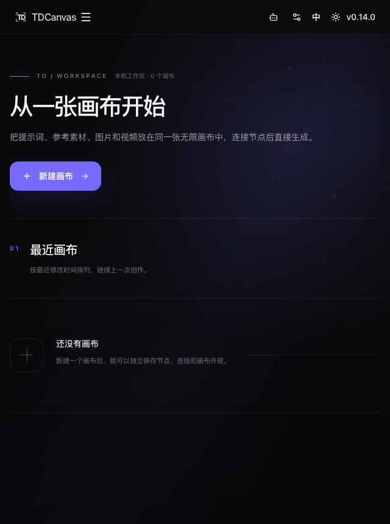

点汉堡会从**左侧滑出一个抽屉**，标题「导航」，左上是关闭按钮，里面是 6 个带图标的链接：

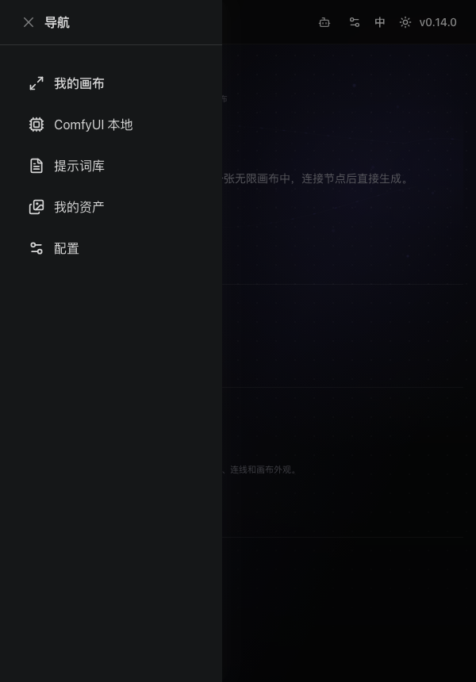

| 抽屉里的链接 | 指向 |
|---|---|
| 我的画布 | `/canvas` |
| ComfyUI 本地 | `/comfyui-local` |
| 提示词库 | `/prompts` |
| 我的资产 | `/assets` |
| 配置 | `/config` |

**三个实用结论**：

- **顶栏导航是响应式的，功能一个不少**。窄屏下找不到「我的资产」不是没有了，是收进汉堡里了。
- **汉堡菜单里没有 Agent 入口**。Agent 图标始终独立留在顶栏右侧，窄屏也在——这是唯一一个不进抽屉的功能。
- **各断点都没有横向滚动条**。实测 1024 / 860 / 640 / 420 四个宽度的 `scrollWidth` 都等于 `clientWidth`，页面不会因为窄而左右晃。

## 鼠标与键位

| 操作 | 键位 / 方式 |
|---|---|
| 平移视图 | 拖动画布空白处（**没有空格平移**） |
| 缩放画布 | 鼠标滚轮（5%–500%，以指针为锚；滚轮向下是缩小） |
| 精确缩放 | 左下角缩放滑杆 |
| 重置视图 | 左下角「重置视图」按钮（有选中时聚焦选中节点） |
| 框选多个节点 | `Ctrl / Cmd` + 空白处拖动 |
| 定位到某个节点 | 左侧 Dock「搜索节点」→ 侧边面板点列表项（提示原文「定位到节点」） |
| 只导出部分节点 | 侧边面板「选择」→ 勾选 → 「导出选中」（实测下载 `画布元素-N个.zip`） |
| 追加选择节点 | `Shift / Ctrl / Cmd` + 点击节点（弹窗只说「追加」，取消选中请点空白处或按 `Esc`） |
| 全选节点 | `Ctrl / Cmd + A`。⚠️ **它只改变"哪些节点处于选中态"，不产生任何副本**——画布空白处右键的「**复制所有节点**」**不能**代替全选：那个动作把整张画布的节点复制进剪切板，跟当前选中了几个完全无关（实测：4 节点只选中 2 个时，「复制所有节点」复制的仍是全部 4 个） |
| 复制 / 粘贴 | `Ctrl / Cmd + C` / `V`（可粘贴**剪切板**文字或图片——应用里一律写「剪切板」，不是「剪贴板」）；**「复制所有节点」+「粘贴」= 整画布复制**（实测 2 节点 → 粘贴后 4 节点） |
| 创建副本 | 节点右键 → 复制（偏移 +36,+36） |
| 撤销 / 重做 | `Ctrl / Cmd + Z`；`Ctrl / Cmd + Shift + Z` 或 `Ctrl / Cmd + Y` |
| 删除选中 | `Delete` / `Backspace` |
| 取消选择并关闭浮层 | `Esc` |
| 编辑文字 | 双击文本节点内容 |
| 重命名节点 | 双击节点标题 |
| 上传素材 | 拖入图片/视频/音频文件 |
| 打开快捷键弹窗 | 顶栏键盘图标，或左侧 Dock 最下方的**问号圆**按钮（**没有 `?` 快捷键**）。⚠️ 它**不是紧贴在小地图旁边**——左下角那组依次是「指南针 / 眼睛 / 磁铁 / 靶心」，**快捷键在离它们约 120 像素远的第五个位置**（2026-10-02 实测：小地图 x=17、快捷键 x=272，同在 y=904 一行） |

> **两处菜单里有「没有按钮的操作」**：顶栏汉堡菜单的「删除当前画布」与画布空白处右键的「复制所有节点 / 粘贴」，界面上没有对应按钮，只能从菜单进。其中「复制所有节点 + 粘贴」等价于整画布复制。顶栏菜单的「导入资产」**名不副实**——它打开的是本地媒体文件选择器（与「上传资产」同一个函数），**不能**用来导入 `我的资产.zip`。**快捷键标签在两处菜单里不一致**——顶栏写 `Ctrl / Cmd + Z`，右键菜单只写 `Ctrl+Z`（Mac 上实际需要 `Cmd`）；以本表为准。两处菜单的完整说明见 [navigate-canvas.md](10-tasks/navigate-canvas.md#画布里两个不显眼的菜单)。

完整的键位表与「画布为什么没有缩放快捷键」见 [shortcuts-help.md](10-tasks/shortcuts-help.md)。

## 素材格式与限制

| 类型 | 格式 | 单文件上限 |
|---|---|---|
| 图片 | JPG / PNG / WebP | 50MB |
| 视频 | MP4 / MOV / AVI / MKV | 50MB |
| 音频 | MP3 / WAV / FLAC | 50MB |

- 节点尺寸范围：最小 220×160，最大 1600×1200；图片/视频默认锁定宽高比。
- 格式**清单外**的文件在上传阶段就会被拒；清单内但内容对不上的文件会拖到播放阶段才失败（见 [90-troubleshooting.md](90-troubleshooting.md#上传的-视频-节点黑屏无法播放)）。
- 图片节点历史版本上限 24 条（规则比数字更严格，见下文「图片历史」）。

## 悬浮工具条：同一条，按节点变出 6 种长度

选中**单个**节点后浮现在节点上方的那条工具条，**按钮数量由「节点类型」和「节点有没有内容」共同决定**——从 **2 个到 13 个不等**。这是最容易让人以为"界面坏了"的地方：新建一个图片节点，工具条只有 4 个按钮，可别人截图里怎么有 13 个。

| 节点 | 按钮数 | 关键区别 |
|---|---|---|
| 组 | **2** | 只剩「信息 · 删除」，最简的一种 |
| 图片 / 视频 / 音频（**空节点**） | **4** | 「信息 · 删除 · 编辑 · 上传 X」——**没放素材前只有这四个** |
| 音频（有内容） | **5** | 比图片/视频少一个「存资产」 |
| 视频（有内容） | **6** | 有「存资产」和「下载」 |
| 文本 | **8** | **唯一一种"有没有内容都一样"的节点**，恒 8 个 |
| 图片（有内容） | **13** | 最长的一条，裁剪、切图、替换图片都在这里 |
| ComfyUI 工作流（空节点） | **4** | **不是「编辑 · 上传」**，换成「**运行 · 参数**」 |

所以"我的图片节点怎么没有裁剪按钮"——**先确认节点里已经放了图**。空节点上的那 9 个按钮要等真的有一张图才出现。

> 完整的 9 种组合、每个按钮逐字列出，以及逐节点实测记录，见 [编辑与整理节点](10-tasks/edit-nodes.md#悬浮工具条-每个节点类型都不一样)。本页只放长度速查，**两处不重复维护同一张表**。

## 生成任务状态

| 你会看到的 | 出现在哪 | 可撤销？ | 费用 |
|---|---|---|---|
| **生成中**（节点内转圈） | 节点内部 | 只能等 | 已计费 |
| **生成失败**（节点内错误块，带「重试」） | 节点内部 | 可重试 | 通常不计费 |
| 英文小徽标 `queued` / `running` / …（带 `· NN%`） | 生成面板标题行右侧，**提交后才出现** | `stopped` 只停本地轮询，**远端可能继续** | 已计费 / `stopped` 可能已计费 |

> **⚠️ 2026-10-01 M85 订正**：本表此前列出「待配置 / 已排队 / 处理中 / 已完成 / 部分完成 / 失败 / 等待补充参数 / 已停止」八个中文状态，并标为「界面原文」。**这八个词在 v0.14.0 界面上一个都不出现**——它们只是 `zh-CN.ts` 里 `canvas.aitudou.status` 这组**从未被任何组件引用的死文案**。实际渲染任务阶段的是英文原始枚举（`TaskStatus` 组件输出 `{taskPhase}`），且未提交时不显示任何徽标。**M71 那次订正方向反了**，详见 [generate-images.md](10-tasks/generate-images.md#任务状态与异常)。提交后的中间态**未实测**（需真实付费任务），英文徽标一行的判据来自源码。

轮询参数：本地每 **4 秒**查询一次任务状态，单个任务最长等待 **60 分钟**，超时按失败处理（远端任务不受影响）。

### 面板显示价格速查（2026-10-01 实测）

| 节点类型 | 面板标题 | 默认模型 | 格式 / 时长 | 价格 | 计费单位 |
|---|---|---|---|---|---|
| **文本** | **文本创作 / 文本处理** | **Kimi k3** | 仅文本输入 · 最大输出长度 1024 | **面板不显示价格** | 按实际结算 |
| 图片 | **文生图** | Seedream V5 Pro | 比例 自适应 · 2k | 约 ¥0.519 | **按张** |
| 视频 | **文生视频** | Seedance 2.0 Standard | 5 秒（可选 4~15 秒）· **分辨率 7 档** · 比例 7 档 | 约 ¥2.48–5.37 | **按时长与分辨率（区间）** |
| 音频 | 音频创作 / 文本生成音频 | Doubao seed audio 1.0 | wav | 约 ¥0.004 | **按秒** |

> **2026-10-01 M82 复验：四个价格数字全部未漂移**（¥0.519 / ¥2.48–5.37 / ¥0.004 / 文本无价），四类的面板标题与默认模型也逐字一致。**但价格是实时拉的**——取证时抓到的相关请求是 `GET /tdtv-api/aitudou/api/pricing`，返回体里带 `observed_prices`、`price_estimates`、`official_price_discounts` 等字段。**平台调价后这里的数字会变**，本表是 2026-10-01 的快照，以界面实际显示为准。

> **视频的「¥2.48–5.37」是个区间，原因在分辨率那一栏。** 面板参数行原文是 `4–15 秒 · 480p / 720p / 1080p / 2k / 4k / native1080p / native4k · 比例 7 档`——**分辨率有 7 档、比例有 7 档**，任选其一都会改变报价。选 `480p` 靠近区间下限，选 `4k` 靠近上限。**只调时长不调分辨率，价格基本不动。**

> **文本面板的价格位有个中间态。** 刚打开面板的**头几秒**那行写的是「**读取价格…**」，随后变成「**按实际结算**」——**始终不会出现任何金额**。看到「读取价格…」不必以为卡住了，等一下就好。

> **文本节点的面板不是生图面板。** 它是「文本创作」，跑的是对话模型（Kimi k3），输入框占位写「输入你希望模型回答的内容」，**面板底部没有价格**（只写「按实际结算」）。**2026-10-01 M66 修正**：本表此前把文本与图片合并成一行「文本 / 图片 → 图像创作 → Seedream V5 Pro → 约 ¥0.519」，三项全错——「图像创作」这个词在 i18n 与源码中各出现 **0** 次，文本节点的默认操作在源码 `DEFAULT_OPERATION_BY_KIND` 里是 `text: "text.chat"`。详见 [generate-images.md](10-tasks/generate-images.md#文本节点的面板不是生图面板)。

> **看单位，不看数字大小**：¥0.004 是每秒，30 秒音频就是 ¥0.12；¥2.48–5.37 是区间，一次顶五次生图。**视频生成是单次最贵的操作**。详情见 [generate-images.md](10-tasks/generate-images.md#生图之外-音频与视频生成的参数和价格)。

> **英文徽标 `stopped` 不等于「已取消」**：这是整张表里最容易误读的一行。「停止」按钮做的事是**停止本地每 4 秒一次的查询**，不是向平台发取消请求。所以点了「停止」之后（面板标题行出现 `stopped`），远端任务大概率还在跑，费用照出；只有回到 Aitudou 平台侧才能真正停掉。60 分钟的等待上限同理——本地超时只是不再等了，远端的活儿不会因为你这边超时而消失。误点「停止」后**先别重试**，去平台确认状态，否则一次手抖就是两次钱。

## 连线与其他限制

- 同一节点对之间的连线不会重复（已有同向连线时再次拖线会被忽略）；
- 节点不能连接自己；组节点不参与连线；
- 一条非多选输入口只接受一条入线（占线后再拖入会被忽略）；
- **内置节点之间没有类型限制**——文本 / 图片 / 视频 / 音频两两互连 16 种组合全部连得上，不存在「类型不匹配所以连不上」；
- 连线一旦建立不会自动消失，除非上游/下游节点被删除或连线被手动删除；- 项目标题最长 64 字符；文本节点重命名同样最长 64 字符；
- 文本节点字号可调范围 10–32。

> **连线不是执行顺序**。它表达的是「谁给谁提供素材」的依赖关系，不是流水线上的先后。多个上游可以同时接一个多选输入口，它们之间没有先后之分；删掉连线也只会断开引用，不会删除任何一端的节点。

> **2026-10-01 M98 逐条实测（上面四条限制此前只有源码依据）**。判据是**应用自己的计数**——首页项目卡上的「N 个节点 · M 条连线」，每做一次拖拽就离开画布再回来读一次，不拿自己写的 DOM 判据下结论：
> - **节点不能连接自己** ✅ 把自己 output 拖到自己的 input，连线数 0 → 0，**被拒**；
> - **正常 output → input** ✅ 0 → 1，**建成**；
> - **同一对节点不重复连线** ✅ 再拖一次同样的两端，1 → 1，**被拒**；
> - **非多选输入口只收一条入线** ✅ 该口已有入线后再拖一条进去，**被拒**；
> - **组节点不参与连线** ✅ 组节点身上**根本找不到可按下的端口**（探针在它的输出位取不到可交互元素），与"不参与"一致。
>
> **两条端口方向规则（M99 补测，此前手册没写）**：
> - **同向拖不动** ❌ output 拖到 output、input 拖到 input，**两种都被拒**（连线数 0 → 0）。源码 `canvas-node-ports.ts` 的 `normalizeConnectionHandles` 第一句就是 `first.handleType === second.handleType` 时直接返回空——**两个口同向就不成立**。
> - **反着拖也能连** ✅ **从 input 往外拖到另一个节点的 output，照样连得上**（0 → 1 建成）。因为同一个函数紧接着把两端**自动归一化**：`handleType` 是 source 的那个当上游、是 target 的那个当下游，**跟你从哪个口起拖无关**。所以「先拖下游再拖上游」是完全可行的做法。
>
> **连线在数据里存的是什么**：`CanvasConnection` 就是 `{ id, fromNodeId, toNodeId, fromPortId, toPortId }`，**方向只由 from/to 表达，没有独立的「方向字段」**——这也是为什么反着拖不会连反。
>
> **2026-10-02 M107 把「内置节点之间没有类型限制」从单点样本升级为全矩阵实测**。此前只有「两个节点的四个端口 `data-port-type` 都是 `any`」这一次观察，**只有一格、没有覆盖到不同类型之间**。现把文本 / 图片 / 视频 / 音频**两两互连的 4×4 十六组全跑了一遍：全部建成（每组 `0 → 1`），被拒 0 组、失败 0 组**，每组独立一张干净画布、两节点左右拉开并断言互不重叠。
>
> **关键是判据本身也验过**：一条全绿的矩阵如果用的计数器恒返回真，那它证明不了任何事。**验证办法是自校准**——先用某条坐标建一次线（证明这套拖拽在本画布上确实通），再**用完全相同的坐标原样拖一次**；源码规定此时应被「同一对不重复」拦下，实测四组都是 `1 → 1` **不增、且两个节点均未位移**。节点没动这一条同时排除了另一种可能：读数之所以不增，是因为**这次抓的是节点本体、根本没发起连线拖拽**。这条反向用法就是 M101 那条「断言源位移非零」的镜像。
>
> **为什么必然如此（源码根因，与运行时读数互为印证）**：内置节点**根本没有定义过端口**——`builtin-nodes.tsx` 里 `ports` 出现 0 次，六种内置节点全部回退到两个兜底口，而兜底口的 `dataType` 写死是 `any`。于是类型校验里「任一端是 `any` 就放行」这一支**对内置节点恒真**，等于**没有闸门**。定义了真端口的只有 ComfyUI 工作流节点和插件节点两类。
>
> **顺手订正一个数字**：端口命中区此前写「43×43」，那是**带着画布缩放量的一次性读数**（43 ÷ 48 ≈ 0.896）。源码写死的是 `size-12`，100% 缩放下实测为 **48×48**，并随画布缩放等比变化。已登记为 R23。

## 图片历史

| 项目 | 规则 |
|---|---|
| 入口 | 图片节点**右上角**的胶囊钮，**上面带着一个数字**（就是版本总数，2026-10-02 实测 2 个版本时按钮上写「2」，整体 63 × 29）。**鼠标提示（title）是「历史版本」四个字**；读屏软件听到的那句是「打开历史版本，共 N 个」（aria-label），**两者不是同一句话**（2026-10-02 实测订正，此前手册把 aria-label 当成了鼠标提示） |
| 面板 | 标题「历史版本」，副标题「选择一个版本在当前节点中预览」，标题右侧另有一个版本总数徽章。三列网格，缩略图是 4:3，左下角角标写 **V1 / V2**（**是硬编码的 `V` 加序号，不是「图片版本 1」**——那句只出现在悬停缩略图的提示里），当前版本标注「当前」 |
| 上限 | 最近 **24** 个版本（源码 `MAX_CANVAS_IMAGE_HISTORY = 24`），更早的被挤出 |
| **谁会产生版本** | **只有 AI 生成会**。上传、「替换图片」、裁剪、切图、放大都**不**产生新版本（2026-10-01 实测：上传后替换，版本入口不出现） |
| **生成前那张图去哪了** | **源码显示它会被记成一条历史**（`canvas-image-history.ts:18-20` 先把当前 `metadata.content` 作为一条基线追加，再追加生成结果）——**所以只跑一次生成通常就有 2 个版本（生成前 + 生成后），刚好越过下面的门槛**。⚠️ 这条**只有源码证据、未经实测**（造出真实生成结果要计费） |
| **何时出现** | 版本数 **少于 2 时入口根本不渲染**（源码 `history.length < 2` 直接返回空）——界面会干净得像没有这个功能，而不是置灰。**2026-10-02 实测钉死**：往画布注入 0 个版本 → 无入口；注入 **1 个** → 仍然无入口；注入 **2 个** → 入口出现。**1 个版本时按钮同样不出现**，不是"只有一个也能看" |

> **为什么"替换图片"不算一次版本"**：版本历史按**生成任务**归档，每条版本都带着 `taskId`，它解决的是「生成结果这次更好，想回到上一版」。上传/替换的心智是「覆盖」而不是「回退」，把它们混进历史会让那个入口含义模糊。本地文件一旦不再被节点引用还会被统一回收，所以重要的图要「存资产」，而不是指望节点历史兜底。

## 画布设置（画布外观面板）

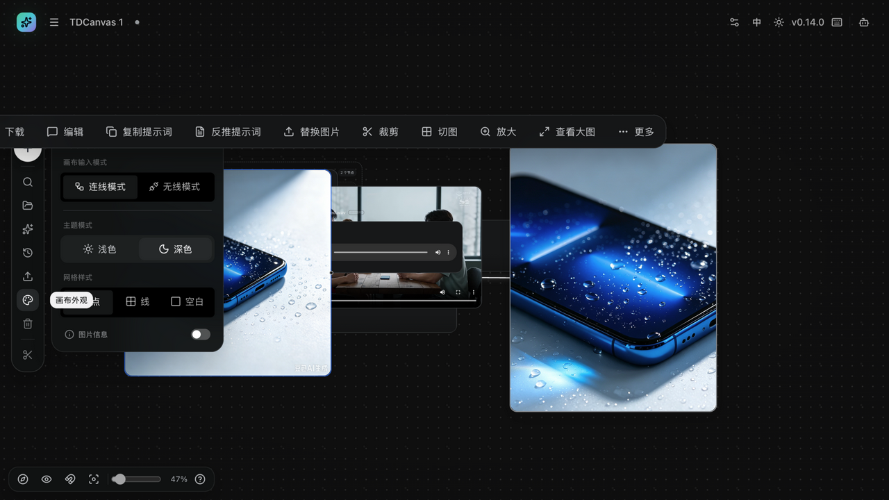

| 设置 | 选项 | 默认 | 归属 |
|---|---|---|---|
| 画布输入模式 | 连线模式 / 无线模式 | 连线模式 | 项目级 |
| **主题模式** | 浅色 / 深色 | 深色 | **全局**（所有画布、所有页面共用） |
| 网格样式 | 点阵 / 线格 / 空白 | 点阵 | 项目级 |
| 图片信息 | 开 / 关 | 关 | 项目级 |
| 网格吸附（缩放 Dock） | 开 / 关 | 关 | 项目级 |
| 对齐辅助线 | 开（拖动时自动出现） | 开 | 项目级 |

> **「连线模式 / 无线模式」是给触控板用的**：切到无线模式后，空白处拖动直接平移视图，不用按住修饰键。默认的连线模式更接近桌面端习惯。
>
> **注意「主题模式」不是项目级的**——它是全局设置，改一次整个应用都变，存进 `localStorage` 的 `tdcanvas:theme_store`，**关掉浏览器再打开也保持**。这一项是本表里唯一的例外，其余外观设置才跟着项目走、会随项目导出。详见 [organize-canvas.md](10-tasks/organize-canvas.md#浅色主题怎么切-两个入口-一个开关)。

## 我的资产

| 项目 | 说明 |
|---|---|
| 资产类型 | 文本 / 图片 / 视频（顶部筛选可切换） |
| 搜索范围 | 匹配标题、内容、标签或来源 |
| 标签 | 输入后按回车逐个添加；卡片最多展示 3 个 |
| 分页 | 默认 10 条/页 |
| 导出文件名 | `我的资产.zip` |
| 视频资产操作 | 只有「下载」和「删除」，**没有「编辑」** |
| 删除 | 无撤销、无回收站 |

> 列表标题右侧的 `N / N` 是个诊断利器：**分母**是全部资产、**分子**是当前筛选结果。分子比分母小，说明东西在、只是被筛掉了（多半是类型筛选或搜索词没清干净），而不是没存进去。批量操作前先「导出资产」，因为删除没有回收站。

## 提示词库

| 项目 | 说明 |
|---|---|
| 页面标题 | 提示词中心（顶部导航入口名为「提示词库」） |
| 内容来源 | 全部来自外部「提示词来源」，无内置来源 |
| 当前版本状态 | 全新安装显示「当前共 0 条提示词」，且无添加来源的界面入口 |
| 搜索范围 | 匹配标题、内容或标签 |
| 收藏方式 | 卡片「加入我的资产」→ 存为文本资产（来源标注「提示词库」）；画布节点工具条上同一操作叫「存资产」 |

> **空列表是当前版本的正常状态**，不是加载失败。内置来源列表 `DEFAULT_PROMPT_SOURCES` 是空数组，界面也没有提供添加来源的入口，所以反复刷新数量不会自己出现。要沉淀提示词，目前只能改用「我的资产」手动录入。

## ComfyUI 本地与 404：两个走不到底的页面

TDCanvas 一共 7 条路由，其中两条**在浏览器里是"走不到底"的**——它们不会报错，但也没有下一步。它们和"故障"不是一回事，先分清能省下很多困惑。

### ComfyUI 本地（浏览器里只有一句提示）

在**浏览器**打开「ComfyUI 本地」，整页只有：标题「ComfyUI 本地模式」、右上角一个「**未配置**」状态徽标，和一条橙色提示：

> **此模式仅在桌面客户端中运行**
> 本地环境需要访问电脑目录并管理 ComfyUI 进程。请从 TDCanvas Windows 或 macOS 客户端打开此页面。

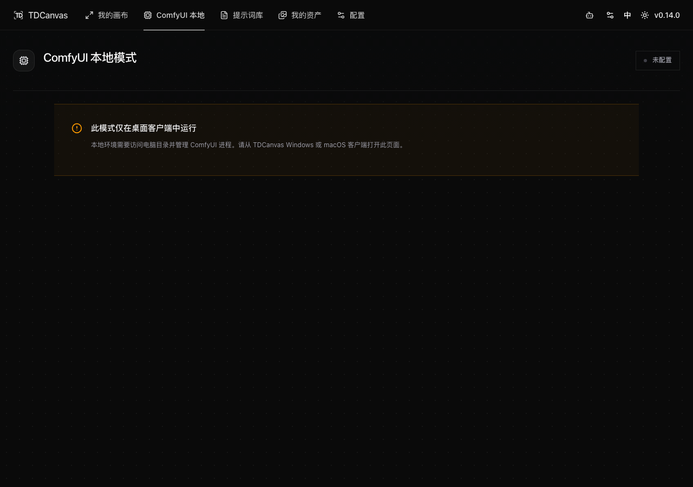

**页面内容区一个按钮都没有**——不是加载失败，是这一页在浏览器里本来就没有交互。判据是 `isTauriRuntime()`：只有存在 `__TAURI_INTERNALS__`（即跑在 Tauri 桌面壳里）才渲染真正的配置界面。

> **别把"整页"理解得太宽**（2026-10-01 复测）：这句话说的是**页面内容区**。实测整页有 **17 个可见按钮**，但其中位于 `<main>` 内的数量是 **0**——全部集中在顶部导航栏与右侧 Agent 面板。也就是说**这一页无法操作，但你仍然能通过顶部导航离开它**，不会困在这里。

**为什么浏览器做不到**：这个页面要做的事是「选择本机 ComfyUI 目录、启动/停止 ComfyUI 进程、读它的节点定义」——全是浏览器没有的能力。硬要开放只会得到一个假按钮。

**想要本地 ComfyUI 工作流节点怎么办**：换用 TDCanvas 的 **Windows 或 macOS 桌面客户端**打开同一地址即可。浏览器里另有一条替代路径是用 Aitudou 云端 API 生成（见 [generate-images.md](10-tasks/generate-images.md)）。

> 界面上的「ComfyUI 工作流」节点类型（添加节点菜单里第七项）在**画布上随时可以创建**，但没有桌面客户端连好环境之前，它只是一个空壳节点。

### 404：地址打错时的样子

访问不存在的地址会看到一张干净的 404 页：中央一个「404」方块，标题「**页面不存在**」，说明「这个地址没有对应的页面，可能已经移动或被合并到其他入口。」，配一个「**返回首页**」按钮。

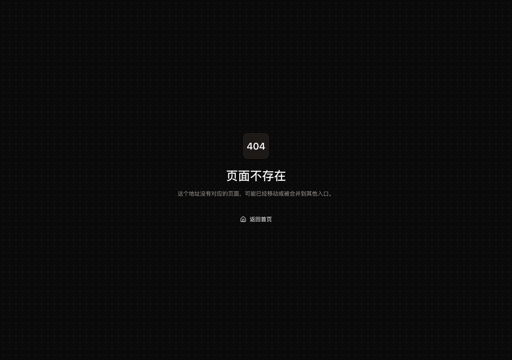

这页**没有任何 TDCanvas 顶部导航**——它渲染在导航壳之外，所以想用导航栏"退回"是不行的，只有「返回首页」这一个出口。碰到它先检查地址栏拼写。

## 切到英文：功能不减，但术语会变

顶栏右侧的「中 / EN」按钮可以一键切换界面语言，**立即生效，不需要刷新或重开**。

**语言按钮本身是双向的**：中文界面下它的提示写「切换到 English」，切过去之后变成「Switch to 简体中文」——始终告诉你**点下去会变成什么**，而不是你现在是什么。

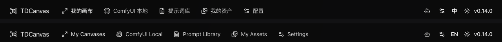

### 术语对照：哪些词会变

**这一步最容易卡住人**——手册里写「配置」，切到英文去找 `Config` 却找不到，因为英文用的是另一个词。

| 中文界面 | 英文界面 | 备注 |
|---|---|---|
| 我的画布 | My Canvases | |
| ComfyUI 本地 | ComfyUI Local | |
| 提示词库 | Prompt Library | |
| 我的资产 | My Assets | |
| **配置** | **Settings** | **不是 Config**，搜 `Config` 一定找不到 |
| API 配置 | API settings | |
| 服务密钥 | Service credential | |
| 第一步 / 第二步 | Step 1 / Step 2 | |
| 验证并查询余额 | Verify & check balance | |
| 保存 | Save | |
| 连接 TDCanvas Agent | Connect TDCanvas Agent | |
| 方式一 / 方式二 | Option 1 / Option 2 | |
| 未连接 / 连接 | Disconnected / Connect | |

> **2026-10-01 M74 逐条复核（13 组全部成立）**：这张表此前的依据只有 M45 的一句「中英各 1814 条、双向 0 缺失」——那是**数量**对得上，并没有逐条核过这 13 行的**具体措辞**。本批把中文与英文两种界面下的可见文本各抓一份全集（首页 / 配置页 / 画布页），逐组检索，**13 组全部对得上**。
>
> 顺带核实的两处：
> - **语言按钮确实是双向的**：中文界面读「切换到 English」，切过去之后立刻变成「**Switch to 简体中文**」；`<html lang>` 同步由 `zh-CN` 变为 `en-US`。
> - 配置页的步骤文案比表里记的更完整——中文是「**第一步：获取 AI 土豆 API Key**」「**第二步：粘贴 API Key 并保存，连接画布**」，英文对应 `Step 1: Get an AI Tudou API key` / `Step 2: Paste your API key and save to connect`。表里只记了「第一步 / 第二步」这个前缀，**对照关系不变**。
>
> **仍然成立的那条经验**：按 `Config` 搜不到，因为英文界面真的写的是 `Settings`。

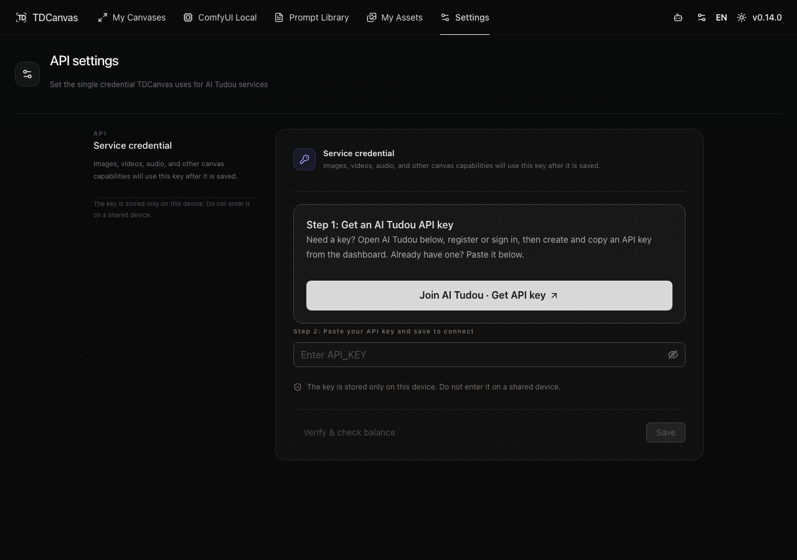

### 切换后文案与布局一致（实测 6 条路由）

2026-10-01 把界面切到英文后，逐条路由扫描残留中文（**M95 已补测到 7 条**，此前只扫了 6 条）：

| 检查项 | 结果 |
|---|---|
| 中英翻译键位 | **各 1814 条，一一对应，0 缺失** |
| 占位符（`{{count}}` 等） | **0 处不一致** |
| 页面残留中文（**可见文字**） | **7 条路由全部为 0**——英文界面上**屏幕里一处中文都没有**，唯一的「简体中文」藏在语言按钮自己的 `aria-label` 里，**鼠标看不到** |
| 页面残留中文（`aria-label` / `title` / `placeholder`） | 6 条路由各 **1 处**，全是 `Switch to 简体中文`；**但 `/canvas/:id` 是 3 处**——除语言按钮外，节点端口的悬停提示**仍是中文**「**输入 · any**」「**输出 · any**」 |
| 文档语言标记 | `html lang` 正确变为 `en-US` |
| 横向溢出 | **0**（英文普遍比中文长 20–30%，但没撑破任何布局） |

> **2026-10-01 M95 复测与订正**：本表此前只扫了 **6 条路由**，结论是"全部只剩 4 个字「简体中文」"。**补测第 7 条 `/canvas/:id` 后该结论不成立**——画布页的节点端口悬停提示照样是中文。**这不是翻译漏了词条，是端口提示压根没走 i18n**：`components/canvas/canvas-node.tsx:1111` 的 title 取值是「port.description，为空时用 port.label 拼上 port.dataType」，`port.label` 直接取端口定义里的中文字面量，`en-US.ts` 里**搜不到「输入」「输出」两个词**。所以**只有画布页有这个问题**，其余 6 条确实干净。顺带说明：先前的"4 个字"是把 `aria-label` 也算进去的结果，**可见文字其实是 0**。
>
> **顺带否证一条**：英文下的 Agent 面板 7 个图标按钮的 `aria-label` **全部已本地化**（Chat / History / Skills / Logs / New chat / Collapse Agent panel / Connection settings），没有漏译。

英文下的 Agent 面板是检验"长文案会不会撑破布局"的好样本——它的说明段落是全站最长的英文，实测正常换行、无截断：

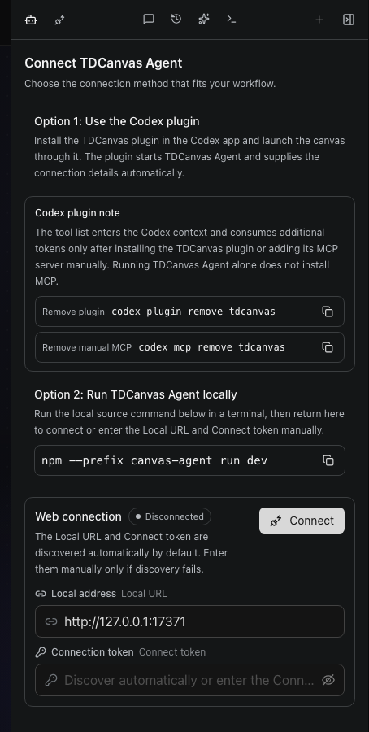

> **唯一一处没翻干净的**：协议选择器里的 `Aitudou / 土豆 API` 这一项在英文界面下**仍然带中文「土豆」**（源码 `en-US.ts` 里就是这么写的）。其余 1813 条都干净。
>
> **这一节只验了「文案与布局」，没有验「功能」**：上表五项全部是静态比对与溢出测量，没有任何一项是「在英文下点一遍看功能是否正常」。所以准确的结论是——**英文界面下界面上该出现的中文都翻掉了、布局也没被英文撑破**；至于每个按钮在英文下是否都行为正常，本手册没有覆盖。如果你在英文下遇到某个按钮点了没反应，那属于本手册未覆盖的范围，反馈给我们比自行猜测更靠谱。

### 品牌名有三处写法

同一家服务在三个地方拼法不同，遇到时别以为找错了：

| 出处 | 写法 |
|---|---|
| 中文界面 | **AI 土豆** |
| 英文界面 | **AI Tudou** |
| 代码与配置 | `Aitudou` |

另外，顶部导航的「提示词库」进入后页面标题是「提示词中心」——这两个名字指的是同一个东西（见 [use-prompt-library.md](10-tasks/use-prompt-library.md)）。

## 数据与存储

TDCanvas 是一个**纯本机应用**：没有账号体系，没有服务器，所有内容都存在你这台机器的这个浏览器里。下表是实测出来的存储位置（2026-10-01）：

| 数据 | 存在哪 | 键名 | 说明 |
|---|---|---|---|
| 画布项目（节点/连线/视口/外观） | 浏览器 IndexedDB | 库 `tdcanvas` → 表 `app_state` → 键 `tdcanvas:canvas_store` | 自动保存（写入有 400ms 防抖），无需手动保存 |
| 「我的资产」条目 | 浏览器 IndexedDB | 同上库表 → 键 `tdcanvas:asset_store` | 提示词文本、参考图片等 |
| 已安装插件 | 浏览器 IndexedDB | 同上库表 → 键 `tdcanvas:plugin_store` | — |
| API Key 与 AI 接口设置 | 浏览器 localStorage | 键 `TDCanvas` | 不会上传到画布仓库；配置弹窗也提示「请勿在公共设备上填写」 |
| 主题（深色/浅色） | 浏览器 localStorage | 键 `tdcanvas:theme_store` | — |
| 画布导出包 | 磁盘上的 zip（`projects.json` v3 + 素材） | — | 首页多选导出；**但没有导入功能** |

> **「自动保存」保的是「关页面不丢」，不是「删错能找回」。** 没有手动保存按钮，也就没有一个明确的存盘点；而且导出的 zip 救不回画布——详见 [project-management.md](10-tasks/project-management.md#导出项目)。同一项目不要开两个标签页编辑：保存是整份文档覆盖写，后写的赢（见 [90-troubleshooting.md](90-troubleshooting.md#两个标签页打开同一画布-文字-节点不见了)）。

### 想手动抢救数据：去浏览器的 IndexedDB 里看

上表的键名是准确的，可以在 Chrome/Edge 里按 `F12` → **Application** → **Storage** → **IndexedDB**，找到 `tdcanvas` 库，在 `app_state` 表里就能看到 `tdcanvas:canvas_store` 这条记录（值是一段 JSON 文本）。**清浏览器数据 / 换浏览器 / 用无痕模式关掉窗口，都会连同这些数据一起消失**——这是本机存储的固有代价，不是 bug。

## 这个版本没有的功能

TDCanvas v0.14.0 有一类特殊状态：**功能实现是完整的，但没有接到界面上**。这类功能最容易误导人——你能在源码和文案里读到一整套自洽的说明，于是以为"只是入口藏得深"，实际上**这个版本里它根本没上线**。

下表是这个版本的完整清单（均为 2026-10-01 实测 + 源码核对）：

> **运行时怎么验的**：对 `/config` 整页与顶栏「配置」弹窗各抓一份**可见叶子文本全集 + 全部 `aria-label`/`title`**（`document.querySelectorAll("body *")` 取无子节点的元素），再逐关键词检索。WebDAV、多设备、同步、蒙版、局部重绘、遮罩、提示词来源、导入画布、channels、preferences —— **全部 0 命中**。配置区的 `role="tab"` 数量为 **0**（页面上出现的那 4 个 tab 是右侧 Agent 面板的「对话/历史/技能/日志」，不是设置标签）。首页整页 `input[type=file]` 数量为 **0**，且整页文本不含「导入」二字。

| 功能 | 实现状态 | 界面上找得到吗 |
|---|---|---|
| **WebDAV / 多设备同步** | 完整（`services/app-sync.ts` 能把画布、资产和本地媒体文件按 `updatedAt` 双向合并上传，域 `canvas` + `assets`；i18n 有整套「WebDAV 同步」文案，含分阶段状态机与错误提示） | ❌ **零调用方**，无任何界面能触发 |
| **四个设置标签**（`channels` / `preferences` / `prompt-sources` / `webdav`） | 类型 `ConfigTabKey` 存在，但配置面板的 `initialTab` 参数**声明了却从未被读取**——源码作者自己在类型定义上留了注释 `/** Kept for callers that used to open a specific settings tab. */`（保留给那些曾经用来打开特定标签页的调用方） | ❌ 四个标签都没有界面 |
| **提示词来源管理** | 组件 `ConfigPromptSources` 及其两个子组件都在 | ❌ **整棵子树零导入**（子组件只被那个孤儿组件引用） |
| **蒙版 / 局部重绘** | 完整（431 行画笔式编辑器，能产出 `maskDataUrl`；`requestEdit` 第 4 个形参就是 mask，以 `formData` 字段发送；中英文错误提示齐备） | ❌ 组件零导入，且 `requestEdit` 的 **4 个调用点全部显式传 `undefined`** |
| **节点插件** | 完整（管理器弹窗 235 行、`plugin-loader` / `runtime` / `registry` / `use-plugin-host`，i18n 从安装卸载到"插件代码会在当前页面内直接执行，可访问本地数据（包含 AI API Key）"的警告全在） | ❌ 管理器弹窗零导入，5 个插件函数的调用点全在其中。`tdcanvas:plugin_store` 这个**存储名在源码里是有定义的**（`use-plugin-store.ts:41`），但因为没有任何组件去挂载那个 store，持久化中间件从不执行，**浏览器里也就永远不会有这个键** |
| **导入画布** | 只有一半（导出的 zip 写得很好，读取那半截从未实现） | ❌ i18n 有三条文案但零组件引用，首页 `input[type=file]` 数量为 0 |

### 怎么判断一个功能是真没有，还是藏得深

记住这一条就够了：**打开界面找不到，就当作它不存在。**

不要因为以下任何一条就以为功能可用——本表里 6 项**每一项都符合其中至少一条**：

- 源码里搜得到完整的实现；
- i18n 文件里有齐全的文案（有的还写了错误提示，读起来像已经能用）；
- 类型定义里有对应的枚举值；
- 消费者是活的（`usePluginHost` 这类确实被挂载了），只是入口没接上。

> **这个版本的实际形态是"消费者活着、入口死了"**。例如节点插件的宿主逻辑确实在画布里跑着，可它只会去加载"已安装"的插件——而安装入口那个弹窗从未被挂载，于是**没有人能装第一个插件**。这类结构最容易让人误判：看到一半是活的，就以为另一半也通着。

### ⚠️ 搜"插件"会搜到东西，但那是另一套插件

上表说"节点插件没上线"，可你到 `/config` 里搜「插件」**能搜到 5 处**，甚至有一个能点的「**移除插件**」按钮。**它们说的全都不是节点插件。** 2026-10-01 逐词核对：

| 你会搜到的词 | 界面原文 | 指的是什么 |
|---|---|---|
| 插件 | 「方式一：在 Codex 中使用插件」 | **Codex 插件**——装在 Codex app 里，用来启动 TDCanvas |
| 插件 | 「在 Codex app 安装 TDCanvas 插件后…」 | 同上 |
| 插件 | 「Codex 插件提醒」 | 同上 |
| 插件 | 「只有安装 TDCanvas 插件或手动添加 MCP 后…」 | 同上 |
| 移除插件 | 一个可点的按钮 | 移除**已装的 Codex 插件**，不是节点插件 |

而**节点插件系统的专有词在界面上一个都没有**（2026-10-01 实测，各词命中数均为 **0**）：「节点插件」「插件管理」「安装插件」「卸载插件」「插件代码」。

> **两套东西同名，是这里最容易踩的坑。** 一套是**装在 Codex app 里**的启动器（有界面、能装能卸）；另一套是**给画布节点写扩展**的插件系统（代码齐全、入口没接上）。判断你看到的是哪一套，只看一句话：**它出现在"配置"里 → 是 Codex 插件；它出现在画布节点的菜单里 → 才是节点插件。** 后者在这个版本里哪儿都不会出现。

### 设置页：左栏不是设置目录

打开 `/config`（或点右上角齿轮）会看到两栏布局：左边一栏说明文字，右边是服务密钥表单。**左边那一栏不是设置目录**——它宽 260 像素，位置正好是标签导航该待的地方，但整栏里一个可点的元素都没有（实测 `aside` 内 button/a 数量为 0，配置区内 `role="tab"` 数量为 0）。

> **别数错了：这一页确实有 4 个 `role="tab"`，但它们不在配置区里。** 2026-10-01 复测：整页 `role="tab"` 数量为 **4**、`role="tablist"` 为 **1**，而 `aside`（左栏）内可点元素为 **0**。那 4 个 tab 属于**右侧常驻的 Agent 面板**（「对话 / 历史 / 技能 / 日志」），它们是手写的 `role="tab"`，**与设置无关**。手册此前只写"配置区内为 0"，读者若按字面去数整页会数出 4 个，反而以为自己数错了——这里补上它们的归属。
>
> 顺带记下一条取证判据（2026-10-01 核对）：本应用的 antd 是 **v6**，它的 `Modal` **确实带 `role="dialog"` 与 `aria-modal="true"`**（打开「新增资产」实测 `roleDialogCount=1`）。所以"某处 `role="dialog"` 数量为 0 ⇒ 这里没有弹窗"这个判据在本应用**有效**——[90-troubleshooting.md](90-troubleshooting.md) 里"画布内删除画布没有任何确认弹窗"那条结论正是靠它立住的。反过来，**不要假设 antd 各版本的类名一致**：v6 的 `Select` 用的是 `.ant-select-content`，而广为流传的 `.ant-select-selector` 在这里**一个都取不到**。

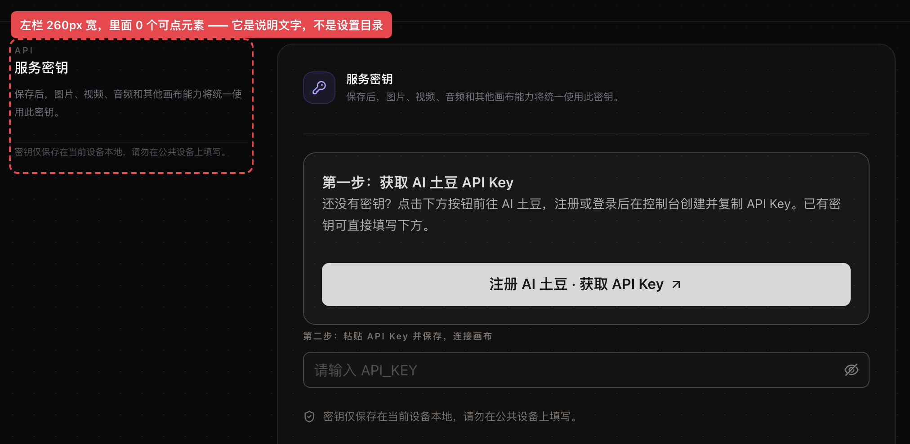

> **窄窗口下的额外提示**：把窗口收窄到 1024 像素以下时，上面的两栏布局会塌成上下两块，说明文字整块压在表单上方（实测 900 像素宽时栅格变为单列 `852px`），侧栏的样子完全消失。

> **这一节怎么用**：如果你在界面上找不到某个功能，先来这里对一眼，能省掉"是不是我操作错了"的排查。逐项的替代方案见 [project-management.md](10-tasks/project-management.md)（画布导入与导出）、[image-operations.md](10-tasks/image-operations.md#局部重绘-蒙版-这个版本没有-别找了)（局部重绘）、[90-troubleshooting.md](90-troubleshooting.md)（按症状查）。

## 版本与更新

**本手册对应 v0.14.0。** 顶栏右侧的版本号（形如 `v0.14.0`）是可以点的，点开是「版本更新」弹窗：

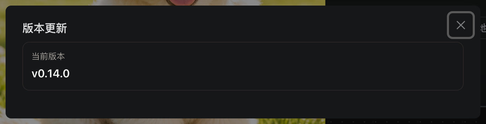

**这个弹窗只能告诉你"你现在是什么版本"，不能帮你升级。** 2026-10-01 实测：弹窗里**只有「当前版本 / v0.14.0」一张卡片**，「最新版本」卡片和「检查更新」按钮**整块不渲染**；点击期间也没有发起任何版本查询请求（抓到的三条 URL 全是前端自身的模块加载）。

原因是这两块由 `canCheckUpdates` 控制，它等于「桌面端更新器已启用」或「配置了版本查询地址」二者之一。浏览器里两个条件都不成立——既不是桌面客户端壳，也没有配置版本查询地址——所以整块被跳过，弹窗下半部那片留白是**设计如此，不是加载失败**。

| 想要什么 | 在浏览器里怎么做 |
|---|---|
| 确认自己用的版本 | 点顶栏版本号，弹窗里的「当前版本」就是 |
| 确认有没有新版本 | **界面上查不到**，需要另行获取发布信息 |
| 原地一键升级 | **浏览器版不支持**，这是桌面客户端安装包的能力 |

> **为什么写这一节**：手册锁定在某个版本上，而版本号又是个看起来"能点什么"的元素。读者最自然的动作就是点它想看看有没有新版，结果只得到一张写着当前版本的卡片和一屏留白——很容易误以为是网络问题或应用坏了。**明确说出"这里查不到、也升不了"**，比让读者自己去撞一次要省事。

## 相关页面

- [30-concepts.md](30-concepts.md)：节点类型与连线语义。
- [90-troubleshooting.md](90-troubleshooting.md)：常见问题排查。
- [10-tasks/README.md](10-tasks/README.md)：按任务查操作步骤。
