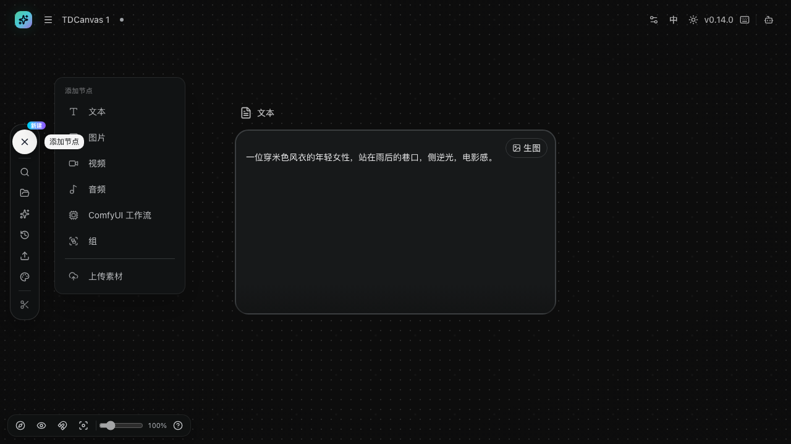
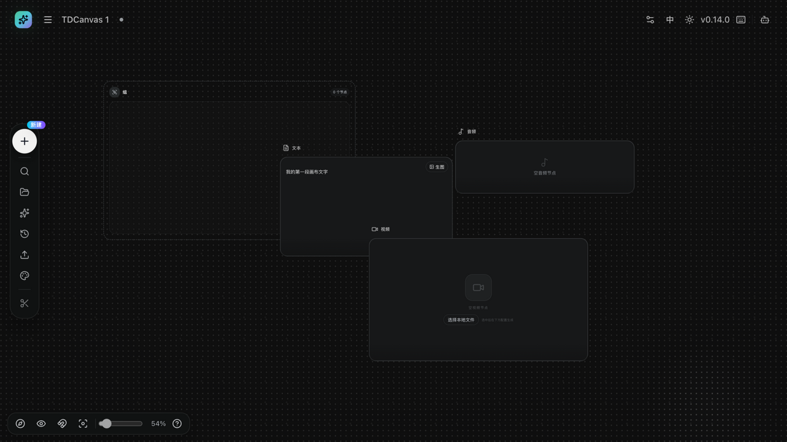
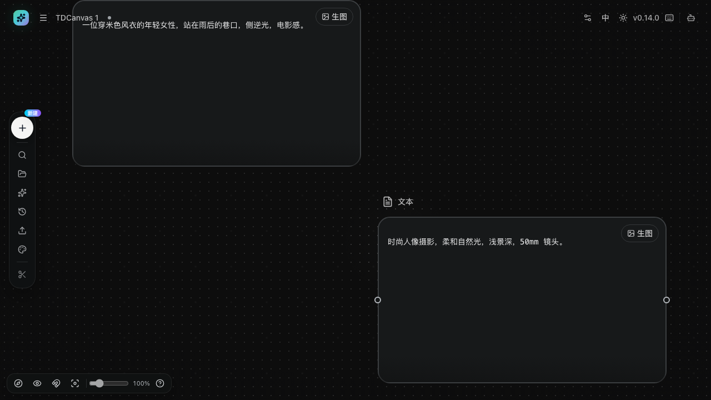
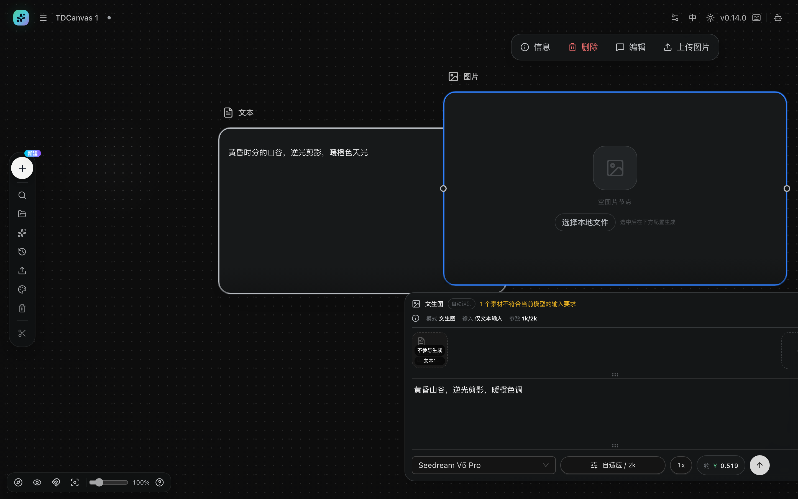
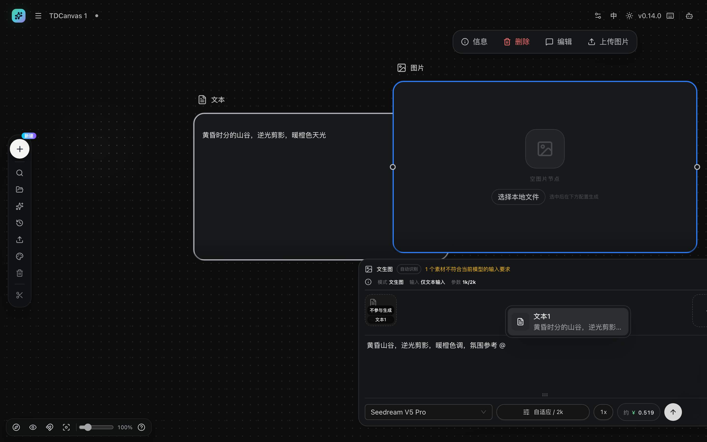
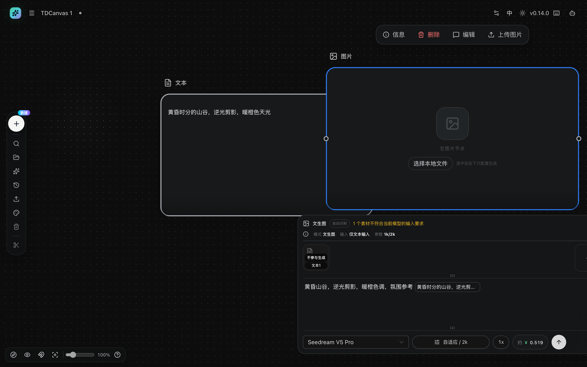
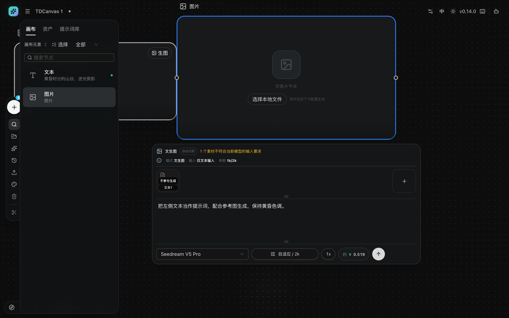
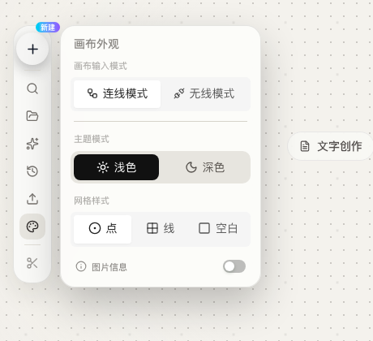

# 概念：节点、连线、双模式与项目

> 解释 TDCanvas 画布的核心概念与设计意图。操作步骤见 10-tasks 各页。

## 一句话心智模型

把 TDCanvas 想成一张**无限大的桌面**：桌面上的每张纸是一个**节点**，纸与纸之间拉一根线表示「引用」。你不需要按「运行」——内容一旦连好，发起生成时系统会自动把所有上游拉进下游。

这个模型解释了三件事：为什么节点能被随意摆放、为什么连线只表达引用而不表达执行顺序、以及为什么改一个上游会影响所有连到它的下游。

## 节点：画布上的一切

TDCanvas 用「节点」统一承载内容，共七种。左侧 Dock 的「+」按钮点开后就是这份清单：

> 同一份清单在双击画布空白处也能打开，标题写作「选择节点」——两处叫法不同，功能一致。2026-10-01 实测确认：双击弹出的菜单同样是**七项**，但**这两项的先后顺序与 Dock 菜单正好相反**：「组」和「ComfyUI 工作流」（Dock 是 ComfyUI 在前，双击是「组」在前）。内容一样，只是顺序不同，不必当成两套清单。
>
> 另外，**空画布中央那排芯片是第三份东西**：文字创作 / 图片创作 / 视频创作 / 音频创作 / 上传素材——只有**五项**，措辞也从「文本」变成了「文字创作」。它只在**画布完全为空**时出现，建完第一个节点就消失，所以要再建第二种类型请用左侧 Dock 的「+」。

| 节点 | 承载 | 作为生成输入 |
|---|---|---|
| 文本 | 提示词、草稿、说明文字（也可承载 AI 生成的文本结果） | 文本引用（见下方「连线 ≠ 自动生效」） |
| 图片 | 本地上传图片、AI 生成图（含 24 版历史） | 作为参考图 |
| 视频 | 本地视频片段 | 作为参考视频 |
| 音频 | 语音、音乐素材 | 作为参考音频 |
| 组 | 视觉容器（圈住相关节点，**不参与生成**） | — |
| ComfyUI 工作流 | 本地 ComfyUI 流程封装为节点（需配置本地环境） | 由工作流输入口决定 |
| 上传素材 | 临时占位：拖入/选择文件后自动变成媒体节点 | 同媒体节点 |

菜单只有这七项。应用内部还有两种**你没法用菜单创建**的节点类型——「生成配置」和「AI 土豆任务」，它们是历史遗留形态，也会在每次打开画布时被自动改写掉，详见本章末尾的「两种打不开的节点类型」。

这两者的"不可见"程度其实不一样，值得先分清：

| | 生成配置 | AI 土豆任务 |
|---|---|---|
| 在创建菜单里 | ❌ 没有 | ❌ 没有 |
| 内部注册了吗 | ✅ **注册了**（菜单里被显式设为隐藏） | ❌ **连注册表都没有**，只有一个类型名和一条文案 |
| 界面上找得到吗 | ⚠️ **找得到**——左侧面板的类型筛选里有一项「配置」（见 [organize-canvas.md](10-tasks/organize-canvas.md)） | ❌ 完全找不到 |
| 画布上能存在吗 | 不能，打开画布时会被改写 | 不能 |

一句话：**「生成配置」是"藏起来的"，「AI 土豆任务」是"没做完的"。** 前者你能在筛选器里撞见它，后者你连名字都搜不到。

七种节点在画布上有各自的视觉身份，便于一眼分辨——下面是文本、音频、视频与组（虚线框）同框的样子：

**组节点为什么特殊**：它只是一个视觉上的圈选框，用来把相关节点归到一起（比如「角色设定」「分镜草稿」）。它不承载内容、不参与连线、也不会被生成读取——把别的节点拖进去只是整理，不是引用。

每个节点自带操作：双击标题重命名、双击内容编辑、四角手柄缩放、悬浮工具条（随节点类型与状态变化）。

## 连线语义：连线 = 让上游参与下游生成

画布上的连线**不是流程图的执行顺序**，而是「把素材接进来」：

- 图片/视频/音频连到下游 → 进入下游的参考素材区；
- 文本连到下游 → 以「文本N」的缩略图出现在下游的参考素材区；
- 生成时按类型归组编号（图片 1、图片 2……文本 1……）。

**接进来 ≠ 一定被用上。** 参考素材还要在提示词里被点名才参与生成，而这一版的点名机制存在已知错位——具体表现与绕行办法见下一节。

拖线时你会看到一条贝塞尔曲线跟随指针，松手才决定连到谁：

因此：把一张角色图和一段描述文本都连到图片节点，就构成「角色 + 提示词 → 新图」的最小生成流程。连线支持多条输入（多参考）。

下面是最小可用的引用组合——一段角色描述和一段风格提示词并排放在画布上，各自独立、互不影响：

## 连线不等于自动生效

参考素材要被点名才算数——这是 v0.14.0 里最容易踩空的一处，值得单独讲。

把文本节点连到图片节点后，打开图片节点的生成面板，参考素材区会出现一条缩略图，角标写着「**文本1**」。

> **2026-10-02 M114 更正**：这一段此前写着「连上就会盖上『不参与生成』标签、顶部同时出现黄字」。**实测不是这样**——刚连上打开面板时，提示词框显示为**空**、**那两处提示都还没有**；它们是在你**动过提示词框之后**才出现的。**这一点很重要，它改变了该怎么做**——详见本节末尾的机制说明与订正。

一旦你动了提示词框，那条缩略图上就会覆盖一层黑底标签「**不参与生成**」，面板顶部同时出现黄字「**N 个素材不符合当前模型的输入要求**」：

界面给出的动作是「点名」：在提示词框里敲一个 `@`，会弹出一个引用选择器，列出所有已连进来的素材：

选中它，内容会以内联标签的形式插进提示词。**但请注意实测结果：插入之后，「不参与生成」标签和顶部黄字都还在。**

**所以要分两种情况看（M114 订正）**：

- **你只是想用连线过来的那段文字**——**别动提示词框**。保持空白时应用会自己按 `@Text 1` 处理它（源码证据），标记也不会亮。
- **你打算自己写提示词**——那就直接把关键描述打进去，**并且接受这段连线进来的文字不会再参与**：你一打字，`@Text 1` 就被覆盖了。

连线的价值在于「把素材接进来，随时可被点名」，而不是「接了就一定用」。

> **2026-10-02 M114 复测订正：上面那段成因解释需要更正——标记不是「连接后就一直亮着」，而是「你一动提示词框才亮」。**
>
> 逐步实测（M114）：
>
> | 阶段 | 提示词框 | 「不参与生成」与顶部黄字 |
> |---|---|---|
> | 文本节点连上图片节点、**刚打开面板** | **显示为空** | **都没有亮** |
> | 在框里敲 `@`，选择器弹出「**文本1　一只穿蓝帽子的猫**」 | `@` | 都没有亮 |
> | 回车选中之后 | 插入一个 chip，内容是「**一只穿蓝帽子的猫**」 | **两个都亮了**（黄字写「1 个素材」） |
>
> **所以真实的机制是这样的**：应用在「提示词为空、且连着文字引用」时，**会自己往请求里填一个 `@Text 1`**（源码 `aitudou-native-generation.ts:498`），而面板把「提示词恰好等于 `@Text 1`」这一种情况**显示成空输入框**（`aitudou-native-generation-panel.tsx:129`）。**这就是为什么刚连上时框是空的、标记却没亮——它其实已经有内容了，只是被藏起来了。**
>
> **而你只要动了这个框（哪怕只是插一个引用 chip），`@Text 1` 就被覆盖了**，那个「被点名」的依据没了，标记随即亮起。插入的 chip 内容也不带 `@`——源码取的是 `reference.text`（文字引用的**正文**）或 `reference.label`（媒体引用的标签），**不是**列表里显示的那个「文本1」。两件事叠在一起，就成了你看到的「点了也不生效」。
>
> **这带来一个反直觉但有用的结论：连线之后先别碰提示词框。** 保持空白时应用会自己按 `@Text 1` 处理这段文字（源码证据）；**一旦你打字或插引用，这段文字就确定不参与了。**（该行为是否真的把文字送进了生成请求，属付费动作，本手册未实测。）

## 连线时的类型 ≠ 生成时的模型要求

「素材挂着『不参与生成』」很容易被理解成**没连上**。**不是的——线连上了，是两道闸门不同：**

| | 闸门一：连线时 | 闸门二：生成时 |
|---|---|---|
| 由谁把关 | 端口的**类型** | **模型**的输入要求 |
| 判据 | `any` 对 `any` 永远放行 | 逐条比对模型收不收这种素材 |
| 内置节点的表现 | **一律 `any`**，随便连 | 文本喂给图片模型 → 不收，标「不参与生成」 |
| 拦下来时的表现 | **拖上去直接连不上**，没有提示 | **连上了**，但素材条盖着标签、面板顶部黄字 |

2026-10-01 实测：画布上每个内置节点左右各一个端口，四个端口的 `data-port-type` **全部是 `any`**（悬停提示为「输入 · any」「输出 · any」），描边 `rgb(183,187,192)`。**所以普通节点之间不存在「类型不匹配」这回事。** 你看到「不参与生成」时，**连线已经成功了**，问题出在模型那一侧——把文字直接打进提示词框比纠结连线更有效。

> **2026-10-02 M107 升级为全矩阵实证**。此前只有「两个节点的四个端口都是 `any`」这一个样本。**现把文本 / 图片 / 视频 / 音频两两互连的 4×4 全跑了一遍：16 组全部建成（每组 `0 → 1`），被拒 0 组**，每组独立一张干净画布、两节点左右拉开并断言互不重叠。**判据的有效性单独验过**：同一条已经建线的坐标原样再拖一次，连线数 `1 → 1` 不增、两个节点均未位移——**证明「不增」这个读数不是恒真的**。顺带实测确认命中区是源码写死的 `size-12`（**48×48**，随画布缩放等比变化）。
>
> **为什么必然如此（源码根因）**：内置节点压根**没有定义过端口**——`builtin-nodes.tsx` 里 `ports` 出现 **0 次**，六种内置节点全部回退到两个兜底口，而兜底口的类型就写死成 `any`。因此类型校验函数里「任一端是 `any` 就放行」这一支**对内置节点恒真**，等于**没有闸门**。端口定义只存在于 ComfyUI 工作流节点和插件节点两类。

唯一的例外是 **ComfyUI 工作流节点**：它的端口是从工作流读出来的真类型（图片 / 视频 / 音频 / 文本 / 数字 / 布尔 / JSON），闸门一就会真的拦你。端口的 `any` 提示与两类端口的差别，见 [connect-references.md](10-tasks/connect-references.md#端口上的-any-是什么意思)。

> **但这个例外有个连源码注释都没写明的缺口**：ComfyUI 节点**文件类型的输出口会被显式降级成 `any`**（`resourceType === "file" ? "any" : ...`）。也就是说，**当工作流输出的是图片 / 视频 / 音频这类文件时，闸门一照样不拦**。只有输出非文件资源（数字、布尔、JSON 这类参数与标量）时，那道类型闸门才真的会拦你。

## 两种打不开的节点类型

**「九种」这个说法不成立——实际是七种。** 2026-10-01 逐层核对过，节点类型在应用里有四层，每层的数量都不一样，搞混就会数错：

| 层 | 数量 | 具体是什么 |
|---|---|---|
| **类型枚举 / 界面词汇表** | **7** | 文本 / 图片 / 视频 / 音频 / 组 / **生成配置** / **AI 土豆任务** |
| **节点注册表**（真正有渲染组件的那些） | **6** | 上面七种**去掉「AI 土豆任务」**——它有名字有文案，却没有组件 |
| **创建菜单** | **7** | 注册表里露出的 5 种 + **ComfyUI 工作流** + **上传素材**（后两者不走注册表） |
| **左侧面板类型筛选** | **7** | 全部 / 图片 / 视频 / 文本 / 音频 / 配置 / 分组（含「全部」，且与创建菜单**不是同一份清单**） |

所以准确的说法是：**枚举有 7 种，菜单给 7 项，两边数量相同但内容不同**——菜单少了「生成配置」和「AI 土豆任务」，多了「ComfyUI 工作流」和「上传素材」。差额的两类是历史遗留形态：

| 遗留类型 | 节点标题 | 在筛选器里叫什么 | 为什么你创建不了它 |
|---|---|---|---|
| `config` | 生成配置 | **配置** | 注册表里有一条，但被显式标记为"不在创建菜单显示"；即使通过别的途径写进画布，下次打开时会被自动改写成图片/视频/音频/文本节点之一 |
| `aitudou` | AI 土豆任务 | 没有这一项 | 连注册表都没进，也没有对应的渲染组件 |

> **同一个东西，界面里有两个名字。**「生成配置」是节点标题和词汇表里的叫法，筛选器里却叫「**配置**」；「组」在节点标题里叫「组」，筛选器里叫「**分组**」。这不是你记错了，是界面自己没统一——想找的时候按筛选器里的名字找更快。

**改写时会保留提示词。** 实测把一个 `config` 节点写进画布、连上一个文本节点后重新打开：节点标题从「生成配置」变成「图片」，尺寸从 340×240 变成 620×350，但它原来那段提示词原封不动地留在了新节点的提示词栏里：

**这解释了几个你可能撞见过的怪现象**：

- 左侧画布面板的类型筛选里有一项「**配置**」（见 [organize-canvas.md](10-tasks/organize-canvas.md)），但选中它永远是空列表——因为画布上不可能存在这种节点；
- 首页统计里的「N 个配置」永远是 0；
- 从旧版本继承来的画布打开后，某些节点会「变成别的样子」——那不是出错，是升级迁移。

## 连线模式 vs 无线模式

同一套引用语义有两种组织方式（画布外观 → 画布输入模式）：

- **连线模式**：引用关系用画布连线表达，视觉直观；
- **无线模式**：不画线，改用对象引用组织输入，画面更干净。

两种模式可随时切换，引用关系保留。

> **2026-10-02 M111 实测**：切到无线模式后，**画布上确实一条线都不显示**（连线元素计数 `1 → 0`），但**数据一条没少**——切回连线模式原样回来（`0 → 1`），连着往返两次都是 `1`。切换本身是安全的。
>
> **但「加引用」不是切换，这是两件事。** 在无线模式下给某个节点**添加引用**时，源码会先执行一句筛选——`connections.filter(c => c.toNodeId !== 你正在加引用的那个节点)`——**把这个节点作为下游的全部连线删掉**，再由对象引用顶替。所以准确的说法是：
>
> | 动作 | 影响 |
> |---|---|
> | 切换模式 | **什么都不删**，只是不显示 |
> | 给节点加引用 | **只删「以该节点为下游」的那些连线**，别的节点之间的连线不受影响 |
>
> **本版无法实测第二行**——「引用结果」与「设为 Set」两个入口在**没有生成结果之前根本不渲染**（M111 实测：无线模式下节点的悬浮工具条与连线模式完全相同，全页也搜不到这两个词条），而产出结果要走付费生成。**所以这一行是源码依据，如实标注为未实测。**
>
> **给使用者的一句话**：在无线模式下看到画布线全没了，**那是没画，不是没连**——切回来就都在。真正会删线的是「加引用」，而它删的也只是你正在加引用的那个节点的下游连线。

## 引用版本：latest 与 pinned

图片节点自带版本历史（最近 24 版）。下游引用默认跟随**最新版**；也可以把引用**固定下来**（pinned）到某一版——之后原图更新不影响已固定的下游。

这个设计解决的问题是：一张参考图迭代了 5 版，但你只想让下游用第 2 版。默认「跟随最新」会让已满意的结果悄悄改变；固定版本则把它冻结。

## 项目与自动保存

- 一个项目 = 一张独立画布（节点 + 连线 + 视口 + 外观 + 会话），数据保存在**本机**（IndexedDB），无需登录与手动保存。
- 顶部标题即项目名，首页「最近画布」按最近修改排列。
- 项目可以导出 zip（`projects.json` + 素材文件），但**这个版本没有「导入画布」**——zip 导得出、导不回，它能帮你抢救素材，救不回节点与连线（见 [project-management.md](10-tasks/project-management.md#导出项目)）；删除项目同样不可恢复。

### 已知边界

- **不要在多个浏览器标签页同时编辑同一项目**（后保存覆盖先保存，详见 [90-troubleshooting.md](90-troubleshooting.md)）。
- 生成类操作走 Aitudou 云端 API，**按量计费**；其余一切操作在本机完成。

## 生成任务的生命周期

生成是画布上唯一的「异步」过程，理解状态能避免重复付费：

1. 点击生成 → 节点内部变成转圈的「**生成中**」，面板标题行出现英文徽标 `queued` → `running`（可继续编辑其他节点）；
2. 完成 → 结果写入节点（多图时主图+子图堆叠），历史版本自动归档；
3. 「停止」只是停止本地等待——**远端任务可能继续执行并计费**；
4. 提交过的任务在刷新页面后自动恢复状态；
5. 有未完成任务时，同一节点禁止再次发起（防重复计费）。

第 3 条是最容易踩坑的地方：界面上「停止」按钮消失、节点不再转圈，并不代表远端已经停下。

## 主题与画布外观

画布外观面板里的四项设置，**并不是同一种东西**——分清这一点能省掉很多困惑：

| 设置 | 归属 | 说明 |
|---|---|---|
| **主题模式（浅色 / 深色）** | **全局** | 改一次，整个应用所有页面都变，并记住你的选择 |
| 网格样式（点阵 / 线格 / 空白） | 项目级 | 随画布保存，不同画布可以不同 |
| 图片信息（开 / 关） | 项目级 | 随画布保存 |
| 画布输入模式（连线 / 无线） | 项目级 | 随画布保存 |

**为什么主题要放在"外观"面板里却不是项目级的**：面板是按"长什么样"分的组，不是按"存哪儿"分的。主题影响的是画布**外面**的一切——顶栏、侧边面板、弹窗、甚至 Agent 面板。如果它按项目存，你在新画布里就突然变回深色，而旧画布还是浅色，同一个界面两种色调，没法用。**所以主题被有意做成了全局开关。**

浅色主题下的同一个面板，「浅色」按钮处于选中态——这正是它跟着全局走的表现：

切换方法见 [organize-canvas.md](10-tasks/organize-canvas.md#浅色主题怎么切-两个入口-一个开关)。

## 相关页面

- 操作步骤：[10-tasks/](10-tasks/) 各页。
- 键位与限制：[20-reference.md](20-reference.md)。
- 症状排查：[90-troubleshooting.md](90-troubleshooting.md)。

