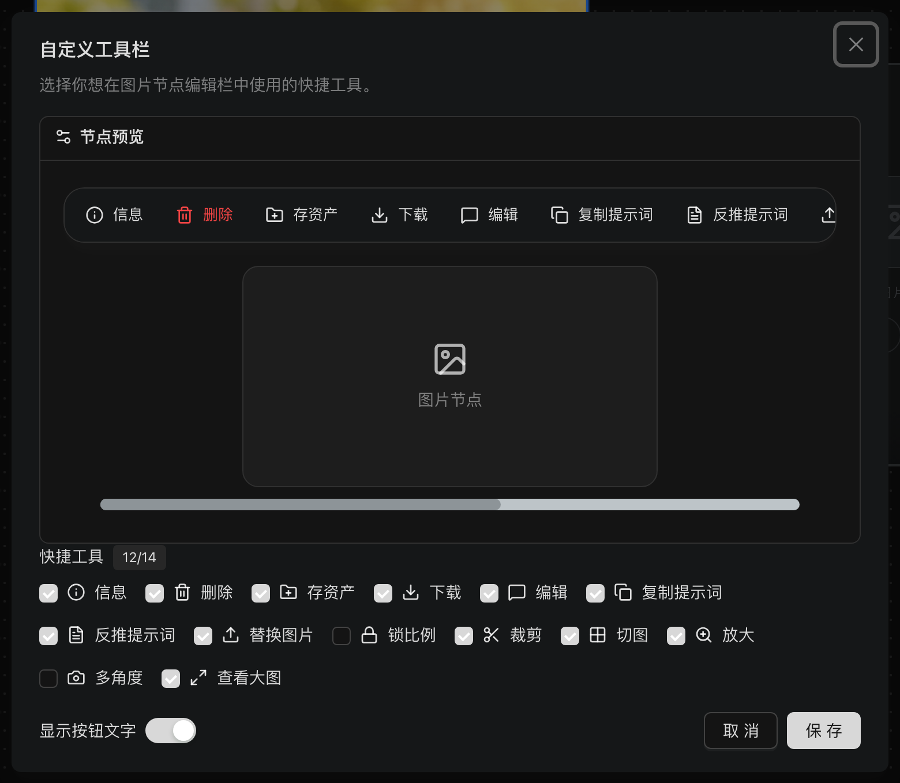
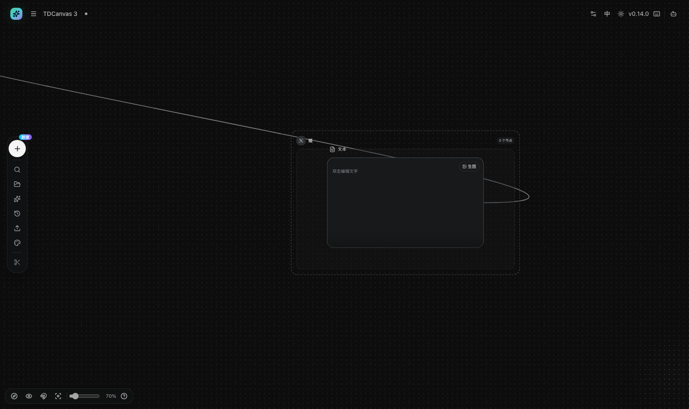
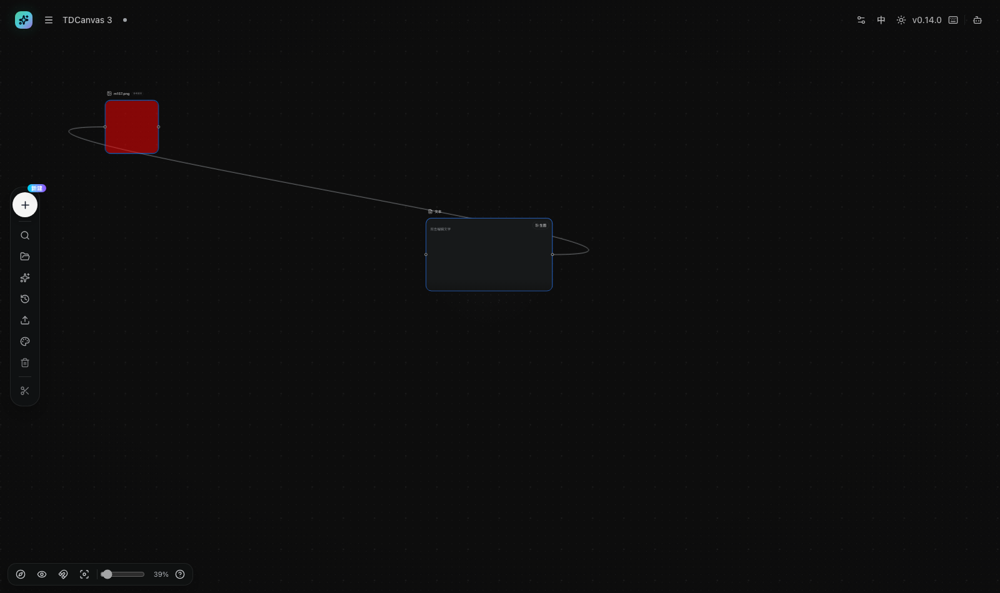
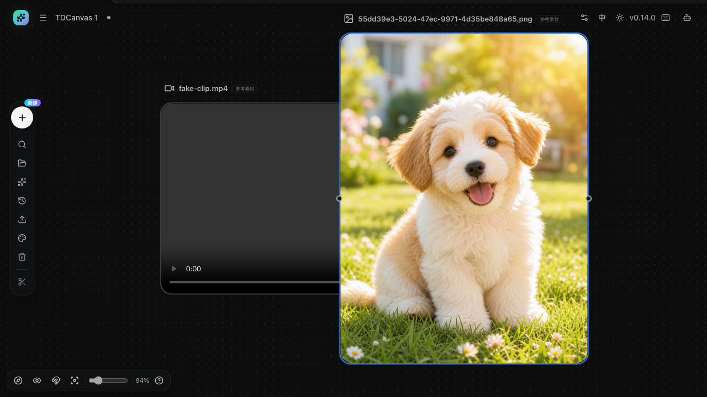
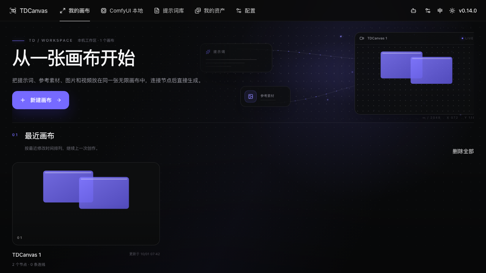
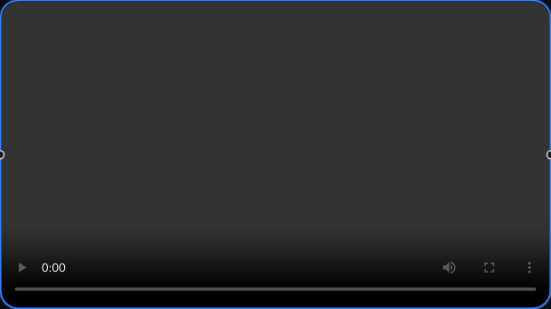
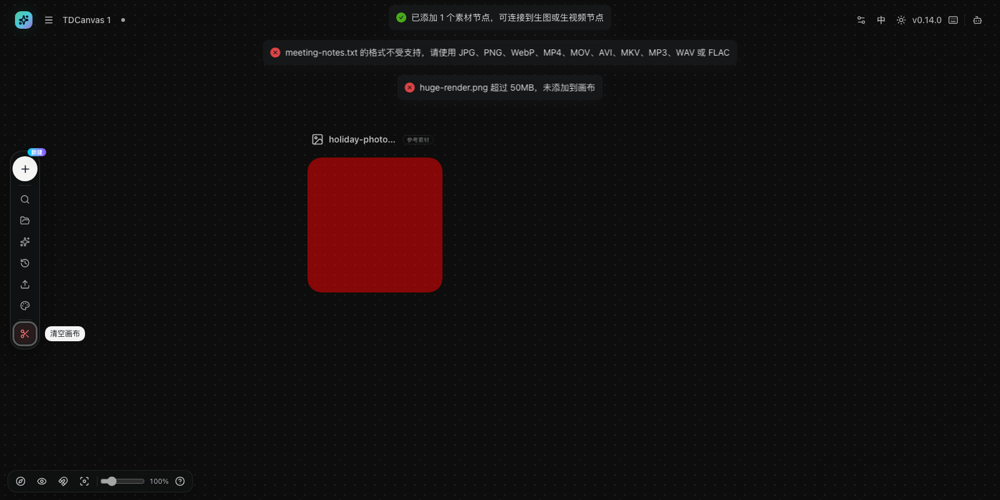
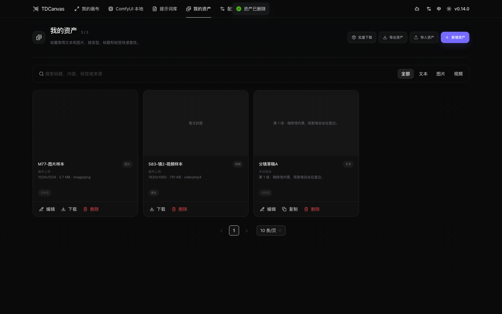
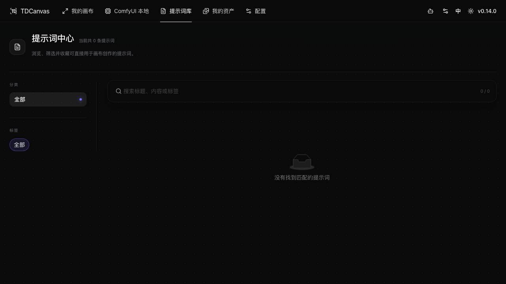

## 怎么用这一页

先判断你遇到的是**故障**还是**产品当前的既定行为**——这两类的处理方式完全相反：故障要修，既定行为只能绕行。TDCanvas 里最常见的困惑其实属于后者，硬按「故障」去查会越查越乱。

| 你看到的 | 属于 | 怎么办 |
|---|---|---|
| 提示词库显示「当前共 0 条提示词」 | 既定行为 | 改用「我的资产」手动录入 |
| 视频资产卡上没有「编辑」按钮 | 既定行为 | 只能删除后重新添加 |
| 首页项目封面不是画布里的图片 | 既定行为 | 用生成功能产出一张图即自动更新 |
| 视频节点全黑、时长 0:00 | 故障 | 文件格式与扩展名不符 |
| 悬浮工具条不见了 | 故障（可自愈） | 多选了，或节点贴边——见下方两条 |
| 画布上的字被覆盖没了 | **数据丢失** | 立刻停止刷新，用「撤销」找回 |

「资产与提示词库类」和「视图与操作类」两节的多数条目属于第一种——它们不是坏了，而是这个版本就这样。

## 内容丢失类

### 画布不见了 / 打开后跳回首页

> **对着图看**：画布没了之后你落在这里——「最近画布」区**不是一片空白**，而是一张完整的空态卡：左边一个加号方块，标题写着「**还没有画布**」，下面一行「新建一个画布后，就可以独立保存节点、连线和画布外观。」
>
> **但这恰恰是最容易误判的一步**：这张卡**只由「项目数为 0」触发**（`web/src/pages/canvas/index.tsx` 里就是 `sortedProjects` 的 `else` 分支，文案取 `canvas.empty` 与 `canvas.emptyDescription`）——**应用不记得你删过什么**，所以「你把画布删了」和「你从来没有画布」看到的是**同一句「还没有画布」**。
>
> > **⚠️ 2026-10-04 M211 订正本段两句。** 原文写「最近画布区**一片空白**」与「这张图和别的画布列表**长得一样**」——**两句都错**：那张卡有标题、有说明、有图标，**和有画布时那些项目卡片长得完全不一样**。
> > **分不出来的不是「空态像列表」，而是「删除之后的空态和初始空态是同一句」**——**这两件事差得很远**：
> > - 若按原文，读者会以为「界面上什么线索都没有」，于是**不会注意到那句「还没有画布」**；
> > - 实际上**读者在排障时唯一能看到的、也正是那句话**，它明说「现在是空的」（`emptyDescription` 还补了「新建一个画布后…」）。
> > **一个排障条目把可观察的线索写成「没有线索」，比不写更糟。**

- **原因**：**这个菜单项没有任何确认弹窗**（2026-10-01 实测：`role=dialog` 数量为 0，点击后 URL 直接变为 `/canvas`，节点归零）。源码对应 `project.tsx:1264` 的 `deleteCurrentProject`，直接 `deleteProjects()` 后跳转；首页卡片删除走的是另一条实现（`CanvasDeleteProjectsDialog` 确认弹窗），两条路径行为不一致。
- **修复**：**无法恢复。** 删除画布没有回收站、没有撤销，撤销历史随画布一起消失。删除前若导出过 zip，你能拿回的只有里面的**素材文件**（手动解压 `projects/<项目id>/files/` 后重新上传），**画布结构本身救不回来**——这个版本没有「导入画布」功能，而画布 zip 也不能拿给「导入资产」用（实测报「导入失败，请选择有效的资产压缩包」，详见 [project-management.md](10-tasks/project-management.md)）。
- **预防**：
  1. 删除画布**一律回首页从项目卡删**，那里的删除有确认弹窗；
  2. 重要项目删之前先导出 zip——**目的不是备份画布，是抢救素材**（换个说法：把里面的图和视频先存出来）；
  3. 想在**同一台机器**留一份副本，用画布空白处右键的「复制所有节点」+「粘贴」（实测 2 节点 → 粘贴后 4 节点）；换机则只能重搭。

> **为什么这个坑特别深**：画布里几乎所有破坏性操作都能撤销——删节点有历史、清空画布有历史——所以用户的直觉是「画布里按错了也能找回」。但**跳出了这套体系的恰恰是「删除画布」**：它删掉的是承载撤销历史的那个容器本身。产品把最容易误触的红色项放在一个没有护栏的菜单里，这正是本手册要单独记一笔的原因。
>
> **「几乎所有」这句话的边界，现在量过了**（2026-10-03 M187）：画布**里面**的九类操作逐项实测**全部能撤回来**（删节点、清空、多选删、改名、改正文、改字号、拖动、缩放、删连线，详见 [undo-persistence.md](10-tasks/undo-persistence.md#撤销能覆盖什么)）；**但画布自己的名字改不回来**——顶栏双击改项目标题后按 `Cmd/Ctrl+Z` 毫无反应（实测 3/3）。所以「按错了也能找回」这句直觉，**对内容成立、对名字不成立**。删除画布则是另一回事：它连承载历史的容器一起删掉，见上。

### 两个标签页打开同一画布，文字/节点不见了

- **症状**：在 A 标签页输入的内容，切到 B 标签页保存后消失（或反之）。
- **原因**：TDCanvas 自动保存为「后写入覆盖」，同项目多标签同时编辑没有冲突保护。
- **复现步骤**（2026-09-28 实测）：
  1. 标签页 A 打开画布项目，在文本节点输入「我的第一段画布文字，用于开场演示。」并点空白提交；
  2. 标签页 B 打开**同一项目**（此时 B 的内存里还是旧文档）；
  3. 在 B 中做任意一次会触发保存的操作（如选中节点）；
  4. 刷新 A 或 B：后保存一方的内容覆盖先保存方——实测文字内容被清空，节点仍存在。
- **修复**：不要刷新；切回仍保留内容的标签页，用左侧 Dock「历史 → 撤销」逐步找回。
- **预防**：同一画布项目只在唯一标签页中编辑（见 [edit-nodes.md](10-tasks/edit-nodes.md) 已知限制）。

> **为什么会有这个坑**：TDCanvas 的自动保存是「整份文档覆盖写」，没有做多版本合并，也没有加锁。所以在两个标签页里编辑同一个项目，本质上是在让两个进程轮流改同一份文件——**后写的赢，先写的整份被替换**，而不是合并。节点还在只是因为另一方的文档里恰好也有同样的节点；一旦有一方新增或删除了节点，另一方就会把它一起抹掉。把「一个项目一个标签页」当成硬约束，比出事后再撤销省事得多。

### 换了电脑 / 换了浏览器，画布和 API Key 全没了

> **对着图看**：新机器上的首页长这样。**它和「在这台机器上误删了画布」是完全一样的画面**——界面不会告诉你到底是哪一种。
>
> 而 API Key 也要重填，是因为它同样只存在这台机器的浏览器里：

- **原因**：TDCanvas 没有账号，也没有服务器。所有数据都存在**原来那台机器的那个浏览器**里（2026-10-01 实测的键名见 [20-reference.md](20-reference.md#数据与存储)）：画布与资产在 IndexedDB 的 `tdcanvas` / `app_state` 表里，API Key 在 localStorage 的 `TDCanvas` 键里。换浏览器、换设备、无痕窗口关掉、或清理过浏览器数据，这些都会一起消失。
- **修复**：**已经清掉的没法找回**——没有服务器副本，也没有回收站。还在原机器上的话，按 `F12` → Application → IndexedDB → `tdcanvas` → `app_state`，能看到 `tdcanvas:canvas_store` 这条记录，复制它的值可以抢救出画布 JSON，但**这个版本没有导入入口**，粘贴不回去。
- **预防**：
  1. **素材**用「我的资产 → 导出资产」打包，新机器上「导入资产」原样恢复（这一对是完整闭环，实测导出 564 字节 zip → 删除全部资产 → 导入 → 资产全部回来）；
  2. **画布**在删改或换机前先导出 zip，至少把 `projects/<项目id>/files/` 里的图和视频解压存下来；
  3. **API Key** 记在自己的密码管理器里，别只存在这台机器上。

> **说句实话**：这个版本没有云端，也没有跨设备同步。想要「两台电脑随时接着用」，目前唯一可行的办法是**只在固定的一台机器、一个固定浏览器里画布**，并按上面的方式定期导出素材。

### 在设置里找不到「同步」/「WebDAV」/「备份」

- **症状**：想找个地方把画布同步到另一台电脑，在 `/config` 和右上角齿轮里翻遍了，只有 API 密钥表单，什么也没有。
- **原因**：**这个版本没有同步功能。**

> **对着图看**：红框标出的那一整栏就是设置目录，**框里一个可点的东西都没有**（实测 0 个）。所以「翻遍了只有 API 密钥表单」不是你没找到，**是这个版本确实没有**。
 同步代码其实写好了（`services/app-sync.ts` 能把画布、资产和本地媒体文件按 `updatedAt` 双向合并上传到 WebDAV），但这套服务**全仓零调用方**，i18n 里那套「WebDAV 同步」文案也没有任何组件引用——**没有任何界面能触发它**。同理，`channels` / `preferences` / `prompt-sources` / `webdav` 四个设置标签只在类型定义里存在，面板根本没接。
- **修复**：**无**。别再找了——`/config` 左栏那 260 像素宽的区域看着像设置目录，其实整栏 0 个可点元素（实测），点不动是正常的。
  ★ **M210 补一条边界（源码可核）**：`web/src/pages/config/index.tsx:12` 写的是
  `lg:grid-cols-[260px_minmax(0,1fr)]`——**这 260 像素是 `lg` 断点以上的宽度**；
  **窗口窄于 `lg` 时整块变成单列，那一栏并不存在**，「左栏点不动」这个说法也就无从谈起。
  那一栏里只有一个小标题「API」、一个 `h2`、两个段落和一条分隔线，**没有链接、没有按钮、没有表单控件**——
  所以「0 个可点元素」是结构决定的，不是恰好。
- **替代方案**：见上一条「换了电脑 / 换了浏览器」。

> **为什么"源码里有"不等于"你能用"**：这一版里 WebDAV 同步、渠道管理、提示词来源管理都是**实现完成但界面未接线**。它们留在仓库里、注释和文案都齐全，搜源码时会以为功能可用——但用户能走的路径上，这些入口一个都不存在。**以界面上找得到为准**，这是本手册反复强调的一条判断准则。

→ **相关任务页**：[撤销重做与自动保存](10-tasks/undo-persistence.md)

### 想只改图片的一小块（局部重绘 / 蒙版），但找不到入口

- **症状**：想让图片里某个局部变一下（换背景、去掉路人、补一块纹理），在图片节点工具条和「自定义工具栏」弹窗里翻遍，14 个工具逐个看过，**没有蒙版、没有画笔、没有涂抹**。
- **原因**：**这个版本没有上线局部重绘。** 蒙版编辑器的代码是齐的（431 行画笔式界面，能产出 `maskDataUrl`），接口层也支持（`requestEdit` 第 4 个形参就是 mask，以 `formData` 的 `mask` 字段发送），中英文错误提示也都在——但**该组件全仓零 import**，且 `requestEdit` 的**全部 4 个调用点都显式传 `undefined`**，界面上没有任何入口能打开它。
- **修复**：**无**。可用替代：① 若诉求其实是「换个视角」，先在「自定义工具栏」里勾出「**多角度**」（它默认没勾，很多人以为不存在）；② 用「裁剪」把要改的那块单独裁成子节点，在子节点上重新生成；③ 外部工具做好局部重绘后再传回画布。
- **不要做的事**：不用反复找蒙版按钮，也不用为此去改代码里的默认值——这不是设置问题，是这个版本没接上。

> **顺带一提**：图片工具条最右端的「**更多**」按钮（读屏标签「配置快捷工具」）容易被人当成溢出菜单直接跳过，其实它是**工具条自定义面板**，里面藏着默认没勾选的「锁比例」和「多角度」。把它当菜单点一下，可能会错过后面的排查方向。

→ **相关任务页**：[图片处理：裁剪、切图、放大与多角度](10-tasks/image-operations.md)

## 生成类（涉及计费，谨慎操作）

### 参考素材上写着「不参与生成」，提示「N 个素材不符合当前模型的输入要求」

- **症状**：把文本/图片节点连到图片节点后，生成面板的参考素材区出现缩略图，但上面盖着「不参与生成」，面板顶部还有黄字警告。
- **这不是你连错了**，是 v0.14.0 的既有行为：

> **对着图看**：缩略图左上那个黑底「不参与生成」标签，和面板顶部那行黄字警告是**同时出现**的——连线成功建立了，**只是这个素材这一轮不参与**。
连线只负责把素材接进参考素材区；判定「参与生成」要求请求参数里出现 `@Text 1`、`@Image 1` 这类固定写法，而在提示词里用 `@` 选择器插入的引用，序列化时写出的是不带 `@` 的「文本1」，两边对不上，标记就一直亮着。
- **修复**：**把关键内容直接打进提示词框**，这是当前版本唯一可靠的做法。素材节点可以留着当草稿，但别指望连线替你传话。
- **不要做的事**：反复重连、反复 `@` 选择都没用，标记不会消失，这不是你的操作问题。
- 完整实测与截图见 [30-concepts.md](30-concepts.md#连线不等于自动生效)。

### 画布上有些节点「变成了别的样子」

> **对着图看**：左侧面板的节点列表里，**「Config」那一项从此永远是空的**——因为这种节点已经被改写成图片节点了。**要确认提示词没丢，看图片节点下方生成面板的提示词框**：原来那段整段提示词**原封不动**在里面。

- **原因**：这是**升级迁移**，不是损坏。应用在每次打开画布时，会把 `config`（生成配置）和 `aitudou`（AI 土豆任务）这两种历史遗留节点自动改写成当前的图片/视频/音频/文本节点之一。
- **提示词不会丢**：实测改写后，原节点里的提示词会原封不动地出现在新节点的提示词栏里。
- **副作用**：左侧画布面板的类型筛选里那个「Config」选项从此永远是空列表，首页的「N 个配置」也永远是 0——都属于同一原因。
- 说明见 [30-concepts.md](30-concepts.md#两种打不开的节点类型)。

### 点击生成报错 / 没有反应

- **原因 1**：未配置 API Key。到右上角「配置」填写并保存（字段说明见 [20-reference.md](20-reference.md#api-配置-生成功能的前提)）。界面里平台显示为「**AI 土豆**」，代码中叫 Aitudou，是同一个东西。
- **原因 2**：模型下拉为空或模型名不受支持。打开配置弹窗拉取模型列表，或手动填写模型名。
- **注意**：点「停止」只停止本地等待，远端任务可能继续执行并计费；请到 Aitudou 平台确认任务状态。

→ **相关任务页**：[发起图片生成并理解任务状态](10-tasks/generate-images.md)

### 生成结果只有一部分成功

- **症状**：批量生成时部分图片成功、部分失败，面板标题行出现英文徽标 `partial`。
- **修复**：打开节点错误详情查看失败项；对失败子图重试。成功图片不受影响（都在图片历史中）。

→ **相关任务页**：[发起图片生成并理解任务状态](10-tasks/generate-images.md)

### 刷新页面后生成任务还在吗

- 在。提交过的任务写入本地日志，重开画布时自动恢复状态（可能显示英文徽标 `stopped`，表示本地不再轮询）。

> **为什么要分清「停止」和「取消」**：这两个词在 TDCanvas 里含义完全不同。「停止」= 本地不再轮询任务状态，**远端该跑完还是跑完，费用照收**；只有在 Aitudou 平台侧真正取消才可能不计费。所以误点了「停止」之后不要重试，先去平台确认那个任务的状态，否则一次手抖就是两次钱。状态表见 [20-reference.md](20-reference.md#生成任务状态)。

→ **相关任务页**：[发起图片生成并理解任务状态](10-tasks/generate-images.md)

## 视图与操作类

### 按住空格拖动不能平移画布

- TDCanvas 不使用空格平移。直接**按住画布空白处拖动**即可；滚轮是缩放。

→ **相关任务页**：[平移、缩放与小地图导航](10-tasks/navigate-canvas.md)

### 把连线拖过去，松手后什么都没发生

- **这不是坏了，是松手位置落在了「死区」。** 从节点输出口拖出的线，**松手位置决定结果，而且其中一种是彻底静默**：没有连线、没有菜单、没有任何提示，线就是消失了。
- **2026-10-02 M112 逐一实测的四种落点**：

  | 你把线松手在 | 结果 |
  |---|---|
  | 远离所有节点的空白处 | 弹出「引用该节点生成」菜单 ✅ |
  | **目标节点身上（任意位置，不必瞄准端口）** | **直接连上** ✅ |
  | **源节点自己身上** | **什么都不发生** ❌ |
  | **节点框外约 32 个画布单位以内** | **同样什么都不发生** ❌ |

- **怎么判断自己踩的是哪一种**：如果松手处**离某个节点很近**（在节点身上，或紧贴着它），那就是死区；**往那个节点身上再靠一点**就能连上。如果线是**拖回了自己出发的那条线上**，那也是死区。
- **想要弹菜单**：把线拖到**明显远离一切节点**的地方——贴着某个节点松手是弹不出来的。
- **顺带一条好消息**：连普通节点时**不用瞄准那个小圆点端口**，拖到目标节点的**任意位置**松手都能连上（实测拖到节点正中心同样建线成功）。

→ **相关任务页**：[连线引用与无线引用](10-tasks/connect-references.md)

### 滚轮滚动的是页面而不是缩放画布

- 鼠标需位于画布区域内；左侧 Dock、顶栏和弹层上的滚轮不会缩放。

→ **相关任务页**：[平移、缩放与小地图导航](10-tasks/navigate-canvas.md)

### 图片节点想自由变形，工具条上找不到「锁比例」

- **症状**：想把一张图拉成任意比例，拖角点时高度死死跟着宽度走；在工具条上翻来覆去找「锁比例」「自由缩放」这类按钮，**一个都没有**。
- **原因**：**它默认不在工具条上。**

> **对着图看**：弹窗里一共 **14 项**，而「**锁比例**」和「**多角度**」**都没勾**（右上角写着 `12/14`）。所以它在列表里、只是没被勾上——勾上就出现在工具条上。
>
> **2026-10-03 M197 双读数复核**：枚举弹窗里的复选项得 **14 项、已勾 12 项**，未勾的正是「**锁比例**」与「**多角度**」；而**弹窗自己右上角写的 `12/14` 与我数出的完全一致**——**两处独立读数对齐才算站住**，只数一遍容易把「还没渲染完」当成「默认没勾」。
 图片工具条共 14 个可用工具，默认只勾了 12 个，没勾的正好是「**锁比例**」和「**多角度**」（2026-10-01 实测：弹窗标题写「自定义工具栏」，计数行显示「快捷工具 12/14」，这两项复选框未勾选）。
- **修复**：选中图片节点，点工具条最右端的「**更多**」（读屏标签是「配置快捷工具」）——**这一步就直接弹出「自定义工具栏」窗口，中间没有一层菜单**，在窗口里勾上「**锁比例**」，再点「**保 存**」。工具条会在「替换图片」和「裁剪」之间多出该按钮（勾选后 localStorage 的 `ids` 数组里出现 `resize`，实测计数变为 13/14）。选择只存在本机浏览器，换设备不跟着走。
- **看到「锁比例」别当成动作**：按钮上的字是**当前状态**，关着时就是锁着的；鼠标悬停出的提示才是下一步动作（关着时提示「切换为自由比例」）。
- **视频节点没有这个开关**，恒为等比缩放。

> **本手册此前写错过这个按钮的名字**（写成不存在的「自由缩放」）**且没提要先勾出来**，已订正，详见 [edit-nodes.md](10-tasks/edit-nodes.md#缩放节点大小)。

### 节点明明在组的虚线框里，徽标却还是「0 个节点」

> **对着图看**：虚线框**确实把节点整个包住了**，框顶那一行的徽标写的是「**0 个节点**」——**位置对了，身份没给**。这张图是 M165 实拍的：先建组、把节点挪到组外、再**拖动组**去框住节点，全程**节点一次都没被拖过**，所以徽标一直是 0。

- **症状**：你在组的上方建了个节点，它**看起来就落在虚线框里面**，可右上角徽标死死写着「0 个节点」。拖动组框时它也不跟着走。
- **原因**：**"落在框里"不等于"是成员"——必须真的拖过它一次。** 成员身份是在**你松手那一刻**才判定的，而且只看**节点中心点**是否落在组框内（2026-10-02 M101 实测对照：同一个组 760×480，节点中心点确实在框内，**不拖**时连读两次徽标都是 0；在框内平移一下松手后再读就是 1）。
- **为什么会误以为坏了**：新建节点的默认位置是画布视图**正中**，只要组建在视图中间附近，新节点就会自动"出现在框里"——**看起来已经归组了，其实一次都没判定过**。界面上没有任何提示告诉你"这个还没入组"。
- **修复**：**用鼠标拖一下这个节点再松手**，徽标立刻变成「1 个节点」。拖进框里、或者只在框内挪几像素，效果一样。
- **顺带知道**：入组判据是**中心点**，不是整块塞进去。节点一大半露在框外，只要中心点在框内就算数。

> **源码口径**：`project.tsx:1407` 的 `findContainingGroupId` 只在**节点拖拽的 mouseup 回调**里调用，且以 `dragRef.current.hasMoved` 为前提；`canvas-node-geometry.ts:49-58` 的实现确实只比较中心点。完整说明见 [organize-canvas.md](10-tasks/organize-canvas.md#分组-把节点圈进「组」)。

### 把一个组拖到另一个组上之后，两个组的徽标都变了

- **症状**：你把组 A 挪到组 B 上（原以为 B 会把 A 收进去，或者什么都不该发生），结果 **A 的徽标少 1、B 的徽标多 1**。接着拖 B，**只有一个节点跟着走**，组 A 和它剩下的节点**纹丝不动**。
- **原因**：**组不会被套进另一个组，但成员会"改投"。** 拖组时成员跟着一起移动，移动过程中每个成员的归属重新判定——**中心点同时落在 A、B 两个框内**的成员会改投到另一个组去（2026-10-02 M102 实测：起点 A `2`、B `0`，拖后 A `1`、B `1`，合计守恒、减的是 A）。
- **为什么更迷惑**：直觉是"组套组了"，于是理所当然地以为拖 B 会连 A 一起拖走。实际拖 B 只会带走那**一个**改投过去的成员。
- **修复**：**把两个组挪开，不重叠**。实在重叠了，把组拖开后各自再拖一下成员，归属就会各自归位。不想动布局的话，对那个"改投"的成员单独拖一下也能改回来。
- **别误判成 bug**：这不是界面故障，是归属按几何重算的结果。界面上确实**没有任何提示**告诉你成员的归属变了。
- **★ 拖空的那个组不会触发任何变化**（2026-10-03 M169 补测）：把**空的**组 B 拖到装满成员的组 A 上，**A 的徽标不动、B 也不涨**——试了六种位置，无一例外。**只有「被拖动的那个组」里的成员才会重新判定归属**。所以如果你拖了半天两个数字都没变，多半是你拖错了那一个：得**拖着有成员的那个组**去重叠，才看得到变化。
- **★ 徽标上的数字取决于你叠了多少，不是固定的**（2026-10-03 M168 补测）：上面那组 `A 2→1 / B 0→1` 是**部分重叠**时的数。把 A **精准叠在** B 上（两框完全重合）再测，得到的是 **`A 2→0 / B 0→2`**——两个成员全改投了。两次的**合计都守恒**（都是 2），机制一致，只是几何不同。**所以你看到的数字和上面这行不一样，多半不是出了别的故障**，先看两个框叠到了什么程度。

> **源码口径**：`findGroupDropTarget` 一旦发现移动集合里有组就返回 `null`（所以组进不了组），而兜底分支只对**非组**节点重算归属——这就是"合计守恒但 A 掉 1"的来源。完整说明见 [organize-canvas.md](10-tasks/organize-canvas.md#两个组重叠时-徽标会莫名变化)。

### 删掉组，里面的节点也跟着没了？

- 不会。**删组只删那个虚线框，成员节点原地留下**，只是从此不属于任何组；撤销还能把组和归属一起恢复。详见 [organize-canvas.md](10-tasks/organize-canvas.md#删掉组-里面的节点不会被一起删掉)。

### 悬浮工具条不见了（选中了不止一个节点）

> **对着图看**：左右两个节点**都带着蓝色选中边框**（说明确实选中了），但**它们上方一条工具条都没有**。留意左侧图标条——多选时那里**多出一个垃圾桶**（删除选中），这是「现在是多选」唯一的界面线索。**没有工具条不是坏了，是这个版本只服务单选。**

- **症状**：刚才还好好浮在节点上方的工具条，**点了几下别的节点之后整个消失了**。节点明明是选中状态（蓝色边框），却找不到任何按钮。
- **原因**：**这个版本的工具条只服务"单选"**。选中 2 个及以上节点时它就不显示（2026-10-01 实测：单选 1 个时有 8 个按钮，`Shift` 追加选中第 2 个后工具条整个消失）。
- **为什么会误以为坏了**：追加选择是"不知不觉"发生的——你 `Shift` 点错了，或者框选时圈进了两个，本单选状态就变成了多选，而界面上**没有任何提示告诉你选中了几个**。
- **修复**：点画布空白处取消选择，再点**一个**节点。只想要一个的话，`Shift` 是在往里加选、再点一次同一个节点可以减掉。
- **顺带知道一件事**：多选状态下这个版本**没有批量编辑**——右键菜单和单选一样只有「复制 / 删除」，改名字、改尺寸都得一个个来。详见 [edit-nodes.md](10-tasks/edit-nodes.md#选中多个节点时-工具条会消失)。

### 悬浮工具条被屏幕边缘裁掉一截

- **症状**：节点选中后本该出现在节点上方的悬浮工具条不见了，只在屏幕边缘露出一条细边。

*实测（2026-10-01 初测，2026-10-02 M108 复核，2026-10-03 M160 二次订正）：把图片节点顶到画布最上缘并选中，悬浮工具条会整体滑到画布可视区之外。**这条经过两轮订正**——第一轮改对了「工具条不是 48px」，但**把顶栏高度和预防值都改错了**，第二轮才查实（见下）——*

> **⚠️ 第二轮订正（M160）：上一轮那条订正里有两个数字是错的，而且错法一模一样——源码引用指到了另一个组件。**
>
> - **画布顶栏是 64px**。运行时实测顶栏 `y=0`、高 `64`；源码在 `canvas-top-bar.tsx:70`，类名是 `h-16`。**上一轮写的那个类名确实存在，但长在 `app-top-nav.tsx:101`，那是「工作区」那一层的顶栏，不是画布页的**。查 `git log` 确认 `h-16` 自首个提交起从未改过——**也就是说这个错不是版本漂移，是当初就取错了证据**。**「源码里找得到」不等于「就是这个东西的」**。
> - **节点上方其实有三条浮层，不是两条**，而且上一轮认定的「第二条」也不是读者关心的那条：
>
>   | 浮层 | 实测 | 何时出现 |
>   |---|---|---|
>   | **工具条**（13 个按钮那排） | 高 **48px**，顶边在**节点顶边上方 104px**（**仅 100% 缩放、且节点是图片/视频/音频/文本这四类**——见下一条的公式） | 节点被选中时 |
>   | 节点名 | 高 **27px**，在节点顶边上方 **40px** | 总是 |
>   | 历史版本胶囊 | 高 **32px**，在节点顶边上方 **39px** | **仅图片节点有 ≥2 个版本时** |
>
>   上一轮量到的「上移 39px、高 32px」是**历史版本胶囊**，它在本文这两种条件下根本不渲染；而**真正会被顶栏盖住的那条 13 按钮工具条，上一轮压根没量到**。
> - **工具条顶边的 104 是怎么来的**：源码 `canvas-node-toolbar-position.ts` 把锚点放在 `节点顶 − (48×缩放 + 8)`，而工具条本身高 48 且用 `-translate-y-full` 整体上移。**104 是这两项在 100% 缩放下相加的结果**——但**偏移量本身不是 104 这个常数**，下一段专门讲这件事。
>
> **⚠️ 第三次订正（M255）：那个 `48` 前面还有一个三目运算，手册一直只写了真值那一支。**
>
> 源码那一行的完整写法是 `const titleClearance = (isNativeWorkbench ? 48 : 36) * viewport.k + 8`，
> 而 `isNativeWorkbench` 只认**图片 / 视频 / 音频 / 文本**这四类。**其余节点类型走 36**——目前能建出来的就是**组**。
> ★ 而 `pages/canvas/project.tsx:634` 的 `toolbarNode` 是「**恰好选中一个节点**」，**不按类型过滤**，
> 所以组节点单选时**照样弹出这条工具条**，36 那支不是死代码。
>
> **两条独立读数**（2026-10-05 M255，1600×1000 无头浏览器，偏移 = 节点顶边 − 工具条顶边）：
> | 节点类型 | 100% 缩放 | 50% 缩放 | 工具条实测尺寸 | 按钮数 | 对应的公式 |
> |---|---|---|---|---|---|
> | 图片（原生四类之一） | **104** | **80** | 1285×48 | 13 | `48×缩放 + 56` |
> | **组 Group** | **92** | **74** | **174×48** | **2** | `36×缩放 + 56` |
>
> **四个数逐个落在各自那一支的公式上，零偏差。** **顺带量到一件对读者更有用的事**：
> 组节点这条工具条只有 **2 个按钮**（查看节点信息、移除节点）、**宽 174px**，而图片节点是 **13 个按钮、宽 1285px**——
> **工具条的宽度跟着内容走、不是固定长条**，所以「节点上方那排」在组节点上是一条很短的小条，**别按长度认它**。
>
> **⚠️ 再订正（M163）：「104 会跟着缩放走」是错的，偏移并不按比例。**
>
> 工具条是渲染在画布变换层**之外**的（源码里它在 `</TDCanvasSurface>` 之后），
> **它自己那 48px 高度不随画布缩放变**。所以偏移量是 **`48×缩放 + 56`**，不是 `104×缩放`。
> （**这个 48 只对原生四类成立**；组节点是 `36×缩放 + 56`，见上面 M255 那条。）
>
> **实测坐实（M163，九档缩放逐点测；测的是图片节点）**：
>
> | 画布缩放 | 25% | 40% | 60% | 80% | 100% | 130% | 160% | 200% | 300% |
> |---|---|---|---|---|---|---|---|---|---|
> | 偏移实测 | 68 | 75.2 | 84.8 | 94.4 | 104 | 118.4 | 132.8 | 152 | 200 |
> | 若按比例该是 | 26 | 41.6 | 62.4 | 83.2 | 104 | 135.2 | 166.4 | 208 | 312 |
>
> **九档与 `48×缩放 + 56` 的偏差全是 0**；而「按比例」那一行在 100% 以外**每一档都错**。
> **方向也是反的**：缩放越大，需要留的空白**越多**（`48×缩放` 那一项在变大），
> 不是「缩小了要按比例放大」那么简单。
>
> **顺带一件对读者更有用的事**：这九档里**工具条始终是 48px 高、1285px 宽，一档都没变**，
> 变的是节点本身（25% 时只有 55px 宽）。**也就是说把画布缩小，工具条不会跟着变小**——
> 缩到 25% 时它比节点宽 23 倍。**「调小画布好让工具条别挡」这个想法不成立。**
>
> **实测坐实（M160）**：把同一个有图图片节点依次拖到 8 个不同的顶端位置，每拖一次都重新选中、重新读工具条位置：
>
> | 节点顶边 | 10 | 60 | 110 | 150 | 160 | **168** | 175 | 200 |
> |---|---|---|---|---|---|---|---|---|
> | 工具条顶边 | −94 | −44 | 6 | 46 | 56 | **64** | 71 | 96 |
> | 完全在顶栏之下？ | 否 | 否 | 否 | 否 | 否 | **是** | 是 | 是 |
>
> **八点逐位落在「节点顶 − 104」上，零偏差**；而临界点精确落在**节点顶 = 168**（工具条顶边正好等于顶栏底边 64），再往下 8px 的 160 就被盖掉 8px。
>
> **所以预防值从「至少 50px」改成「至少 168px」**——原值差了三倍多。**它是从一个错的顶栏高度推出来的，所以错得不随机、错得很整**。
>
> **仍未验证的**：初版描述的「只剩底部 6px 细边」这个具体像素数，两轮都**没有复测到**（工具条整体在屏幕外时，屏幕上确实什么都不剩，「细边」指的是贴着屏幕边缘的那一截，两轮都未逐像素确认）——**如实记为未验证，不改写**。

- **原因**：工具条固定渲染在**节点上边缘之外**的位置（顶边恒在节点顶上方 104px，**100% 缩放、且节点是图片/视频/音频/文本这四类**；**组节点是 92px**，见上文 M255 第三次订正），**它是画布坐标里的固定偏移，不跟随画布边界收缩，也不跟随视口缩放而重算位置**。所以节点离画布顶部越近，工具条被顶栏盖掉得越多；同理，节点贴着左右两侧时工具条也会伸出屏幕。顶栏是**浮在画布之上**的一层（高 64px），不是把画布往下推的。
- **修复**：把节点向画布中心方向拖一段，工具条立刻恢复。这是布局问题，**不会丢数据**。
- **预防**：批量摆放节点时给画布上方留出足够空白，**要留多少按你当前的缩放算**——临界值是 **`120 + 48×缩放系数`**（缩放 100% 时是 168px，M163 九档实测反推并与源码式一致）。**画布放大反而要留更多**（200% 时是 216px），缩小才少留（25% 时是 132px）；用「重置视图」把选中节点拉回画面中心也一样。
  **组节点另算一条**：它是 **`120 + 36×缩放系数`**，100% 时是 **156px**（比四类少 12px）。**两种都记不住就用大的那个**，多留 12px 没有代价。

→ **相关任务页**：[编辑节点：重命名、改文字、缩放与信息面板](10-tasks/edit-nodes.md)

### 点了左侧 Dock 的「+」，什么都没出来

- **症状**：点左侧竖栏最上面那个大圆钮（「添加节点」），**按钮确实变成了「✕」，但屏幕上没有弹出任何菜单**。往它右边看，只有左侧那块「画布 / 资产 / 提示词库」的面板。菜单里的七项一个都点不到，因为**它们根本不在你能点到的那一层上**。
- **原因**：**左侧节点面板默认是开着的**，而它和 Dock 的飞层**横向完全重叠**（2026-10-05 M255 实测）。面板占住 56–336 这段横坐标，而「添加节点」菜单是 88–300、「画布外观」74–322、「历史」74–294——**三个全在面板底下**。源码里面板那层的定位是 `absolute left-14 z-[60]`（`canvas-side-panel.tsx:96`），Dock 那一层是 `z-50`，**面板层级更高**。至于为什么默认是开的：`stores/use-canvas-side-panel-store.ts:19` 写的是「**只有 localStorage 里明确记着 `0` 才算关**」，所以新装、清过缓存、换浏览器都是开着。
- **这不是坏了，是被挡住了**：面板开着时菜单**确实打开了**——「+」变成「✕」就是证据。**看到这个 ✕ 却找不到菜单，按「被挡住」处理，不用重装也不用刷新。**
- **修复**：三条任选。
  1. **双击画布空白处**——同一份七项清单，标题写作「选择节点」，它是浮在面板之上的，**点得到**（推荐）。
  2. **先把左侧面板收起来**再点「+」：点 Dock 里的「搜索节点」（放大镜）能切换它开合。
  3. 画布完全为空时，点中央那排芯片（只有五项）。
- ★ **三个飞层都是这样，M259 已把它们逐一实测**（2026-10-05）：默认状态下
  **三个飞层里的 12 个按钮一个都点不到**（添加节点 **0 / 7**、画布外观 **0 / 3**、历史 **0 / 2**），
  **收起面板后 12 / 12 全部可点**。
  ★ **一句话记住这件事：「点得开」不等于「点得动」**——
  三个 Dock 按钮自己都点得动（**它们靠左，落在面板的 x=56 左边**），
  **而它们开出来的飞层整块都在面板底下**。
- ★ **这一下不是打空气**：默认状态点「历史」里的「撤销」，落点是
  **侧面板节点索引里的一个节点标题**（`SPAN.block.truncate`）——
  **它落在别的东西上，而那个东西自己是有行为的**。
  ★ **点下去之后具体会发生什么，本轮没有验，如实记为未验证**；
  但「这一下打在别处、而不是根本没打着」这件事是读数坐实的。
- **★ 拖窄面板能不能解决？不能——这条两批记为「未验证」的，本批测完了，答案是行不通**（2026-10-05 M260 实测，R112）：
  - 面板**有**拖宽把手（`canvas-side-panel.tsx:131`），**而且它真拖得动**——但**只有内侧那一小段拖得动**，见下面第 377 行那条订正。
  - **宽度区间实测是 220 – 480**（默认 280）：往左拖 600 和往左拖 300，**都停在 220**，**再窄它不让了**。
  - ★ **关键在于左缘是钉死的**：面板**始终从 x=56 起**，**挪不走**。
    收到最窄时右缘只从 **336 退到 276**，而三个飞层占 88–300 / 74–322 / 74–294——
    **重叠从 220px 只降到「还是全覆盖」**：飞层内 12 个按钮里**只有最右边那几个可能露出来**。
  - **所以结论是：想用飞层或缩放条，就只能把面板整个收起来，没有「拖窄一点」这条中间路。**

→ **相关任务页**：[创建画布项目并认识工作区](10-tasks/create-canvas-project.md)、[核心概念](30-concepts.md#节点-画布上的一切)

### 点「画布外观」里的「深色」，主题切不过去

- **症状**：点左侧「画布外观」，飞层弹出来了（标题就写着「画布外观」），里面有两个主题按钮；
  你点了「深色」或「浅色」，**主题一点没变**。关掉面板再打开、刷新页面，都还是原来那个配色。
  ★ **最容易把人带偏的是**：飞层**自己也不变色**，
  于是很像「点了但界面没刷新」——**而实际上那一下压根没落在按钮上**。
- **原因**：**左侧节点面板默认开着，而它整个盖住这个飞层**（2026-10-05 M259 实测，R111）。
  飞层占 **x 74–322**、面板占 **56–336**，**横向重叠 248px**，
  **飞层里 3 个按钮在默认状态下 0 / 3 可点**；收起面板后 **3 / 3**。
  ★ **行为也验过一遍**：默认状态点那个位置，主题 **`dark → dark`（没变）**；
  收起面板后点**同一个坐标**，主题 **`dark → light`（真变了）**。
- **修复**：**先收起左侧节点面板**（点 Dock 里「搜索节点」的放大镜）再点主题，**立刻生效**。
  ★ **更省事的办法**：**直接用顶栏右侧那个日亮 / 月亮按钮**——它在顶栏，不受这块面板影响。
- **别被另一句话误导**：外观面板「切完要关掉再打开才看到新配色」**这句话本身没错**，
  **但它假设那一下点中了**。**点不中的时候，关掉再打开看到的还是原来的配色**——
  **这不是显示延迟，是根本没切。**
- **预防**：**左侧面板开着的时候别从飞层里改设置**；要么先收面板，要么走顶栏的入口。

→ **相关任务页**：[分组、外观与画布整理](10-tasks/organize-canvas.md)、[核心概念](30-concepts.md#主题与画布外观)

### 左下角一排按钮点不动（缩放、网格吸附、重置视图、快捷键全都失灵）

- **症状**：左下角那一排里，**「打开小地图」能点开，其余五项全部点了没反应**——缩放滑杆拖不动、「重置视图」按了画面不动、「网格吸附」按不出磁铁图标、「隐藏连线」关不掉、「快捷键」弹不出帮助。**按下去的时候鼠标没有变成手型。**
- **原因**：**它们被左侧那块节点面板盖住了**（2026-10-05 M257 实测，R110）。
  左下缩放条占 **x 12–309**，面板占 **x 56–336**，**横向重叠 253px**；面板那层是 `z-[60]`、缩放条是 `z-50`（源码 `canvas-side-panel.tsx:96` 与 `canvas-zoom-controls.tsx:40`）。
  ★ **面板默认就是开着的**（`stores/use-canvas-side-panel-store.ts:19` 的 `initialOpen()` 只在 localStorage 明确记着 `0` 时才算关）。
  ★ **只有「打开小地图」幸免**，因为它的中心在 x=33，落在重叠区左边——**越往右的越先被吃掉**。
- **同一原因还有另外两处**：左侧 Dock 的三个飞层菜单（添加节点 / 画布外观 / 历史）也是被它盖住的（见上面那条），
  **默认状态下三个飞层里的 12 个按钮一个都点不到**（M259 实测，R111）。
  ★ **而「面板自己的宽度拖动把手也点不到」这句话是错的，本批已订正**——
  **把手是拖得动的，只是只有内侧那一小段拖得动**（R112，见下）。
- **修复**：**先把左侧节点面板收起来**——点 Dock 里的「搜索节点」（放大镜）能切换它开合，收起来之后六项**全部恢复**（实测 6/6 可点）。**顶栏的键盘图标不受影响**，想看快捷键可以直接用它。
- **预防**：**记住「左下角这一片的控件按 x 从小到大排，面板从 x=56 开始吃」**——面板一打开，先靠左的那几个还在，越往右越先失效。**要连续用这几个按钮，就把面板收着。**
- **顺带排除一个误会**：**左侧 Dock 那 8 个按钮（单选时 9 个）全部点得到**，实测两种面板状态下都是全通——**它们没被盖住，因为按钮中心在 x=40**。「收面板之后 Dock 也坏了」是不成立的。
- **★ 这条「未验证」本批测了，答案是「拖窄没用」**（2026-10-05 M260 实测，R112）：
  **拖宽把手是真拖得动的**（从内侧 2px 处拖 +100，面板宽 280 → 380，**拖回去复原 280**），
  **而宽度下限是 220**——左拖 600 与左拖 300 **都停在 220**。
  收到最窄时面板占 **56–276**，缩放条占 **12–309**，**重叠仍有 220px**：
  **「隐藏连线 / 网格吸附 / 重置视图 / 缩放滑杆」这四个照样在面板底下**（它们中心在 x 51 / 85 / 119 / 160）。
  ★ **面板左缘钉死在 x=56，挪不走，所以没有第三条路——只能收起。**
  ★ **顺带一条踩坑**：**试拖把手前记得取样点要落在视口内**——
  把手高 830，顶栏下沿约 70，**写成「顶 + 高 × 2」会得到 y≈1730（视口只有 1000）**，
  而 `elementFromPoint` 越界一律返回 `null`，**于是读数「全 null」、拖拽也等于在空气里拖**。
  **本批第一版就是这样白跑一轮的**——**「读数全 null」先怀疑取样点坐标，别急着下结论。**

→ **相关任务页**：[快捷键与帮助](10-tasks/shortcuts-help.md)、[创建画布项目并认识工作区](10-tasks/create-canvas-project.md)

### 画布空空的，可左侧面板写着「画布元素 5」

- **症状**：画布上**一个节点都看不见**，看着像被清空了；但点开左侧「搜索节点」，面板顶部明明写着「**画布元素 5**」。刷新页面没用，撤销也没得可撤——**因为东西一直都在**。
- **原因**：**画布只画「当前视野 + 一圈缓冲」里的节点**。节点跑到视野之外就不会被渲染出来（源码 `pages/canvas/project.tsx:617` 的 `visibleNodes`，缓冲是视野四周各 280 个世界坐标单位）。**这是性能优化，不是丢数据。**
- **先对账再动手**：**想知道画布上到底有几个节点，读左侧面板的「画布元素 N」**，那才是真值。**别靠「画布上看起来有几个」判断**——节点一旦跑到视野外，这个数就是错的。
- **修复**，两条，第二条最快：
  1. **点左下角「重置视图」**，视野自动缩放到刚好容纳全部节点。★ **但面板默认开着时这个按钮点不动**——它被左侧节点面板盖住了，**得先点 Dock 里的「搜索节点」（放大镜）把面板收起来**（见上面那条）。
  2. **点开小地图找它**：小地图画的是**全部节点**，视野外的也在上面；点它一下，视野就跳过去。★ 它是左下角那排里**默认状态下唯一点得到的按钮**，所以面板开着时这条依然走得通。
- **预防**：**把节点尽量放在画布中部**（边角被小地图和左侧面板占着），跑远了用小地图或重置视图找回来。
- ★ **写脚本的也适用**：自动化里 `document.querySelectorAll('[data-node-id]').length === 0` **同样不等于画布是空的**——`[data-node-id]` 只标在**被渲染出来的那部分**节点上。详见 `PUBLISH.md` 的 F79。

→ **相关任务页**：[平移、缩放与小地图导航](10-tasks/navigate-canvas.md)、[分组、外观与画布整理](10-tasks/organize-canvas.md)

### 快捷键按了没反应

- 焦点在输入框/文本域中时快捷键不生效；先点击画布空白处再操作。
- 自动化脚本环境（无头浏览器）下部分组合键可能无法送达，属环境限制。

→ **相关任务页**：[快捷键与帮助](10-tasks/shortcuts-help.md)

### 生成到一半刷新了页面，节点变成「生成失败」

- **症状**：生成过程中刷新了页面（或关了标签页再回来），节点上写着「**页面刷新后生成已中断，请重新生成。**」，下面有两个按钮：「查看完整错误」「重试」。
- **这是既定行为，不是坏了**：**画布上只要有节点停在「生成中」，下次打开这个画布时它就会被判为中断**，状态直接变成失败。2026-10-03 实测：把一个图片节点手工置成「生成中」再刷新，得到的正是这句提示。源码是 `web/src/lib/canvas/canvas-generation-helpers.ts:247` 的 `resetInterruptedGeneration`，由 `web/src/pages/canvas/project.tsx:375` 在**每次打开项目**时调用；它只碰「生成中」的节点，其他状态一律不动。
- **修复**：点节点上的「**重试**」重新发起。**注意重试会重新计费**——中断掉的那次和重试这次是两次。
- **预防**：等长任务时别刷新、别关标签页。想看进度就别开新画布，**在同一个画布里编辑别的节点**是可以的。
- **「查看完整错误」时有时无**：这个按钮**只在确实有错误详情时才出现**。2026-10-03 实测：把错误详情清掉，这个按钮立刻消失，而「重试」还在。**所以看到「重试」却没看到「查看完整错误」，不是被挡住了，是这次失败没留下详情。**
- **没有验证到的部分**：源码里另有一条更温和的分支，会把任务改成「已停止」并提示「可从节点恢复查询」。**本手册没能让任何节点走到那条分支**（手写的 `aitudou` 节点会在同一次打开流程里先被改写成普通媒体节点），而且它需要一次真实提交过的任务才能确认。**不代你花钱，所以不下结论**——如果你实际遇到了「刷新后还能恢复查询」的情况，告诉我们。

→ **相关任务页**：[生成与编辑图片](10-tasks/generate-images.md) · [概念：生成任务的生命周期](30-concepts.md#生成任务的生命周期)

### 图片历史里找不到早先的版本

- **症状**：在图片节点上找不到版本历史入口，或者翻不到某张生成过的图。
- **原因**：实测 + 源码确认有三条，缺一不可（2026-10-01）：

  1. **只有 AI 生成结果会进版本历史**。上传的图片、用「替换图片」换上去的图、以及裁剪/切图/放大的结果都**不产生新版本**——实测上传一张图后再「替换图片」，节点右上角的版本入口根本不出现。
  2. **版本数少于 2 时入口不渲染**。源码里有一句 `history.length < 2` 就直接返回空，界面上会干净得像「没有这个功能」，而不是灰掉。**2026-10-02 实测钉死**：同一个图片节点，注入 0 个版本 → 无入口；注入 **1 个** → **仍然无入口**；注入 **2 个** → 入口出现。**别指望"至少能看到自己那一张"**——1 个版本时按钮同样不出现。
  3. **每个节点只保留最近 24 个版本**（`MAX_CANVAS_IMAGE_HISTORY = 24`），更早的会被挤出列表。

- **入口长什么样**：图片节点**右上角**的胶囊钮，上面带着**版本数数字**（2026-10-02 实测：2 个版本时按钮上写「2」，整个按钮 63 × 29）。**鼠标提示是「历史版本」四个字**——⚠️ 此前本手册写的是「鼠标提示写着『打开历史版本，共 N 个』」，**那是错的**：那句话是读屏软件用的 `aria-label`，不是给人看的浮层提示。点开后是三列网格，标题「历史版本」、副标题「选择一个版本在当前节点中预览」，当前版本标注「当前」；每张缩略图左下角的角标是 **V1 / V2**（2026-10-02 实测，同样是此前漏写的）。
- **本条没有配图，而且试过也配不出来**（2026-10-02）：造出第 2 个真实版本必须跑一次生成，**属于计费操作，本手册不代你花钱**；退一步用注入历史条目的办法造，缩略图指向的是 blob URL，**页面一刷新就失效**，实测两张缩略图 `naturalWidth` 全为 0，截出来是破图——**不为凑图硬拍，故仍不配图**。入口能出现这件事本身已由 0/1/2 三段注入实测坐实（见上）。
- **预防**：重要版本及时「存资产」，或导出项目 zip 备份（见 [undo-persistence.md](10-tasks/undo-persistence.md)）。

> **为什么「替换图片」不算一次版本」**：版本历史解决的是「生成结果变好之后想回到上一版」的问题，它按**生成任务**归档（每个版本都带着 `taskId`）。而上传/替换是「换素材」，用户的心智是覆盖而非回退——如果它们也进历史，节点右上角会长期挂着一个含义模糊的入口。本地文件一旦不再被任何节点引用还会被统一回收，所以重要的图应该「存资产」而不是指望节点历史兜底。

### 项目封面显示不出画布里的图片

- **症状**：首页项目卡的封面是一片紫色色块，而不是画布里的图片。

*实测（2026-10-01）：项目「TDCanvas 1」里有 2 个节点（1 张上传的图片 + 1 个视频），首页卡面是两片紫色色块，卡下写着「2 个节点 · 0 条连线」；整页 `` 元素数量为 0，说明封面不是照片。*

> **★ M230 订正：这两片紫色色块不是「占位图」，是你自己那两个节点的缩略图。**
>
> *实测（2026-10-05）：新建一张画布、通过「添加节点」建 **4 个节点**（文本 / 图片 / 视频 / 音频），
> 回到首页读那张卡的封面：`data-canvas-project-preview="nodes"`，**缩略图块数 4，与画布节点数逐个对上**，
> 每块上方还有一条标题栏；填充与透明度也逐类吻合——**图片与视频是紫色渐变（`url(#td-home-node-accent)`，不透明度 0.86）**，
> **文本是浅色 0.42、音频是更浅的 0.25**，而卡下写着「4 个节点 · 0 条连线」、缩略图里也确实一条连线曲线都没有
> （**0 条连线 ↔ 0 条贝塞尔曲线**）。另一张**零节点**的画布则是 `preview="empty"`：
> 只有一个带十字的小方块——**那才是真正的「占位图」，且只有画布空着时才会出现**。*

- **原因**：封面**只认 AI 生成素材**（源码 `canvas-project-cover.tsx`：先问 `latestGeneratedCanvasMedia(project)`，
  问不到才退回 `CanvasProjectPreview`）。**只上传了本地图片、或画布上只有文本/视频节点的项目没有生成物，
  于是退回的不是占位图，而是把你画布上的节点画成缩略图。**
- **改善**：在画布里用生成功能产出一张图片，封面会自动更新为最新生成结果。**这不是加载慢**——
  刷新多少次它都不会自己变出来。★ **顺带**：若你只是想「认出这是哪个项目」，
  **那两片色块其实有用**——色块数量就是节点数，紫色的是图片/视频节点，浅色的是文本/音频节点。

→ **相关任务页**：[创建画布项目并认识工作区](10-tasks/create-canvas-project.md)

### 找不到 Agent 面板

- **症状**：顶栏扫一圈没看到跟 AI 相关的入口，怀疑这个功能不存在。
- **它默认是收起的**：面板**不自动展开**，顶栏右侧只留一排纯图标。要点**机器人（Bot）图标**（源码图标是 `Bot`）才会滑出。面板内还有 7 个同样只有图标、没有文字的按钮（连接设置/对话/历史/技能/日志/新对话/收起），认图标比认位置可靠。
- **在画布里还有第二个入口**：项目名（画布标题）**右边有一颗小圆点**，那就是 Codex 的连接状态灯，点它同样能打开面板。灰=未连接、橙=正在连接、绿=已连接。认不出就悬停看提示文字。

完整对照见 [use-agent.md](10-tasks/use-agent.md#画布上多一个入口-项目名旁边的小圆点)。

### 切到英文界面后，画布节点的端口提示还是中文

- **症状**：把界面语言切成 English，页面文字全变成英文了，但**鼠标悬停到节点左右两侧的连线圆点上，弹出来的提示仍然是中文**——写的是「**输入 · any**」「**输出 · any**」。
- **原因**：**只有画布页有这个问题，其余页面英文下是干净的。** 端口的悬停提示压根没走翻译：`components/canvas/canvas-node.tsx:1111` 的 title 取值是「port.description，为空时用 port.label 拼上 port.dataType」，`port.label` 直接取端口定义里的中文字面量，而 `en-US.ts` 里**搜不到「输入」「输出」**。这是漏接线，不是漏翻词条。
- **有没有影响**：**没有功能影响**，只是提示文字没跟着切换。端口的类型标识 `any` 照常显示，中英文下完全一致。
- **要不要管**：**不用管**。这不是你设置错了，也不是版本装坏了；本版本的界面语言切换就是只覆盖可见文字，不覆盖这个提示。
- **同类问题的排查口径**：想自己核一遍，切到英文后逐页看**屏幕上有没有中文**（2026-10-01 实测 7 条路由**可见残留全为 0**），再单独看 `aria-label` / `title` 这类**悬停才出现的提示**——漏的都在这一层，只看屏幕会漏掉。完整结论见 [20-reference.md](20-reference.md) 的「切到英文」一节。

### Agent 对话框一直是灰的，发送不了

- **症状**：打开 Agent 面板的「对话」页，输入框是灰的，发送按钮点不动。
- **这不是卡住了**：输入框的占位文字就写着

> **对着图看**：输入框和四个图标按钮**全是灰的**，这不是渲染坏了——**占位文字自己就写着在等 MCP 初始化**。
「**MCP 初始化中，完成后即可发送**」。实测未连接 Agent 时，「发送」「上传图片」「选择 Skill」「新对话」四个按钮**全部为禁用态**。
- **怎么办**：TDCanvas 在等本机 Agent 建立 MCP 连接。按 [use-agent.md](10-tasks/use-agent.md#连接设置-两种方式) 的两种方式之一把它跑起来；跑之前，这个输入框会一直保持这个状态。
- **顺带一提**：只运行 Agent **不会**安装 MCP。想让工具进入 Codex 上下文（并产生 token 消耗），还要装 TDCanvas 插件或手动加 MCP——界面上的「Codex 插件提醒」就是这个意思。

### 点开「ComfyUI 本地」只有一个提示

- **症状**：点顶栏「ComfyUI 本地」，页面内容区只有一句「此模式仅在桌面客户端中运行」，**一个可操作的按钮都没有**（顶部导航栏仍然在，所以你不会被困住）。
- **这是设计如此，不是故障**：这一页要做的是选择本机目录、启停 ComfyUI 进程、读节点定义，全是浏览器不具备的能力。界面靠 `isTauriRuntime()` 判断，跑在 Tauri 桌面壳里才渲染真正的配置界面。
- **怎么办**：用 **TDCanvas 的 Windows 或 macOS 桌面客户端**打开同一地址。浏览器里想要生成能力，走 Aitudou 云端 API（见 [generate-images.md](10-tasks/generate-images.md)）。

> 画布上的「ComfyUI 工作流」节点**随时可以创建**，但在桌面客户端连好环境之前，它只是一个空壳节点——创建得出来，跑不出东西。

### 打开的页面显示「404 页面不存在」

- **症状**：地址打错或链接过期，页面中央一个「404」方块加一句「这个地址没有对应的页面，可能已经移动或被合并到其他入口。」
- **注意这一页没有顶部导航**：它渲染在导航壳之外，所以**不能用导航栏退回去**，只有「返回首页」一个出口。
- 先检查地址栏拼写；TDCanvas 的合法路径只有 7 条：`/`、`/canvas`、`/canvas/:id`、`/assets`、`/prompts`、`/comfyui-local`、`/config`。

→ **相关任务页**：[创建画布项目并认识工作区](10-tasks/create-canvas-project.md)

### 点顶栏版本号，弹窗里没有「检查更新」

- **症状**：点顶栏右侧的 `v0.14.0`，弹窗「版本更新」里只有一张「当前版本 / v0.14.0」卡片，下半部大片留空，**没有「最新版本」那一栏，也没有「检查更新」按钮**。
- **这不是加载失败，也不是网络问题。** 2026-10-01 实测：弹窗边界框 680×162，全文只有三行；点击期间没有发起任何版本查询请求（抓到的 URL 全是前端自身的模块加载）。
- **原因**：「最新版本」卡片与「检查更新」按钮由 `canCheckUpdates` 控制，它要求「桌面端更新器已启用」**或**「配置了版本查询地址」二者之一。浏览器里两个条件都不成立（不是桌面客户端壳，也没配版本查询地址），整块被跳过。
- **修复**：**界面上查不到、也升不了。** 想知道有没有新版本，需要另行获取发布信息；想要一键升级是桌面客户端安装包的能力。弹窗里那半屏留白是设计如此。
- **顺带**：版本号右侧那个**绿点**（提示有新版本）在浏览器里同样不会出现，因为它依赖同一个 `hasNewVersion` 判定。

→ **相关任务页**：[管理画布项目](10-tasks/project-management.md)

## 素材与文件类

### 上传的"视频"节点黑屏无法播放

- **症状**：上传成功、节点也创建了，但视频播放器黑屏或报格式错误。

*实测（2026-10-01）：把一个纯文本文件改名成 `fake-clip.mp4` 上传，节点照常创建、照常计入「2 个节点」，但播放器全黑、左下角永远停在 `0:00`、进度条拖不动。控制台层面读到的状态是 `readyState = 0`、`videoWidth = 0`、`error.code = 4`，报错为 `PipelineStatus::DEMUXER_ERROR_COULD_NOT_OPEN: FFmpegDemuxer: open context failed`。*

- **原因**：TDCanvas 上传时**只认格式声明、不检查真实内容**——`fake-clip.mp4` 会被当视频收下并建好节点，等到浏览器真正去解码才失败。所以「上传成功」只代表**文件收到了**，不代表**内容能播**。
- **识别方法**：黑屏 + `0:00` + 拖不动进度条 = 解码失败；如果画面能出来只是不动，才可能是别的问题。
- **修复**：确认文件真实格式后用「替换视频」重新上传正确的媒体文件。
- **说明**：这是产品已知的取舍（2026-09-28 首次实测，2026-10-01 复现）；正常渠道（拖入/相机导出）的媒体不受影响。

> **它到底按什么认格式（2026-10-02 补测厘清）**：判定顺序是「**先看浏览器给出的 MIME 类型，MIME 缺失时才退而看扩展名**」，两步都不沾边才判为不支持。所以「按扩展名认格式」只是在**大多数情况下的样子**——因为浏览器本来就是按扩展名推断 MIME 的（`fake-clip.mp4` 因此拿到 `video/mp4`，顺利过闸）。两条实测出来的边角：
>
> - **一个 MIME 非空但系统不认识的类型，即使扩展名合法也会被拒**——扩展名兜底**只在 MIME 为空时**才启用。
> - **一个完全没有扩展名的文件，只要 MIME 对得上就会被接受**。
>
> 这解释了为什么「明明扩展名没问题却被拒」这类反馈会出现。

> **为什么只认声明不解封装**：上传时逐个解封装验证每个文件的真实格式，会让大视频的上传明显变慢。TDCanvas 选择了「先收下、播的时候再报错」的取舍——代价就是像这样「节点建好了但内容是废的」。所以判断上传是否真的成功，要看**能不能播**，不能只看节点有没有出现。

→ **相关任务页**：[上传本地素材：图片、视频、音频](10-tasks/upload-materials.md)

### 上传失败提示 too-large / unsupported

- 单文件上限 **50MB**（**超过**才拒，恰好 50MB 仍可上传）；仅支持 图片（JPG/PNG/WebP）、视频（MP4/MOV/AVI/MKV）、音频（MP3/WAV/FLAC）。
- 注意这与上一条相反：格式**不在**清单里会在上传阶段就被拒（提示 unsupported），格式**在**清单里但内容对不上，则会拖到播放阶段才失败。
- 一次拖多个文件时，**不合规的会被单独拒掉，合规的照常上传**，两条提示一起出现。

对照着看：画布上只站着那张合规的 `holiday-photo.png`，被拒的 `huge-render.png` 和 `meeting-notes.txt` 都没变成节点。两条红色提示**各自点名了出问题的那个文件**——一次投十个文件时不用猜是谁被拒了。上面那条绿色的是成功提示，混在错误里一起出现，不代表上传失败了。

→ **相关任务页**：[上传本地素材：图片、视频、音频](10-tasks/upload-materials.md)

### 删除了素材节点，本地文件还在吗

- 删除节点后引用断开，孤儿文件由系统统一回收；不需要手动清理。

→ **相关任务页**：[编辑节点：重命名、改文字、缩放与信息面板](10-tasks/edit-nodes.md)

## 仍无法解决

- 到 TDCanvas 仓库提交 Issue，附上「节点信息」（悬浮工具条 → 信息）中的 ID 与错误详情。
  - **不要手抄错误详情**：出错时面板里会多出一块**红色区域**，右上角有「**复制错误**」按钮，点一下整段就复制走了。面板右上角的 **「信息 / JSON」** 切换到 JSON 页签还能拿到节点的原始数据（`metadata` 里含 `bytes`、`mimeType`、`naturalWidth/Height` 等），一并贴上去最省事。详见 [edit-nodes.md](10-tasks/edit-nodes.md#查看节点信息)。

## 资产与提示词库类

### 「我的资产」里找不到刚保存的内容

- **症状**：保存后列表仍是空的，或看不到刚建的资产。

> **对着图看**：列表区只有「**没有找到资产**」一行。**先看右上角「我的资产」旁边的那个计数**，下面两条检查都从它开始。

- **检查 1**：页面标题右侧的计数，形如 `0 / 1`——分母是全部资产、分子是**当前筛选结果**。如果类型筛选停在「图片 / 视频」，文本资产不会显示。
- **检查 2**：搜索框里是否还留着旧关键词（搜索同时匹配标题、内容、标签或来源）。
- **修复**：把类型筛选切回「全部」并清空搜索框。
- **成功标志**：计数变为 `N / N` 且列表出现卡片。

> 计数是最快的诊断工具：分子比分母小，说明**东西在、只是被筛掉了**；分子分母都是 0，才是真没存进去。

→ **相关任务页**：[管理我的资产](10-tasks/manage-assets.md)

### 资产删掉后找不回来

- **症状**：误删了资产，无法撤销。

> **对着图看**：删资产**会弹确认框**（这和删画布不一样），但**确认之后没有回收站、没有撤销**，资产立刻就没了。**删之前先导出资产**。
- **原因**：删除无撤销、无回收站（2026-09-30 实测确认）。
- **修复**：只能重新录入；如果之前点过「导出资产」，可用 `我的资产.zip` 通过「导入资产」恢复。
- **预防**：批量清理前先「导出资产」留一份备份。

→ **相关任务页**：[管理我的资产](10-tasks/manage-assets.md)

### 视频资产没有「编辑」按钮

- **症状**：图片和文本资产卡片底部有「编辑」，视频资产没有。

> **对着图看**：三张卡并排放着对比最清楚——左边图片卡是「编辑 下载 删除」，右边文本卡是「编辑 复制 删除」，**中间那张视频卡只有「下载 删除」**。**不是它没加载出来，是这一版对 video 就不渲染「编辑」。**

- **原因**：这是当前版本的既定行为，不是加载失败（源码中编辑按钮对 video 类型不渲染）。
- **修复**：要改标题只能删除后重新添加。

→ **相关任务页**：[管理我的资产](10-tasks/manage-assets.md)

### 提示词库是空的（显示「当前共 0 条提示词」）

- **症状**：打开「提示词库」/「提示词中心」，列表为空，显示「没有找到匹配的提示词」。

> **对着图看**：标题右边就写着「**当前共 0 条提示词**」，列表区是「没有找到匹配的提示词」。**来源没配置时它就长这样**，不是加载失败。

- **原因**：**当前版本的正常状态，不是故障**。提示词内容全部来自外部「提示词来源」，而内置来源列表为空（`DEFAULT_PROMPT_SOURCES` 为空数组）；同时当前版本界面未提供添加来源的入口（实测 `/canvas`、`/assets`、`/prompts`、`/config` 四个页面均无「提示词来源」相关界面）。
- **修复**：暂无可用绕行。需要沉淀提示词时，改用「**我的资产**」手动录入（见 [manage-assets.md](10-tasks/manage-assets.md)）。
- **注意**：不要反复刷新等待，来源未配置时数量不会自己出现。

### 顶部写「提示词库」，进去后标题写「提示词中心」

- **原因**：同一页面的两处叫法不统一

> **对着图看**：**顶栏的导航项叫「提示词库」，页面标题叫「提示词中心」**——同一页、两种叫法，这就是你按哪个词都搜不到另一半的原因。
（导航项 `prompts.library` = 提示词库，页面标题 `prompts.title` = 提示词中心）。
- **说明**：指同一个页面，不是两个功能。

## 相关页面

- [20-reference.md](20-reference.md)：键位、限制与状态速查。
- [10-tasks/README.md](10-tasks/README.md)：按任务查操作步骤。
