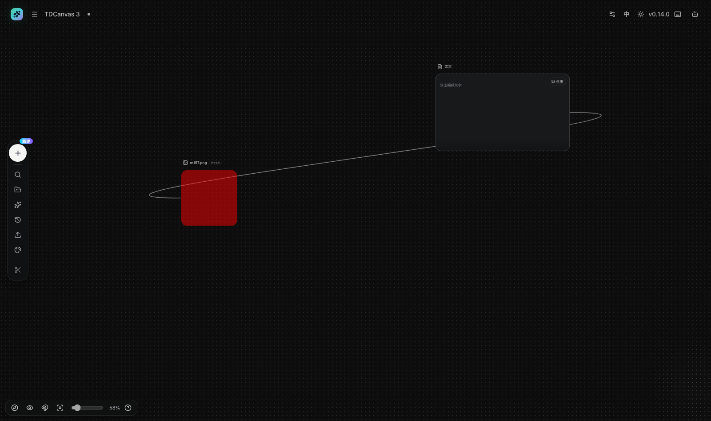

# TDCanvas 用户手册

> 适用版本：TDCanvas `v0.14.0`。本手册在 **Web 版**（浏览器 / `localhost:3000`）中逐屏取证；**桌面客户端绝大多数页面与 Web 一致，但并非处处相同**——已知差异见下方「Web 与桌面客户端的差异」。
> 面向读者：使用 TDCanvas 进行 AI 图片/视频/音频创作的普通用户。
> 手册中所有界面文字均取自当前版本的真实界面；生成类操作涉及按量计费，请留意各页的费用提示。

## 这是什么

TDCanvas 是一个**本地优先**的 AI 无限画布：把提示词（文本）、参考素材、图片、视频和音频放在同一张无限画布上，通过连线组织「素材 → 生成」的流程，节点内容自动保存在本机。



> **这一张就是整个产品**：左边那条竖着的图标条是**添加节点**入口，顶部一条是当前画布与全局设置；
> 画布上摆着的方块（图片、文本、视频、音频）就是**节点**，节点之间那根线就是**连线**——
> **「拿这个当提示词、拿那个当参考」这件事，在界面上就是把它们连起来。**
> 后面每个任务页讲的都是怎么在这张图上做事。**节点内容存在你自己的电脑上，不上传。**
>
> 这句话 2026-10-03 抓包实测过：上传图片、逐字打字、改节点名，**全程没有一条指向本机以外的请求，也没有一条带请求体**。
> 但有**三个例外**——点「生成」会把提示词发给 API、连上 Agent 面板会把整张画布交给本机 Agent、而 **Agent 的地址是可以改成公网地址的**。
> 用之前请先看 [数据与存储：三个例外](20-reference.md#不上传这句话的实测与三个例外)。

## 快速开始

从零到第一个节点只需 2 分钟：[00-quickstart.md](00-quickstart.md)。

## 任务指南（How-to）

| 我想…… | 页面 | 深度 |
|---|---|---|
| 创建画布项目并认识工作区 | [create-canvas-project.md](10-tasks/create-canvas-project.md) | 旗舰 |
| 平移、缩放、用小地图导航 | [navigate-canvas.md](10-tasks/navigate-canvas.md) | 旗舰 |
| 创建文本/图片/视频/音频/组节点 | [create-nodes.md](10-tasks/create-nodes.md) | 旗舰 |
| 上传本地图片、视频、音频 | [upload-materials.md](10-tasks/upload-materials.md) | 旗舰 |
| 重命名、改文字、缩放节点 | [edit-nodes.md](10-tasks/edit-nodes.md) | 旗舰 |
| 连线引用与无线引用 | [connect-references.md](10-tasks/connect-references.md) | 旗舰 |
| 发起图片生成、理解任务状态 | [generate-images.md](10-tasks/generate-images.md) | 完整 |
| 裁剪、切图、放大（免费）与多角度（**付费**） | [image-operations.md](10-tasks/image-operations.md) | 完整 |
| 分组整理（**删组 / 复制组 / 组内连线**）、主题背景、对齐与吸附 | [organize-canvas.md](10-tasks/organize-canvas.md) | 完整 |
| 撤销重做与自动保存 | [undo-persistence.md](10-tasks/undo-persistence.md) | 完整 |
| 管理项目（列表/重命名/导出/删除） | [project-management.md](10-tasks/project-management.md) | 完整 |
| 收藏、检索、导出我的资产 | [manage-assets.md](10-tasks/manage-assets.md) | 完整 |
| 连接 Agent 让它操作画布 | [use-agent.md](10-tasks/use-agent.md) | 完整 |
| 浏览提示词库（当前版本为空） | [use-prompt-library.md](10-tasks/use-prompt-library.md) | 简明 |
| 快捷键与帮助 | [shortcuts-help.md](10-tasks/shortcuts-help.md) | 简明 |

## 参考

- [20-reference.md](20-reference.md)：键位表、格式与限制、任务状态、设置项。

## 概念解释

- [30-concepts.md](30-concepts.md)：节点类型、连线语义、连线/无线双模式、项目与自动保存。

## 排障

- [90-troubleshooting.md](90-troubleshooting.md)：按症状查找原因与修复方法。

## 费用与安全提示

- 画布的节点创建、素材上传、连线、裁剪/切图/放大等操作**全部在本机完成，免费**。
- 点击「生成」类按钮会调用 AI 服务**按量计费**：请先在「配置」中确认 API Key 与模型，再开始生成。**多角度**同样是付费操作，只是它藏在工具条的自选面板里（见 [image-operations.md](10-tasks/image-operations.md#多角度)）。
- 手册中的生成流程说明以当前版本真实界面为准；涉及计费的细节以 Aitudou 平台账单为准。

## Web 与桌面客户端的差异

本手册在 Web 版逐屏取证，已知与桌面客户端不同的有两处：

| 页面 | Web 版 | 桌面客户端 |
|---|---|---|
| [ComfyUI 本地](20-reference.md#comfyui-本地与-404-两个走不到底的页面) | 页面内容区**一个可操作按钮都没有**（顶部导航栏仍在），只有一句「此模式仅在桌面客户端中运行」 | 渲染完整的工作流配置界面 |
| [版本更新](20-reference.md#版本与更新) | 弹窗里**只有「当前版本」**，查不到也升不了 | 有「最新版本」与一键下载安装 |

判据是 `isTauriRuntime()`（是否存在 `__TAURI_INTERNALS__`）。**其余页面未逐一比对，不排除还有差异**——本手册不对未验证的范围下结论。

## 这个版本还没有的功能

TDCanvas v0.14.0 有一批「实现完毕但没接到界面上」的功能（WebDAV 同步、节点插件、蒙版局部重绘、导入画布等）。如果你在界面里找不到它们，**那不是你的问题，是这个版本确实没有**。完整清单与判断方法见 [20-reference.md](20-reference.md#这个版本没有的功能)。

## 以网站形式查看本手册

本手册已构建为 **VitePress 静态网站**（含侧边栏导航与中文全文搜索 ⌘K），构建产物在本目录 `.vitepress/dist/`。**页数 / 截图数 / 体积以最近一次 `./build-site.sh` 的实测输出为准**（构建结束时会打印这三项；下表数字随内容更新，请以构建输出核对）：

| 构建日期 | 页数 | 截图数 | 体积 |
|---|---|---|---|
| 2026-10-01 | 22 | 94 | 23M |
| 2026-10-02 | 22 | 109 | 24M |
| 2026-10-03 | 22 | 112 | 25M |
| 2026-10-04 | 22 | 112 | 25M |
| 2026-10-05 | 22 | 113 | 25M |
| 2026-10-06 | 22 | 115 | 27M |

**本地查看**：

```bash
# 启动一个静态服务器，浏览器打开 http://localhost:4173
# 端口被其他手册预览占用时换一个（如 4174）
python3 -m http.server 4173 -d .vitepress/dist
```

> **两点必须知道**（都是实测结论，别踩）：
>
> - **不要用 `open dist/index.html` 直接打开文件。** 构建产物里的资源路径全是绝对路径（`/assets/...`、`/vp-icons.css`），在 `file://` 协议下会指向**文件系统根目录**，样式和脚本一律加载不上，整站退化成没样式的纯文本、点哪都跳不动。必须通过 HTTP 访问。
> - **`python3 -m http.server` 不会返回站点的 404 页。** VitePress 确实生成了带侧边栏的 `dist/404.html`，但这个简易服务器对不存在的路径只返回它自己的裸报错（`Error response / File not found.`），**一个链接都没有**，读者落到那里就走不动了。**正式发布的站点不会有这个问题**——GitHub Pages、Netlify、以及配了 `error_page 404 /404.html;` 的 nginx 都会正确送出 `404.html`。本地预览时知道这一点即可。
>
> `./build-site.sh --preview` 是等价做法，它会构建完自动起服务。

**重新构建**（手册内容更新后）：

```bash
./build-site.sh            # 六步一键构建，产物刷新到 .vitepress/dist/
./build-site.sh --preview  # 构建后自动启动 :4173 预览
```

构建/发布的完整说明（含子路径部署、404 映射与运维 FAQ）写在**仓库里的 `PUBLISH.md`**，属于维护者文档，不随站点发布。
